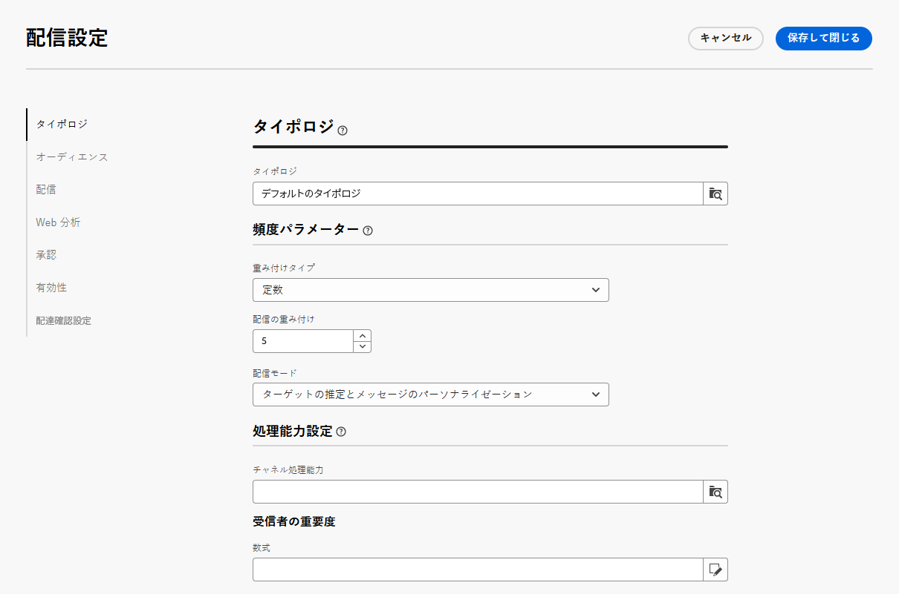
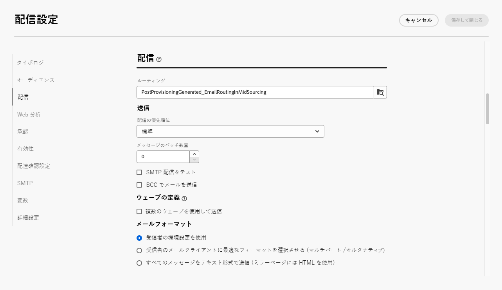
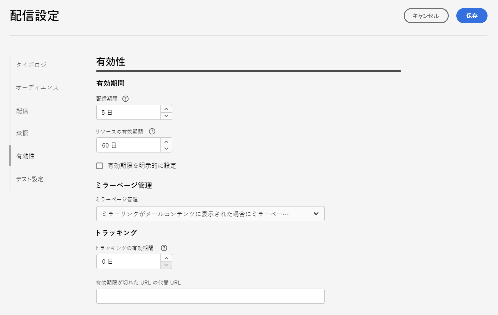
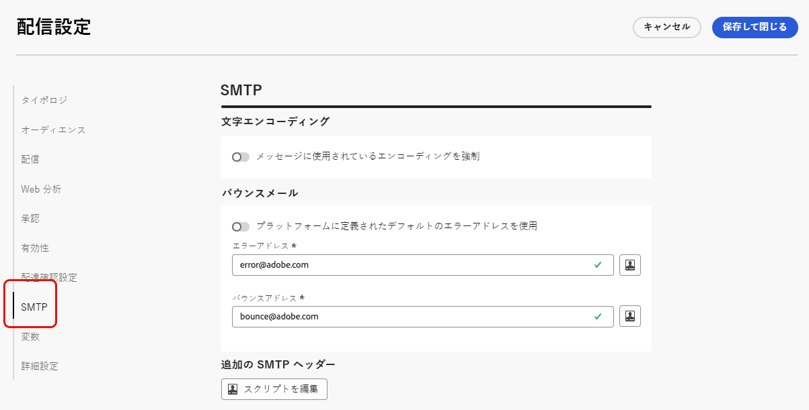
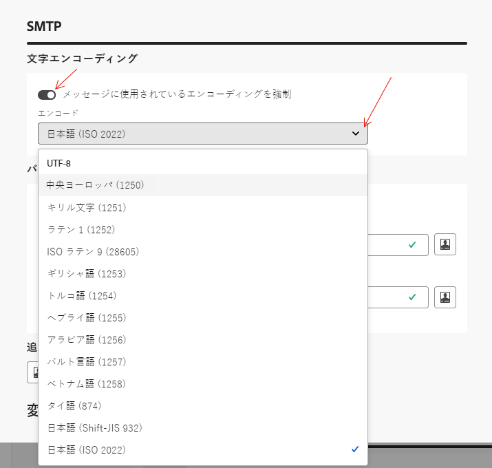
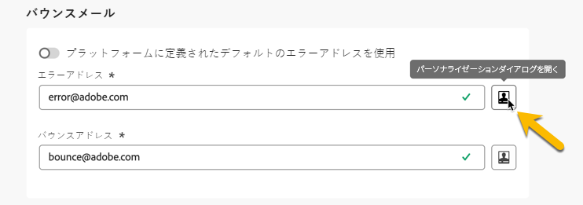
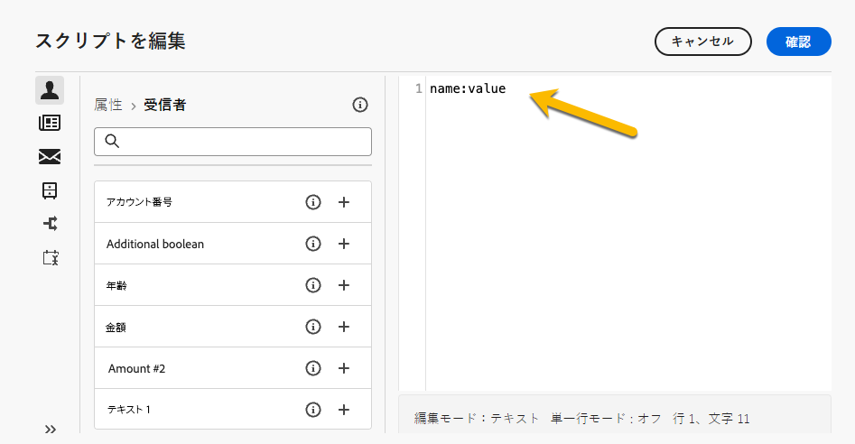
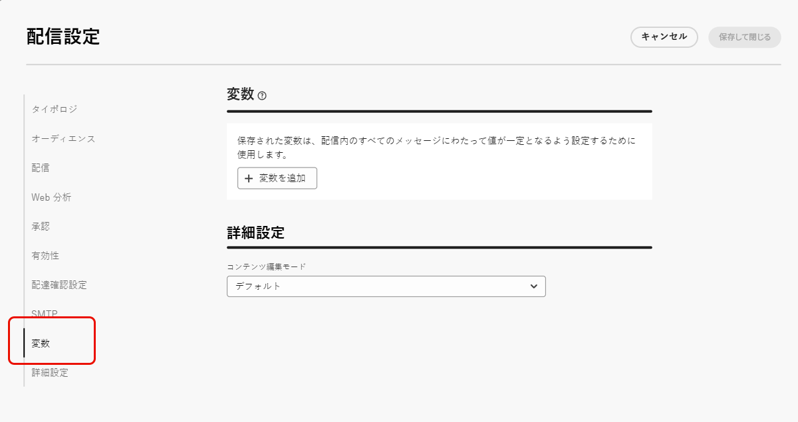
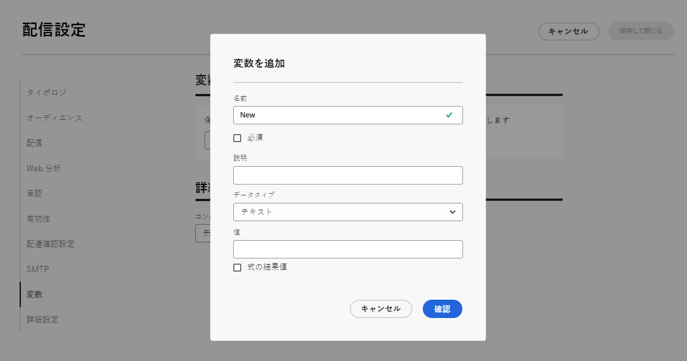

<?xml version="1.0" encoding="UTF-8"?>
<xliff xmlns="urn:oasis:names:tc:xliff:document:1.2" xmlns:okp="okapi-framework:xliff-extensions" xmlns:its="http://www.w3.org/2005/11/its" xmlns:itsxlf="http://www.w3.org/ns/its-xliff/" version="1.2" its:version="2.0">
<file original="help/v8/advanced-settings/delivery-settings.md.mdsc" source-language="en-US" target-language="en-XX" datatype="x-text/markdown">
<body>
<trans-unit id="tu34" xml:space="preserve">
<source xml:lang="en-US">https://experienceleague.adobe.com/docs/campaign/automation/campaign-optimization/pressure-rules.html</source>
<target xml:lang="en-XX">https://experienceleague.adobe.com/docs/campaign/automation/campaign-optimization/pressure-rules.html?lang=ja</target>
</trans-unit>
<trans-unit id="tu44" xml:space="preserve">
<source xml:lang="en-US">https://experienceleague.adobe.com/docs/campaign/automation/campaign-optimization/consistency-rules.html</source>
<target xml:lang="en-XX">https://experienceleague.adobe.com/docs/campaign/automation/campaign-optimization/consistency-rules.html?lang=ja</target>
</trans-unit>
<trans-unit id="tu50" xml:space="preserve">
<source xml:lang="en-US">https://experienceleague.adobe.com/docs/campaign/campaign-v8/send/failures/quarantines.html</source>
<target xml:lang="en-XX">https://experienceleague.adobe.com/docs/campaign/campaign-v8/send/failures/quarantines.html?lang=ja</target>
</trans-unit>
<trans-unit id="tu64" xml:space="preserve">
<source xml:lang="en-US">https://experienceleague.adobe.com/docs/campaign/campaign-v8/send/emails/email-bcc.html</source>
<target xml:lang="en-XX">https://experienceleague.adobe.com/docs/campaign/campaign-v8/send/emails/email-bcc.html?lang=ja</target>
</trans-unit>
<trans-unit id="tu87" xml:space="preserve">
<source xml:lang="en-US">https://experienceleague.adobe.com/docs/campaign/campaign-v8/connect/ac-aa.html#external-account-ac</source>
<target xml:lang="en-XX">https://experienceleague.adobe.com/docs/campaign/campaign-v8/connect/ac-aa.html?lang=ja#external-account-ac</target>
</trans-unit>
<trans-unit id="tu115" xml:space="preserve">
<source xml:lang="en-US">https://experienceleague.adobe.com/docs/campaign/campaign-v8/campaigns/send/failures/delivery-failures.html#validity-period</source>
<target xml:lang="en-XX">https://experienceleague.adobe.com/docs/campaign/campaign-v8/campaigns/send/failures/delivery-failures.html?lang=ja#validity-period</target>
</trans-unit>
<trans-unit id="tu1" restype="x-YAML_METADATA_HEADER_VALUE" xml:space="preserve">
<source xml:lang="en-US">Configure delivery Settings</source>
<target xml:lang="en-XX">配信設定の指定</target>
</trans-unit>
<trans-unit id="tu2" restype="x-YAML_METADATA_HEADER_VALUE" xml:space="preserve">
<source xml:lang="en-US">Learn how to configure delivery settings in Campaign Web</source>
<target xml:lang="en-XX">Campaign web で配信設定を指定する方法について学ぶ</target>
</trans-unit>
<trans-unit id="tu3" xml:space="preserve">
<source xml:lang="en-US">Configure delivery settings</source>
<target xml:lang="en-XX">配信設定の指定</target>
</trans-unit>
<trans-unit id="tu4" xml:space="preserve">
<source xml:lang="en-US">Delivery settings are <ph id="1" ctype="x-STRONG_EMPHASIS">**</ph>technical delivery parameters<ph id="2" ctype="x-STRONG_EMPHASIS">**</ph> that are defined in the delivery template. They can be overloaded for each delivery. These settings are available from the <ph id="3" ctype="x-STRONG_EMPHASIS">**</ph>Settings<ph id="4" ctype="x-STRONG_EMPHASIS">**</ph> button available when editing a delivery or a delivery template.</source>
<target xml:lang="en-XX">配信設定は、配信テンプレートで定義される<ph id="1" ctype="x-STRONG_EMPHASIS">**</ph>技術的な配信パラメーター<ph id="2" ctype="x-STRONG_EMPHASIS">**</ph>です。 配信ごとに過負荷になる可能性があります。 これらの設定は、配信または配信テンプレートの編集時に使用できる「<ph id="3" ctype="x-STRONG_EMPHASIS">**</ph>設定<ph id="4" ctype="x-STRONG_EMPHASIS">**</ph>」ボタンから利用できます。</target>
</trans-unit>
<trans-unit id="tu5" xml:space="preserve">
<source xml:lang="en-US"><ph id="1" ctype="x-regxph" equiv-text="&lbrack;!CAUTION">[!CAUTION]</ph></source>
<target xml:lang="en-XX"><ph id="1" ctype="x-regxph" equiv-text="&lbrack;!CAUTION">[!CAUTION]</ph></target>
</trans-unit>
<trans-unit id="tu6" xml:space="preserve">
<source xml:lang="en-US">These settings are described for your information only. Some of them depend on your configuration and permissions. They must not be modified in this version of the product.</source>
<target xml:lang="en-XX">これらの設定については、情報提供のみを目的として説明しています。 一部のものは、設定や権限によって異なります。 それらは、このバージョンの製品では変更できません。</target>
</trans-unit>
<trans-unit id="tu7" xml:space="preserve">
<source xml:lang="en-US">Typology settings</source>
<target xml:lang="en-XX">タイポロジ設定</target>
</trans-unit>
<trans-unit id="tu8" xml:space="preserve">
<source xml:lang="en-US">Typology</source>
<target xml:lang="en-XX">タイポロジ</target>
</trans-unit>
<trans-unit id="tu9" xml:space="preserve">
<source xml:lang="en-US">Typologies allow you to standardize business practices, across all deliveries. A typology is a collection of typology rules which lets you control, filter, and prioritize the sending of deliveries. Profiles which match criteria within a typology rule are excluded from the delivery audiences at the preparation phase.</source>
<target xml:lang="en-XX">タイポロジを使用すると、すべての配信にわたってビジネスプラクティスを標準化できます。 タイポロジとは、配信状況を制御、フィルター、および優先順位付けするタイポロジルールの集まりです。 タイポロジルール内の条件に一致するプロファイルは、準備フェーズで配信オーディエンスから除外されます。</target>
</trans-unit>
<trans-unit id="tu10" xml:space="preserve">
<source xml:lang="en-US">Typology settings for the delivery</source>
<target xml:lang="en-XX">配信のタイポロジ設定</target>
</trans-unit>
<trans-unit id="tu11" xml:space="preserve">
<source xml:lang="en-US">Typology rules allow you to standardize business practices, across all deliveries. A typology is a collection of typology rules which lets you control, filter, and prioritize the sending of deliveries. Profiles which match criteria within a typology rule are excluded from the delivery audiences at the preparation phase.</source>
<target xml:lang="en-XX">タイポロジルールを使用すると、すべての配信にわたってビジネスプラクティスを標準化できます。 タイポロジとは、配信状況を制御、フィルター、および優先順位付けするタイポロジルールの集まりです。 タイポロジルール内の条件に一致するプロファイルは、準備フェーズで配信オーディエンスから除外されます。</target>
</trans-unit>
<trans-unit id="tu12" xml:space="preserve">
<source xml:lang="en-US">Typologies are sets of <ph id="1" ctype="x-STRONG_EMPHASIS">**</ph>typology rules<ph id="2" ctype="x-STRONG_EMPHASIS">**</ph> that are executed during the preparation phase in order to easily apply multiple filtering rules to a delivery at once. They allow marketers to standardize business practices across all deliveries as they let them control, filter, and prioritize the sending of deliveries. <ph id="3" ctype="x-LINK">[</ph>Learn how to create typologies and typology rules<ph id="4" ctype="x-LINK">](../administration/typologies.md)</ph></source>
<target xml:lang="en-XX">タイポロジとは、複数のフィルタリングルールを配信に対して一度に簡単に適用するために、準備フェーズ中に実行される<ph id="1" ctype="x-STRONG_EMPHASIS">**</ph>タイポロジルール<ph id="2" ctype="x-STRONG_EMPHASIS">**</ph>のセットです。 これを使用すると、マーケターは、配信の送信を制御、フィルタリング、優先順位付けできるので、すべての配信でビジネスプラクティスを標準化できます。 <ph id="3" ctype="x-LINK">[</ph>詳しくは、タイポロジとタイポロジルールを作成する方法を参照してください<ph id="4" ctype="x-LINK">](../administration/typologies.md)</ph></target>
</trans-unit>
<trans-unit id="tu13" xml:space="preserve">
<source xml:lang="en-US"><ph id="1" ctype="x-IMAGE">{zoomable="yes"}</ph></source>
<target xml:lang="en-XX"><ph id="1" ctype="x-IMAGE">{zoomable="yes"}</ph></target>
</trans-unit>
<trans-unit id="tu14" xml:space="preserve">
<source xml:lang="en-US">Pressure parameters</source>
<target xml:lang="en-XX">頻度パラメーター</target>
</trans-unit>
<trans-unit id="tu15" xml:space="preserve">
<source xml:lang="en-US">Pressure parameters for the delivery</source>
<target xml:lang="en-XX">配信の頻度パラメーター</target>
</trans-unit>
<trans-unit id="tu16" xml:space="preserve">
<source xml:lang="en-US">Delivery weights let you identify top-priority deliveries within the framework of fatigue management. Messages with the highest weight have priority.</source>
<target xml:lang="en-XX">配信の重み付けは、疲労管理のフレームワーク内で最も優先順位の高い配信を指定できます。 最も大きな重みを付けられたメッセージが、最優先されます。</target>
</trans-unit>
<trans-unit id="tu17" xml:space="preserve">
<source xml:lang="en-US">Delivery weight</source>
<target xml:lang="en-XX">配信の重み付け</target>
</trans-unit>
<trans-unit id="tu18" xml:space="preserve">
<source xml:lang="en-US">Delivery weights let you identify top-priority deliveries within the framework of pressure management. Messages with the highest weight have priority.</source>
<target xml:lang="en-XX">配信の重み付けは、頻度管理のフレームワーク内で最も優先順位の高い配信を指定できます。 最も大きな重みを付けられたメッセージが、最優先されます。</target>
</trans-unit>
<trans-unit id="tu19" xml:space="preserve">
<source xml:lang="en-US">In this section, pressure parameters let you define a <ph id="1" ctype="x-STRONG_EMPHASIS">**</ph>threshold<ph id="2" ctype="x-STRONG_EMPHASIS">**</ph> to set up fatigue management rules, which is the maximum number of messages that can be sent to one profile over a given period.</source>
<target xml:lang="en-XX">このセクションでは、頻度パラメーターを使用して<ph id="1" ctype="x-STRONG_EMPHASIS">**</ph>しきい値<ph id="2" ctype="x-STRONG_EMPHASIS">**</ph>を定義し、疲労管理ルールを設定できます。これは、特定の期間に 1 つのプロファイルに送信できるメッセージの最大数です。</target>
</trans-unit>
<trans-unit id="tu20" xml:space="preserve">
<source xml:lang="en-US">Once this threshold has been reached, no more deliveries can take place until the end of the period considered. This process lets you automatically exclude a profile from a delivery if a message exceeds the set threshold, thus avoiding over-solicitation.</source>
<target xml:lang="en-XX">しきい値に達すると、その後は指定された期間が完了するまで、配信は実施できなくなります。 このプロセスにより、メッセージの数がしきい値を超過したプロファイルは配信から自動的に除外されるので、過剰な配信が回避できます。</target>
</trans-unit>
<trans-unit id="tu21" xml:space="preserve">
<source xml:lang="en-US">Threshold values can be either constant or variable. This means that for a given period, thresholds can vary from one profile to another, or even for the same profile.</source>
<target xml:lang="en-XX">しきい値は、定数または変数のいずれかです。 したがって、ある期間、しきい値はプロファイルによって異なる場合も、同じプロファイルで異なる場合もあります。</target>
</trans-unit>
<trans-unit id="tu22" xml:space="preserve">
<source xml:lang="en-US">In the <ph id="1" ctype="x-STRONG_EMPHASIS">**[!UICONTROL </ph>Weight type<ph id="3" ctype="x-LINK_REF">]**</ph> field, three options are available:</source>
<target xml:lang="en-XX">「<ph id="1" ctype="x-STRONG_EMPHASIS">**[!UICONTROL </ph>重み付けタイプ<ph id="3" ctype="x-LINK_REF">]**</ph>」フィールドでは、次の 3 つのオプションを使用できます。</target>
</trans-unit>
<trans-unit id="tu23" xml:space="preserve">
<source xml:lang="en-US"><ph id="1" ctype="x-STRONG_EMPHASIS">**[!UICONTROL </ph>Constant<ph id="3" ctype="x-LINK_REF">]**</ph></source>
<target xml:lang="en-XX"><ph id="1" ctype="x-STRONG_EMPHASIS">**[!UICONTROL </ph>定数<ph id="3" ctype="x-LINK_REF">]**</ph></target>
</trans-unit>
<trans-unit id="tu24" xml:space="preserve">
<source xml:lang="en-US"><ph id="1" ctype="x-STRONG_EMPHASIS">**[!UICONTROL </ph>Depends on the recipient<ph id="3" ctype="x-LINK_REF">]**</ph></source>
<target xml:lang="en-XX"><ph id="1" ctype="x-STRONG_EMPHASIS">**[!UICONTROL </ph>受信者に依存<ph id="3" ctype="x-LINK_REF">]**</ph></target>
</trans-unit>
<trans-unit id="tu25" xml:space="preserve">
<source xml:lang="en-US"><ph id="1" ctype="x-STRONG_EMPHASIS">**[!UICONTROL </ph>Defined in each rule<ph id="3" ctype="x-LINK_REF">]**</ph></source>
<target xml:lang="en-XX"><ph id="1" ctype="x-STRONG_EMPHASIS">**[!UICONTROL </ph>各ルールで定義<ph id="3" ctype="x-LINK_REF">]**</ph></target>
</trans-unit>
<trans-unit id="tu26" xml:space="preserve">
<source xml:lang="en-US">Use the <ph id="1" ctype="x-STRONG_EMPHASIS">**[!UICONTROL </ph>Delivery weight<ph id="3" ctype="x-LINK_REF">]**</ph> field to define the delivery priority. Each delivery has a weight which represents its level of priority. By default, the weight of a delivery is set to 5. Pressure rules let you define the weight of the deliveries which they are applied to. Weights can be either set or calculated via a formula to suit recipients. For example, you can define the weight of a delivery based on recipient interests.</source>
<target xml:lang="en-XX">「<ph id="1" ctype="x-STRONG_EMPHASIS">**[!UICONTROL </ph>配信の重み付け<ph id="3" ctype="x-LINK_REF">]**</ph>」フィールドでは、配信の優先順位を定義できます。 各配信には、優先度を表す重みが付けられます。 デフォルトでは、配信の重みは 5 に設定されています。 頻度ルールでは、適用先となる配信の重み付けを定義できます。 重みの値は、定数を指定するか、受信者ごとに数式で算出します。 例えば、受信者の興味に基づいて配信の重みを定義することができます。</target>
</trans-unit>
<trans-unit id="tu27" xml:space="preserve">
<source xml:lang="en-US">Use the <ph id="1" ctype="x-STRONG_EMPHASIS">**[!UICONTROL </ph>Delivery mode<ph id="3" ctype="x-LINK_REF">]**</ph> field to select the target evaluation mode.</source>
<target xml:lang="en-XX">「<ph id="1" ctype="x-STRONG_EMPHASIS">**[!UICONTROL </ph>配信モード<ph id="3" ctype="x-LINK_REF">]**</ph>」フィールドでは、ターゲットの評価モードを選択できます。</target>
</trans-unit>
<trans-unit id="tu28" xml:space="preserve">
<source xml:lang="en-US">Three modes are available:</source>
<target xml:lang="en-XX">次の 3 つのモードを選択できます。</target>
</trans-unit>
<trans-unit id="tu29" xml:space="preserve">
<source xml:lang="en-US"><ph id="1" ctype="x-STRONG_EMPHASIS">**[!UICONTROL </ph>Target estimation and message personalization<ph id="3" ctype="x-LINK_REF">]**</ph></source>
<target xml:lang="en-XX"><ph id="1" ctype="x-STRONG_EMPHASIS">**[!UICONTROL </ph>ターゲットの推定とメッセージのパーソナライゼーション<ph id="3" ctype="x-LINK_REF">]**</ph></target>
</trans-unit>
<trans-unit id="tu30" xml:space="preserve">
<source xml:lang="en-US"><ph id="1" ctype="x-STRONG_EMPHASIS">**[!UICONTROL </ph>Estimation and approval of the provisional target<ph id="3" ctype="x-LINK_REF">]**</ph></source>
<target xml:lang="en-XX"><ph id="1" ctype="x-STRONG_EMPHASIS">**[!UICONTROL </ph>暫定ターゲットの推定と承認<ph id="3" ctype="x-LINK_REF">]**</ph></target>
</trans-unit>
<trans-unit id="tu31" xml:space="preserve">
<source xml:lang="en-US"><ph id="1" ctype="x-STRONG_EMPHASIS">**[!UICONTROL </ph>Target evaluation<ph id="3" ctype="x-LINK_REF">]**</ph></source>
<target xml:lang="en-XX"><ph id="1" ctype="x-STRONG_EMPHASIS">**[!UICONTROL </ph>ターゲットの評価<ph id="3" ctype="x-LINK_REF">]**</ph></target>
</trans-unit>
<trans-unit id="tu32" xml:space="preserve">
<source xml:lang="en-US"><ph id="1" ctype="x-regxph" equiv-text="&lbrack;!NOTE">[!NOTE]</ph></source>
<target xml:lang="en-XX"><ph id="1" ctype="x-regxph" equiv-text="&lbrack;!NOTE">[!NOTE]</ph></target>
</trans-unit>
<trans-unit id="tu33" xml:space="preserve">
<source xml:lang="en-US">Fatigue management and pressure rules are configured in the Campaign client console. Learn more in <ph id="1" ctype="x-LINK">&lbrack;</ph>Campaign v8 (client console) documentation<ph id="2" ctype="x-LINK">[#$tu34]{target="_blank"}</ph>.</source>
<target xml:lang="en-XX">疲労管理と頻度ルールは、Campaign クライアントコンソールで設定されます。 詳しくは、<ph id="1" ctype="x-LINK">&lbrack;</ph>Campaign v8（クライアントコンソール）ドキュメント<ph id="2" ctype="x-LINK">[#$tu34]{target="_blank"}</ph>を参照してください。</target>
</trans-unit>
<trans-unit id="tu35" xml:space="preserve">
<source xml:lang="en-US">Capacity settings</source>
<target xml:lang="en-XX">処理能力設定</target>
</trans-unit>
<trans-unit id="tu36" xml:space="preserve">
<source xml:lang="en-US">Capacity settings for the delivery</source>
<target xml:lang="en-XX">配信用の処理能力設定</target>
</trans-unit>
<trans-unit id="tu37" xml:space="preserve">
<source xml:lang="en-US">Before delivering messages, use capacity rules to make sure your organization can process the delivery, the inbound messages which the delivery may generate, and the number of calls to be made to contact subscribers for example. Capacity rules are defined in the Adobe Campaign v8 console. In this screen, select a rule associated to the channel.</source>
<target xml:lang="en-XX">メッセージを配信する前に、処理能力ルールを使用して、組織が配信や、その配信によって生成される可能性があるインバウンドメッセージと、購読者に連絡するための通話数などを処理できることを確認します。 処理能力ルールは、Adobe Campaign v8 コンソールで定義されます。 この画面で、チャネルに関連付けられたルールを選択します。</target>
</trans-unit>
<trans-unit id="tu38" xml:space="preserve">
<source xml:lang="en-US">Importance of the recipient</source>
<target xml:lang="en-XX">受信者の重要度</target>
</trans-unit>
<trans-unit id="tu39" xml:space="preserve">
<source xml:lang="en-US">The importance of the recipient is a formula used to determine which profiles are kept when the capacity typology rules are exceeded.</source>
<target xml:lang="en-XX">受信者の重要度は、処理能力タイポロジルールを超過した場合に維持するプロファイルを決定するために使用される式です。</target>
</trans-unit>
<trans-unit id="tu40" xml:space="preserve">
<source xml:lang="en-US">In this section, you can select a capacity rule defined in the Adobe Campaign v8 console. This rule is associated to the channel.</source>
<target xml:lang="en-XX">このセクションでは、Adobe Campaign v8 コンソールで定義した処理能力ルールを選択できます。 このルールは、チャネルに関連付けられています。</target>
</trans-unit>
<trans-unit id="tu41" xml:space="preserve">
<source xml:lang="en-US">The <ph id="1" ctype="x-STRONG_EMPHASIS">**[!UICONTROL </ph>Importance of the recipient<ph id="3" ctype="x-LINK_REF">]**</ph> field is a formula used to determine which profiles are kept when the capacity typology rules are exceeded.</source>
<target xml:lang="en-XX">「<ph id="1" ctype="x-STRONG_EMPHASIS">**[!UICONTROL </ph>受信者の重要度<ph id="3" ctype="x-LINK_REF">]**</ph>」フィールドは、処理能力タイポロジルールを超過した場合に維持するプロファイルを決定するために使用される式です。</target>
</trans-unit>
<trans-unit id="tu42" xml:space="preserve">
<source xml:lang="en-US"><ph id="1" ctype="x-regxph" equiv-text="&lbrack;!NOTE">[!NOTE]</ph></source>
<target xml:lang="en-XX"><ph id="1" ctype="x-regxph" equiv-text="&lbrack;!NOTE">[!NOTE]</ph></target>
</trans-unit>
<trans-unit id="tu43" xml:space="preserve">
<source xml:lang="en-US">Typology rules are configured in the Campaign Client console. Learn more in <ph id="1" ctype="x-LINK">&lbrack;</ph>Campaign v8 (client console) documentation<ph id="2" ctype="x-LINK">[#$tu44]{target="_blank"}</ph>.</source>
<target xml:lang="en-XX">タイポロジルールは、Campaign クライアントコンソールで設定されます。 詳しくは、<ph id="1" ctype="x-LINK">&lbrack;</ph>Campaign v8（クライアントコンソール）ドキュメント<ph id="2" ctype="x-LINK">[#$tu44]{target="_blank"}</ph>を参照してください。</target>
</trans-unit>
<trans-unit id="tu45" xml:space="preserve">
<source xml:lang="en-US">Audience settings</source>
<target xml:lang="en-XX">オーディエンス設定</target>
</trans-unit>
<trans-unit id="tu46" xml:space="preserve">
<source xml:lang="en-US">Audience settings for the delivery</source>
<target xml:lang="en-XX">配信用のオーディエンス設定</target>
</trans-unit>
<trans-unit id="tu47" xml:space="preserve">
<source xml:lang="en-US">Select a <ph id="1" ctype="x-STRONG_EMPHASIS">**</ph>target mapping<ph id="2" ctype="x-STRONG_EMPHASIS">**</ph> among those available. Target mappings are defined in the Adobe Campaign v8 console. You can also set the exclusion parameters for the delivery.</source>
<target xml:lang="en-XX">利用可能な<ph id="1" ctype="x-STRONG_EMPHASIS">**</ph>ターゲットマッピング<ph id="2" ctype="x-STRONG_EMPHASIS">**</ph>を選択します。 ターゲットマッピングは、Adobe Campaign v8 コンソールで定義されます。 また、配信用の除外パラメーターを設定することもできます。</target>
</trans-unit>
<trans-unit id="tu48" xml:space="preserve">
<source xml:lang="en-US">In this section, you can select a <ph id="1" ctype="x-STRONG_EMPHASIS">**</ph>target mapping<ph id="2" ctype="x-STRONG_EMPHASIS">**</ph> among those available. Target mappings are defined in the Adobe Campaign v8 console. The target mapping is the type of data that an operation is handling. It lets you define the targeted population: recipients, contract beneficiaries, operators, subscribers, etc. <ph id="3" ctype="x-LINK">[</ph>Learn more about target mappings<ph id="4" ctype="x-LINK">](../audience/targeting-dimensions.md)</ph>.</source>
<target xml:lang="en-XX">このセクションでは、利用可能な<ph id="1" ctype="x-STRONG_EMPHASIS">**</ph>ターゲットマッピング<ph id="2" ctype="x-STRONG_EMPHASIS">**</ph>を選択できます。 ターゲットマッピングは、Adobe Campaign v8 コンソールで定義されます。 ターゲットマッピングは、操作で処理されるデータのタイプです。 ターゲット母集団（受信者、契約の受益者、オペレーター、サブスクライバーなど）を定義できます。<ph id="3" ctype="x-LINK">[</ph>詳しくは、ターゲットマッピングを参照してください<ph id="4" ctype="x-LINK">](../audience/targeting-dimensions.md)</ph>。</target>
</trans-unit>
<trans-unit id="tu49" xml:space="preserve">
<source xml:lang="en-US">In the <ph id="1" ctype="x-STRONG_EMPHASIS">**[!UICONTROL </ph>Exclusion<ph id="3" ctype="x-LINK_REF">]**</ph> field, you can select to exclude profiles who no longer want to be contacted or who are quarantined. <ph id="5" ctype="x-LINK">&lbrack;</ph>Learn more<ph id="6" ctype="x-LINK">[#$tu50]{target="_blank"}</ph></source>
<target xml:lang="en-XX">「<ph id="1" ctype="x-STRONG_EMPHASIS">**[!UICONTROL </ph>除外<ph id="3" ctype="x-LINK_REF">]**</ph>」フィールドでは、今後連絡を希望しないプロファイルや強制隔離されているプロファイルを除外することを選択できます。 <ph id="5" ctype="x-LINK">&lbrack;</ph>詳細情報<ph id="6" ctype="x-LINK">[#$tu50]{target="_blank"}</ph></target>
</trans-unit>
<trans-unit id="tu51" xml:space="preserve">
<source xml:lang="en-US">Delivery</source>
<target xml:lang="en-XX">配信</target>
</trans-unit>
<trans-unit id="tu52" xml:space="preserve">
<source xml:lang="en-US">Global settings for the delivery</source>
<target xml:lang="en-XX">配信用のグローバル設定</target>
</trans-unit>
<trans-unit id="tu53" xml:space="preserve">
<source xml:lang="en-US">Delivery parameters are technical settings which apply to your delivery. You can change the delivery and routine modes, activate Email BCC, send using waves, and also choose the format of the email messages sent. These options are restricted to expert users only.</source>
<target xml:lang="en-XX">配信パラメーターは、配信に適用する技術的な設定です。 配信およびルーチンモードの変更、メールの BCC の有効化、ウェーブを使用した送信および送信されるメールメッセージの形式の選択を行うことができます。 これらのオプションは、エキスパートユーザーのみに制限されます。</target>
</trans-unit>
<trans-unit id="tu54" xml:space="preserve">
<source xml:lang="en-US"><ph id="1" ctype="x-STRONG_EMPHASIS">**[!UICONTROL </ph>Delivery<ph id="3" ctype="x-LINK_REF">]**</ph> parameters are technical settings which apply to your delivery.</source>
<target xml:lang="en-XX"><ph id="1" ctype="x-STRONG_EMPHASIS">**[!UICONTROL </ph>配信<ph id="3" ctype="x-LINK_REF">]**</ph>パラメーターは、配信に適用する技術的な設定です。</target>
</trans-unit>
<trans-unit id="tu55" xml:space="preserve">
<source xml:lang="en-US"><ph id="1" ctype="x-IMAGE">{zoomable="yes"}</ph></source>
<target xml:lang="en-XX"><ph id="1" ctype="x-IMAGE">{zoomable="yes"}</ph></target>
</trans-unit>
<trans-unit id="tu56" xml:space="preserve">
<source xml:lang="en-US">The integrated <ph id="1" ctype="x-STRONG_EMPHASIS">**[!UICONTROL </ph>Routing<ph id="3" ctype="x-LINK_REF">]**</ph> external account is provided by default. It contains the technical parameters that allow the application to send deliveries.</source>
<target xml:lang="en-XX">統合された<ph id="1" ctype="x-STRONG_EMPHASIS">**[!UICONTROL </ph>ルーティング<ph id="3" ctype="x-LINK_REF">]**</ph>用外部アカウントがデフォルトで提供されます。 アプリケーションから配信を送信するための技術的なパラメーターが含まれます。</target>
</trans-unit>
<trans-unit id="tu57" xml:space="preserve">
<source xml:lang="en-US">You can define the <ph id="1" ctype="x-STRONG_EMPHASIS">**[!UICONTROL </ph>Sending<ph id="3" ctype="x-LINK_REF">]**</ph> settings below.</source>
<target xml:lang="en-XX">次の<ph id="1" ctype="x-STRONG_EMPHASIS">**[!UICONTROL </ph>送信<ph id="3" ctype="x-LINK_REF">]**</ph>設定を定義できます。</target>
</trans-unit>
<trans-unit id="tu58" xml:space="preserve">
<source xml:lang="en-US"><ph id="1" ctype="x-STRONG_EMPHASIS">**[!UICONTROL </ph>Delivery priority<ph id="3" ctype="x-LINK_REF">]**</ph>: Use this option to change the sending order for your deliveries by setting their priority level: normal, high or low.</source>
<target xml:lang="en-XX"><ph id="1" ctype="x-STRONG_EMPHASIS">**[!UICONTROL </ph>配信の優先順位<ph id="3" ctype="x-LINK_REF">]**</ph>：配信の優先順位レベル（標準、高、低）を設定して、配信の送信順序を変更します。</target>
</trans-unit>
<trans-unit id="tu59" xml:space="preserve">
<source xml:lang="en-US"><ph id="1" ctype="x-STRONG_EMPHASIS">**[!UICONTROL </ph>Message batch quantity<ph id="3" ctype="x-LINK_REF">]**</ph>: Use this option to define the number of messages grouped within the same XML delivery package. If the parameter is set to 0, the messages are automatically grouped. The package size is defined by the calculation <ph id="5" ctype="x-CODE">`&lt;delivery size>/1024`</ph>, with a minimum of 8 and a maximum of 256 messages by package.</source>
<target xml:lang="en-XX"><ph id="1" ctype="x-STRONG_EMPHASIS">**[!UICONTROL </ph>メッセージのバッチサイズ<ph id="3" ctype="x-LINK_REF">]**</ph>：1 つの XML 配信パッケージ内でグループ化するメッセージの件数を定義します。 このパラメーターが 0 に設定されている場合、メッセージは自動的にグループ化されます。 パッケージサイズは、<ph id="5" ctype="x-CODE">`&lt;delivery size>/1024`</ph> という計算に基づいて決定されます（ただし、パッケージあたりのメッセージ件数は最小 8、最大 256）。</target>
</trans-unit>
<trans-unit id="tu60" xml:space="preserve">
<source xml:lang="en-US"><ph id="1" ctype="x-regxph" equiv-text="&lbrack;!IMPORTANT">[!IMPORTANT]</ph></source>
<target xml:lang="en-XX"><ph id="1" ctype="x-regxph" equiv-text="&lbrack;!IMPORTANT">[!IMPORTANT]</ph></target>
</trans-unit>
<trans-unit id="tu61" xml:space="preserve">
<source xml:lang="en-US">When the delivery is created by duplicating an existing one, this parameter is reset.</source>
<target xml:lang="en-XX">既存の配信を複製して配信を作成すると、このパラメーターはリセットされます。</target>
</trans-unit>
<trans-unit id="tu62" xml:space="preserve">
<source xml:lang="en-US"><ph id="1" ctype="x-STRONG_EMPHASIS">**[!UICONTROL </ph>Test SMTP delivery<ph id="3" ctype="x-LINK_REF">]**</ph> (email channel): This option is used to test sending via SMTP. The email is processed up to connection to the SMTP server, but is not sent: for every recipient of the email, Campaign connects to the SMTP provider server, executes the SMTP RCPT TO command, and closes the connection before the SMTP DATA command.</source>
<target xml:lang="en-XX"><ph id="1" ctype="x-STRONG_EMPHASIS">**[!UICONTROL </ph>SMTP 配信をテスト<ph id="3" ctype="x-LINK_REF">]**</ph> (メールチャネル) : このオプションを使用して、SMTP 経由での送信をテストします。 メールは SMTP サーバーへの接続まで処理されますが、送信はされません。メールの受信者ごとに、Campaign は SMTP プロバイダーサーバーに接続し、「SMTP RCPT TO」コマンドを実行して、「SMTP DATA」コマンドの前に接続を閉じます。</target>
</trans-unit>
<trans-unit id="tu63" xml:space="preserve">
<source xml:lang="en-US"><ph id="1" ctype="x-STRONG_EMPHASIS">**[!UICONTROL </ph>Email BCC<ph id="3" ctype="x-LINK_REF">]**</ph> (email channel): This option is used to store emails on an external system through BCC by simply adding a BCC email address to your message target. Learn more in <ph id="5" ctype="x-LINK">&lbrack;</ph>Campaign v8 (client console) documentation<ph id="6" ctype="x-LINK">[#$tu64]{target="_blank"}</ph>.</source>
<target xml:lang="en-XX"><ph id="1" ctype="x-STRONG_EMPHASIS">**[!UICONTROL </ph>BCC でメールを送信<ph id="3" ctype="x-LINK_REF">]**</ph> (メールチャネル) : BCC メールアドレスをメッセージのターゲットに追加するだけで、BCC 経由でメールを外部システムに保存します。 詳しくは、<ph id="5" ctype="x-LINK">&lbrack;</ph>Campaign v8（クライアントコンソール）ドキュメント<ph id="6" ctype="x-LINK">[#$tu64]{target="_blank"}</ph>を参照してください。</target>
</trans-unit>
<trans-unit id="tu65" xml:space="preserve">
<source xml:lang="en-US">In the <ph id="1" ctype="x-STRONG_EMPHASIS">**[!UICONTROL </ph>Wave definition<ph id="3" ctype="x-LINK_REF">]**</ph> section, select the <ph id="5" ctype="x-STRONG_EMPHASIS">**[!UICONTROL </ph>Send using multiple waves<ph id="7" ctype="x-LINK_REF">]**</ph> option to progressively increase the volume sent using waves. This will avoid your messages being marked as spam or when you want to restrict the number of messages per day. Using waves you can divide deliveries into several batches instead of sending high volumes of messages at the same time. <ph id="9" ctype="x-LINK">[</ph>Learn more<ph id="10" ctype="x-LINK">](send-using-waves.md)</ph></source>
<target xml:lang="en-XX">「<ph id="1" ctype="x-STRONG_EMPHASIS">**[!UICONTROL </ph>ウェーブの定義<ph id="3" ctype="x-LINK_REF">]**</ph>」セクションで、「<ph id="5" ctype="x-STRONG_EMPHASIS">**[!UICONTROL </ph>複数のウェーブを使用して送信<ph id="7" ctype="x-LINK_REF">]**</ph>」オプションを選択し、ウェーブを使用して送信される音量を徐々に増やします。 これにより、メッセージがスパムとしてマークされず、また 1 日あたりのメッセージ数を制限できます。 ウェーブを使用すると、一度に大量のメッセージを送信するのではなく、配信をいくつかのバッチに分割できます。 <ph id="9" ctype="x-LINK">[</ph>詳細情報<ph id="10" ctype="x-LINK">](send-using-waves.md)</ph></target>
</trans-unit>
<trans-unit id="tu66" xml:space="preserve">
<source xml:lang="en-US">For emails, you can also change the <ph id="1" ctype="x-STRONG_EMPHASIS">**[!UICONTROL </ph>Mail formats<ph id="3" ctype="x-LINK_REF">]**</ph> of the messages sent as detailed below.</source>
<target xml:lang="en-XX">また、メールの場合は、以下で詳しく説明されているように、送信されるメッセージの<ph id="1" ctype="x-STRONG_EMPHASIS">**[!UICONTROL </ph>メール形式<ph id="3" ctype="x-LINK_REF">]**</ph>を変更することもできます。</target>
</trans-unit>
<trans-unit id="tu67" xml:space="preserve">
<source xml:lang="en-US"><ph id="1" ctype="x-STRONG_EMPHASIS">**[!UICONTROL </ph>Use recipient preferences<ph id="3" ctype="x-LINK_REF">]**</ph> (default mode): The email format is defined according to the data stored in the recipient profile. If a recipient wishes to receive emails in a certain format, this is the format sent. If the field is not filled in, a multipart-alternative email is sent (see below).</source>
<target xml:lang="en-XX"><ph id="1" ctype="x-STRONG_EMPHASIS">**[!UICONTROL </ph>受信者の環境設定を使用<ph id="3" ctype="x-LINK_REF">]**</ph> (デフォルトモード) : メールの形式は、受信者プロファイルに保存されたデータに従って定義されます。 受信者が特定の形式でメールを受信することを希望していれば、メッセージはその形式で送信されます。 このフィールドに何も入力されていない場合は、マルチパート/オルタナティブメールが送信されます (以下を参照)。</target>
</trans-unit>
<trans-unit id="tu68" xml:space="preserve">
<source xml:lang="en-US"><ph id="1" ctype="x-STRONG_EMPHASIS">**[!UICONTROL </ph>Let recipient mail client choose the most appropriate format<ph id="3" ctype="x-LINK_REF">]**</ph>: The email contains both formats: text and HTML. The format displayed on reception depends on the configuration of the recipient's mail software (multipart-alternative).</source>
<target xml:lang="en-XX"><ph id="1" ctype="x-STRONG_EMPHASIS">**[!UICONTROL </ph>受信者のメールクライアントに最適なフォーマットを選択させる<ph id="3" ctype="x-LINK_REF">]**</ph> : メールには、テキストと HTML の両方の形式が含まれます。 受信時に表示されるメッセージ形式は、受信者のメールソフトウェアの設定に応じて切り替わります（マルチパート／オルタナティブ）。</target>
</trans-unit>
<trans-unit id="tu69" xml:space="preserve">
<source xml:lang="en-US"><ph id="1" ctype="x-regxph" equiv-text="&lbrack;!IMPORTANT">[!IMPORTANT]</ph></source>
<target xml:lang="en-XX"><ph id="1" ctype="x-regxph" equiv-text="&lbrack;!IMPORTANT">[!IMPORTANT]</ph></target>
</trans-unit>
<trans-unit id="tu70" xml:space="preserve">
<source xml:lang="en-US">This option includes both versions of the document. It therefore impacts the delivery rate, because the email size is greater.</source>
<target xml:lang="en-XX">このオプションを指定すると、両方のバージョンのドキュメントがメッセージに含められます。 したがって、メールサイズが大きくなり、配信の順位に影響があります。</target>
</trans-unit>
<trans-unit id="tu71" xml:space="preserve">
<source xml:lang="en-US"><ph id="1" ctype="x-STRONG_EMPHASIS">**[!UICONTROL </ph>Send all messages in text format<ph id="3" ctype="x-LINK_REF">]**</ph>: The email is sent in text format. HTML format will not be sent, but used for the mirror page only when the recipient clicks the email.</source>
<target xml:lang="en-XX"><ph id="1" ctype="x-STRONG_EMPHASIS">**[!UICONTROL </ph>すべてのメッセージをテキスト形式で送信<ph id="3" ctype="x-LINK_REF">]**</ph> : メールはテキスト形式で送信されます。 HTML 形式は送信されませんが、受信者がメールをクリックした場合にのみミラーページに使用されます。</target>
</trans-unit>
<trans-unit id="tu72" xml:space="preserve">
<source xml:lang="en-US">Tracking</source>
<target xml:lang="en-XX">トラッキング</target>
</trans-unit>
<trans-unit id="tu73" xml:space="preserve">
<source xml:lang="en-US">Edit tracking</source>
<target xml:lang="en-XX">トラッキングの編集</target>
</trans-unit>
<trans-unit id="tu74" xml:space="preserve">
<source xml:lang="en-US">By default, tracking is enabled for the delivery, meaning all links included in the message content are tracked. You can disable this option from here.</source>
<target xml:lang="en-XX">デフォルトでは、配信のトラッキングが有効になっています。つまり、メッセージコンテンツに含まれるすべてのリンクが追跡されます。 ここからこのオプションを無効にできます。</target>
</trans-unit>
<trans-unit id="tu75" xml:space="preserve">
<source xml:lang="en-US">https://experienceleague.adobe.com/en/docs/campaign-web/v8/content/email-design/design-content/message-tracking</source>
<target xml:lang="en-XX">https://experienceleague.adobe.com/ja/docs/campaign-web/v8/content/email-design/design-content/message-tracking</target>
</trans-unit>
<trans-unit id="tu76" xml:space="preserve">
<source xml:lang="en-US">Add links and track messages</source>
<target xml:lang="en-XX">リンクの追加とメッセージのトラッキング</target>
</trans-unit>
<trans-unit id="tu77" xml:space="preserve">
<source xml:lang="en-US">This tab is available when a tracking log schema is configured for the delivery, and the delivery mode is not external.</source>
<target xml:lang="en-XX">このタブは、配信に対してトラッキングログスキーマが設定され、配信モードが外部ではない場合に使用できます。</target>
</trans-unit>
<trans-unit id="tu78" xml:space="preserve">
<source xml:lang="en-US"><ph id="1" ctype="x-STRONG_EMPHASIS">**[!UICONTROL </ph>Activate tracking<ph id="3" ctype="x-LINK_REF">]**</ph>: Enable or disable tracking for the delivery. When disabled, no click or open tracking data is collected.</source>
<target xml:lang="en-XX"><ph id="1" ctype="x-STRONG_EMPHASIS">**[!UICONTROL </ph>トラッキングをアクティブ化<ph id="3" ctype="x-LINK_REF">]**</ph>：配信のトラッキングを有効または無効にします。無効にした場合、クリックまたはオープントラッキングデータは収集されません。</target>
</trans-unit>
<trans-unit id="tu79" xml:space="preserve">
<source xml:lang="en-US"><ph id="1" ctype="x-STRONG_EMPHASIS">**[!UICONTROL </ph>Opens tracking<ph id="3" ctype="x-LINK_REF">]**</ph> (email channel): Enable or disable tracking of message opens using the tracking pixel. This option is only available when <ph id="5" ctype="x-STRONG_EMPHASIS">**[!UICONTROL </ph>Activate tracking<ph id="7" ctype="x-LINK_REF">]**</ph> is enabled. This helps you comply with data protection regulations, such as CNIL or GDPR.</source>
<target xml:lang="en-XX"><ph id="1" ctype="x-STRONG_EMPHASIS">**[!UICONTROL </ph>オープントラッキング<ph id="3" ctype="x-LINK_REF">]**</ph>（メールチャネル）：トラッキングピクセルを使用して、メッセージの開封のトラッキングを有効または無効にします。このオプションは、<ph id="5" ctype="x-STRONG_EMPHASIS">**[!UICONTROL </ph>トラッキングをアクティブ化<ph id="7" ctype="x-LINK_REF">]**</ph>が有効になっている場合にのみ使用できます。これにより、CNIL や GDPR などのデータ保護規制に準拠できます。</target>
</trans-unit>
<trans-unit id="tu80" xml:space="preserve">
<source xml:lang="en-US">Web Analytics</source>
<target xml:lang="en-XX">Web 分析</target>
</trans-unit>
<trans-unit id="tu81" xml:space="preserve">
<source xml:lang="en-US">Web analytics settings for the delivery</source>
<target xml:lang="en-XX">配信用の web 分析設定</target>
</trans-unit>
<trans-unit id="tu82" xml:space="preserve">
<source xml:lang="en-US">Select a web analytics account. This account is configured in the Campaign Client console. You can also define the tags shared with the analytics tool you are using.</source>
<target xml:lang="en-XX">Web 分析アカウントを選択します。 このアカウントは、Campaign クライアントコンソールで設定されます。 使用している分析ツールと共有するタグを定義することもできます。</target>
</trans-unit>
<trans-unit id="tu83" xml:space="preserve">
<source xml:lang="en-US">In this section, you can select a web analytics account. This account is configured in the Campaign client console.</source>
<target xml:lang="en-XX">このセクションでは、web 分析アカウントを選択できます。 このアカウントは、Campaign クライアントコンソールで設定されます。</target>
</trans-unit>
<trans-unit id="tu84" xml:space="preserve">
<source xml:lang="en-US">You can also define the tags shared with the analytics tool you are using.</source>
<target xml:lang="en-XX">使用している分析ツールと共有するタグを定義することもできます。</target>
</trans-unit>
<trans-unit id="tu85" xml:space="preserve">
<source xml:lang="en-US"><ph id="1" ctype="x-regxph" equiv-text="&lbrack;!NOTE">[!NOTE]</ph></source>
<target xml:lang="en-XX"><ph id="1" ctype="x-regxph" equiv-text="&lbrack;!NOTE">[!NOTE]</ph></target>
</trans-unit>
<trans-unit id="tu86" xml:space="preserve">
<source xml:lang="en-US">Web Analytics capabilities are configured in the Campaign Client console. Learn more in <ph id="1" ctype="x-LINK">&lbrack;</ph>Campaign v8 (client console) documentation<ph id="2" ctype="x-LINK">[#$tu87]{target="_blank"}</ph>.</source>
<target xml:lang="en-XX">Web 分析機能は、Campaign クライアントコンソールで設定されます。 詳しくは、<ph id="1" ctype="x-LINK">&lbrack;</ph>Campaign v8（クライアントコンソール）ドキュメント<ph id="2" ctype="x-LINK">[#$tu87]{target="_blank"}</ph>を参照してください。</target>
</trans-unit>
<trans-unit id="tu88" xml:space="preserve">
<source xml:lang="en-US">Retries</source>
<target xml:lang="en-XX">再試行</target>
</trans-unit>
<trans-unit id="tu89" xml:space="preserve">
<source xml:lang="en-US">Maximum number of retries</source>
<target xml:lang="en-XX">再試行の最大数</target>
</trans-unit>
<trans-unit id="tu90" xml:space="preserve">
<source xml:lang="en-US">If a message fails due to a temporary error, retries are performed until the end of the delivery duration.</source>
<target xml:lang="en-XX">一時的なエラーが原因でメッセージ送信が失敗した場合は、配信期間が終了するまで再試行されます。</target>
</trans-unit>
<trans-unit id="tu91" xml:space="preserve">
<source xml:lang="en-US">Temporarily undelivered messages due to a Soft or Ignored error are subject to an automatic retry. By default, five retries are scheduled for the first day of the delivery with a minimum interval of one hour spread out over the 24 hours of the day.</source>
<target xml:lang="en-XX">ソフトまたは無視のエラーによって一時的に配信できなかったメッセージは、自動再試行の対象となります。 デフォルトでは、配信の初日に最低 1 時間の間隔をおいて 24 時間に 5 回の再試行がスケジュールされます。</target>
</trans-unit>
<trans-unit id="tu92" xml:space="preserve">
<source xml:lang="en-US">Approval (email channel)</source>
<target xml:lang="en-XX">承認 (メールチャネル)</target>
</trans-unit>
<trans-unit id="tu93" xml:space="preserve">
<source xml:lang="en-US">Approval mode for the delivery</source>
<target xml:lang="en-XX">配信の承認モード</target>
</trans-unit>
<trans-unit id="tu94" xml:space="preserve">
<source xml:lang="en-US">Select the approval mode. If warnings are generated during the delivery preparation, you can configure the delivery to define whether or not it should still be executed.</source>
<target xml:lang="en-XX">承認モードを選択します。 配信の準備中に警告が発生した場合、配信を設定して、配信を実行するかどうかを定義できます。</target>
</trans-unit>
<trans-unit id="tu95" xml:space="preserve">
<source xml:lang="en-US">Approval mode for the deliveries</source>
<target xml:lang="en-XX">配信の承認モード</target>
</trans-unit>
<trans-unit id="tu96" xml:space="preserve">
<source xml:lang="en-US">Select the approval mode for deliveries based on this template. If warnings are generated during the delivery preparation, you can configure the delivery to define whether or not it should still be executed.</source>
<target xml:lang="en-XX">このテンプレートに基づく配信の承認モードを選択します。 配信の準備中に警告が発生した場合、配信を設定して、配信を実行するかどうかを定義できます。</target>
</trans-unit>
<trans-unit id="tu97" xml:space="preserve">
<source xml:lang="en-US">If warnings are generated during an email delivery preparation, you can configure the delivery to define whether or not it should still be executed. By default, the user must confirm the sending of emails at the end of the analysis phase: this is <ph id="1" ctype="x-STRONG_EMPHASIS">**</ph>manual<ph id="2" ctype="x-STRONG_EMPHASIS">**</ph> validation.</source>
<target xml:lang="en-XX">メール配信の準備中に警告が発生した場合、配信を設定して、配信を実行するかどうかを定義できます。 デフォルトでは、分析フェーズの最後に、メールの送信をユーザーが確認する必要があります (<ph id="1" ctype="x-STRONG_EMPHASIS">**</ph>手動<ph id="2" ctype="x-STRONG_EMPHASIS">**</ph>検証)。</target>
</trans-unit>
<trans-unit id="tu98" xml:space="preserve">
<source xml:lang="en-US">You can select another approval mode in the appropriate field. Available modes are:</source>
<target xml:lang="en-XX">別の承認モードは、該当するフィールドで選択できます。 使用可能なモードは次のとおりです。</target>
</trans-unit>
<trans-unit id="tu99" xml:space="preserve">
<source xml:lang="en-US"><ph id="1" ctype="x-STRONG_EMPHASIS">**[!UICONTROL </ph>Manual<ph id="3" ctype="x-LINK_REF">]**</ph>: At the end of the analysis phase, the user must confirm delivery to start sending.</source>
<target xml:lang="en-XX"><ph id="1" ctype="x-STRONG_EMPHASIS">**[!UICONTROL </ph>手動<ph id="3" ctype="x-LINK_REF">]**</ph>：分析フェーズの最後に、配信の送信開始をユーザーが確認する必要があります。</target>
</trans-unit>
<trans-unit id="tu100" xml:space="preserve">
<source xml:lang="en-US"><ph id="1" ctype="x-STRONG_EMPHASIS">**[!UICONTROL </ph>Semi-Automatic<ph id="3" ctype="x-LINK_REF">]**</ph>: Sending begins automatically if the analysis phase generates no warning messages.</source>
<target xml:lang="en-XX"><ph id="1" ctype="x-STRONG_EMPHASIS">**[!UICONTROL </ph>半自動<ph id="3" ctype="x-LINK_REF">]**</ph>：分析フェーズで警告メッセージが送信されなかった場合には送信が自動的に開始されます。</target>
</trans-unit>
<trans-unit id="tu101" xml:space="preserve">
<source xml:lang="en-US"><ph id="1" ctype="x-STRONG_EMPHASIS">**[!UICONTROL </ph>Automatic<ph id="3" ctype="x-LINK_REF">]**</ph>: Sending begins automatically at the end of the analysis phase, irrespective of its result.</source>
<target xml:lang="en-XX"><ph id="1" ctype="x-STRONG_EMPHASIS">**[!UICONTROL </ph>自動<ph id="3" ctype="x-LINK_REF">]**</ph>：分析が終了した時点で、その結果にかかわらず送信が自動的に開始されます。</target>
</trans-unit>
<trans-unit id="tu102" xml:space="preserve">
<source xml:lang="en-US">Validity</source>
<target xml:lang="en-XX">有効性</target>
</trans-unit>
<trans-unit id="tu103" xml:space="preserve">
<source xml:lang="en-US">Settings validity</source>
<target xml:lang="en-XX">設定の有効性</target>
</trans-unit>
<trans-unit id="tu104" xml:space="preserve">
<source xml:lang="en-US">The <ph id="1" ctype="x-STRONG_EMPHASIS">**</ph>Delivery duration<ph id="2" ctype="x-STRONG_EMPHASIS">**</ph> field lets you enter the limit for global delivery retries. This means that Adobe Campaign sends the messages beginning on the start date, and then, for messages returning an error only, regular, configurable retries are performed until the validity limit is reached.<ph id="3" ctype="x-br">&lt;br></ph>The <ph id="4" ctype="x-STRONG_EMPHASIS">**</ph>Resources validity limit<ph id="5" ctype="x-STRONG_EMPHASIS">**</ph> field is used for uploaded resources, such as mirror page or images. Once the limit is reached, resources are no longer available.</source>
<target xml:lang="en-XX">「<ph id="1" ctype="x-STRONG_EMPHASIS">**</ph>配信期間<ph id="2" ctype="x-STRONG_EMPHASIS">**</ph>」フィールドには、グローバルでおこなう配信再試行の期限を入力できます。 Adobe Campaign は、開始日にメッセージの送信を開始した後、エラーのみを返すメッセージについて、設定された定期的な再試行を、有効期限日に達するまで実行します。<ph id="3" ctype="x-br">&lt;br></ph>「<ph id="4" ctype="x-STRONG_EMPHASIS">**</ph>リソースの有効期間<ph id="5" ctype="x-STRONG_EMPHASIS">**</ph>」フィールドは、ミラーページや画像などのアップロードされたリソースに使用されます。 制限に達すると、リソースは使用できなくなります。</target>
</trans-unit>
<trans-unit id="tu105" xml:space="preserve">
<source xml:lang="en-US">Resources validity limit</source>
<target xml:lang="en-XX">リソースの有効期間</target>
</trans-unit>
<trans-unit id="tu106" xml:space="preserve">
<source xml:lang="en-US">The <ph id="1" ctype="x-STRONG_EMPHASIS">**</ph>Resources validity limit<ph id="2" ctype="x-STRONG_EMPHASIS">**</ph> field is used for uploaded resources, such as the mirror page or images. These resources are valid for a limited time: once the limit is reached, resources are no longer available.</source>
<target xml:lang="en-XX">「<ph id="1" ctype="x-STRONG_EMPHASIS">**</ph>リソースの有効期間<ph id="2" ctype="x-STRONG_EMPHASIS">**</ph>」フィールドは、ミラーページや画像などのアップロードされたリソースに使用されます。 これらのリソースは限られた時間のみ有効です。制限に達すると、リソースは使用できなくなります。</target>
</trans-unit>
<trans-unit id="tu107" xml:space="preserve">
<source xml:lang="en-US">Delivery duration</source>
<target xml:lang="en-XX">配信期間</target>
</trans-unit>
<trans-unit id="tu108" xml:space="preserve">
<source xml:lang="en-US">The <ph id="1" ctype="x-STRONG_EMPHASIS">**</ph>Delivery duration<ph id="2" ctype="x-STRONG_EMPHASIS">**</ph> field lets you enter the limit for global delivery retries. This means that Adobe Campaign sends the messages beginning on the start date, and then, for messages returning an error only, regular, configurable retries are performed until the validity limit is reached.</source>
<target xml:lang="en-XX">「<ph id="1" ctype="x-STRONG_EMPHASIS">**</ph>配信期間<ph id="2" ctype="x-STRONG_EMPHASIS">**</ph>」フィールドには、グローバルでおこなう配信再試行の期限を入力できます。 Adobe Campaign は、開始日にメッセージの送信を開始した後、エラーのみを返すメッセージについて、設定された定期的な再試行を、有効期限日に達するまで実行します。</target>
</trans-unit>
<trans-unit id="tu109" xml:space="preserve">
<source xml:lang="en-US">Validity period</source>
<target xml:lang="en-XX">有効期間</target>
</trans-unit>
<trans-unit id="tu110" xml:space="preserve">
<source xml:lang="en-US">The <ph id="1" ctype="x-STRONG_EMPHASIS">**[!UICONTROL </ph>Delivery duration<ph id="3" ctype="x-LINK_REF">]**</ph> field lets you enter the limit for global delivery retries. This means that Adobe Campaign sends the messages beginning on the start date, and then, for messages returning an error only, regular, configurable retries are performed until the validity limit is reached.</source>
<target xml:lang="en-XX">「<ph id="1" ctype="x-STRONG_EMPHASIS">**[!UICONTROL </ph>配信期間<ph id="3" ctype="x-LINK_REF">]**</ph>」フィールドには、グローバルでおこなう配信再試行の期限を入力できます。 Adobe Campaign は、開始日にメッセージの送信を開始した後、エラーのみを返すメッセージについて、設定された定期的な再試行を、有効期限日に達するまで実行します。</target>
</trans-unit>
<trans-unit id="tu111" xml:space="preserve">
<source xml:lang="en-US">You can also choose to specify dates. To do this, select <ph id="1" ctype="x-STRONG_EMPHASIS">**[!UICONTROL </ph>Explicitly set validity dates<ph id="3" ctype="x-LINK_REF">]**</ph>. In this case, the delivery and validity limit dates also let you specify the time. The current time is used by default, but you can modify this directly in the input field.</source>
<target xml:lang="en-XX">日付を指定することもできます。 そのためには、「<ph id="1" ctype="x-STRONG_EMPHASIS">**[!UICONTROL </ph>有効期限を明示的に設定<ph id="3" ctype="x-LINK_REF">]**</ph>」を選択します。 この場合、配信および有効期限日に時刻を指定することもできます。 デフォルト値は現在時刻ですが、入力フィールドを使用して直接変更できます。</target>
</trans-unit>
<trans-unit id="tu112" xml:space="preserve">
<source xml:lang="en-US"><ph id="1" ctype="x-STRONG_EMPHASIS">**[!UICONTROL </ph>Resources validity limit<ph id="3" ctype="x-LINK_REF">]**</ph> is used for uploaded resources, mainly for the mirror page and images. The resources on this page are valid for a limited time (to save disk space). After this limit, these resources are no longer available.</source>
<target xml:lang="en-XX">「<ph id="1" ctype="x-STRONG_EMPHASIS">**[!UICONTROL </ph>リソースの有効期限<ph id="3" ctype="x-LINK_REF">]**</ph>」フィールドは、主にミラーページや画像のアップロードされたリソースに使用されます。 ディスク容量を節約するために、このページ上のリソースは限られた時間のみ有効です。 この制限を超えると、これらのリソースは使用できなくなります。</target>
</trans-unit>
<trans-unit id="tu113" xml:space="preserve">
<source xml:lang="en-US"><ph id="1" ctype="x-IMAGE">{zoomable="yes"}</ph></source>
<target xml:lang="en-XX"><ph id="1" ctype="x-IMAGE">{zoomable="yes"}</ph></target>
</trans-unit>
<trans-unit id="tu114" xml:space="preserve">
<source xml:lang="en-US">Learn more about delivery validity period in <ph id="1" ctype="x-LINK">&lbrack;</ph>Campaign v8 (client console) documentation<ph id="2" ctype="x-LINK">[#$tu115]{target="_blank"}</ph>.</source>
<target xml:lang="en-XX">配信の有効期間について詳しくは、<ph id="1" ctype="x-LINK">&lbrack;</ph>Campaign v8（クライアントコンソール）ドキュメント<ph id="2" ctype="x-LINK">[#$tu115]{target="_blank"}</ph>を参照してください。</target>
</trans-unit>
<trans-unit id="tu116" xml:space="preserve">
<source xml:lang="en-US">Mirror page management (email channel)</source>
<target xml:lang="en-XX">ミラーページ管理 (メールチャネル)</target>
</trans-unit>
<trans-unit id="tu117" xml:space="preserve">
<source xml:lang="en-US">The mirror page is an HTML page accessible online via a web browser. Its content is identical to the email. By default, the mirror page is generated if the link is inserted in the content of the email.</source>
<target xml:lang="en-XX">ミラーページは、web ブラウザーでオンラインアクセス可能な HTML ページです。 そのコンテンツはメールと同一です。 デフォルトでは、メールのコンテンツにリンクが挿入されている場合にミラーページが生成されます。</target>
</trans-unit>
<trans-unit id="tu118" xml:space="preserve">
<source xml:lang="en-US">In addition to the default mode, the following options are also available:</source>
<target xml:lang="en-XX">デフォルトモードのほかに、次のオプションも選択できます。</target>
</trans-unit>
<trans-unit id="tu119" xml:space="preserve">
<source xml:lang="en-US"><ph id="1" ctype="x-STRONG_EMPHASIS">**[!UICONTROL </ph>Force the generation of the mirror page<ph id="3" ctype="x-LINK_REF">]**</ph>: Use this mode to generate the mirror page even if no link to the mirror page is inserted in the email.</source>
<target xml:lang="en-XX"><ph id="1" ctype="x-STRONG_EMPHASIS">**[!UICONTROL </ph>ミラーページを強制的に生成<ph id="3" ctype="x-LINK_REF">]**</ph> : このモードを使用すると、メールにミラーページへのリンクが挿入されていなくても、ミラーページを生成します。</target>
</trans-unit>
<trans-unit id="tu120" xml:space="preserve">
<source xml:lang="en-US"><ph id="1" ctype="x-STRONG_EMPHASIS">**[!UICONTROL </ph>Do not generate the mirror page<ph id="3" ctype="x-LINK_REF">]**</ph>: Use this mode to avoid generating a mirror page, even if the link is present in the email.</source>
<target xml:lang="en-XX"><ph id="1" ctype="x-STRONG_EMPHASIS">**[!UICONTROL </ph>ミラーページを生成しない<ph id="3" ctype="x-LINK_REF">]**</ph> : このモードを使用すると、メールにリンクが存在する場合でも、ミラーページを生成しないようにすることができます。</target>
</trans-unit>
<trans-unit id="tu121" xml:space="preserve">
<source xml:lang="en-US"><ph id="1" ctype="x-STRONG_EMPHASIS">**[!UICONTROL </ph>Generates a mirror page accessible using only the message identifier<ph id="3" ctype="x-LINK_REF">]**</ph>: When the mirror page link is not present in the email content, use this option to enable access the content of the mirror page, in the delivery log window, from the client console.</source>
<target xml:lang="en-XX"><ph id="1" ctype="x-STRONG_EMPHASIS">**[!UICONTROL </ph>メッセージ識別子のみを使用してアクセス可能なミラーページを生成<ph id="3" ctype="x-LINK_REF">]**</ph>：メールコンテンツにミラーページのリンクが存在しない場合、このオプションを使用して、クライアントコンソールから配信ログウィンドウでミラーページのコンテンツにアクセスできるようにします。</target>
</trans-unit>
<trans-unit id="tu122" xml:space="preserve">
<source xml:lang="en-US">Tracking</source>
<target xml:lang="en-XX">トラッキング</target>
</trans-unit>
<trans-unit id="tu123" xml:space="preserve">
<source xml:lang="en-US">Validity period</source>
<target xml:lang="en-XX">有効期間</target>
</trans-unit>
<trans-unit id="tu124" xml:space="preserve">
<source xml:lang="en-US">The validity period sets the duration for which the tracking is activated on the message URLs.</source>
<target xml:lang="en-XX">有効期間には、メッセージ URL に対してトラッキングがアクティブになっている期間を設定します。</target>
</trans-unit>
<trans-unit id="tu125" xml:space="preserve">
<source xml:lang="en-US"><ph id="1" ctype="x-STRONG_EMPHASIS">**[!UICONTROL </ph>Tracking<ph id="3" ctype="x-LINK_REF">]**</ph> parameters are defined in the related section. Possible options are:</source>
<target xml:lang="en-XX"><ph id="1" ctype="x-STRONG_EMPHASIS">**[!UICONTROL </ph>トラッキング<ph id="3" ctype="x-LINK_REF">]**</ph>パラメーターは、関連するセクションで定義されています。 選択できるオプションは次のとおりです。</target>
</trans-unit>
<trans-unit id="tu126" xml:space="preserve">
<source xml:lang="en-US"><ph id="1" ctype="x-STRONG_EMPHASIS">**[!UICONTROL </ph>Tracking validity limit<ph id="3" ctype="x-LINK_REF">]**</ph>: Use this option to change the duration for which the tracking is activated on the URLs.</source>
<target xml:lang="en-XX"><ph id="1" ctype="x-STRONG_EMPHASIS">**[!UICONTROL </ph>トラッキングの有効期限<ph id="3" ctype="x-LINK_REF">]**</ph>：URL に対してトラッキングがアクティブになっている期間を変更するのに使用できます。</target>
</trans-unit>
<trans-unit id="tu127" xml:space="preserve">
<source xml:lang="en-US"><ph id="1" ctype="x-STRONG_EMPHASIS">**[!UICONTROL </ph>Substitution URL for expired URLs<ph id="3" ctype="x-LINK_REF">]**</ph>: Use this option to enter a URL to a fallback web page: it is displayed once the tracking has expired.</source>
<target xml:lang="en-XX"><ph id="1" ctype="x-STRONG_EMPHASIS">**[!UICONTROL </ph>期限切れ URL の代替 URL<ph id="3" ctype="x-LINK_REF">]**</ph>：フォールバック Web ページへの URL を入力します。トラッキングの有効期限が切れると表示されます。</target>
</trans-unit>
<trans-unit id="tu128" xml:space="preserve">
<source xml:lang="en-US">Proof settings</source>
<target xml:lang="en-XX">配達確認設定</target>
</trans-unit>
<trans-unit id="tu129" xml:space="preserve">
<source xml:lang="en-US">Define the proof settings for the delivery</source>
<target xml:lang="en-XX">配信用の配達確認設定の定義</target>
</trans-unit>
<trans-unit id="tu130" xml:space="preserve">
<source xml:lang="en-US">Select the exclusion parameters and customize the label of the proofs.</source>
<target xml:lang="en-XX">除外パラメーターを選択し、配達確認のラベルをカスタマイズします。</target>
</trans-unit>
<trans-unit id="tu131" xml:space="preserve">
<source xml:lang="en-US">You can set the exclusion parameters in this section. Available options are:</source>
<target xml:lang="en-XX">このセクションでは、除外パラメーターを設定できます。 次のオプションを使用できます。</target>
</trans-unit>
<trans-unit id="tu132" xml:space="preserve">
<source xml:lang="en-US"><ph id="1" ctype="x-STRONG_EMPHASIS">**[!UICONTROL </ph>Keep doubles<ph id="3" ctype="x-LINK_REF">]**</ph> lets you authorize multiple deliveries to profiles who satisfy several targeting criteria.</source>
<target xml:lang="en-XX"><ph id="1" ctype="x-STRONG_EMPHASIS">**[!UICONTROL </ph>重複を保持<ph id="3" ctype="x-LINK_REF">]**</ph> : 複数のターゲティング条件を満たすプロファイルに対して複数の配信を許可できます。</target>
</trans-unit>
<trans-unit id="tu133" xml:space="preserve">
<source xml:lang="en-US"><ph id="1" ctype="x-STRONG_EMPHASIS">**[!UICONTROL </ph>Keep denylisted addresses<ph id="3" ctype="x-LINK_REF">]**</ph> lets you keep from the target any profiles no longer being targeted by the delivery, such as after an unsubscription (opt-out).</source>
<target xml:lang="en-XX"><ph id="1" ctype="x-STRONG_EMPHASIS">**[!UICONTROL </ph>ブロックリスト登録済みアドレスを保持<ph id="3" ctype="x-LINK_REF">]**</ph>：購読解除（オプトアウト）後など、配信のターゲットでなくなったプロファイルをターゲットから除外できます。</target>
</trans-unit>
<trans-unit id="tu134" xml:space="preserve">
<source xml:lang="en-US"><ph id="1" ctype="x-STRONG_EMPHASIS">**[!UICONTROL </ph>Keep quarantined addresses<ph id="3" ctype="x-LINK_REF">]**</ph> lets you keep from the target any profiles with an address that does not respond.</source>
<target xml:lang="en-XX"><ph id="1" ctype="x-STRONG_EMPHASIS">**[!UICONTROL </ph>強制隔離されたアドレスを保持<ph id="3" ctype="x-LINK_REF">]**</ph>：プロファイルで指定されているアドレスからの応答がないターゲットを除外できます。</target>
</trans-unit>
<trans-unit id="tu135" xml:space="preserve">
<source xml:lang="en-US">You can also customize the lable of the proofs:</source>
<target xml:lang="en-XX">また、配達確認のラベルをカスタマイズすることもできます。</target>
</trans-unit>
<trans-unit id="tu136" xml:space="preserve">
<source xml:lang="en-US">Use the <ph id="1" ctype="x-STRONG_EMPHASIS">**[!UICONTROL </ph>Keep the delivery code for the proof<ph id="3" ctype="x-LINK_REF">]**</ph> to associate to the proof the same delivery code as the one defined for the delivery to which it relates.</source>
<target xml:lang="en-XX"><ph id="1" ctype="x-STRONG_EMPHASIS">**[!UICONTROL </ph>配達確認の配信コードを保持<ph id="3" ctype="x-LINK_REF">]**</ph>を使用すると、関連する配信用に定義されたのと同じ配信コードを、配達確認に関連付けることができます。</target>
</trans-unit>
<trans-unit id="tu137" xml:space="preserve">
<source xml:lang="en-US">By default, the subject of the proof is prefixed by 'PROOF #', where # is the number of the proof. You can change this prefix in the <ph id="1" ctype="x-STRONG_EMPHASIS">**[!UICONTROL </ph>Label prefix<ph id="3" ctype="x-LINK_REF">]**</ph> field.</source>
<target xml:lang="en-XX">デフォルトでは、配達確認の件名の先頭に接頭辞「PROOF #」が付きます（「#」は配達確認の番号）。 この接頭辞は「<ph id="1" ctype="x-STRONG_EMPHASIS">**[!UICONTROL </ph>ラベルの接頭辞<ph id="3" ctype="x-LINK_REF">]**</ph>」フィールドで変更できます。</target>
</trans-unit>
<trans-unit id="tu138" xml:space="preserve">
<source xml:lang="en-US">SMS settings (SMS channel)</source>
<target xml:lang="en-XX">SMS 設定（SMS チャネル）</target>
</trans-unit>
<trans-unit id="tu139" xml:space="preserve">
<source xml:lang="en-US">SMS delivery settings</source>
<target xml:lang="en-XX">SMS 配信設定</target>
</trans-unit>
<trans-unit id="tu140" xml:space="preserve">
<source xml:lang="en-US">SMS delivery parameters are technical settings which apply to your SMS delivery. You can define the sender address, service parameters, transmission mode, and more. These options are restricted to expert users only.</source>
<target xml:lang="en-XX">SMS 配信パラメーターは、SMS 配信に適用する技術的な設定です。 送信者のアドレス、サービスパラメーター、送信モードなどを定義できます。 これらのオプションは、エキスパートユーザーのみに制限されます。</target>
</trans-unit>
<trans-unit id="tu141" xml:space="preserve">
<source xml:lang="en-US">SMS delivery parameters are technical settings which apply to your SMS delivery. You can define the sender address, service parameters, transmission mode, and more. These options are restricted to expert users only.</source>
<target xml:lang="en-XX">SMS 配信パラメーターは、SMS 配信に適用する技術的な設定です。 送信者のアドレス、サービスパラメーター、送信モードなどを定義できます。 これらのオプションは、エキスパートユーザーのみに制限されます。</target>
</trans-unit>
<trans-unit id="tu142" xml:space="preserve">
<source xml:lang="en-US"><ph id="1" ctype="x-STRONG_EMPHASIS">**[!UICONTROL </ph>Service type<ph id="3" ctype="x-LINK_REF">]**</ph>:</source>
<target xml:lang="en-XX"><ph id="1" ctype="x-STRONG_EMPHASIS">**[!UICONTROL </ph>サービスタイプ<ph id="3" ctype="x-LINK_REF">]**</ph>：</target>
</trans-unit>
<trans-unit id="tu143" xml:space="preserve">
<source xml:lang="en-US">This parameter is passed to the provider as is.</source>
<target xml:lang="en-XX">このパラメーターは、プロバイダーにそのまま渡されます。</target>
</trans-unit>
<trans-unit id="tu144" xml:space="preserve">
<source xml:lang="en-US"><ph id="1" ctype="x-STRONG_EMPHASIS">**[!UICONTROL </ph>Service or program ID<ph id="3" ctype="x-LINK_REF">]**</ph></source>
<target xml:lang="en-XX"><ph id="1" ctype="x-STRONG_EMPHASIS">**[!UICONTROL </ph>サービスまたはプログラム ID<ph id="3" ctype="x-LINK_REF">]**</ph></target>
</trans-unit>
<trans-unit id="tu145" xml:space="preserve">
<source xml:lang="en-US"><ph id="1" ctype="x-regxph" equiv-text="&lbrack;!NOTE">[!NOTE]</ph></source>
<target xml:lang="en-XX"><ph id="1" ctype="x-regxph" equiv-text="&lbrack;!NOTE">[!NOTE]</ph></target>
</trans-unit>
<trans-unit id="tu146" xml:space="preserve">
<source xml:lang="en-US">Use of this field is discouraged. Optional SMPP parameters, available in the Client Console, provide a much more flexible implementation.</source>
<target xml:lang="en-XX">このフィールドの使用はお勧めしません。 クライアントコンソールで使用できるオプションの SMPP パラメーターにより、より柔軟な実装が可能になります。</target>
</trans-unit>
<trans-unit id="tu147" xml:space="preserve">
<source xml:lang="en-US">This field cannot be used simultaneously with optional SMPP parameters.</source>
<target xml:lang="en-XX">このフィールドは、オプションの SMPP パラメーターと同時に使用できません。</target>
</trans-unit>
<trans-unit id="tu148" xml:space="preserve">
<source xml:lang="en-US">In combination with the matching external account setting, allows sending one optional parameter with each MT. This field defines the value part of the TLV.</source>
<target xml:lang="en-XX">一致する外部アカウント設定と組み合わせることで、各 MT で 1 つのオプションパラメーターを送信できます。 このフィールドは、TLV の値のパートを定義します。</target>
</trans-unit>
<trans-unit id="tu149" xml:space="preserve">
<source xml:lang="en-US"><ph id="1" ctype="x-STRONG_EMPHASIS">**[!UICONTROL </ph>Transmission mode<ph id="3" ctype="x-LINK_REF">]**</ph></source>
<target xml:lang="en-XX"><ph id="1" ctype="x-STRONG_EMPHASIS">**[!UICONTROL </ph>送信モード<ph id="3" ctype="x-LINK_REF">]**</ph></target>
</trans-unit>
<trans-unit id="tu150" xml:space="preserve">
<source xml:lang="en-US">This field defines the type of SMS to send: whether it is a normal or flash message, and whether it should be stored on the mobile device or the SIM card. This setting is transmitted in the dest_addr_subunit optional field in the SUBMIT_SM PDU.</source>
<target xml:lang="en-XX">このフィールドでは、送信する SMS のタイプ（通常メッセージまたは Flash メッセージか、モバイルデバイスまたは SIM カードに保存する必要があるか）を定義します。 この設定は、SUBMIT_SM PDU の dest_addr_subunit オプションフィールドに送信されます。</target>
</trans-unit>
<trans-unit id="tu151" xml:space="preserve">
<source xml:lang="en-US"><ph id="1" ctype="x-STRONG_EMPHASIS">**</ph>Flash<ph id="2" ctype="x-STRONG_EMPHASIS">**</ph> sets the value to 1. Sends a flash SMS that appears immediately on the screen and is not stored.</source>
<target xml:lang="en-XX">「<ph id="1" ctype="x-STRONG_EMPHASIS">**</ph>Flash<ph id="2" ctype="x-STRONG_EMPHASIS">**</ph>」の場合、値を 1 に設定します。 画面にすぐに表示され、保存されない Flash SMS を送信します。</target>
</trans-unit>
<trans-unit id="tu152" xml:space="preserve">
<source xml:lang="en-US"><ph id="1" ctype="x-STRONG_EMPHASIS">**</ph>Normal<ph id="2" ctype="x-STRONG_EMPHASIS">**</ph> sets the value to 0. Sends a standard SMS.</source>
<target xml:lang="en-XX">「<ph id="1" ctype="x-STRONG_EMPHASIS">**</ph>通常<ph id="2" ctype="x-STRONG_EMPHASIS">**</ph>」の場合、値を 0 に設定します。 標準の SMS を送信します。</target>
</trans-unit>
<trans-unit id="tu153" xml:space="preserve">
<source xml:lang="en-US"><ph id="1" ctype="x-STRONG_EMPHASIS">**</ph>Saved on mobile<ph id="2" ctype="x-STRONG_EMPHASIS">**</ph> sets the value to 2. Instructs the device to store the SMS in internal memory.</source>
<target xml:lang="en-XX">「<ph id="1" ctype="x-STRONG_EMPHASIS">**</ph>モバイルに保存<ph id="2" ctype="x-STRONG_EMPHASIS">**</ph>」の場合、値を 2 に設定します。 SMS を内部メモリに保存するようデバイスに指示します。</target>
</trans-unit>
<trans-unit id="tu154" xml:space="preserve">
<source xml:lang="en-US"><ph id="1" ctype="x-STRONG_EMPHASIS">**</ph>Saved on terminal<ph id="2" ctype="x-STRONG_EMPHASIS">**</ph> sets the value to 3. Instructs the device to store the SMS on the SIM card.</source>
<target xml:lang="en-XX">「<ph id="1" ctype="x-STRONG_EMPHASIS">**</ph>ターミナルに保存<ph id="2" ctype="x-STRONG_EMPHASIS">**</ph>」の場合、値を 3 に設定します。 SMS を SIM カードに保存するようデバイスに指示します。</target>
</trans-unit>
<trans-unit id="tu155" xml:space="preserve">
<source xml:lang="en-US"><ph id="1" ctype="x-STRONG_EMPHASIS">**[!UICONTROL </ph>Priority, Communication type<ph id="3" ctype="x-LINK_REF">]**</ph></source>
<target xml:lang="en-XX"><ph id="1" ctype="x-STRONG_EMPHASIS">**[!UICONTROL </ph>優先度、通信タイプ<ph id="3" ctype="x-LINK_REF">]**</ph></target>
</trans-unit>
<trans-unit id="tu156" xml:space="preserve">
<source xml:lang="en-US">These fields are ignored by the extended SMPP connector.</source>
<target xml:lang="en-XX">これらのフィールドは、拡張 SMPP コネクタでは無視されます。</target>
</trans-unit>
<trans-unit id="tu157" xml:space="preserve">
<source xml:lang="en-US"><ph id="1" ctype="x-STRONG_EMPHASIS">**[!UICONTROL </ph>Maximum number of SMS per message<ph id="3" ctype="x-LINK_REF">]**</ph></source>
<target xml:lang="en-XX"><ph id="1" ctype="x-STRONG_EMPHASIS">**[!UICONTROL </ph>メッセージあたりの SMS の最大数<ph id="3" ctype="x-LINK_REF">]**</ph></target>
</trans-unit>
<trans-unit id="tu158" xml:space="preserve">
<source xml:lang="en-US">This setting is only effective if the Message payload option is disabled (see the external account settings for more details). If the message requires more SMS than this value, an error is triggered.</source>
<target xml:lang="en-XX">この設定は、メッセージペイロードオプションが無効な場合にのみ有効です（詳しくは、外部アカウント設定を参照してください）。 メッセージにこの値より多くの SMS が必要な場合は、エラーがトリガーされます。</target>
</trans-unit>
<trans-unit id="tu159" xml:space="preserve">
<source xml:lang="en-US">While the SMS protocol allows messages to be split into up to 255 parts, some mobile devices may struggle to reassemble messages with more than 10 parts (the limit depends on the device model). For reliability, it's best to limit messages to 5 parts or fewer.</source>
<target xml:lang="en-XX">SMS プロトコルでは、メッセージを最大 255 個の部分に分割できますが、一部のモバイルデバイスでは、10 個を超える部分のメッセージを再構築することが困難な場合があります（制限はデバイスモデルによって異なります）。 信頼性を高めるには、メッセージの部分を 5 個以下に制限することをお勧めします。</target>
</trans-unit>
<trans-unit id="tu160" xml:space="preserve">
<source xml:lang="en-US">Note that due to how personalized messages work in Adobe Campaign, message sizes can vary. A high number of long messages may result in increased sending costs, so using a sensible limit helps control expenses.</source>
<target xml:lang="en-XX">Adobe Campaign でのパーソナライズされたメッセージの動作によって、メッセージのサイズが異なる場合があります。 長いメッセージの数が多いと、送信コストが増加する可能性があるので、適切な制限を使用すると費用を管理するのに役立ちます。</target>
</trans-unit>
<trans-unit id="tu161" xml:space="preserve">
<source xml:lang="en-US">Setting this value to 0 disables the limit.</source>
<target xml:lang="en-XX">この値を 0 に設定すると、制限が無効になります。</target>
</trans-unit>
<trans-unit id="tu162" xml:space="preserve">
<source xml:lang="en-US"><ph id="1" ctype="x-STRONG_EMPHASIS">**[!UICONTROL </ph>Optional SMPP parameters (TLV)<ph id="3" ctype="x-LINK_REF">]**</ph></source>
<target xml:lang="en-XX"><ph id="1" ctype="x-STRONG_EMPHASIS">**[!UICONTROL </ph>オプションの SMPP パラメーター（TLV）<ph id="3" ctype="x-LINK_REF">]**</ph></target>
</trans-unit>
<trans-unit id="tu163" xml:space="preserve">
<source xml:lang="en-US">You can specify extra fields to send as optional SMPP parameters (TLV). These extra fields are sent with each MT and personalized fields allow to have different values for each MT.
The table lists optional parameters to send with each message. Columns contain the following information:</source>
<target xml:lang="en-XX">オプションの SMPP パラメーター（TLV）として送信する追加のフィールドを指定できます。 これらの追加フィールドは各 MT で送信され、パーソナライズされたフィールドにより各 MT に異なる値を設定できます。
表には、各メッセージで送信されるオプションのパラメーターが一覧表示されます。 列には、次の情報が含まれます。</target>
</trans-unit>
<trans-unit id="tu164" xml:space="preserve">
<source xml:lang="en-US"><ph id="1" ctype="x-STRONG_EMPHASIS">**</ph>Label<ph id="2" ctype="x-STRONG_EMPHASIS">**</ph>: this is an optional, free-form label. It is not transmitted to the provider. You can provide a textual description of the parameter.</source>
<target xml:lang="en-XX"><ph id="1" ctype="x-STRONG_EMPHASIS">**</ph>ラベル<ph id="2" ctype="x-STRONG_EMPHASIS">**</ph>：これは、オプションの自由形式のラベルです。 プロバイダーには送信されません。 パラメーターの説明をテキストで指定できます。</target>
</trans-unit>
<trans-unit id="tu165" xml:space="preserve">
<source xml:lang="en-US"><ph id="1" ctype="x-STRONG_EMPHASIS">**</ph>Tag<ph id="2" ctype="x-STRONG_EMPHASIS">**</ph>: the tag value, either in decimal format (e.g. 12345) or hexadecimal with 0x prefix (e.g. 0x12ab). Tags can go between 0 and 65535. Ask the SMPP service provider for tags they support.</source>
<target xml:lang="en-XX"><ph id="1" ctype="x-STRONG_EMPHASIS">**</ph>タグ<ph id="2" ctype="x-STRONG_EMPHASIS">**</ph>：10 進数形式（例：12345）または 0x 接頭辞が付いた 16 進数形式（例：0x12ab）のいずれかのタグの値。 タグには 0～65535 の範囲を指定できます。 サポートされているタグについて詳しくは、SMPP サービスプロバイダーにお問い合わせください。</target>
</trans-unit>
<trans-unit id="tu166" xml:space="preserve">
<source xml:lang="en-US"><ph id="1" ctype="x-STRONG_EMPHASIS">**</ph>Value<ph id="2" ctype="x-STRONG_EMPHASIS">**</ph>: value to send in the optional parameter. This is a personalized field.</source>
<target xml:lang="en-XX"><ph id="1" ctype="x-STRONG_EMPHASIS">**</ph>値<ph id="2" ctype="x-STRONG_EMPHASIS">**</ph>：オプションパラメーターで送信する値。 これは、パーソナライズされたフィールドです。</target>
</trans-unit>
<trans-unit id="tu167" xml:space="preserve">
<source xml:lang="en-US"><ph id="1" ctype="x-STRONG_EMPHASIS">**</ph>Format<ph id="2" ctype="x-STRONG_EMPHASIS">**</ph>: Encoding used for the parameter. You can select any supported text encoding or the most common binary formats. Ask the SMPP service provider for the required format.</source>
<target xml:lang="en-XX"><ph id="1" ctype="x-STRONG_EMPHASIS">**</ph>形式<ph id="2" ctype="x-STRONG_EMPHASIS">**</ph>：パラメーターに使用するエンコーディング。 サポートされている任意のテキストエンコーディングまたは最も一般的なバイナリ形式を選択できます。 必要な形式について詳しくは、SMPP サービスプロバイダーにお問い合わせください。</target>
</trans-unit>
<trans-unit id="tu168" xml:space="preserve">
<source xml:lang="en-US"><ph id="1" ctype="x-STRONG_EMPHASIS">**</ph>Maximum length<ph id="2" ctype="x-STRONG_EMPHASIS">**</ph>: Maximum number of bytes for this parameter. This is ignored for binary fields as binary fields have a fixed size.</source>
<target xml:lang="en-XX"><ph id="1" ctype="x-STRONG_EMPHASIS">**</ph>最大長<ph id="2" ctype="x-STRONG_EMPHASIS">**</ph>：このパラメーターの最大バイト数。 バイナリフィールドはサイズが固定されているので、無視されます。</target>
</trans-unit>
<trans-unit id="tu169" xml:space="preserve">
<source xml:lang="en-US"><ph id="1" ctype="x-STRONG_EMPHASIS">**</ph>Using binary formats for TLV<ph id="2" ctype="x-STRONG_EMPHASIS">**</ph></source>
<target xml:lang="en-XX"><ph id="1" ctype="x-STRONG_EMPHASIS">**</ph>TLV のバイナリ形式の使用<ph id="2" ctype="x-STRONG_EMPHASIS">**</ph></target>
</trans-unit>
<trans-unit id="tu170" xml:space="preserve">
<source xml:lang="en-US">Campaign supports sending TLV in binary format. Binary is limited to sending numbers.</source>
<target xml:lang="en-XX">Campaign では、バイナリ形式での TLV の送信をサポートしています。 バイナリは、数値の送信に制限されます。</target>
</trans-unit>
<trans-unit id="tu171" xml:space="preserve">
<source xml:lang="en-US">Because personalized fields always output text, the personalized field must contain a decimal representation of the number (any string is okay as long as it only contains digits). Values can be both signed or unsigned, the personalization engine just converts it to the correct binary representation.</source>
<target xml:lang="en-XX">パーソナライズされたフィールドは常にテキストを出力するので、パーソナライズされたフィールドには数値の 10 進表現を含める必要があります（数字のみを含む文字列であれば、どのような文字列でも問題ありません）。 値は、符号付きまたは符号なしの両方に指定できます。パーソナライゼーションエンジンは、値を正しいバイナリ表現に変換するだけです。</target>
</trans-unit>
<trans-unit id="tu172" xml:space="preserve">
<source xml:lang="en-US">When using binary formats, special values '' (empty string), 'null' and 'undefined' disable the field completely without throwing an error. In these 3 special cases, the tag is not passed at all. This allows passing a specific TLV only for some messages when using carefully crafted Javascript in the personalization field.</source>
<target xml:lang="en-XX">バイナリ形式を使用する場合、特殊な値 ''（空の文字列）、'null' および 'undefined' はエラーをスローせずにフィールドを完全に無効にします。 これら 3 つの特殊なケースでは、タグはまったく渡されません。 これにより、パーソナライゼーションフィールドで慎重に作成された Javascript を使用する際に、一部のメッセージに対してのみ特定の TLV を渡すことができます。</target>
</trans-unit>
<trans-unit id="tu173" xml:space="preserve">
<source xml:lang="en-US"><ph id="1" ctype="x-regxph" equiv-text="&lbrack;!NOTE">[!NOTE]</ph></source>
<target xml:lang="en-XX"><ph id="1" ctype="x-regxph" equiv-text="&lbrack;!NOTE">[!NOTE]</ph></target>
</trans-unit>
<trans-unit id="tu174" xml:space="preserve">
<source xml:lang="en-US">Binary formats are always encoded into big-endian form.</source>
<target xml:lang="en-XX">バイナリ形式は、常にビッグエンディアン形式にエンコードされます。</target>
</trans-unit>
<trans-unit id="tu175" xml:space="preserve">
<source xml:lang="en-US">SMTP settings for email delivery</source>
<target xml:lang="en-XX">メール配信の SMTP 設定</target>
</trans-unit>
<trans-unit id="tu176" xml:space="preserve">
<source xml:lang="en-US">SMTP parameters</source>
<target xml:lang="en-XX">SMTP パラメーター</target>
</trans-unit>
<trans-unit id="tu177" xml:space="preserve">
<source xml:lang="en-US">You can add additional SMTP parameters to your email delivery.</source>
<target xml:lang="en-XX">メール配信に、追加 SMTP パラメーターを追加できます。</target>
</trans-unit>
<trans-unit id="tu178" xml:space="preserve">
<source xml:lang="en-US">You can add additional SMTP parameters to your email delivery. You can do it in the SMTP tab of the delivery settings.</source>
<target xml:lang="en-XX">メール配信に、追加 SMTP パラメーターを追加できます。 この操作は、配信設定の「SMTP」タブで実行できます。</target>
</trans-unit>
<trans-unit id="tu179" xml:space="preserve">
<source xml:lang="en-US"><ph id="1" ctype="x-IMAGE">{zoomable="yes"}</ph></source>
<target xml:lang="en-XX"><ph id="1" ctype="x-IMAGE">{zoomable="yes"}</ph></target>
</trans-unit>
<trans-unit id="tu180" xml:space="preserve">
<source xml:lang="en-US">Character encoding</source>
<target xml:lang="en-XX">文字エンコーディング</target>
</trans-unit>
<trans-unit id="tu181" xml:space="preserve">
<source xml:lang="en-US">The <ph id="1" ctype="x-STRONG_EMPHASIS">**[!UICONTROL </ph>Character encoding<ph id="3" ctype="x-LINK_REF">]**</ph> section allows you to set a specific encoding. The default encoding is UTF-8, which works for most characters. However, some email providers might not display special characters correctly if they do not support the UTF-8 standard encoding.</source>
<target xml:lang="en-XX">「<ph id="1" ctype="x-STRONG_EMPHASIS">**[!UICONTROL </ph>文字エンコーディング<ph id="3" ctype="x-LINK_REF">]**</ph>」セクションでは、特定のエンコーディングを設定できます。 デフォルトのエンコーディングは UTF-8 で、ほとんどの文字に対して機能します。 ただし、一部のメールプロバイダーでは、UTF-8 標準エンコーディングをサポートしていない場合、特殊文字が正しく表示されない可能性があります。</target>
</trans-unit>
<trans-unit id="tu182" xml:space="preserve">
<source xml:lang="en-US">For example, if you want to send an email with Japanese characters, it is better to use an encoding that specifically supports those characters, so your audience in Japan can see everything correctly.</source>
<target xml:lang="en-XX">例えば、日本語の文字を含むメールを送信する場合は、日本のオーディエンスがすべてを正しく表示できるように、これらの文字専用のエンコーディングを使用することをお勧めします。</target>
</trans-unit>
<trans-unit id="tu183" xml:space="preserve">
<source xml:lang="en-US">To do this,  activate the <ph id="1" ctype="x-STRONG_EMPHASIS">**[!UICONTROL </ph>Force the encoding used for messages<ph id="3" ctype="x-LINK_REF">]**</ph> toggle, and select the right encoding from the list that supports your special characters.</source>
<target xml:lang="en-XX">これを行うには、「<ph id="1" ctype="x-STRONG_EMPHASIS">**[!UICONTROL </ph>メッセージに使用されているエンコーディングを強制<ph id="3" ctype="x-LINK_REF">]**</ph>」切替スイッチをアクティブ化し、特殊文字をサポートするリストから適切なエンコーディングを選択します。</target>
</trans-unit>
<trans-unit id="tu184" xml:space="preserve">
<source xml:lang="en-US"><ph id="1" ctype="x-IMAGE">{zoomable="yes"}</ph></source>
<target xml:lang="en-XX"><ph id="1" ctype="x-IMAGE">{zoomable="yes"}</ph></target>
</trans-unit>
<trans-unit id="tu185" xml:space="preserve">
<source xml:lang="en-US">Bounce emails</source>
<target xml:lang="en-XX">バウンスメール</target>
</trans-unit>
<trans-unit id="tu186" xml:space="preserve">
<source xml:lang="en-US">The <ph id="1" ctype="x-STRONG_EMPHASIS">**[!UICONTROL </ph>SMTP<ph id="3" ctype="x-LINK_REF">]**</ph> tab of the delivery settings lets you also configure the management of bounce mails.</source>
<target xml:lang="en-XX">配信設定の「<ph id="1" ctype="x-STRONG_EMPHASIS">**[!UICONTROL </ph>SMTP<ph id="3" ctype="x-LINK_REF">]**</ph>」タブでは、バウンスメール管理を設定することもできます。</target>
</trans-unit>
<trans-unit id="tu187" xml:space="preserve">
<source xml:lang="en-US"><ph id="1" ctype="x-STRONG_EMPHASIS">**[!UICONTROL </ph>Errors-to-address<ph id="3" ctype="x-LINK_REF">]**</ph>: If you activate the <ph id="5" ctype="x-STRONG_EMPHASIS">**[!UICONTROL </ph>Use the default error address defined for the platform<ph id="7" ctype="x-LINK_REF">]**</ph> toggle, bounced emails are received in the default error box of the platform. If you do not activate it, you can define a specific error address for your delivery.</source>
<target xml:lang="en-XX"><ph id="1" ctype="x-STRONG_EMPHASIS">**[!UICONTROL </ph>エラーアドレス<ph id="3" ctype="x-LINK_REF">]**</ph>：「<ph id="5" ctype="x-STRONG_EMPHASIS">**[!UICONTROL </ph>プラットフォームに定義されたデフォルトのエラーアドレスを使用<ph id="7" ctype="x-LINK_REF">]**</ph>」切替スイッチをアクティブ化する場合は、バウンスメールがプラットフォームのデフォルトエラーボックスに受信されます。 アクティブ化しない場合は、配信用の専用エラーアドレスを定義できます。</target>
</trans-unit>
<trans-unit id="tu188" xml:space="preserve">
<source xml:lang="en-US"><ph id="1" ctype="x-STRONG_EMPHASIS">**[!UICONTROL </ph>Bounce address<ph id="3" ctype="x-LINK_REF">]**</ph>: You can also define another address to which the unprocessed bounced emails are forwarded. This address allows to investigate the reasons for bouncing when emails could not be automatically qualified by the application.</source>
<target xml:lang="en-XX"><ph id="1" ctype="x-STRONG_EMPHASIS">**[!UICONTROL </ph>バウンスアドレス<ph id="3" ctype="x-LINK_REF">]**</ph>：未処理のバウンスメールの転送先となる別のアドレスを定義することもできます。 バウンスメールの発生理由をアプリケーションで自動判定できない場合は、このアドレスを使用することで調査できます。</target>
</trans-unit>
<trans-unit id="tu189" xml:space="preserve">
<source xml:lang="en-US">These two fields can be personalized as described in <ph id="1" ctype="x-LINK">[</ph>this section<ph id="2" ctype="x-LINK">](../personalization/gs-personalization.md)</ph>.</source>
<target xml:lang="en-XX">これら 2 つのフィールドは、<ph id="1" ctype="x-LINK">[</ph>この節<ph id="2" ctype="x-LINK">](../personalization/gs-personalization.md)</ph>の説明に従ってパーソナライズできます。</target>
</trans-unit>
<trans-unit id="tu190" xml:space="preserve">
<source xml:lang="en-US"><ph id="1" ctype="x-IMAGE">{zoomable="yes"}</ph></source>
<target xml:lang="en-XX"><ph id="1" ctype="x-IMAGE">{zoomable="yes"}</ph></target>
</trans-unit>
<trans-unit id="tu191" xml:space="preserve">
<source xml:lang="en-US">Additional SMTP headers</source>
<target xml:lang="en-XX">追加の SMTP ヘッダー</target>
</trans-unit>
<trans-unit id="tu192" xml:space="preserve">
<source xml:lang="en-US">You can add <ph id="1" ctype="x-STRONG_EMPHASIS">**[!UICONTROL </ph>SMTP headers<ph id="3" ctype="x-LINK_REF">]**</ph> to your email delivery, in the SMTP tab of the delivery settings.</source>
<target xml:lang="en-XX">配信設定の「SMTP」タブで、メール配信に <ph id="1" ctype="x-STRONG_EMPHASIS">**[!UICONTROL </ph>SMTP ヘッダー<ph id="3" ctype="x-LINK_REF">]**</ph>を追加できます。</target>
</trans-unit>
<trans-unit id="tu193" xml:space="preserve">
<source xml:lang="en-US">The script entered in this window must reference one header per line in the following form: name<ph id="1" ctype="x-inline-directive">:value</ph>.</source>
<target xml:lang="en-XX">このウィンドウで入力するスクリプトは、name<ph id="1" ctype="x-inline-directive">:value</ph> の形式で 1 行ごとに 1 つのヘッダーを参照する必要があります。</target>
</trans-unit>
<trans-unit id="tu194" xml:space="preserve">
<source xml:lang="en-US">Values are encoded automatically if necessary.</source>
<target xml:lang="en-XX">値は必要に応じて自動的にエンコードされます。</target>
</trans-unit>
<trans-unit id="tu195" xml:space="preserve">
<source xml:lang="en-US"><ph id="1" ctype="x-IMAGE">{zoomable="yes"}</ph></source>
<target xml:lang="en-XX"><ph id="1" ctype="x-IMAGE">{zoomable="yes"}</ph></target>
</trans-unit>
<trans-unit id="tu196" xml:space="preserve">
<source xml:lang="en-US"><ph id="1" ctype="x-regxph" equiv-text="&lbrack;!IMPORTANT">[!IMPORTANT]</ph></source>
<target xml:lang="en-XX"><ph id="1" ctype="x-regxph" equiv-text="&lbrack;!IMPORTANT">[!IMPORTANT]</ph></target>
</trans-unit>
<trans-unit id="tu197" xml:space="preserve">
<source xml:lang="en-US">Adding a script for inserting additional SMTP headers is reserved for advanced users. The syntax of this script must comply with the requirements of this content type: no unused space, no empty line, etc.</source>
<target xml:lang="en-XX">スクリプトを追加すると、挿入する SMTP ヘッダーを追加できます。これは高度な知識を持つユーザー向けに用意されています。 スクリプトの構文は、このコンテンツタイプの要件を満たしている必要があります（不要なスペースや空行を含まないなど）。</target>
</trans-unit>
<trans-unit id="tu198" xml:space="preserve">
<source xml:lang="en-US">Adding variables</source>
<target xml:lang="en-XX">変数の追加</target>
</trans-unit>
<trans-unit id="tu199" xml:space="preserve">
<source xml:lang="en-US">Variables</source>
<target xml:lang="en-XX">変数</target>
</trans-unit>
<trans-unit id="tu200" xml:space="preserve">
<source xml:lang="en-US">You can add variables to your delivery, which can be useful for tracking and personalization. These variables are accessible from both your delivery content and your workflows.</source>
<target xml:lang="en-XX">配信に変数を追加できます。これは、トラッキングやパーソナライゼーションに役立ちます。 これらの変数には、配信コンテンツとワークフローの両方からアクセスできます。</target>
</trans-unit>
<trans-unit id="tu201" xml:space="preserve">
<source xml:lang="en-US">You can add variables to your delivery, which can be useful for tracking and personalization. These variables are accessible from both your delivery content and your workflows. Stored variables are used to set values that remain constant across all messages within the delivery. They can also be configured in delivery templates.</source>
<target xml:lang="en-XX">配信に変数を追加できます。これは、トラッキングやパーソナライゼーションに役立ちます。 これらの変数には、配信コンテンツとワークフローの両方からアクセスできます。 保存された変数は、配信内のすべてのメッセージにわたって値が一定となるよう設定するために使用します。 また、配信テンプレートで設定することもできます。</target>
</trans-unit>
<trans-unit id="tu202" xml:space="preserve">
<source xml:lang="en-US">To add a variable, browse to the <ph id="1" ctype="x-STRONG_EMPHASIS">**[!UICONTROL </ph>Variables<ph id="3" ctype="x-LINK_REF">]**</ph> tab as shown below.</source>
<target xml:lang="en-XX">変数を追加するには、次に示すように、「<ph id="1" ctype="x-STRONG_EMPHASIS">**[!UICONTROL </ph>変数<ph id="3" ctype="x-LINK_REF">]**</ph>」タブを参照します。</target>
</trans-unit>
<trans-unit id="tu203" xml:space="preserve">
<source xml:lang="en-US"><ph id="1" ctype="x-IMAGE">{zoomable="yes"}</ph></source>
<target xml:lang="en-XX"><ph id="1" ctype="x-IMAGE">{zoomable="yes"}</ph></target>
</trans-unit>
<trans-unit id="tu204" xml:space="preserve">
<source xml:lang="en-US">Click the <ph id="1" ctype="x-STRONG_EMPHASIS">**[!UICONTROL </ph>Add Variables<ph id="3" ctype="x-LINK_REF">]**</ph> button to enter the details of your variable. You can add directly its value or use an expression for it by activating the checkbox <ph id="5" ctype="x-STRONG_EMPHASIS">**[!UICONTROL </ph>Value is the result of an expression<ph id="7" ctype="x-LINK_REF">]**</ph>. Then click <ph id="9" ctype="x-STRONG_EMPHASIS">**[!UICONTROL </ph>Confirm<ph id="11" ctype="x-LINK_REF">]**</ph> to save your changes.</source>
<target xml:lang="en-XX">「<ph id="1" ctype="x-STRONG_EMPHASIS">**[!UICONTROL </ph>変数を追加<ph id="3" ctype="x-LINK_REF">]**</ph>」ボタンをクリックして、変数の詳細を入力します。 その値を直接追加することも、チェックボックスをオンにすることで値に式を使用することもできます。<ph id="5" ctype="x-STRONG_EMPHASIS">**[!UICONTROL </ph>値は式の結果です<ph id="7" ctype="x-LINK_REF">]**</ph>。 次に、「<ph id="9" ctype="x-STRONG_EMPHASIS">**[!UICONTROL </ph>確認<ph id="11" ctype="x-LINK_REF">]**</ph>」をクリックして変更を保存します。</target>
</trans-unit>
<trans-unit id="tu205" xml:space="preserve">
<source xml:lang="en-US"><ph id="1" ctype="x-IMAGE">{zoomable="yes"}</ph></source>
<target xml:lang="en-XX"><ph id="1" ctype="x-IMAGE">{zoomable="yes"}</ph></target>
</trans-unit>
<trans-unit id="tu206" xml:space="preserve">
<source xml:lang="en-US">Learn more about <ph id="1" ctype="x-LINK">[</ph>using variables for personalization<ph id="2" ctype="x-LINK">](../personalization/personalize.md#variables-personalization)</ph> and <ph id="3" ctype="x-LINK">[</ph>using variables for dynamic content<ph id="4" ctype="x-LINK">](../personalization/conditions.md#variables-conditional)</ph>.</source>
<target xml:lang="en-XX"><ph id="1" ctype="x-LINK">[</ph>パーソナライゼーションに変数を使用<ph id="2" ctype="x-LINK">](../personalization/personalize.md#variables-personalization)</ph>と<ph id="3" ctype="x-LINK">[</ph>動的コンテンツに変数を使用<ph id="4" ctype="x-LINK">](../personalization/conditions.md#variables-conditional)</ph>について詳しく説明します。</target>
</trans-unit>
</body>
</file>
</xliff>