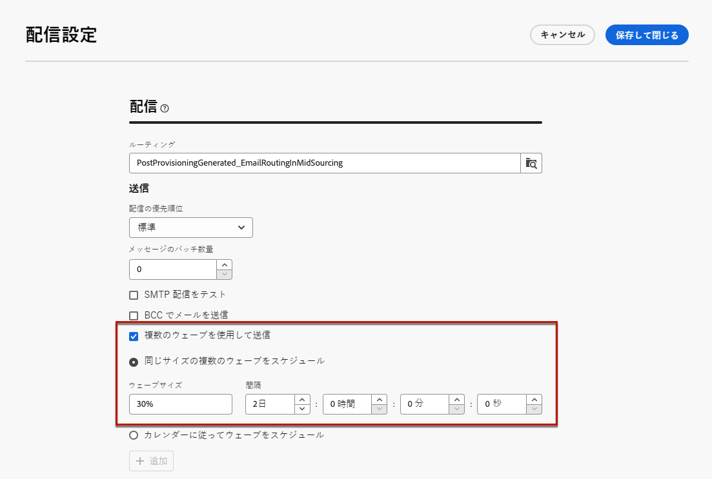
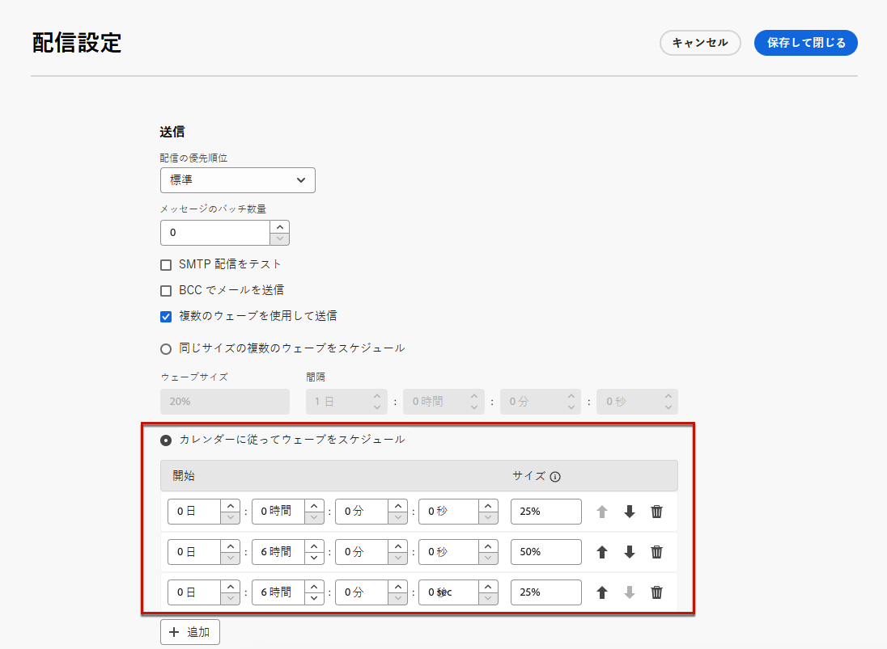
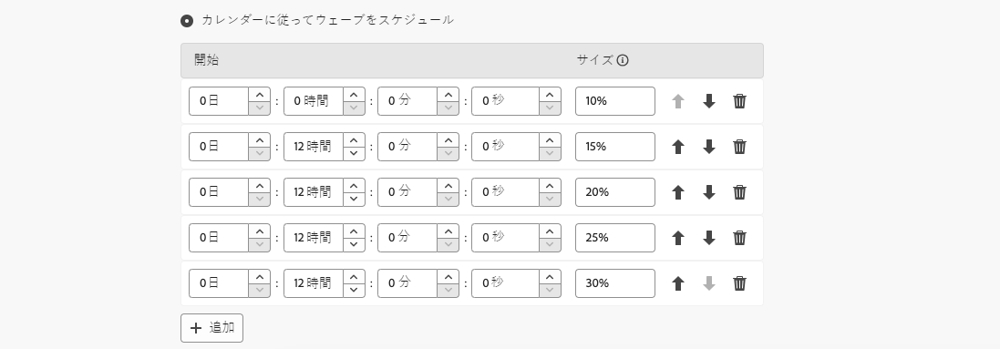

# ウェーブを使用した送信 {#send-using-waves}

>[!CONTEXTUALHELP]
>id="acw_deliveries_waves_definition"
>title="複数のバッチへの配信の分割"
>abstract="大量のメッセージを同時に送信する代わりに、ウェーブを定義して複数のバッチに配信を分割します。同じサイズの複数のウェーブを設定することや、異なるウェーブを送信するようにカレンダーを設定することができます。"

>[!CONTEXTUALHELP]
>id="acw_deliveries_waves_size"
>title="各ウェーブのサイズの定義"
>abstract="追加するすべてのウェーブのサイズを入力する必要があります。数値（各ウェーブのメッセージ数）または割合（0～100％）を入力します。"

負荷を分散するには、メール配信を複数のバッチに分割します。全体の配信を基準にしてバッチの数とその比率および 2 つのウェーブ間の間隔を設定します。

>[!NOTE]
>
>定義できるのは、サイズと 2 つの連続するウェーブの間隔のみです。受信者の選択条件をウェーブごとに調整することはできません。

ウェーブを使用して配信を送信するには、次の手順に従います。

1. [配信設定](delivery-settings.md#retries)を開きます。

1. 「**[!UICONTROL 配信]**」セクションを参照します。

1. 「**[!UICONTROL 複数のウェーブを使用して送信]**」オプションを選択します。

1. ウェーブを設定するには、次のいずれかを行います。

   * [同じサイズの複数のウェーブをスケジュール](#waves-same-size)
   * [カレンダーに従ってウェーブをスケジュール](#waves-calendar)

1. 通常どおりに配信を準備して送信します。[詳細情報](../msg/gs-deliveries.md)

   >[!CAUTION]
   >
   >最後のウェーブが「[有効性](delivery-settings.md#validity)」タブで定義された配信期限を過ぎていないことを確認してください。期限を過ぎている場合、一部のメッセージが送信されない可能性があります。特別なタイポロジコントロールルールである「**[!UICONTROL ウェーブスケジュールの検証]**」では、最後のウェーブが配信の有効期限の前に計画されているかどうかが確認されます。コントロールルールについて詳しくは、[Campaign v8 （クライアントコンソール）ドキュメント ](https://experienceleague.adobe.com/docs/campaign/automation/campaign-optimization/control-rules.html?lang=ja) を参照してください。
   >
   >また、最後のウェーブを設定するときに、再試行の時間を十分にみておく必要があります。[詳細情報](delivery-settings.md#retries)

1. 送信状況を監視するには、[配信ログ](../monitor/delivery-logs.md)を参照してください。処理済みのウェーブで既に送信された配信（ステータスが&#x200B;**[!UICONTROL 送信済み]**）と、残りのウェーブで送信されるウェーブ（ステータスが&#x200B;**[!UICONTROL 保留中]**）を確認できます。

## 同じサイズの複数のウェーブをスケジュール {#waves-same-size}

このオプションを選択した場合、すべてのウェーブ（最後のウェーブを除く）が同じサイズになり、各ウェーブ間の遅延は常に同じになります。

{zoomable="yes"}

* 配信を分割するすべてのウェーブのサイズを指定します。割合または数値を入力できます。残りのメッセージ数を含める必要があるので、最後のウェーブのみサイズを変更できます。

  例えば、「**[!UICONTROL ウェーブサイズ]**」フィールドに「**[!UICONTROL 30％]**」と入力すると、最初の 3 つのウェーブは配信に含まれるすべてのメッセージの 30％を表し、4 番目のウェーブは残りの 10％を表します。

* 「**[!UICONTROL 間隔]**」セクションで、2 つの連続するウェーブの開始間隔を指定します。例えば、「**[!UICONTROL 2 日]**」と入力した場合、最初のウェーブは直ちに、2 番目のウェーブは 2 日後、3 番目のウェーブは 4 日後にといった具合に開始されます。

同じサイズの複数のウェーブを使用する一般的なユースケースの 1 つは、コールセンターが関与する場合です。電話によるロイヤルティキャンペーンを管理する場合、組織が処理できるサブスクライバーへの電話の本数には限界があります。

ウェーブを使用して、1 日あたりのメッセージ数を 20 に制限できます（コールセンターの 1 日あたりの処理能力）。

これをおこなうには、「**[!UICONTROL 同じサイズの複数のウェーブをスケジュール]**」オプションを選択します。ウェーブサイズとして「**[!UICONTROL 20]**」と入力し、「**[!UICONTROL 期間]**」フィールドに「**[!UICONTROL 1 日]**」と入力します。

{zoomable="yes"}

## カレンダーに従ってウェーブをスケジュール {#waves-calendar}

このオプションを選択した場合は、送信する各ウェーブの開始日/時刻および各ウェーブのサイズを定義します。

* 「**[!UICONTROL 開始]**」フィールドでは、2 つの連続するウェーブの開始間隔を指定します。

* 「**[!UICONTROL サイズ]**」列では、固定の数値または割合を入力します。

必要な数のウェーブを追加します。 必要に応じて並べ替えます。

>[!NOTE]
>
>割合を使用している場合は、すべてのウェーブの合計が 100％を超えないようにする必要があります。

以下の例では、最初のウェーブは、配信に含まれるメッセージ総数の 25％を表しており、ただちに開始されます。次の 2 つのウェーブで配信が完了しますが、これらのウェーブは、6 時間間隔で開始するように設定されています。

{zoomable="yes"}

カレンダーに従って複数のウェーブを使用する一般的なユースケースは、ランプアッププロセス中です。

新しいプラットフォームを使用してメールが送信された場合、インターネットサービスプロバイダー（ISP）は認識されない IP アドレスを疑わしく思います。多くの場合、大量のメールが突然送信されると、ISP はそれらのメールをスパムとしてマークします。

スパムと見なされないようにするには、ウェーブを使用して送信する量を徐々に増やします。 これにより、スタートアップフェーズがスムーズに展開され、無効なアドレスの全体的な割合が減ります。

そのためには、「**[!UICONTROL カレンダーに従ってウェーブをスケジュール]**」オプションを選択します。例えば、最初のウェーブを 10％に、2 番目のウェーブを 15％に、3 番目のウェーブを 20％にといった具合に設定します。

{zoomable="yes"}