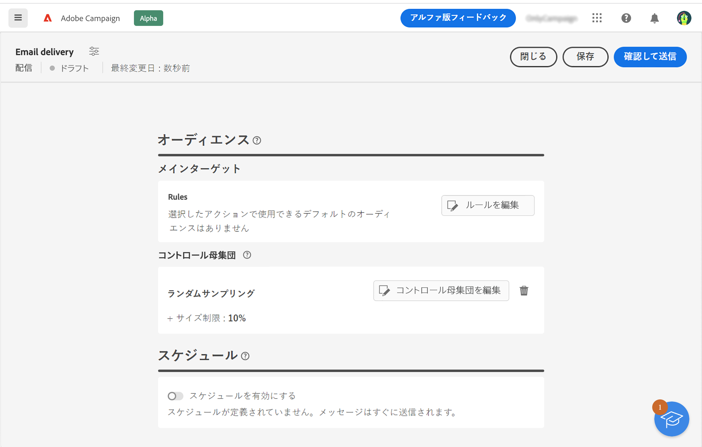

# オーディエンスの基本を学ぶ {#about-audiences}

<!--
Audience only created for the delivery, not available later-->

<!--
Three ways:
* existing audience

Campaign or AEP Audiences

* create new on the fly

query like AEP segment builder (same component with campaign data)

* import from file

show use case with a new audience creation (or import from file?)

control groups like acc: exract, random, based on attribute
-->

オーディエンスは配信のメインターゲットであり、メッセージを受信する受信者となります。オーディエンスのタイプは、配信テンプレートで定義されたターゲットマッピングによって異なります。配信テンプレートの概要については、[この節](../msg/delivery-template.md)を参照してください。

オーディエンス母集団を定義するには、次の操作を実行します。

* クライアントコンソールでリストとして作成した既存のオーディエンスを選択します。[詳細情報](add-audience.md)
* Adobe Experience Platform オーディエンスを選択します。[詳細情報](aep-audience.md)
* フィルタリング条件を定義し組み合わせて、ルールビルダーを使用して新しいオーディエンスを作成します。[詳細情報](segment-builder.md)
* 外部ファイルからオーディエンスを使用：このオプションは、スタンドアロンのメール配信にのみ使用でき、キャンペーン配信では使用できません。[詳細情報](file-audience.md)

キャンペーンワークフローのコンテキストでメッセージを送信する場合、オーディエンスは特定の&#x200B;**オーディエンスを読み取り**&#x200B;ワークフローアクティビティで定義されます。このコンテキストでは、メール配信用のオーディエンスをファイルから読み込むことはできず、オーディエンスはこの専用アクティビティでのみ定義されます。キャンペーンワークフローで配信のオーディエンスを定義する方法について詳しくは、[この節](../workflows/orchestrate-activities.md)を参照してください。

また、コントロール母集団を定義すると、キャンペーンの影響を測定するために、オーディエンスの一部にメッセージを送信しないようにできます。[詳細情報](control-group.md)

