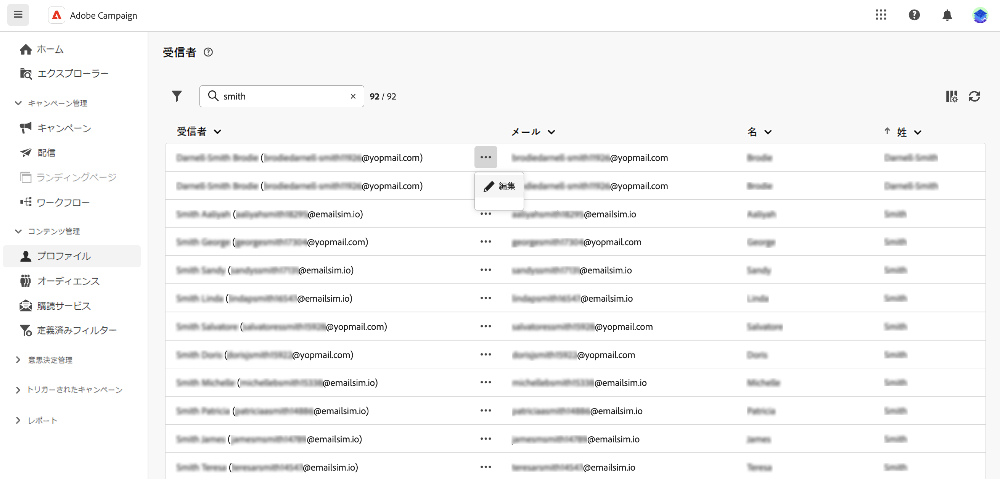
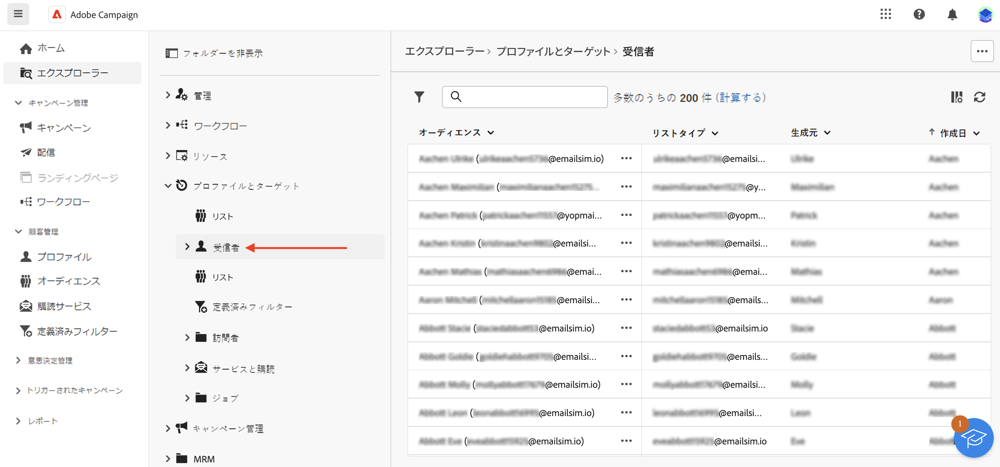

# 受信者とオーディエンスの操作 {#about-recipients}

>[!CONTEXTUALHELP]
>id="acw_homepage_rn4"
>title="受信者の 360 表示"
>abstract="新しい受信者を作成し、強力なレポートとツールを通じて監視します。受信者の属性、インタラクションおよびログにアクセスします。 フィルターオプションを使用して、受信者リストを参照し、プロファイルを編集および更新します。"
>additional-url="https://experienceleague.adobe.com/docs/campaign-web/v8/whats-new.html" text="リリースノートを参照"

>[!CONTEXTUALHELP]
>id="acw_recipients_list"
>title="プロファイル"
>abstract="プロファイルとは、Adobe Campaign から送信されるメッセージの受信対象となる個人です。Adobe Campaign の受信者は、配信（メール、SMS など）の送信先となるデフォルトプロファイルです。このリストから、権限に基づいて受信者のプロファイルを表示できます。フィルターオプションを使用して、このリストを参照します。受信者の属性の一部を編集および更新できます。"

受信者とは、Adobe Campaign から送信されるメッセージの受信対象となるプロファイルです。Adobe Campaign では、受信者は配信（メール、SMS など）の送信先となるデフォルトプロファイルです。データベースに保存された受信者データを使用すると、特定の配信を受信するオーディエンスを作成したり、配信コンテンツにパーソナライズデータを追加したりできます。データベースには、他のタイプのプロファイルも保存されています。他のタイプのプロファイルは、様々な用途に使用するように設計されています。例えば、シードプロファイルは配信をテストするために作成され、最終的なオーディエンスに配信されます。

受信者は、Campaign クライアントコンソールからのみ追加できます。ただし、受信者は、Campaign web 内で、左側のナビゲーションレールの&#x200B;**受信者**&#x200B;エントリから表示されます。この画面から受信者の属性を編集することもできます。

受信者のデータを編集するには、名前の横にある 3 つのドットをクリックし「**編集…**」を選びます。

一部の属性（名、姓、メール、電話番号）を更新できます。

>[!NOTE]
>
>この限定的なプロファイル編集フォームは、ベータ版プログラムテスト用にのみ提供されています。今後のリリースで改善される予定です。ユーザーはすぐにメールアドレスと電話番号をプロファイルに追加し、メールと SMS チャネルをテストして、送信されたメッセージを受信できます。

検索フィールドを使用して、「**フィルターを表示**」ボタンから受信者をフィルタリングできます。

また、**エクスプローラー**&#x200B;ビューから受信者にアクセスし、フォルダーおよびサブフォルダーを表示、参照、作成し、関連する権限を確認することができます。

>[!NOTE]
>
>権限によっては、データベースに保存されている受信者の完全なリストへのアクセス権がない場合があります。権限について詳しくは、[この節](../get-started/permissions.md)を参照してください。

さらに、ニュースレターなどのサービスに関する受信者の登録および登録解除を管理できます。購読サービスの使用方法については、[このページ](manage-services.md)を参照してください。

ワークフローを作成して、重複排除、エンリッチメント、プロファイルの組み合わせ、オーディエンスの作成を行うことができます。詳しくは、[こちら](../workflows/gs-workflows.md)を参照してください。
