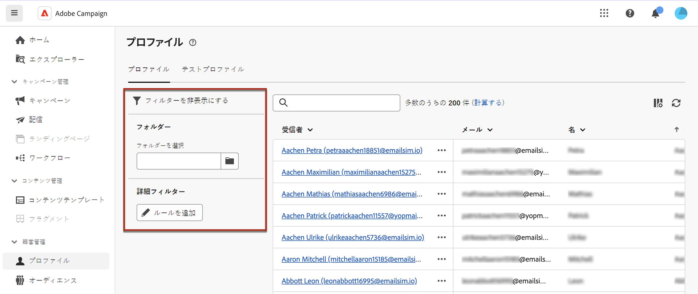

# プロファイルの基本を学ぶ {#profiles}

>[!CONTEXTUALHELP]
>id="acw_recipients_list"
>title="プロファイル"
>abstract="プロファイルとは、Adobe Campaign から送信されるメッセージの受信対象となるレコードです。このリストから、権限に基づいてプロファイルの詳細を表示できます。フィルターオプションを使用して、このリストを参照します。プロファイルの属性の一部を編集および更新できます。"

## プロファイルとは {#what}

**プロファイル**&#x200B;は、クライアントコンソールでは「受信者」とも呼ばれ、Campaign データベースに保存されるレコードを表し、配信の[オーディエンスを作成](create-audience.md)し、コンテンツに[パーソナライゼーションデータを追加](../personalization/personalize.md)するための重要なコンポーネントとして機能します。Adobe Campaign では、新しいエントリの作成からすべてのプロファイルの属性とサービスの購読の包括的なビューへのアクセスまで、すべて Campaign web ユーザーインターフェイスを通じてプロファイルをシームレスに管理できます。

さらに、クライアントコンソールで「シードプロファイル」として識別される&#x200B;**[!UICONTROL テストプロファイル]**&#x200B;を使用すると、特定の配信のターゲティング条件に一致しない追加の受信者をターゲットにすることができます。これらのプロファイルには、架空の連絡先情報や、送信者が制御する連絡先情報が含まれます。テストプロファイルは本配信前確認の受信者です。本配信前確認を送信してメッセージをテストするために使用されます。[詳しくは、テストプロファイルの操作方法を参照してください](test-profiles.md)

プロファイルとテストプロファイルは、どちらも、対象のオーディエンスに到達する前に配信をテストする場合に使用できます。これにより、メッセージのコンテンツとパーソナライゼーションをプレビューしたり、テストと検証のために配達確認を送信したり、様々なプラットフォームやデバイスでのメールのレンダリングを評価したり、ランディングページをテストしたりできます。[詳しくは、配信のプレビューとテストの方法を参照してください](../preview-test/preview-test.md)

➡️ [この機能をビデオで確認](#video)

## プロファイルのリストへのアクセス {#access}

プロファイルは、Adobe Campaign web の左側のナビゲーションパネルで、**[!UICONTROL 顧客管理]**／**プロファイル**&#x200B;エントリからアクセスして編集できます。また、**[!UICONTROL プロファイルとターゲット]**／**[!UICONTROL 受信者]**&#x200B;ノードから、**[!UICONTROL エクスプローラー]**&#x200B;ビューでアクセスすることもできます。そこから、フォルダーまたはサブフォルダーを参照、作成、管理したり、関連する権限を確認したりできます。[フォルダーの作成方法を学ぶ](../get-started/permissions.md#folders)

>[!NOTE]
>
>権限によっては、データベースに保存されているプロファイルの完全なリストへのアクセス権がない場合があります。[詳しくは、権限を参照してください](../get-started/permissions.md)。

検索フィールドを使用するか、「**フィルターを表示**」ボタンから使用できるフィルターを使用して、**[!UICONTROL プロファイル]**&#x200B;リストをフィルタリングできます。ドロップダウンリストを使用して結果を特定の[フォルダー](../get-started/permissions.md#folders)に制限したり、[クエリモデラー](../query/query-modeler-overview.md)を使用してルールを追加したりできます。

{zoomable=&quot;yes&quot;}

プロファイルの詳細にアクセスするには、リストからプロファイルの名前をクリックします。プロファイルの詳細ビューが開き、その属性とサブスクライブしているサービスを探索できます。[詳しくは、プロファイルの詳細の探索方法を参照してください](create-profile.md)

プロファイルを削除するには、**[!UICONTROL その他のアクション]**&#x200B;メニューから対応するオプションを選択します。

## チュートリアルビデオ {#video}

Campaign web ユーザーインターフェイスを使用してプロファイルにアクセス、管理および探索する方法について説明します。

>[!VIDEO](https://video.tv.adobe.com/v/3427293?quality=12)
