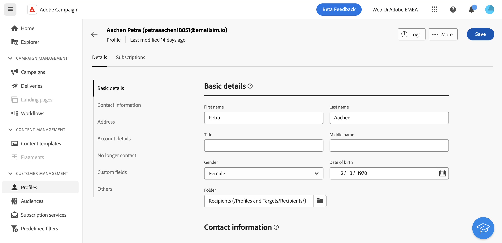

# プロファイルの監視と管理 {#profiles}

>[!CONTEXTUALHELP]
>id="acw_homepage_rn4"
>title="プロファイルの 360 ビュー"
>abstract="新しいプロファイルを作成し、強力なレポートやツールを使用してそれらを監視します。 プロファイルの属性、インタラクションおよびログにアクセスします。 フィルターオプションを使用して、プロファイルのリストを参照し、プロファイルを編集および更新します。"
>additional-url="https://experienceleague.adobe.com/docs/campaign-web/v8/whats-new.html" text="リリースノートを参照"

>[!CONTEXTUALHELP]
>id="acw_recipients_list"
>title="プロファイル"
>abstract="プロファイルとは、Adobe Campaign から送信されるメッセージの受信対象となる個人です。このリストから、権限に基づいてプロファイルの詳細を表示できます。 フィルターオプションを使用して、このリストを参照します。プロファイルの属性の一部を編集および更新できます。"

## プロファイルの基本を学ぶ {#gs}

Adobe Campaign Web のプロファイルは、データベースに格納された個人で、配信のオーディエンスを作成し、コンテンツにパーソナライゼーションデータを追加するための主要なコンポーネントとして機能します。 様々なタイプのプロファイルがデータベースに保存されます（テストプロファイルなど）。テストプロファイルは、最終的なオーディエンスに配信を送信する前に配信をテストするように設計されています。 [テストプロファイルの操作方法を説明します。](test-profiles.md)

プロファイルは、Campaign クライアントコンソールからのみ追加できます。 ただし、Adobe Campaign Web では、 **プロファイル** エントリをクリックします。 また、 **エクスプローラ** フォルダ、サブフォルダを参照、作成、および関連付けられた権限を確認できるビュー。

プロファイルリストは、 **フィルターを表示** 」ボタンをクリックします。

>[!NOTE]
>
>権限によっては、データベースに保存されているプロファイルの完全なリストへのアクセス権がない場合があります。 権限について詳しくは、[この節](../get-started/permissions.md)を参照してください。

## プロファイルの属性へのアクセスと編集 {#access}

プロファイルの詳細にアクセスするには、プロファイルリストでプロファイルの名前をクリックします。

この画面から、プロファイルの詳細情報にアクセスできます。

* The **[!UICONTROL 詳細]** 「 」タブでは、プロファイルの属性を参照できます。 属性を編集するには、目的のフィールドに変更を加え、 **[!UICONTROL 保存]** 」ボタンをクリックします。
* The **[!UICONTROL 購読]** 「 」タブには、プロファイルが購読しているサービスに関する情報が表示されます。 [サブスクリプションサービスの使用方法を学ぶ](manage-services.md)
* The **[!UICONTROL ログ]** 画面の右上隅にあるボタンを使用すると、送信、除外、トラッキングのログや、プロファイルに提示された提案を通じて、プロファイルのインタラクションの履歴を表示できます。
