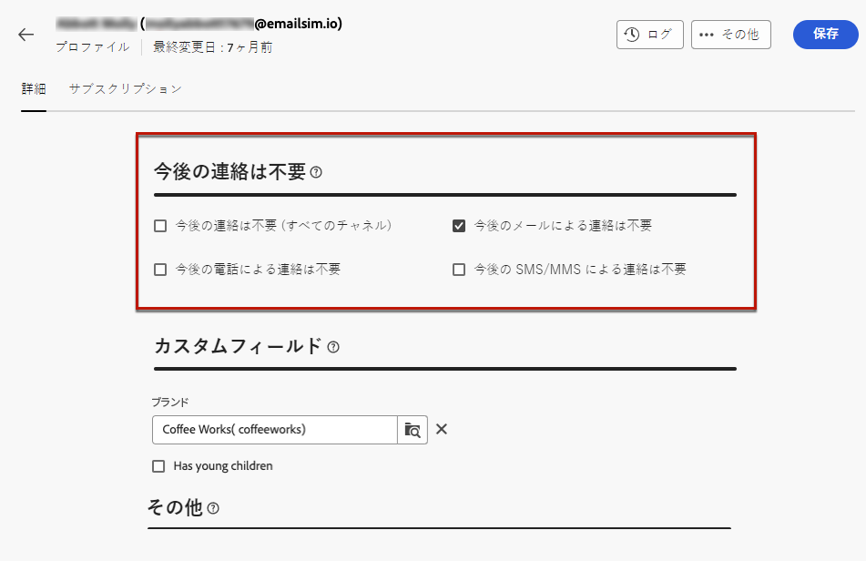

# プロファイルの監視と管理 {#profiles}

>[!CONTEXTUALHELP]
>id="acw_homepage_welcome_rn4"
>title="プロファイルの 360 ビュー"
>abstract="新しいプロファイルを作成し、強力なレポートやツールを使用してそれらを監視します。 プロファイルの属性、インタラクションおよびログにアクセスします。 フィルターオプションを使用して、プロファイルのリストを参照し、プロファイルを編集および更新します。"
>additional-url="https://experienceleague.adobe.com/docs/campaign-web/v8/whats-new.html?lang=ja" text="リリースノートを参照してください"

<!--TO REMOVE BELOW-->
>[!CONTEXTUALHELP]
>id="acw_homepage_rn4"
>title="プロファイルの 360 ビュー"
>abstract="新しいプロファイルを作成し、強力なレポートやツールを使用してそれらを監視します。 プロファイルの属性、インタラクションおよびログにアクセスします。 フィルターオプションを使用して、プロファイルのリストを参照し、プロファイルを編集および更新します。"
>additional-url="https://experienceleague.adobe.com/docs/campaign-web/v8/whats-new.html?lang=ja" text="リリースノートを参照してください"

<!--TO REMOVE ABOVE-->

>[!CONTEXTUALHELP]
>id="acw_recipients_list"
>title="プロファイル"
>abstract="プロファイルとは、Adobe Campaignから送信されるメッセージの受信をターゲットとしている個人です。 このリストから、権限に基づいてプロファイルの詳細を表示できます。 フィルターオプションを使用して、このリストを参照します。プロファイルの属性の一部を編集および更新できます。"

## プロファイルの基本を学ぶ {#gs}

Adobe Campaign Web のプロファイルは、データベースに格納される個人で、 [オーディエンスを作成](create-audience.md) 配信および [パーソナライゼーションを追加](../personalization/personalize.md) データをコンテンツに追加します。

その他のタイプのプロファイルは、データベースに格納されます。例： **[!UICONTROL テストプロファイル]**：配信を最終的なオーディエンスに送信する前にテストするように設計されています。 [詳細情報](test-profiles.md)

プロファイルは、Adobe Campaignクライアントコンソールからのみ作成できます。 [詳細を学ぶ](https://experienceleague.adobe.com/docs/campaign/campaign-v8/audience/add-profiles/create-profiles.html){target="_blank"}. ただし、Adobe Campaign Web では、 **[!UICONTROL 顧客管理]** > **プロファイル** エントリをクリックします。

>[!NOTE]
>
>権限によっては、データベースに保存されているプロファイルの完全なリストへのアクセス権がない場合があります。 [権限の詳細を表示](../get-started/permissions.md).

* 次の項目をフィルターできます。 **[!UICONTROL プロファイル]** 次の場所から使用できる検索フィールドまたはフィルターを使用したリスト **フィルターを表示** 」ボタンをクリックします。 結果を特定の [フォルダー](../get-started/permissions.md#folders) ドロップダウンリストを使用するか、 [クエリモデラー](../query/query-modeler-overview.md).

  

* プロファイルを削除するには、「 **[!UICONTROL その他のアクション]** メニュー。

* プロファイルを編集するには、リストから目的の項目をクリックします。 [詳細情報](#access)

また、 **[!UICONTROL エクスプローラ]** ビュー、 **[!UICONTROL プロファイルとターゲット]** > **[!UICONTROL 受信者]** ノード。

ここから、フォルダやサブフォルダを参照、作成、管理したり、関連する権限を確認したりできます。 [フォルダーの作成方法を説明します](../get-started/permissions.md#folders)

次から： **[!UICONTROL エクスプローラ]** 表示では、フィルター、削除および [編集](#access) プロファイル。

## プロファイルの属性へのアクセスと編集 {#access}

>[!CONTEXTUALHELP]
>id="acw_recipients_creation_details"
>title="基本の詳細"
>abstract="この節では、プロファイルの基本的な詳細に関するインサイトを提供します。 情報を変更するには、各フィールド内で直接変更をおこない、 **保存** ボタンをクリックします。"

>[!CONTEXTUALHELP]
>id="acw_recipients_creation_contactinformation"
>title="連絡先情報"
>abstract="この節では、プロファイルの連絡先情報に関するインサイトを提供します。 情報を変更するには、各フィールド内で直接変更をおこない、 **保存** ボタンをクリックします。"

>[!CONTEXTUALHELP]
>id="acw_recipients_creation_address"
>title="住所"
>abstract="このセクションでは、プロファイルの住所と住所の質に関するインサイトを提供します。 情報を変更するには、各フィールド内で直接変更をおこない、 **保存** ボタンをクリックします。"

>[!CONTEXTUALHELP]
>id="acw_recipients_creation_account"
>title="アカウントの詳細"
>abstract="この節では、プロファイルのアカウント詳細に関するインサイトを提供します。 情報を変更するには、各フィールド内で直接変更をおこない、 **保存** ボタンをクリックします。"

>[!CONTEXTUALHELP]
>id="acw_recipients_creation_nolongercontact"
>title="受信者の今後の連絡は不要"
>abstract="この節では、プロファイルの連絡先設定に関するインサイトを提供します。 情報を変更するには、各フィールド内で直接変更をおこない、 **保存** ボタンをクリックします。"

>[!CONTEXTUALHELP]
>id="acw_recipients_creation_customfields"
>title="カスタムフィールド"
>abstract="カスタムフィールドは、お使いのインスタンスに合わせて設定された、ニーズに合わせた特定の属性です。 情報を変更するには、各フィールド内で直接変更をおこない、 **保存** ボタンをクリックします。"

>[!CONTEXTUALHELP]
>id="acw_recipients_creation_othersfields"
>title="その他"
>abstract="この節では、追加の組み込み属性を提供します。 情報を変更するには、各フィールド内で直接変更をおこない、 **保存** ボタンをクリックします。"

>[!CONTEXTUALHELP]
>id="acw_recipients_subscription_list"
>title="受信者の購読リスト"
>abstract="このタブには、プロファイルが購読しているすべてのサービスが表示されます。"

プロファイルの詳細にアクセスして編集するには、次の手順に従います。

1. 参照先 **[!UICONTROL 顧客管理]** > **[!UICONTROL プロファイル]** をクリックし、 **[!UICONTROL プロファイル]** リスト。

   

1. プロファイルの詳細情報が表示されます。

   The **[!UICONTROL 詳細]** 「 」タブを使用すると、プロファイルの組み込み属性とカスタム属性を参照できます。 属性を編集するには、目的のフィールドに変更を加え、 **[!UICONTROL 保存]** 」ボタンをクリックします。

   

   1. デフォルトでは、プロファイルは **[!UICONTROL 受信者]** フォルダー。 目的の場所を参照して変更できます。 [フォルダーの操作方法を説明します](../get-started/permissions.md#folders)

      

   1. Adobe Analytics の **[!UICONTROL 連絡先情報]** 」セクションで、e メールアドレスやその他の関連データを更新できます。 E メールアドレスは、プロファイルラベルの後に括弧で囲まれて表示されます。

      

   1. 次を確認します。 **[!UICONTROL 今後の連絡は不要]** オプションを選択し、必要に応じて更新します。 これらのオプションのいずれかを選択すると、プロファイルはオンになブロックリストに加えるります。 例えば、受信者がニュースレターの購読解除リンクをクリックした場合、この情報が連絡先データに追加されます。 その受信者は、選択したチャネルのターゲットになっていません。 [詳細情報](https://experienceleague.adobe.com/docs/campaign/campaign-v8/send/failures/quarantines.html){target="_blank"}

      

   1. 存在する場合 **[!UICONTROL カスタムフィールド]**&#x200B;の場合は、必要に応じて値を更新できます。 カスタムフィールドは、 **[!UICONTROL プロファイル]** スキーマをAdobe Campaignコンソールで使用できます。 [詳細情報](https://experienceleague.adobe.com/docs/campaign/campaign-v8/developer/shemas-forms/extend-schema.html){target="_blank"}

      

1. 次をクリック： **[!UICONTROL 購読]** 「 」タブをクリックして、プロファイルが購読されているサービスに関する情報にアクセスします。 [購読サービスの詳細を表示](manage-services.md)

   

1. 次をクリック： **[!UICONTROL ログ]** ボタンをクリックすると、送信ログ、除外ログ、トラッキングログを通じたプロファイルのインタラクション履歴が表示されます。 [配信ログの詳細を説明します](../monitor/delivery-logs.md)

   また、 **[!UICONTROL 提案]** タブをクリックします。 [オファーの詳細を表示](../msg/offers.md)

   
