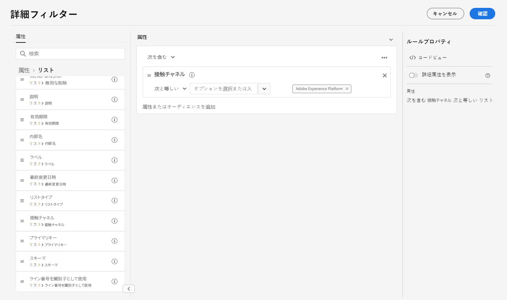

# 既存オーディエンスの選択 {#add-audience}

>[!CONTEXTUALHELP]
>id="acw_deliveries_email_audience_select"
>title="既存オーディエンスの選択"
>abstract="リストを参照して、既存のオーディエンスを選択します。「フィルターを表示」アイコンを使用してリストをフィルターするか、特定のフォルダーを選択します。"

この節では、配信のターゲット母集団を定義する際に、既存のオーディエンスを選択する方法について説明します。配信のメインターゲットを定義する際には、次の操作も可能です。

* [1 回限りのオーディエンスの構築](one-time-audience.md) クエリモデラーを使用します。
* [外部ファイルのオーディエンスを読み込みます](file-audience.md)（メールの場合のみ）。

配信のターゲットに設定できるオーディエンスには、**オーディエンス**&#x200B;の左メニューからアクセスできます。オーディエンスは、クライアントコンソール、Campaign Web オーディエンスワークフロー、Adobe Experience Platformなど、複数のソースから選びます。[オーディエンスの監視および管理方法を学ぶ](manage-audience.md)

メッセージの既存のオーディエンスを選択するには、次の手順に従います。

1. 次から： **対象ユーザ** 配信作成アシスタントの「 」セクションで、 **[!UICONTROL オーディエンスを選択]** ボタンを選択し、 **[!UICONTROL オーディエンスを選択]** 既存のオーディエンスを使用する場合。

   

1. この画面には、現在のフォルダーの既存のすべてのオーディエンスが表示されます。

   

   Adobe Experience Platform からオーディエンスを選択するには、画面のフィルターセクションから `AEP Audiences folder` を参照します。

   

1. 「フィルター」セクションでは、フィルターオプションにアクセスしてオーディエンスリストを絞り込むことができます。これをおこなうには、 **ルールを追加** ：クエリモデラーにアクセスします。このモデラーを使用して、オーディエンスのリストの詳細フィルターを作成できます。 [詳しくは、クエリモデラーの使用方法を参照してください](../query/query-modeler-overview.md)

   例えば、次に示すように、オーディエンスの起源に基づいてフィルタリングするルールを定義できます。

   

1. 「**確認**」をクリックして、オーディエンスを配信のメインターゲットとして追加します。その後も、クエリモデラーを使用してオーディエンスを絞り込むには、 **ルールを編集** 」ボタンをクリックします。

   

   また、コントロール母集団を設定して、キャンペーンの影響を測定することもできます。コントロール母集団はメッセージを受信しません。これにより、メッセージを受信した母集団の行動と、受信しなかった連絡先の行動を比較できます。[詳細情報](control-group.md)
