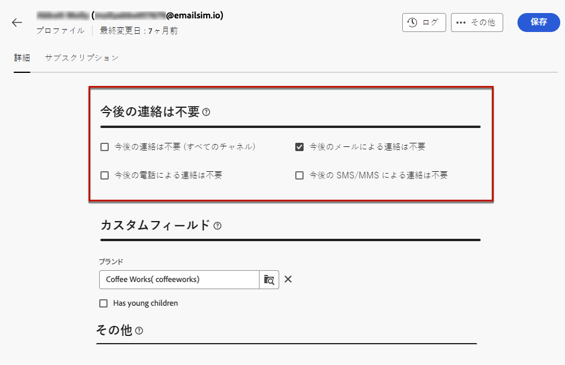

# 同意の管理 {#manage-consent}

## 一般的なレコメンデーション {#general-recommendations}

Adobe Campaign を使用すると、個人情報や機密情報などのデータを収集できます。GDPR（一般データ保護規則）やその他の適用されるプライバシー法などのデータ保護規制に従って、受信者から同意を取得し、監視することが重要です。

* 最初に、迷惑メール、プッシュ通知、SMS メッセージ（「スパム」）を送信しないようにします。アドビは、顧客のライフタイムバリューおよびロイヤリティを促進するうえで許可型マーケティングの原則を強くサポートしています。アドビでは、迷惑メールの送信に Adobe Campaign を使用することを固く禁止しています。[詳細情報](#denylisted-profiles)

* 受信者に配信をオプトアウトする機能を提供することで、常に受信者に通信の受信に同意してもらいます<!-- and keep honoring opt-out requests as quickly as possible-->。[詳細情報](#opt-out)

* 購読管理プロセスを使用して、受信者の環境設定を管理し、特定のタイプの購読をオプトインした受信者を追跡します。[詳細情報](../../delivery/using/about-services-and-subscriptions.md)

## オプトアウトの管理 {#opt-out}

ブランドからの受信を購読解除できる機能を受信者に提供することは、法的要件です。また、この選択を確実に行うためにも必要です。<!--Learn more about the applicable legislation in the [Adobe Campaign Classic v7 documentation](https://experienceleague.adobe.com/docs/campaign-classic/using/getting-started/privacy/privacy-and-recommendations.html?lang=ja#privacy-regulations){target="_blank"}.-->

**重要な理由**

* これらの規制に準拠できないと、ブランドに法規制上のリスクが生じます。
* メッセージがスパムとしてマークされ、評判が損なわれるような未承諾の通信を送信することを防ぐのに役立ちます。

Adobe Campaign web を使用して配信を送信する場合、顧客が今後の通信を購読解除できるようにします。購読解除すると、プロファイルは、今後のマーケティングメッセージのオーディエンスから自動的に削除されます。

### メールのオプトアウト {#email-opt-out}

受信者がメール配信を購読解除できるようにするには、受信者に送信するすべてのメールに&#x200B;**購読解除リンク**&#x200B;を含めます。

次の手順に従います。

1. 外部ランディングページを作成し、選択したサードパーティ製のシステムでホストします。

1. メール配信を作成します。[詳細情報](../email/create-email.md)

1. メールコンテンツにリンクを挿入します。[詳細情報](../email/message-tracking.md#insert-links)

   

1. 「**[!UICONTROL URL]**」フィールドに、サードパーティ製のランディングページへのリンクを貼り付けます。

1. 左側のパネルで&#x200B;**[!UICONTROL リンク]**&#x200B;アイコンをクリックすると、追跡するコンテンツのすべての URL のリストが表示されます。

1. 新しいリンクの横にある鉛筆アイコンをクリックして編集します。

1. **[!UICONTROL トラッキングタイプ]**&#x200B;を変更し、**[!UICONTROL オプトアウト]**&#x200B;に設定します。

   

1. 「**[!UICONTROL 保存]**」をクリックし、メッセージを送信します。[詳細情報](../monitor/prepare-send.md)

1. メッセージを受信し、受信者が登録解除リンクをクリックすると、ランディングページが表示されます。

1. 受信者がランディングページフォームを送信すると、プロファイルデータが更新されます。[詳細情報](#denylisted-profiles)

<!--Any other option available such as one-click opt-out link or List-Unsubscribe (to include an unsubscribe link in the email header) to enable opt-out in a delivery?-->

## ブロックリスト登録済みプロファイル {#denylisted-profiles}

購読解除（オプトアウト）すると、プロファイルは特定のチャネルの&#x200B;**ブロックリスト**&#x200B;に追加されます。つまり、プロファイルはどの配信のターゲットにもならないことを意味します。

>[!NOTE]
>
>メールチャネルのブロックリストのプロファイルに 2 つのメールアドレスがある場合、両方のアドレスが配信から除外されます。

プロファイルが 1 つ以上のチャネルのブロックリストに含まれているかどうかは、プロファイルの「**[!UICONTROL 詳細]**」タブの「**[!UICONTROL 今後の連絡は不要]**」セクションで確認できます。[詳細情報](../audience/about-recipients.md#access)

<!--Denylisted status on quarantine list

Additionally, when recipients report your message as spam, or reply to an SMS message with a keyword such as "STOP", their address or phone number is quarantined with the **[!UICONTROL Denylisted]** status. Their profile is updated accordingly.

QUESTION: When a user marks an email as spam, is the profile's No longer contact section also updated? Apparently no (not the same = quarantine vs denylist)

>[!NOTE]
>
>The **[!UICONTROL Denylisted]** status refers to the address only, the profile is not on the denylist, so that the user continues receiving SMS messages and push notifications.

Learn more about Feedback loops in the [Delivery Best Practices Guide](https://experienceleague.adobe.com/docs/deliverability-learn/deliverability-best-practice-guide/transition-process/infrastructure.html?lang=ja#feedback-loops){target="_blank"}.

Learn more about quarantine in the [Campaign v8 (client console) documentation](https://experienceleague.adobe.com/docs/campaign/campaign-v8/send/failures/quarantines.html?lang=ja#non-deliverable-bounces){target="_blank"}.-->