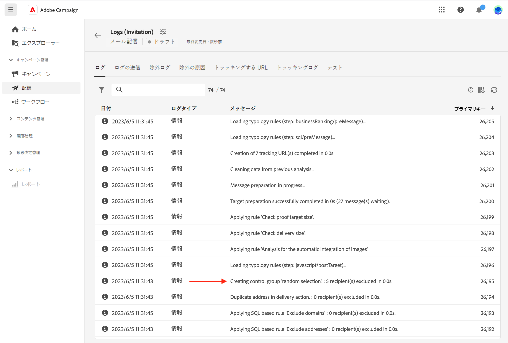

# コントロール母集団を設定 {#control-group}

コントロール母集団は、配信から除外されるサブ母集団です。コントロール母集団を定義して、オーディエンスの一部にメッセージを送信しないようにし、配信後の動作をメインターゲットと比較できます。このオプションは、キャンペーンの影響を測定するのに役立ちます。

## コントロール母集団を有効にする{#add-a-control-group}

コントロール母集団を追加するには、配信のオーディエンスを定義する際にオプションを有効にします。 コントロール母集団は、メインターゲットから無作為に抽出できます。特定の母集団から選択することもできます。したがって、コントロール母集団を定義する方法は主に 2 つあります。

* メインターゲットから複数のプロファイルを抽出します。
* リストから、またはクエリで定義された条件に基づいて、一部のプロファイルを除外します。

コントロール母集団を定義する際は、両方の方法を組み合わせることができます。

配信準備段階でコントロール母集団に含まれているすべてのプロファイルが、メインターゲットから削除されます。これらのプロファイルは、メッセージを受信しません。

>[!CAUTION]
>
>ターゲット母集団の読み込み時には、[外部ファイルから](file-audience.md)コントロール母集団を使用できません。

配信にコントロール母集団を追加するには、配信作成画面の「**オーディエンス**」セクションの&#x200B;**[!UICONTROL コントロールグループを有効にする]**&#x200B;切替スイッチを有効にします。

## ターゲットから抽出 {#extract-target}

>[!CONTEXTUALHELP]
>id="acw_deliveries_email_controlgroup_target"
>title="抽出モード"
>abstract="コントロール母集団は、配信から除外される一連のプロファイルです。コントロール母集団を定義するには、ターゲット母集団から無作為に、または並べ替えに基づいて、一定の割合または一定数のプロファイルを抽出できます。"

### コントロール母集団を作成 {#build-extract-target}

コントロール母集団を定義するには、ターゲット母集団から無作為に、または並べ替えに基づいて、一定の割合または一定数のプロファイルを抽出できます。追加の母集団を追加する場合は、「**抽出なし**」オプションを選択し、[ここで詳しく述べたように](#extra-population)追加の母集団を選択します。

まず、ターゲットからプロファイルを抽出する方法（ランダムまたは並べ替えに基づく）を定義します。

「**コントロール母集団**」セクションで、**抽出モード**&#x200B;を選択します。

* **ランダム**：配信を準備すると、サイズ上限として設定されている割合または最大数に応じてプロファイルがランダムに抽出されます。

* **属性ごとにランク付け**：特定の並べ替え順で特定の属性に基づいて一連のプロファイルを除外できます。

次に、「**サイズ制限**」セクションを使用して、メインターゲットから抽出する必要があるプロファイルの数を設定します。 生の数値（除外する 50 個のプロファイルなど）または初期オーディエンスの割合（メインターゲットの 5％など）を指定できます。

### コントロール母集団の例{#control-group-sample}

例えば、100 人の新しい最年少受信者を含むコントロール母集団を作成するには、次の手順に従います。

1. 「**年齢**」フィールドを並べ替え条件として選択します。**昇順**&#x200B;並べ替えオプションはそのままにしておきます。
1. 「**作成日**」フィールドを追加します。**降順**&#x200B;並べ替えオプションに変更します。
1. 「**サイズ制限**」セクションでしきい値に 100 を定義します。

   

この 100 人の新しい最年少受信者がメインターゲットから除外されます。

### コントロール母集団を確認 {#check-control-group}

ログを表示して、除外されたプロファイルを確認および特定できます。5 つのプロファイルに対するランダムな除外の例を見てみましょう。

配信準備が完了したら、除外がどのように適用されたかを確認できます。

* 配信ダッシュボードで、送信前に&#x200B;**除外対象** KPI を確認します。

  

* 配信ログの「ログ」タブには、除外手順が表示されます。

  
<!--

 * The **Exclusion logs** tab displays each profile and the related exclusion **Reason**.

    
-->

* **除外の原因**&#x200B;には、タイポロジルールごとに除外されたプロファイルの数が表示されます。

  

配信ログについて詳しくは、[こちら](../monitor/delivery-logs.md)を参照してください。

## 追加の母集団を追加 {#extra-population}

>[!CONTEXTUALHELP]
>id="acw_deliveries_email_controlgroup_extra"
>title="追加の母集団"
>abstract="コントロール母集団は、配信から除外される一連のプロファイルです。既存のオーディエンスを選択するか、クエリを定義すると、配信オーディエンスから特定の母集団を除外できます。"

コントロール母集団を定義する他の方法として、既存のオーディエンス内の特定の母集団を選択するか、クエリを定義します。

**コントロール母集団**&#x200B;の定義画面で、「**追加の母集団**」セクションの「**[!UICONTROL オーディエンスを選択]**」ボタンをクリックします。

* 既存のオーディエンスを使用するには、「**オーディエンスを選択**」をクリックします。詳しくは、[こちら](add-audience.md)を参照してください。

* 新しいクエリを定義するには、「**独自に作成**」を選択し、クエリモデラ―を使用して除外条件を定義します。詳しくは、[こちら](../query/query-modeler-overview.md)を参照してください。

オーディエンスに含まれるプロファイル、またはクエリの結果と一致するプロファイルは配信ターゲットから&#x200B;**除外**&#x200B;され、メッセージを受信しません。

## 結果を比較{#control-group-results}

配信が送信されたら、送信ログを抽出して、通信を受信しなかったプロファイルと有効なターゲット間の動作を比較できます。また、配信ログを使用して別のターゲティングを作成することもできます。

ターゲットから削除されたプロファイルを確認するには、**配信ログ**&#x200B;を確認します。詳しくは、[この節](#check-control-group)を参照してください。

