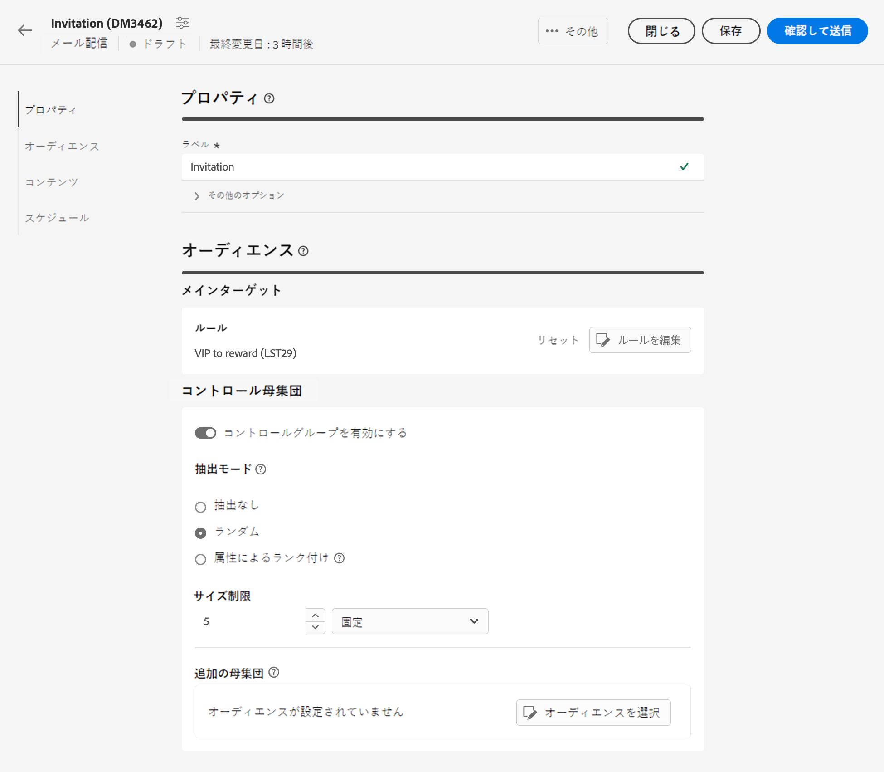
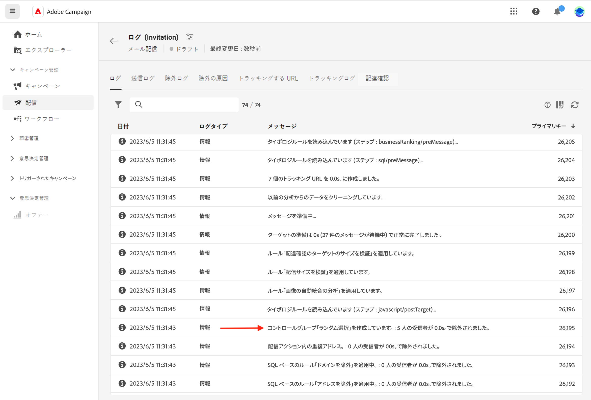
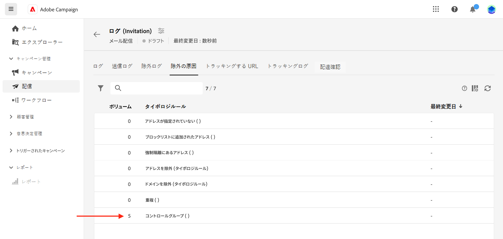

# コントロール母集団の設定 {#control-group}

コントロール母集団は、配信から除外されるサブ母集団です。 コントロール母集団を定義して、オーディエンスの一部にメッセージが送信されないようにしたり、配信後の動作とメインターゲットを比較したりできます。 このオプションを使用すると、キャンペーンの影響を測定できます。

## コントロールグループを有効にする{#add-a-control-group}

コントロール母集団を追加するには、配信のオーディエンスを定義する際に「 」オプションを有効にします。 コントロール母集団は、メインターゲットから無作為に抽出できます。特定の母集団から選択することもできます。したがって、コントロール母集団を定義する方法は主に 2 つあります。

* メインターゲットから複数のプロファイルを抽出します。
* リストから、またはクエリで定義された条件に基づいて、一部のプロファイルを除外します。

コントロール母集団を定義する際には、両方の方法を組み合わせることができます。

配信準備段階でコントロール母集団に含まれているすべてのプロファイルが、メインターゲットから削除されます。これらのプロファイルは、メッセージを受信しません。

>[!CAUTION]
>
>ターゲット母集団の読み込み時には、[外部ファイルから](file-audience.md)コントロール母集団を使用できません。

配信にコントロール母集団を追加するには、 **[!UICONTROL コントロール母集団を有効にする]** 切り替え **対象ユーザ** 「 」セクションに表示されます。

## ターゲットから抽出 {#extract-target}

>[!CONTEXTUALHELP]
>id="acw_deliveries_email_controlgroup_target"
>title="抽出モード"
>abstract="コントロール母集団を定義するには、ターゲット母集団から無作為に、または並べ替えに基づいて、一定の割合または一定数のプロファイルを抽出できます。"

### コントロール母集団の作成 {#build-extract-target}

コントロール母集団を定義するには、ターゲット母集団から無作為に、または並べ替えに基づいて、一定の割合または一定数のプロファイルを抽出できます。追加の母集団を追加する場合は、 **抽出なし** オプションを選択し、追加の母集団を選択します。 [ここで詳しく述べたように](#extra-population).

まず、ターゲットからプロファイルを抽出する方法を定義します。ランダムに、または並べ替えに基づいて。

以下 **コントロール母集団** セクションで、 **抽出モード**:

* **ランダム**：配信を準備すると、サイズ上限として設定されている割合または最大数に応じてプロファイルがランダムに抽出されます。

* **属性ごとにランク付け**：特定の並べ替え順で特定の属性に基づいて一連のプロファイルを除外できます。

その後、 **サイズ制限** 「 」セクションを使用して、メインターゲットから抽出する必要があるプロファイルの数を設定します。 生の数値（除外する 50 個のプロファイルなど）または初期オーディエンスの割合（メインターゲットの 5%など）を指定できます。

### コントロール母集団の例{#control-group-sample}

例えば、新しく年齢の低い受信者 100 人を含むコントロール母集団を作成するには、次の手順に従います。

1. を選択します。 **年齢** フィールドを並べ替え条件として使用します。 を **昇順** 並べ替えオプション。
1. を **作成日** フィールドに入力します。 を **降順** 並べ替えオプション。
1. しきい値として 100 を **サイズ制限** 」セクションに入力します。

   

その後、この 100 人の新しい最年少の受信者がメインターゲットから除外されます。

### コントロール母集団の確認 {#check-control-group}

ログを表示して、除外されたプロファイルを確認および特定できます。5 つのプロファイルに対するランダムな除外の例を見てみましょう。

配信の準備後、除外が適用された方法を確認できます。

* 配信ダッシュボードで、送信前に **除外する** KPI

   

* 配信ログの「ログ」タブには、除外手順が表示されます。

   
<!--

 * The **Exclusion logs** tab displays each profile and the related exclusion **Reason**.

    
-->

* この **除外の原因** 「 」タブには、各タイポロジルールから除外されたプロファイルの数が表示されます。

   

配信ログについて詳しくは、[こちら](../monitor/delivery-logs.md)を参照してください。

## 母集団の追加 {#extra-population}

>[!CONTEXTUALHELP]
>id="acw_deliveries_email_controlgroup_extra"
>title="追加の母集団"
>abstract="既存のオーディエンスを選択するか、クエリを定義することで、ターゲットから特定の母集団を除外できます。"

コントロール母集団を定義するもう 1 つの方法は、既存のオーディエンスを使用するか、クエリを定義してターゲットから特定のプロファイルを除外することです。

**コントロール母集団**&#x200B;の定義画面で、「**追加の母集団**」セクションの「**[!UICONTROL オーディエンスを選択]**」ボタンをクリックします。

* 既存のオーディエンスを使用するには、「**オーディエンスを選択**」をクリックします。[こちら](add-audience.md)を参照してください。

* 新しいクエリを定義するには、「**独自に作成**」を選択し、ルールビルダーを使用して除外条件を定義します。[こちら](segment-builder.md)を参照してください。

オーディエンスに含まれているプロファイル、またはクエリの結果と一致するプロファイルが、ターゲットから除外されます。

## 結果の比較{#control-group-results}

配信が送信されたら、送信ログを抽出して、通信を受信しなかったプロファイルと有効なターゲットの行動を比較できます。 また、配信ログを使用して新しいターゲティングを作成することもできます。

ターゲットから削除されたプロファイルを確認するには、 **配信ログ**. 詳しくは、[この節](#check-control-group)を参照してください。

