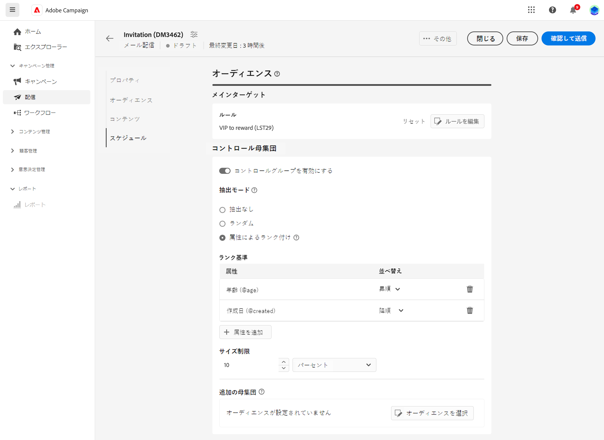

# コントロール母集団の設定 {#control-group}

コントロール母集団を使用すると、キャンペーンの影響を測定するために、オーディエンスの一部にメッセージを送信しないようにできます。

これを Adobe Campaign で行うには、配信のオーディエンスを定義する際にコントロール母集団を作成します。プロファイルは、無作為、フィルターの有無、または条件に基づいてコントロール母集団に追加されます。次に、メッセージを受信したターゲット母集団の行動と、ターゲット設定されていない連絡先の行動を比較できます。

コントロール母集団は、メインターゲットから無作為に抽出できます。特定の母集団から選択することもできます。したがって、コントロール母集団を定義する方法は主に 2 つあります。

* メインターゲットから複数のプロファイルを抽出します。
* クエリで定義された条件に基づいて、一部のプロファイルを除外します。

コントロール母集団を定義する際は、両方の方法を使用できます。

配信の準備手順でコントロール母集団に含まれているすべてのプロファイルが、メインターゲットから削除されます。 メッセージは受信されません。

コントロール母集団を作成するには、 配信作成アシスタントの「**オーディエンス**」セクションの「**[!UICONTROL コントロール母集団を設定]**」ボタンをクリックします。

## ターゲットから抽出 {#extract-target}

>[!CONTEXTUALHELP]
>id="acw_deliveries_email_controlgroup_target"
>title="ターゲットから抽出"
>abstract="TBC"

コントロール母集団を定義するには、ターゲット母集団から一定の割合または一定数のプロファイルを、無作為または並べ替えに基づいて抽出できます。

まず、ターゲットからプロファイルを抽出する方法を定義します。ランダムに、または並べ替えに基づいて。

「**ターゲットから抽出**」セクションで、**除外タイプ**&#x200B;を選択します。

* **ランダム**:配信を準備する際、Adobe Campaignは、サイズ制限として設定されている割合または最大数に対応するプロファイル数をランダムに抽出します。

   

* **属性ごとにランク付け**：特定の並べ替え順で特定の属性に基づいて一連のプロファイルを除外できます。

   

**サイズ制限**&#x200B;の定義：メインターゲットから抽出するプロファイルの数を制限する方法を設定する必要があります。

**例**

ログを表示して、除外されたプロファイルを確認および特定できます。5 つのプロファイルに対するランダムな除外の例を見てみましょう。

配信準備が完了したら、以下の画面で除外を確認できます。

* 送信前の配信ダッシュボードでの&#x200B;**除外対象** KPI。

   

* この **除外ログ** 各プロファイルと関連する除外の表示 **理由**.

   

* この **除外の原因** 各タイポロジルールの除外されたプロファイルの数を表示します。

   

配信ログについて詳しくは、[こちら](../monitor/delivery-logs.md)を参照してください。

## 追加の母集団 {#extra-population}

>[!CONTEXTUALHELP]
>id="acw_deliveries_email_controlgroup_extra"
>title="追加の母集団"
>abstract="TBC"

コントロール母集団を定義するもう 1 つの方法は、既存のオーディエンスを使用するか、またはクエリを定義してターゲットから特定のプロファイルを除外することです。

**コントロール母集団**&#x200B;の定義画面で、「**追加の母集団**」セクションの「**[!UICONTROL オーディエンスを選択]**」ボタンをクリックします。

* 既存のオーディエンスを使用するには、「**オーディエンスを選択**」をクリックします。[こちら](add-audience.md)を参照してください。

* 新しいクエリを定義するには、「**独自に作成**」を選択し、ルールビルダーを使用して除外条件を定義します。[こちら](segment-builder.md)を参照してください。

オーディエンスに含まれるプロファイル、またはクエリの結果と一致するプロファイルは、ターゲットから除外されます。