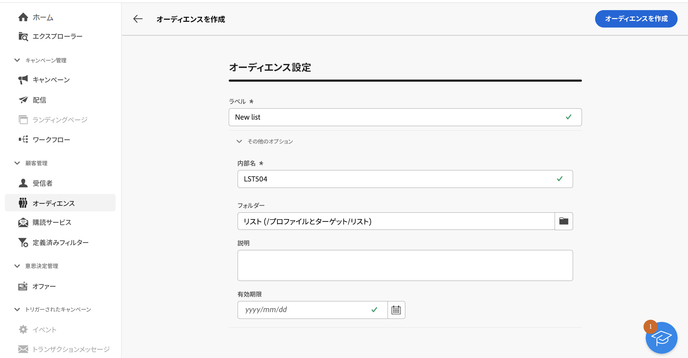

# オーディエンスの作成 {#create-audiences}

>[!CONTEXTUALHELP]
>id="acw_audiences_list"
>title="オーディエンス"
>abstract="この画面から、オーディエンスを作成して組み合わせ、視覚的なキャンバスにすることができます。 次のような様々なワークフローアクティビティを追加します。 **分割** または **除外** をクリックして、新しいオーディエンスと絞り込まれたオーディエンスを生成します。"

>[!CONTEXTUALHELP]
>id="acw_audiences_create_settings"
>title="オーディエンス設定"
>abstract="オーディエンスの名前と追加のオプションを入力し、 **オーディエンスを作成** 」ボタンをクリックします。"

Campaign Web を使用すると、ビジュアルワークフローキャンバスに新しいオーディエンスを作成できます。 最初から始めてシンプルなオーディエンスを作成する以外に、ワークフローアクティビティを活用してオーディエンスを絞り込むこともできます。 例えば、複数のオーディエンスを 1 つのオーディエンスに組み合わせたり、オーディエンスを外部属性でエンリッチメントしたり、選択したルールに基づいて 1 つを複数のオーディエンスに分割したりできます。

ワークフローを作成すると、結果のオーディエンスは、既存のオーディエンスと共に Campaign データベースに自動的に保存されます。 その後、これらのオーディエンスは、キャンペーンまたはスタンドアロン配信のターゲットに設定できます。

## 最初のオーディエンスを作成 {#create}

オーディエンスを作成するには、次の手順に従います。

1. 次に移動： **[!UICONTROL オーディエンス]** メニューで、 **[!UICONTROL オーディエンスを作成]** ボタンをクリックします。
1. オーディエンスのラベルを指定します。
1. を展開します。 **[!UICONTROL その他のオプション]** の節を参照してください。

   デフォルトでは、オーディエンスは **[!UICONTROL プロファイルとターゲット]** / **[!UICONTROL リスト]** エクスプローラーメニュー。 デフォルトの保存場所は、 **[!UICONTROL フォルダー]** フィールドに入力します。

   

1. オーディエンスを設定したら、 **[!UICONTROL オーディエンスを作成]** 」ボタンをクリックします。 ワークフローキャンバスが表示され、次の 2 つのデフォルトアクティビティが示されます。

   * **[!UICONTROL オーディエンスの構築]**：これは、ワークフローの開始点で、オーディエンスを作成し、ワークフローの基盤として使用できます。

   * **[!UICONTROL オーディエンスを保存]**：これは、ワークフローの最後の手順を表し、ワークフローの結果を新しいオーディエンスとして保存できます。

1. を開きます。 **[!UICONTROL オーディエンスの構築]** アクティビティを作成し、データベースに含まれるデータをフィルタリングして、オーディエンスに含める母集団を定義する場合に、ルールビルダーを使用します。 [オーディエンスアクティビティの作成を設定する方法を説明します](../workflows/activities/build-audience.md)

1. ワークフローの対象となる母集団に対して追加の操作を実行する場合は、必要な数のアクティビティを追加し、それらを結び付けます。 ワークフローアクティビティの設定方法について詳しくは、 [ワークフロードキュメント](../workflows/activities/about-activities.md).

   >[!NOTE]
   >
   >チャネルアクティビティは、オーディエンスワークフローでは使用できません。

   

1. を設定します。 **[!UICONTROL オーディエンスを保存]** 「 」アクティビティを使用して、ワークフローでアップストリームを計算した母集団の保存方法を指定します。 [「オーディエンスの保存」アクティビティの設定方法を説明します](../workflows/activities/save-audience.md)

1. ワークフローの準備が整ったら、「 **[!UICONTROL 開始]** をクリックして実行します。

ワークフローは、 **[!UICONTROL ワークフロー]** リストに追加されても、結果のオーディエンスは **[!UICONTROL オーディエンス]** リスト。

## オーディエンスワークフローの例 {#example}

次の例は、ニューヨークに住む女性の顧客をターゲットに設定し、最新の購入（ヨガまたはランニングギア）に応じて 2 人の新しいオーディエンスを作成するオーディエンスワークフローを示しています。

1. The **[!UICONTROL オーディエンスの構築]** 「 」アクティビティは、ニューヨークに住むすべての女性プロファイルをターゲットにします。
1. The **[!UICONTROL エンリッチメント]** 「 」アクティビティは、顧客が購入した商品のタイプを識別するために、「購入品」テーブルの情報を使用してオーディエンスを強化します。
1. The **[!UICONTROL 分割]** 「 」アクティビティでは、顧客の最新の購入に基づいて、ワークフローを 2 つのパスに分割します。
1. The **[!UICONTROL オーディエンスを保存]** 各パスの最後にあるアクティビティは、各パスで計算された母集団を含む、2 つの新しいオーディエンスをデータベースに作成します。

## オーディエンスの監視と管理 {#monitor}

Campaign Web で使用できるオーディエンスのリストには、 **[!UICONTROL オーディエンス]** メニュー。

オーディエンスは複数のソースから作成できます。 The **[!UICONTROL Origin]** 列は、特定のオーディエンスが作成された場所を示します。

* **[!UICONTROL Adobe Campaign]**：これらのオーディエンスはAdobe Campaign V8 コンソールで作成されます。 詳しくは、[Campaign v8（クライアントコンソール）ドキュメント](https://experienceleague.adobe.com/docs/campaign/campaign-v8/audience/create-audiences/create-audiences.html?lang=ja){target="_blank"}を参照してください。

* **[!UICONTROL ADOBE EXPERIENCE PLATFORM:]** これらのオーディエンスは、Adobe Experience Platform内で作成され、宛先ソースとAdobeの統合を使用して Campaign Web に統合されます。 でこの統合を設定する方法を説明します。 [Campaign v8（クライアントコンソール）ドキュメント](https://experienceleague.adobe.com/docs/campaign/campaign-v8/connect/ac-aep/ac-aep.html)

* **[!UICONTROL Adobe Campaign WebUI]**：これらのオーディエンスは、Campaign の Web オーディエンスワークフローを使用して作成されます。 [オーディエンスの作成方法を説明します](create-audience.md)

オーディエンスの詳細を取得するには、リストからオーディエンスを開きます。 オーディエンスのプロパティと、オーディエンスに含まれているプロファイルの数が表示されます。 オーディエンス数は、いつでも **[!UICONTROL 計算]** 」ボタンをクリックします。

The **[!UICONTROL データ]** 「 」タブでは、オーディエンスの一部であるプロファイルを視覚化できます。 列をさらに追加することでこのビューをカスタマイズしたり、詳細フィルターを利用して表示されるデータを絞り込んだりできます。

オーディエンスを複製または削除するには、 **[!UICONTROL その他のアクション]** ボタンが表示されます。
