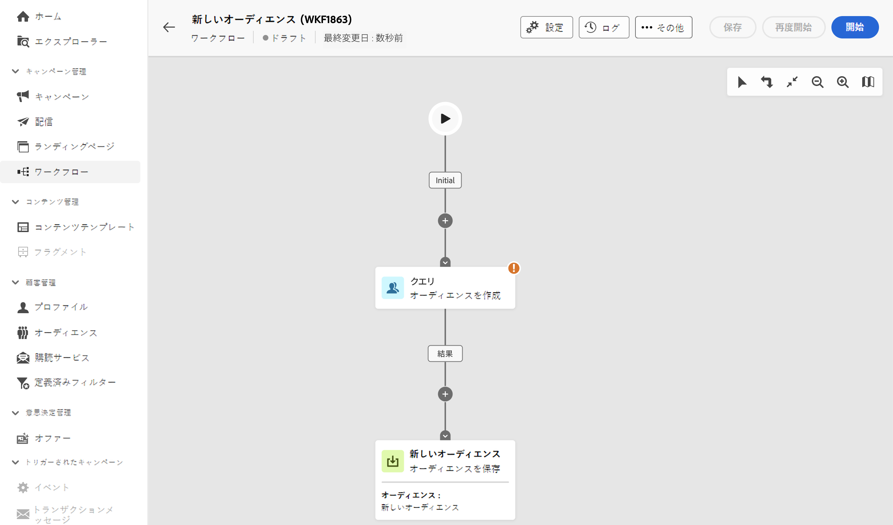
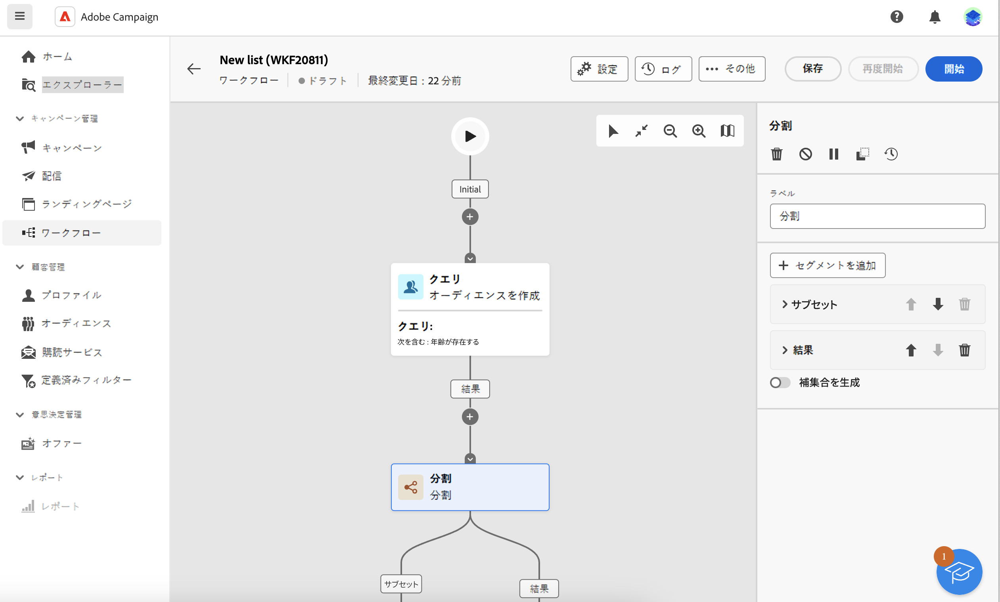
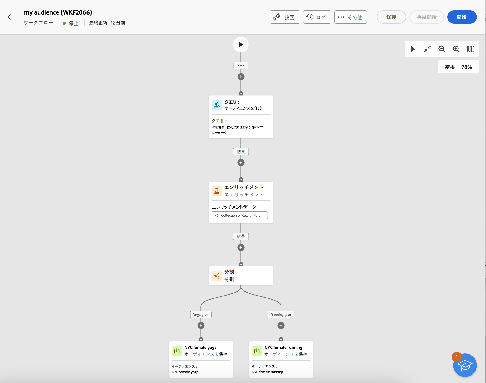
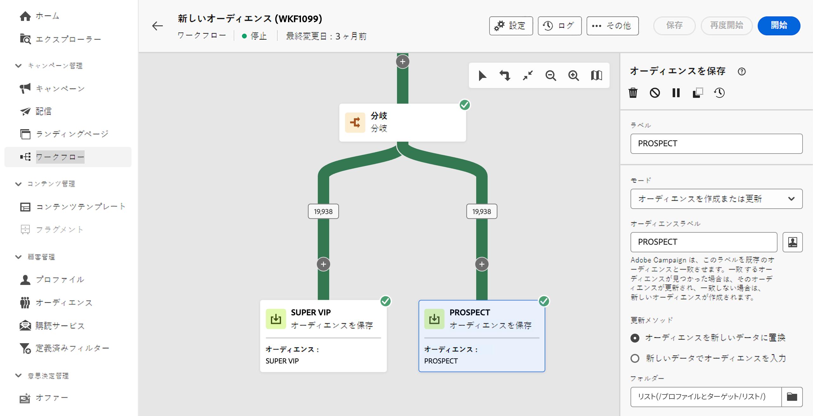

# オーディエンスの作成 {#create-audiences}

>[!CONTEXTUALHELP]
>id="acw_homepage_welcome_rn1"
>title="オーディエンスコンポジション"
>abstract="ビジュアルワークフローキャンバスに、新しいオーディエンスを作成します。ゼロから始めてシンプルなオーディエンスを作成する以外に、ワークフローアクティビティを活用してオーディエンスを絞り込むこともできます。複数のオーディエンスを組み合わせて 1 つのオーディエンスにしたり、オーディエンスを外部属性でエンリッチメントしたり、選択したルールに基づいて 1 つのオーディエンスを複数のオーディエンスに分割したりします。"
>additional-url="https://experienceleague.adobe.com/docs/campaign-web/v8/whats-new.html?lang=ja" text="リリースノートを参照してください"

<!--TO REMOVE BELOW-->

>[!CONTEXTUALHELP]
>id="acw_homepage_rn1"
>title="オーディエンスコンポジション"
>abstract="ビジュアルワークフローキャンバスに、新しいオーディエンスを作成します。ゼロから始めてシンプルなオーディエンスを作成する以外に、ワークフローアクティビティを活用してオーディエンスを絞り込むこともできます。複数のオーディエンスを組み合わせて 1 つのオーディエンスにしたり、オーディエンスを外部属性でエンリッチメントしたり、選択したルールに基づいて 1 つのオーディエンスを複数のオーディエンスに分割したりします。"
>additional-url="https://experienceleague.adobe.com/docs/campaign-web/v8/whats-new.html?lang=ja" text="リリースノートを参照してください"

<!--TO REMOVE ABOVE-->

>[!CONTEXTUALHELP]
>id="acw_audiences_list"
>title="オーディエンス"
>abstract="この画面から、配信のターゲットにできるすべてのオーディエンスのリストにアクセスできます。「**作成**」をクリックすると、**分割**&#x200B;や&#x200B;**除外**&#x200B;などの様々なワークフローアクティビティを使用して、新しいオーディエンスをビジュアルキャンバスに作成できます。"

>[!CONTEXTUALHELP]
>id="acw_audiences_create_settings"
>title="オーディエンス設定"
>abstract="オーディエンスの名前と追加のオプションを入力したあと、「**オーディエンスを作成**」ボタンをクリックします。"

Campaign web を使用すると、ビジュアルワークフローキャンバスに新しいオーディエンスを作成できます。ゼロから始めてシンプルなオーディエンスを作成する以外に、ワークフローアクティビティを活用してオーディエンスを絞り込むこともできます。例えば、複数のオーディエンスを組み合わせて 1 つのオーディエンスにしたり、オーディエンスを外部属性でエンリッチメントしたり、選択したルールに基づいて 1 つのオーディエンスを複数のオーディエンスに分割したりできます。

ワークフローを作成したら、結果のオーディエンスは、既存のオーディエンスと共に Campaign データベースに自動的に保存されます。その後、これらのオーディエンスを、ワークフローやスタンドアロン配信のターゲットにすることができます。

## 最初のオーディエンスの作成 {#create}

オーディエンスを作成するには、次の手順に従います。

1. **[!UICONTROL オーディエンス]**&#x200B;メニューに移動し、右上隅の「**[!UICONTROL オーディエンスを作成]**」ボタンをクリックします。

1. 新しいワークフローが自動的に作成されるので、アクティビティを組み合わせてオーディエンスを生成できます。デフォルトでは、キャンバスには次の 2 つの主要なアクティビティが含まれます。

   * 「クエリ」の「**[!UICONTROL オーディエンスを作成]**」アクティビティはワークフローの開始点で、ここではオーディエンスを作成しワークフローの基盤として使用できます。

   * 「新しいオーディエンス」の「**[!UICONTROL オーディエンスを保存]**」アクティビティはワークフローの最後のステップを表すもので、ここでは結果を新しいオーディエンスとして保存できます。

   

   >[!IMPORTANT]
   >
   >オーディエンスワークフローは、他のキャンペーンワークフローと共に&#x200B;**ワークフロー**&#x200B;メニューに保存されます。特にオーディエンスを作成するように設計され、垂直方向のキャンバスによって識別できます。

1. 読みやすくするために、ワークフロー設定の「**ラベル**」フィールドでワークフローの名前を変更することをお勧めします。[ワークフローの設定方法を説明します](../workflows/workflow-settings.md)

1. **[!UICONTROL オーディエンスを作成]**&#x200B;アクティビティを開き、クエリモデラーを使用して、データベースに含まれているデータをフィルタリングしてオーディエンスに含める母集団を定義します。[「オーディエンスを作成」アクティビティの設定方法の詳細情報](../workflows/activities/build-audience.md)

1. ワークフローのターゲットとなる母集団に対して追加の操作を実行する場合は、必要なだけのアクティビティを追加し、それらを接続します。ワークフローアクティビティの設定方法について詳しくは、[ワークフロードキュメント](../workflows/activities/about-activities.md)を参照してください。

   >[!NOTE]
   >
   >チャネルアクティビティは、オーディエンスワークフローでは使用できません。

   

1. **[!UICONTROL オーディエンスを保存]**&#x200B;アクティビティを設定して、ワークフローの上流で計算された母集団を保存する方法を指定します。[「オーディエンスを保存」アクティビティの設定方法の詳細情報](../workflows/activities/save-audience.md)

1. ワークフローの準備が整ったら、「**[!UICONTROL 開始]**」をクリックして実行します。

ワークフローが&#x200B;**[!UICONTROL ワークフロー]**&#x200B;リストに保存されるのに対して、結果のオーディエンスは「**オーディエンスを保存**」アクティビティで定義したラベルを使用して&#x200B;**[!UICONTROL オーディエンス]**&#x200B;リストでアクセスできます。オーディエンスの監視と管理の方法については、[このセクション](manage-audience.md)を参照してください

これで、このオーディエンスを配信のメインターゲットとして使用できます。[詳細情報](add-audience.md)

## オーディエンスワークフローの例 {#example}

次の例は、ニューヨークに住む女性の顧客をターゲットにし、最新の購入（ヨガまたはランニングギア）に応じて 2 つの新しいオーディエンスを作成するように設定されたオーディエンスワークフローを示しています。

1. **[!UICONTROL オーディエンスを作成]**&#x200B;アクティビティでは、ニューヨークに住むすべての女性プロファイルをターゲットにします。
1. **[!UICONTROL エンリッチメント]**&#x200B;アクティビティでは、顧客が購入した商品のタイプを識別するために、「購入品」テーブルの情報でオーディエンスをエンリッチメントします。
1. **[!UICONTROL 分割]**&#x200B;アクティビティでは、顧客の最新の購入に応じて、ワークフローを 2 つのパスに分割します。
1. 各パスの最後にある&#x200B;**[!UICONTROL オーディエンスを保存]**&#x200B;アクティビティでは、各パスで計算された母集団を含め、2 つの新しいオーディエンスをデータベースに作成します。

## オーディエンスの編集 {#edit}

対応するワークフローを再実行すれば、必要に応じて、ワークフローから生成されたオーディエンスを変更できます。これにより、必要に応じてクエリを調整して、簡単にオーディエンスデータを更新したり、オーディエンスを絞り込んだりできます。

1. **オーディエンス**&#x200B;メニューに移動し、編集するオーディエンスを開きます。
1. 「**概要**」タブの「**前回のワークフロー**」セクションには、オーディエンスの生成に使用したワークフローへのリンクが表示されます。クリックしてワークフローにアクセスします。
1. 必要な変更を行って、「**開始**」ボタンをクリックして、ワークフローを再実行します。完了すると、ワークフローから生成されたオーディエンスが最新のワークフロー結果で自動的に更新されます。

デフォルトでは、オーディエンスワークフローを再実行すると、オーディエンスのコンテンツ全体が新しいデータに置き換えられ、以前のデータが失われます。

既存のオーディエンス結果を置き換えない場合は、要件に合わせて「**オーディエンスを保存**」アクティビティを設定します。例えば、「**オーディエンスラベル**」フィールドを変更して、新しい結果を新しいオーディエンスに保存したり、以前のデータを消去せずに新しい結果を既存のオーディエンスコンテンツに追加したりできます。[「オーディエンスを保存」アクティビティの設定方法について説明します](../workflows/activities/save-audience.md)

