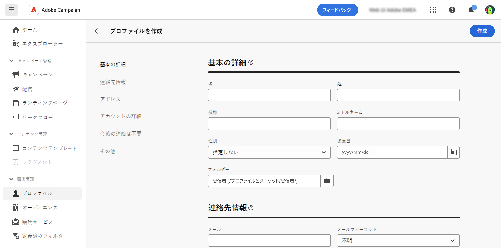

# プロファイルの作成 {#profiles}

>[!CONTEXTUALHELP]
>id="acw_recipients_creation_details"
>title="基本の詳細"
>abstract="この節では、プロファイルの基本の詳細に関するインサイトについて説明します。情報を変更するには、各フィールド内で直接変更を行い、画面の右上隅にある「**保存**」ボタンをクリックします。"

>[!CONTEXTUALHELP]
>id="acw_recipients_creation_contactinformation"
>title="連絡先情報"
>abstract="この節では、プロファイルの連絡先情報に関するインサイトについて説明します。情報を変更するには、各フィールド内で直接変更を行い、画面の右上隅にある「**保存**」ボタンをクリックします。"

>[!CONTEXTUALHELP]
>id="acw_recipients_creation_address"
>title="住所"
>abstract="この節では、プロファイルの郵送先住所と住所の品質に関するインサイトについて説明します。情報を変更するには、各フィールド内で直接変更を行い、画面の右上隅にある「**保存**」ボタンをクリックします。"

>[!CONTEXTUALHELP]
>id="acw_recipients_creation_account"
>title="アカウントの詳細"
>abstract="この節では、プロファイルのアカウント詳細に関するインサイトについて説明します。情報を変更するには、各フィールド内で直接変更を行い、画面の右上隅にある「**保存**」ボタンをクリックします。"

>[!CONTEXTUALHELP]
>id="acw_recipients_creation_nolongercontact"
>title="今後の連絡は不要"
>abstract="この節では、プロファイルの連絡先環境設定に関するインサイトについて説明します。情報を変更するには、各フィールド内で直接変更を行い、画面の右上隅にある「**保存**」ボタンをクリックします。"

>[!CONTEXTUALHELP]
>id="acw_recipients_creation_customfields"
>title="カスタムフィールド"
>abstract="カスタムフィールドは、インスタンス用に設定された、ニーズに合わせて調整された特定の属性です。情報を変更するには、各フィールド内で直接変更を行い、画面の右上隅にある「**保存**」ボタンをクリックします。"

>[!CONTEXTUALHELP]
>id="acw_recipients_creation_othersfields"
>title="その他"
>abstract="この節では、追加の組み込み属性について説明します。情報を変更するには、各フィールド内で直接変更を行い、画面の右上隅にある「**保存**」ボタンをクリックします。"

プロファイルを作成するには、次の手順に従います。

1. **[!UICONTROL 顧客管理]**／**[!UICONTROL プロファイル]**&#x200B;に移動し、画面の右上隅にある「**[!UICONTROL プロファイルを作成]**」ボタンをクリックします。

1. プロファイル表示に使用できる属性のリストは、次の表で詳しく説明する様々なセクションに分類されます。

   {zoomable="yes"}

   | 「属性」セクション | 説明 |
   |  ---  |  ---  |
   | **基本の詳細** | 名前や生年月日など、プロファイルに関する基本情報。 デフォルトでは、プロファイルは&#x200B;**[!UICONTROL 受信者]**&#x200B;フォルダーに保存されます。目的の場所を参照して変更できます。[詳しくは、フォルダーの操作方法を参照してください](../get-started/permissions.md#folders) |
   | **連絡先情報** | メールアドレスや電話番号など、プロファイルの連絡先情報。 |
   | **アドレス** | プロファイルの郵送先住所。また、このセクションでは、アドレスの質の評価も行います。「姓」、「市区町村」および「郵便番号」フィールドが指定されている場合、プロファイルのアドレスは有効と見なされます。 |
   | **アカウントの詳細** | ステータスやアカウント番号など、プロファイルのアカウントに関する情報。 |
   | **今後の連絡は不要** | プロファイルの連絡先の環境設定。これらのオプションのいずれかを選択すると、プロファイルはブロックリストに登録されます。 例えば、受信者がニュースレターの購読解除リンクをクリックした場合、この情報は連絡先データに追加されます。このような受信者は、選択したチャネルのターゲットに設定されなくなりました。強制隔離管理について詳しくは、[Adobe Campaign v8 ドキュメント](https://experienceleague.adobe.com/docs/campaign/campaign-v8/send/failures/quarantines.html?lang=ja){target="_blank"}を参照してください |
   | **カスタムフィールド** | カスタムフィールドを設定している場合は、このセクションに表示されます。カスタムフィールドは、Adobe Campaign コンソールを通じて&#x200B;**[!UICONTROL プロファイル]**&#x200B;スキーマに追加される追加属性です。詳しくは、[Adobe Campaign v8 ドキュメント](https://experienceleague.adobe.com/docs/campaign/campaign-v8/developer/shemas-forms/extend-schema.html?lang=ja){target="_blank"}を参照してください。 |
   | **その他** | 追加の組み込み属性。 |

1. プロファイルを設定したら、「**[!UICONTROL 作成]**」をクリックしてデータベースに保存します。

   保存したら、プロファイルのリストからプロファイルを開いて、いつでもプロファイルを編集できます。[詳しくは、プロファイルの詳細の探索方法を参照してください](profile-view.md)。