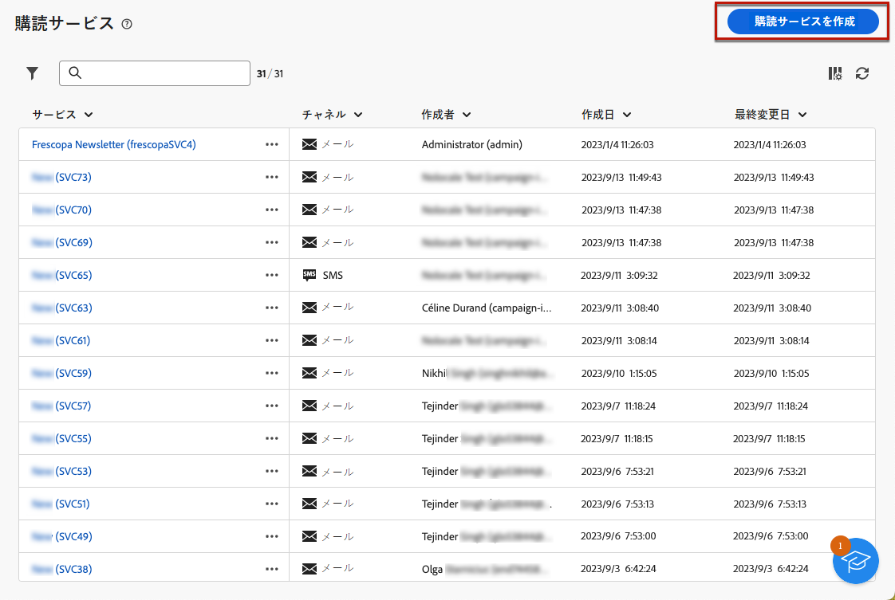

# 購読サービスの使用 {#create-services}

>[!CONTEXTUALHELP]
>id="acw_subscriptions_list"
>title="サービスの作成と管理"
>abstract="Adobe Campaignを使用して、ニュースレターなどのサービスを作成および監視し、これらのサービスの購読/購読解除を確認します。 購読は E メールおよび SMS 配信にのみ適用されます。"

Adobe Campaign Web を使用して、ニュースレターなどのサービスを管理および作成し、これらのサービスの購読/購読解除を確認します。

>[!NOTE]
>
>購読は E メールおよび SMS 配信にのみ適用されます。

複数のサービスを並行して定義できます。例えば、Web サイトの特定の製品カテゴリ、テーマまたは領域のニュースレター、様々な種類のアラートメッセージの購読、リアルタイム通知などです。

購読と購読解除の管理について詳しくは、 [Campaign v8（クライアントコンソール）ドキュメント](https://experienceleague.adobe.com/docs/campaign/campaign-v8/audience/subscriptions.html){target="_blank"}.

## 購読サービスへのアクセス {#access-services}

お使いのプラットフォームで使用可能な購読サービスにアクセスするには、 **[!UICONTROL 購読サービス]** メニューを使用します。

既存のすべての購読サービスのリストが表示されます。 サービスを検索して、チャネル、フォルダーまたは詳細フィルターでフィルタリングできます。

既存のサービスを編集するには、サービス名をクリックします。

## 最初のサブスクリプションサービスを作成する {#create-service}

>[!CONTEXTUALHELP]
>id="acw_subscriptions_list_properties"
>title="購読サービスのプロパティ"
>abstract="購読サービスのラベルを入力し、追加のオプションを定義します。"

>[!CONTEXTUALHELP]
>id="acw_subscriptions_list_confirm"
>title="購読サービスの確認メッセージ"
>abstract="ユーザーがサービスを購読したり、サービスを購読解除したりする際に、確認メッセージを送信できます。 これらのメッセージに使用するテンプレートを選択します。"

購読サービスを作成するには、次の手順に従います。

1. を選択します。 **[!UICONTROL 購読サービスを作成]** 」ボタンをクリックします。

   

1. チャネルを選択： **[!UICONTROL 電子メール]** または **[!UICONTROL SMS]**.

1. サービスプロパティで、ラベルを入力し、必要に応じて追加オプションを定義します。

   

1. デフォルトでは、購読は無制限です。次の項目を無効にすることができます。 **[!UICONTROL 無制限の有効期間]** オプションを使用して、サービスの有効期間を定義します。 <!--The duration can be specified in days or months.TBC-->

   

1. ユーザーがサービスを購読または購読解除する際に、確認メッセージを送信できます。 使用例に従って、そのメッセージに使用するテンプレートを選択します。

   

1. 「**[!UICONTROL 保存]**」をクリックします。新しいサービスが **[!UICONTROL 購読サービス]** リスト。

<!--
## Reporting

You can measure the effectiveness of your subscription services for SMS and email channels.

1. Select an existing service from the **[!UICONTROL Subscription services]** list.

1. From the service dashboard, click More > Reports?

1. Check the following indicators:

* Total numbers of subscribers

* Area graph with subscriptions and unsubscriptions. Use the dropwdown to change the time range. (24h, 48h, 1 week, 2 weeks, 1 month, 6 months)

* The breakdown by period. including subs, unsub, evolution in numbers and % and loyalty.
* Last updated / Next refresh time: these values are retrieved from the execution and schedule of the tracking workflow
-->

