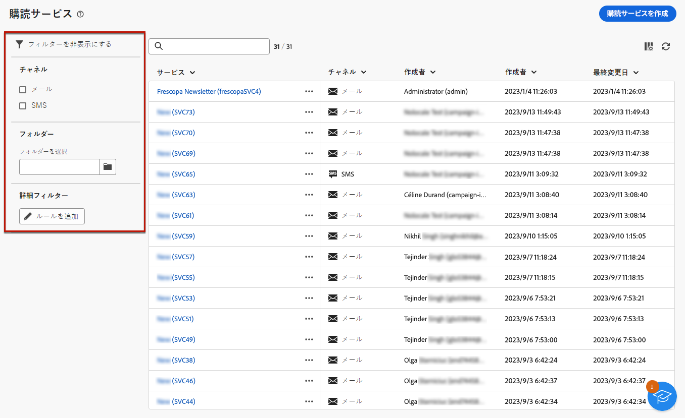

# サービスの作成 {#create-services}

>[!CONTEXTUALHELP]
>id="acw_subscription_services_read_only"
>title="このサービスは読み取り専用です"
>abstract="このサービスを編集する権限がありません。必要に応じて、管理者に連絡し、アクセス権の付与を依頼してください。"

Adobe Campaignを使用して、ニュースレターなどの情報サービスを作成および監視し、これらのサービスの購読/購読解除を確認します。

複数のサービスを並行して定義できます。例えば、web サイトの特定の商品カテゴリ、テーマまたは分野に関する専門家向けのニュースレター、様々なタイプのアラートメッセージやリアルタイム通知の購読などです。

購読と購読解除の管理について詳しくは、 [Campaign v8（クライアントコンソール）ドキュメント](https://experienceleague.adobe.com/docs/campaign/campaign-v8/audience/subscriptions.html){target="_blank"}.

## 購読サービスへのアクセス {#access-services}

1. に移動します。 **[!UICONTROL アクセス管理]** > **[!UICONTROL 購読サービス]** メニュー。

   

1. これまでに作成されたすべてのサービスのリストが表示されます。 サービスを検索して、チャネル、フォルダーまたは詳細フィルターでフィルタリングできます。

   

## 最初のサービスを作成する {#create-service}

1. を選択します。 **[!UICONTROL 購読サービスを作成]** 」ボタンをクリックします。

   

1. チャネルを選択します。 **[!UICONTROL 電子メール]** および **[!UICONTROL SMS]** が使用可能です。

1. サービスプロパティで、ラベルを入力し、必要に応じて追加のオプションを定義します。

   

1. 確認メッセージを選択します。

   

1. クリック **[!UICONTROL 保存してレビュー]**.

