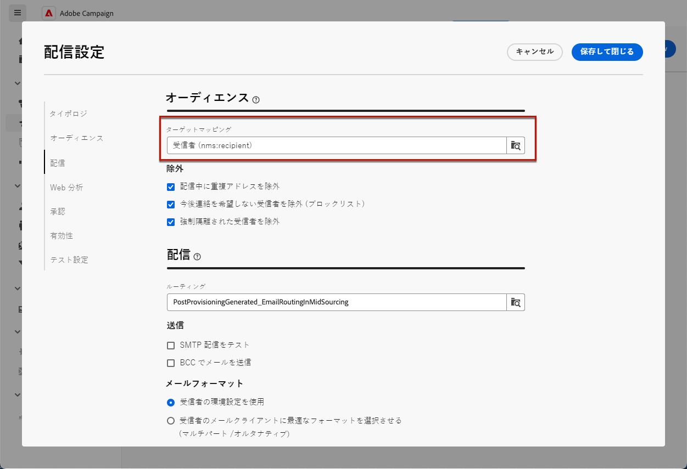

# 購読サービスの使用 {#create-services}

>[!CONTEXTUALHELP]
>id="acw_subscriptions_list"
>title="サービスの作成と管理"
>abstract="Adobe Campaignを使用して、ニュースレターなどのサービスを作成および監視し、それらのサービスの購読または購読解除を確認します。 購読は E メールおよび SMS 配信にのみ適用されます。"

Adobe Campaign Web を使用して、ニュースレターなどのサービスを管理および作成し、それらのサービスの購読または購読解除を確認します。

>[!NOTE]
>
>購読は E メールおよび SMS 配信にのみ適用されます。

複数のサービスを並行して定義できます。例えば、Web サイトの特定の製品カテゴリ、テーマまたは領域のニュースレター、様々な種類のアラートメッセージの購読、リアルタイム通知などです。

購読と購読解除の管理について詳しくは、 [Campaign v8（クライアントコンソール）ドキュメント](https://experienceleague.adobe.com/docs/campaign/campaign-v8/audience/subscriptions.html){target="_blank"}.

## 購読サービスにアクセス {#access-services}

お使いのプラットフォームで使用可能な購読サービスにアクセスするには、次の手順に従います。

1. 次を参照： **[!UICONTROL 購読サービス]** メニューを使用します。

   

1. 既存のすべての購読サービスのリストが表示されます。 サービスを検索して、チャネル、フォルダーまたは詳細フィルターでフィルタリングできます。

   

1. 既存のサービスを編集するには、サービス名をクリックします。

1. このサービス名の横にある 3 つのドットのアイコンを使用して、任意のサービスを削除または複製できます。<!--so all subscribers are unsuibscribed - need to mention?-->

## 最初のサブスクリプションサービスを作成する {#create-service}

>[!CONTEXTUALHELP]
>id="acw_subscriptions_list_properties"
>title="サービスプロパティを定義する"
>abstract="購読サービスのラベルを入力し、追加のオプション（サービスの有効期間など）を定義します。"

>[!CONTEXTUALHELP]
>id="acw_subscriptions_list_confirm"
>title="確認メッセージを選択"
>abstract="ユーザーがサービスを購読または購読解除する際に、確認メッセージを送信できます。 そのメッセージに使用するテンプレートを選択します。"

購読サービスを作成するには、次の手順に従います。

1. を選択します。 **[!UICONTROL 購読サービスを作成]** 」ボタンをクリックします。

   

1. チャネルを選択： **[!UICONTROL 電子メール]** または **[!UICONTROL SMS]**.

1. サービスプロパティで、ラベルを入力し、必要に応じて追加オプションを定義します。

   

1. デフォルトでは、購読は無制限です。次の項目を無効にすることができます。 **[!UICONTROL 無制限の有効期間]** オプションを使用して、サービスの有効期間を定義します。

   次の例では、20 日後に以下をおこないます。
   * このサービスを購読できる受信者はいません。
   * このサービスのすべての購読者は、20 日後に自動的に購読解除されます。 [詳細情報](#automatic-unsubscription)

   

1. ユーザーがサービスを購読または購読解除する際に、確認メッセージを送信できます。 使用例に従って、そのメッセージに使用するテンプレートを選択します。 これらのテンプレートは、 **[!UICONTROL 購読]** ターゲットマッピング。 [詳細情報](#create-confirmation-message)

   

1. クリック **[!UICONTROL 保存してレビュー]**. 新しいサービスが **[!UICONTROL 購読サービス]** リスト。

## 確認メッセージの作成 {#create-confirmation-message}

サービスを購読または購読解除するユーザーに確認メッセージを送信するには、 **[!UICONTROL 購読]** ターゲットマッピング（定義済みのターゲットなし） これを行うには、以下の手順に従います。

1. 購読確認用の配信テンプレートを作成します。 方法については、[こちら](../msg/delivery-template.md)を参照してください。

1. この配信のオーディエンスを選択しないでください。 代わりに、 **[!UICONTROL 配信設定]**、に移動します。 [対象ユーザ](../advanced-settings/delivery-settings.md#audience) 」タブで「 **[!UICONTROL 購読]** ターゲットマッピングをリストから取得します。

   

   >[!NOTE]
   >
   >このオプションを選択しない場合、  **[!UICONTROL 購読]** ターゲットマッピングの場合、購読者は確認メッセージを受け取りません。 ターゲットマッピングは、 Campaign v8 コンソールで定義されます。詳細情報 [Adobe Campaign v8 ドキュメント](https://experienceleague.adobe.com/docs/campaign/campaign-v8/audience/add-profiles/target-mappings.html?lang=ja){target="_blank"}.

1. 配信テンプレートのコンテンツを編集し、保存して閉じます。

   

   >[!NOTE]
   >
   >配信チャネルと、 [E メールチャネル](../email/create-email.md) および [SMS チャネル](../sms/create-sms.md) セクション。

1. 上記の手順を繰り返して、購読解除の確認用の配信テンプレートを作成します。

これで、次の場合にこれらのメッセージを選択できます。 [購読サービスの作成](#create-service). そのサービスを購読または購読解除するユーザーには、選択した確認メッセージが表示されます。

## サービスへの購読者の追加 {#add-subscribers}

サービスを作成したら、購読者を手動で追加できます。 次の手順に従います。

1. 次の中から既存のサービスを選択します： **[!UICONTROL 購読サービス]** リスト。

1. を選択します。 **[!UICONTROL 購読者]** タブをクリックし、 **[!UICONTROL プロファイルを追加]**.

   

1. リストから追加するプロファイルを選択し、 **[!UICONTROL 確認]**.

   

1. クリック **[!UICONTROL 送信]**.<!--if you click cancel, does it mean that no message is sent but recipients are still subscribed, or they are not subscribed? it's 2 different actions in the console)--> 選択した受信者が購読を受け取ります [確認メッセージ](#create-confirmation-message) 選択した日時 [サービスの作成](#create-service).

   

追加されたプロファイルは、「 **[!UICONTROL 購読者]** リスト。 これで、サービスが購読されました。

## サービスから購読者を削除する {#remove-subscribers}

### 手動で受信者を購読解除 {#manual-unsubscription}

サービスに購読登録者を追加したら、それぞれを手動で購読解除できます。 次の手順に従います。

1. 次の中から既存のサービスを選択します： **[!UICONTROL 購読サービス]** リスト。

1. 目的の受信者名の横にある 3 つのドットのアイコンをクリックし、「 」を選択します。 **[!UICONTROL 削除]**.

   

1. 削除を確定し、「 **[!UICONTROL 送信]**. 選択した受信者が購読解除を受け取ります [確認メッセージ](#create-confirmation-message) 選択した日時 [サービスの作成](#create-service).

   

受信者が **[!UICONTROL 購読者]** リストに登録され、サービスの購読登録が解除されました。

### 受信者を自動的に配信停止 {#automatic-unsubscription}

サブスクリプションサービスの期間を限定できます。 有効期間が終了すると、受信者は自動的に購読解除されます。

この期間は、 [サービスの作成](#create-service). 次から： **[!UICONTROL その他のオプション]**、無効 **[!UICONTROL 無制限の有効期間]** 」オプションを選択し、サービスの有効期間を定義します。

指定された期間が終了すると、すべての購読者がそのサービスから自動的に購読解除されます。

## 購読サービスのログとレポート {#logs-and-reports}

SMS および E メールチャネルに対するサブスクリプションサービスの効果を測定するには、特定のサービスのログとレポートにアクセスします。

1. 次の中から既存のサービスを選択します： **[!UICONTROL 購読サービス]** リスト。 クリック **[!UICONTROL 計算]** は合計購読者数を取得します。

   

1. サービスダッシュボードで、「 」を選択します。 **[!UICONTROL ログ]** をクリックして、このサービスの購読者のリストを表示します。 購読者の合計数、名前、各受信者のアドレスおよび購読または購読解除のタイミングを確認できます。 また、フィルタリングすることもできます。

   

1. サービスダッシュボードで、「 」を選択します。 **[!UICONTROL レポート]**. 次の指標を確認します。

   * The **[!UICONTROL 購読者の合計数]** が表示されます。

   * 選択した期間の購読および購読解除の数を表示できます。 ドロップダウンリストを使用して、時間範囲を変更します。

     

   * The **[!UICONTROL 購読の全体的な変化]** グラフは、購読、購読解除、数値の変化、ロイヤルティの割合を含む、期間別の分類を表示します。<!--what is Registered?-->

1. 以下を使用します。 **[!UICONTROL リロード]** ボタンを使用して、トラッキングワークフローの実行およびスケジュールから最後の値を取得します。

## サービスの購読者への配信

一度 [購読サービスを作成しました](#create-service)を使用すると、配信の購読者をターゲットに設定できます。 次の手順に従います。

1. [オーディエンスの作成](../audience/create-audience.md) 作成したサービスの購読者を含める：

   * Adobe Analytics の **[!UICONTROL オーディエンスの構築]** アクティビティ、詳細属性の表示および選択 **[!UICONTROL 受信者]** > **[!UICONTROL 購読]** > **[!UICONTROL サービス]**.

   * この例では、 **Luma ニュースレター** ラベル。

   

1. [配信の作成](../msg/gs-messages.md) をクリックし、上で作成したオーディエンスを選択します。

   

1. 必要に応じてメッセージコンテンツを編集し、配信を送信します。

   

配信は、そのサービスの購読者にのみ送信されます。

