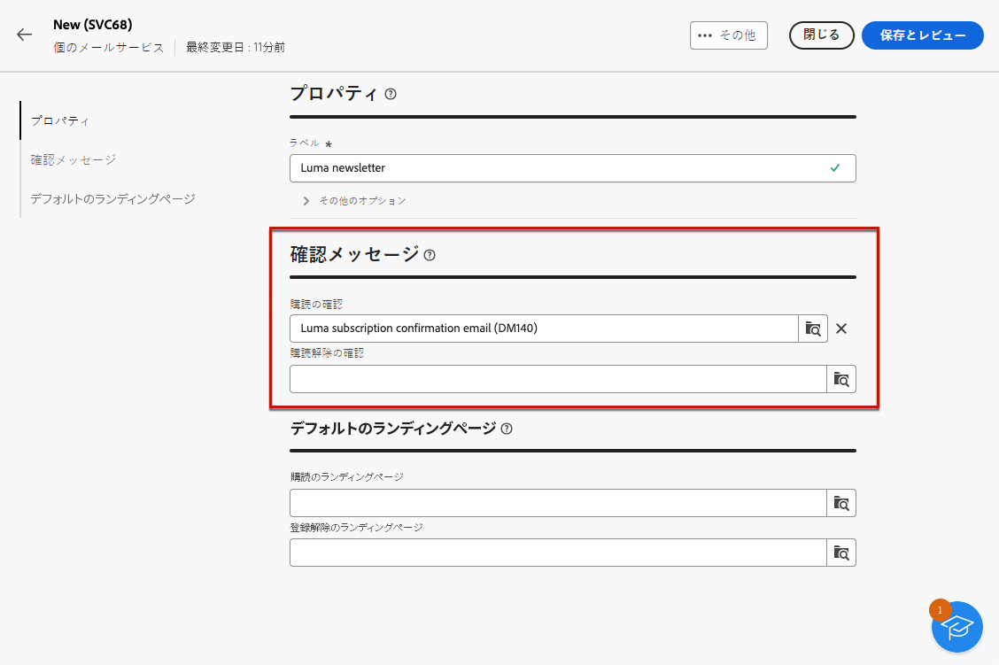

# 購読サービスの使用 {#create-services}

>[!CONTEXTUALHELP]
>id="acw_subscription_services_read_only"
>title="このサービスは読み取り専用です"
>abstract="このサービスを編集する権限がありません。必要に応じて、管理者に連絡し、アクセス権の付与を依頼してください。"

Adobe Campaignを使用して、ニュースレターなどのサービスを作成および監視し、これらのサービスの購読/購読解除を確認します。 購読は E メールおよび SMS 配信にのみ適用されます。

複数のサービスを並行して定義できます。例えば、Web サイトの特定の製品カテゴリ、テーマまたは領域のニュースレター、様々な種類のアラートメッセージの購読、リアルタイム通知などです。

購読と購読解除の管理について詳しくは、 [Campaign v8（クライアントコンソール）ドキュメント](https://experienceleague.adobe.com/docs/campaign/campaign-v8/audience/subscriptions.html){target="_blank"}.

## 購読サービスへのアクセス {#access-services}

お使いのプラットフォームで使用可能な購読サービスにアクセスするには、 **[!UICONTROL 購読サービス]** メニューを使用します。

既存のすべての購読サービスのリストが表示されます。 サービスを検索して、チャネル、フォルダーまたは詳細フィルターでフィルタリングできます。

## 最初のサブスクリプションサービスを作成する {#create-service}

購読サービスを作成するには、次の手順に従います。

1. を選択します。 **[!UICONTROL 購読サービスを作成]** 」ボタンをクリックします。

   

1. チャネルを選択します。 **[!UICONTROL 電子メール]** および **[!UICONTROL SMS]** が使用可能です。

1. サービスプロパティで、ラベルを入力し、必要に応じて追加のオプションを定義します。

   

1. 確認メッセージを選択します。

   

1. クリック **[!UICONTROL 保存してレビュー]**.

