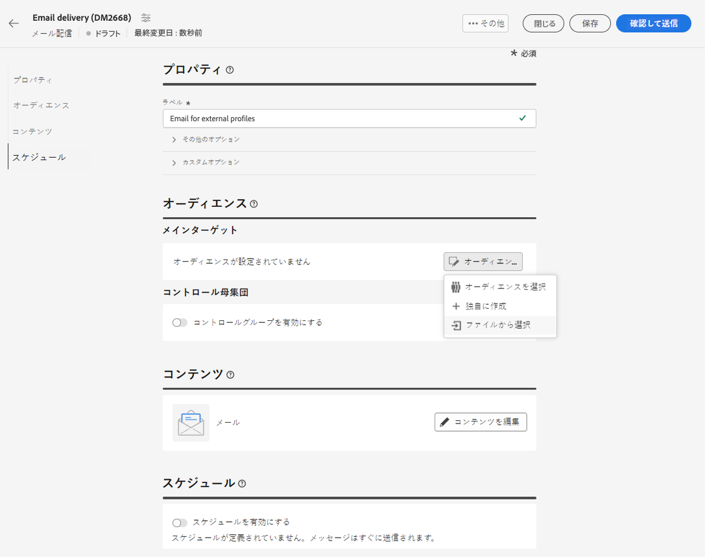
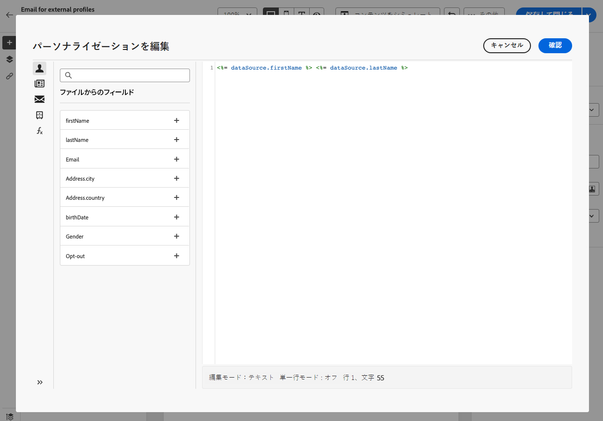
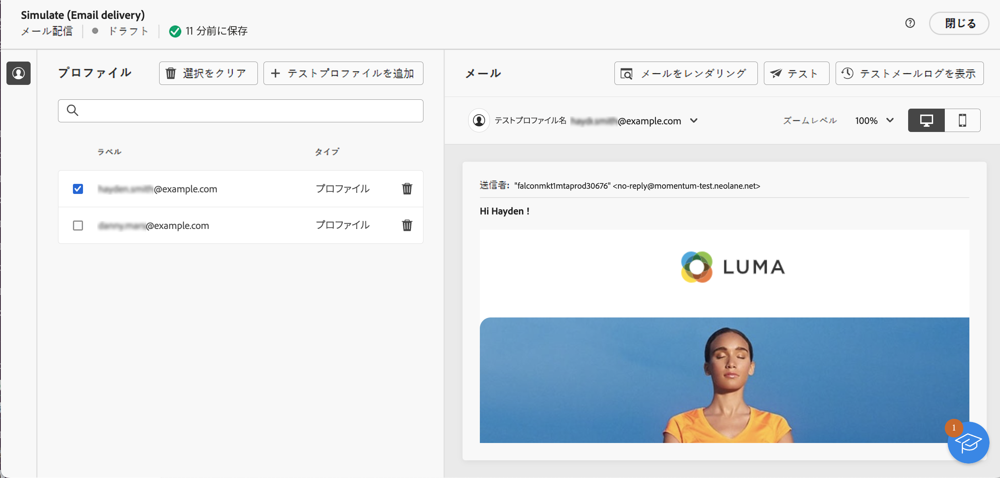
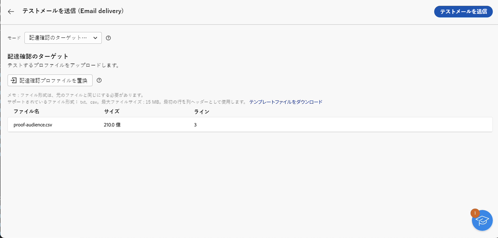

# ファイルからメールオーディエンスを読み込み {#audience-from-file}

>[!CONTEXTUALHELP]
>id="acw_audience_fromfile_select"
>title="ファイル選択"
>abstract="アップロードするローカルファイルを選択します。サポートされる形式は TXT および CSV です。ファイル形式を、以下にリンクしたサンプルファイルに合わせます。"

>[!CONTEXTUALHELP]
>id="acw_audience_fromfile_columns"
>title="列の定義"
>abstract="外部ファイルの列の形式を確認します。"

>[!CONTEXTUALHELP]
>id="acw_audience_fromfile_formatting"
>title="書式設定パラメーター"
>abstract="データが正しく読み込まれるように外部ファイルの形式を指定します。"

>[!CONTEXTUALHELP]
>id="acw_audience_fromfile_preview"
>title="ファイルをプレビュー"
>abstract="外部ファイルの列のプレビューを確認します。この画面には、最大 30 個のレコードのみが表示されます。"

外部ファイルに保存されているプロファイルをターゲットにすることができます。プロファイルはデータベースに追加されませんが、入力ファイル内のすべてのフィールドを[パーソナライゼーション](../personalization/gs-personalization.md)に使用できます。サポートされるファイル形式は、テキスト（TXT）とコンマ区切り値（CSV）です。この記事では、スタンドアロンのメール配信を作成する際に外部プロファイルを読み込む方法について説明します。ワークフロー内のファイルからデータを読み込むには、[このページ](../workflows/activities/load-file.md)を参照してください。

>[!CAUTION]
>
>* この機能は、**メール配信**&#x200B;でのみ使用できます。SMS またはプッシュ配信では使用できません。
>
>* 外部ファイルからターゲット母集団を読み込む場合は、[コントロール母集団](control-group.md)を使用できません。
>
>* プロファイルはデータベースに追加されず、この特定のスタンドアロンのメール配信に対してのみ読み込まれ、使用可能になります。

## ファイルの選択と設定 {#upload}

メールインターフェイスで直接ローカルファイルからプロファイルをターゲットにするには、次の手順に従います。

1. 既存のメール配信を開くか、[新しいメール配信を作成](../email/create-email.md)します。
1. メール配信作成ウィンドウの「**オーディエンス**」セクションで、「**オーディエンスを選択**」ボタンをクリックし、「**ファイルから選択**」オプションを選択します。

   

1. 使用するローカルファイルを選択します。形式は、[サンプルファイル](#sample-file)と一致する必要があります。
1. 画面の中央のセクションで、データがどのようにマッピングされるかをプレビューして確認します。
1. **アドレスフィールド**&#x200B;ドロップダウンからメールアドレスを含む列を選択します。また、入力ファイルにブロックリストの情報がある場合は、ブロックリストの列を選択することもできます。
1. 列設定を調整し、使用可能なオプションからデータをフォーマットする方法を調整します。
1. 設定が正しければ、「**確認**」をクリックします。

メッセージコンテンツを作成およびパーソナライズする際に、[パーソナライゼーションエディター](../personalization/gs-personalization.md)で入力ファイルからフィールドを選択できます。



## サンプルファイル {#sample-file}

>[!CONTEXTUALHELP]
>id="acw_audience_fromfile_samplefile"
>title="ファイルからオーディエンスを読み込み"
>abstract="サポートされるファイル形式は TXT および CSV です。先頭行を列ヘッダーとして使用します。ファイル形式を、以下のリンクにあるサンプルファイルに合わせます。"

サポートされる形式は TXT および CSV です。先頭行は列ヘッダーです。

ファイル形式を、以下のサンプルファイルに合わせます。

```javascript
{
lastname,firstname,city,birthdate,email,denylist
Smith,Hayden,Paris,23/05/1985,hayden.smith@example.com,0
Mars,Daniel,London,17/11/1999,danny.mars@example.com,0
Smith,Clara,Roma,08/02/1979,clara.smith@example.com,0
Durance,Allison,San Francisco,15/12/2000,allison.durance@example.com,1
}
```

## メールのプレビューとテスト {#test}

Campaign Web では、ファイルからアップロードされたオーディエンスを使用する際に、テストメールをプレビューして送信できます。これを行うには、次の手順に従います。

1. 配信コンテンツ編集画面で「**[!UICONTROL コンテンツをシミュレートボタン]**」をクリックし、「**[!UICONTROL テストプロファイルを追加]**」ボタンをクリックします。

1. アップロードされたファイルに含まれるプロファイルが表示されます。コンテンツのプレビューに使用するプロファイルを選択し、「**[!UICONTROL 選択]**」をクリックします。

1. 配信コンテンツのプレビューが、画面の右側のパネルに表示されます。パーソナライズされた要素は、左側のパネルで選択したプロファイルのデータに置き換えられます。[配信コンテンツのプレビューの詳細情報](../preview-test/preview-content.md)

   

1. テストメールを送信するには、「**[!UICONTROL テスト]**」ボタンをクリックします。

1. 「**[!UICONTROL 配達確認プロファイルをアップロード]**」ボタンをクリックし、プルーフの受信者を含む .txt ファイルまたは .csv ファイルを選択します。 

   >[!CAUTION]
   >
   >ファイル形式がオーディエンスのアップロードに使用した形式と一致していることを確認してください。形式エラーがあると警告が表示されます。

1. 配達確認の受信者を追加し、配達確認を送信する準備が整ったら、「**[!UICONTROL テストメールを送信]**」ボタンをクリックし、送信を確定します。

   

1. 「**[!UICONTROL テストメールログを表示]**」ボタンを使用して、いつでもテストメールの送信を監視できます。[テストメールの監視の詳細情報](../preview-test/test-deliveries.md#access-test-deliveries)
