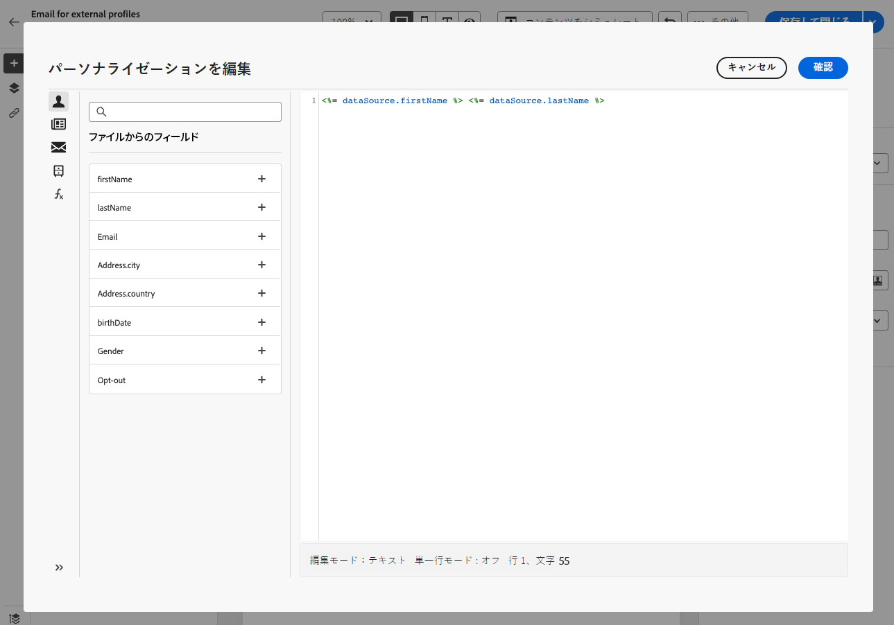

# ファイルからの受信者のターゲティング {#audience-from-file}

外部ファイルから連絡先をアップロードできます。 この機能は、E メール配信でのみ使用できます。サポートされる形式は次のとおりです。テキストファイル (TXT) またはコンマ区切り値ファイル (CSV)。 それにより、プロファイルはデータベースに追加されます。

>[!NOTE]
>
>インポートワークフローを作成して、複数のプロファイルを追加または更新できます。  詳細情報


インターフェイスから直接ローカルファイルからプロファイルをターゲットにするには、次の手順に従います。

1. E メール配信作成ウィンドウで、 **オーディエンスを選択** ボタンをクリックし、 **ファイルから選択** オプション。

   

1. アップロードするローカルファイルを選択します。
1. 画面の中央のセクションで、データがどのようにマッピングされるかをプレビューします。
1. 次の中から E メールアドレスを含む列を選択します： **住所フィールド** 」ドロップダウンリストから選択できます。
1. 使用可能なオプションから列設定とデータの書式設定を調整します。
1. 設定が正しければ、「**確認**」をクリックします。

メッセージコンテンツを作成およびパーソナライズする際に、パーソナライゼーションエディターで入力ファイルからフィールドを選択できます。



## サンプルファイル {#sample-file}

>[!CONTEXTUALHELP]
>id="acw_audience_fromfile_samplefile"
>title="サンプルファイル"
>abstract="サポートされているファイル形式：txt、csv。 先頭行を列ヘッダーとして使用します。"


```json
{
lastname,firstname,city,birthdate,email,denylist
Smith,Hayden,Paris,23/05/1985,hayden.smith@example.com,0
Mars,Daniel,London,17/11/1999,dannymars@example.com,0
Smith,Clara,Roma,08/02/1979,clara.smith@example.com,0
Durance,Allison,San Francisco,15/12/2000,allison.durance@example.com,1
}
```
