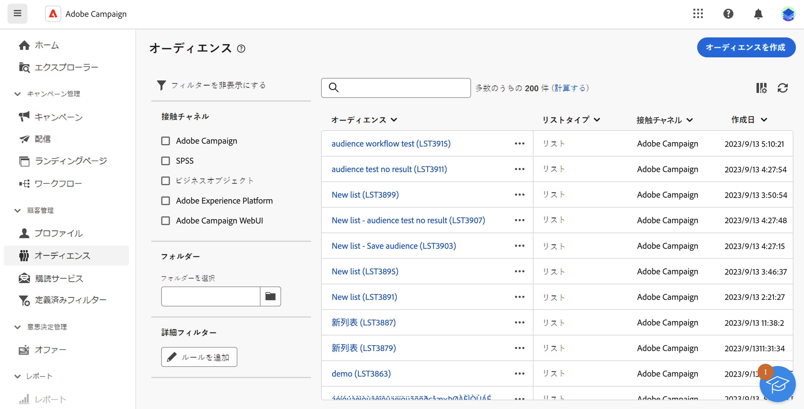
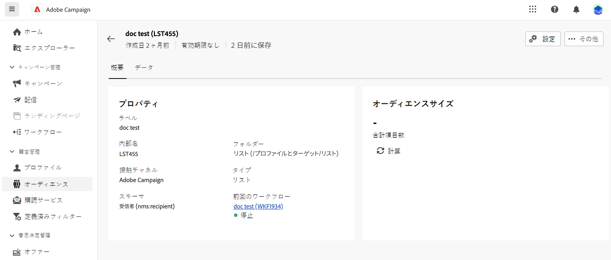

# オーディエンスの監視と管理 {#monitor-manage}

## オーディエンスとは {#what}

オーディエンスは配信のメインターゲット、つまりメッセージを受信するプロファイルです。オーディエンスのタイプは、配信テンプレートで定義されたターゲットマッピングによって異なります。配信テンプレートについて詳しくは、[このページ](../msg/delivery-template.md)を参照してください。

オーディエンスの母集団を定義するには、次の操作を実行します。

* **[!UICONTROL オーディエンス]**&#x200B;メニューから、[新しいオーディエンスを作成](create-audience.md)し、
* クライアントコンソールまたは Adobe Experience Platform でリスト化された[既存のオーディエンスを選択](add-audience.md)
* フィルタリング基準を定義し組み合わせ、クエリモデラーを使用して、[新しいオーディエンスを作成](../query/query-modeler-overview.md)し、
* [外部ファイルからオーディエンスを使用](file-audience.md)します。このオプションは、スタンドアロンのメール配信にのみ使用でき、キャンペーン配信では使用できません。

また、オーディエンスをターゲティングする際に、**コントロール母集団**&#x200B;を定義すると、オーディエンスの一部にメッセージを送信しないようにして、キャンペーンの影響を測定することもできます。[コントロール母集団の設定方法を学ぶ](control-group.md)

>[!NOTE]
>
>キャンペーンワークフローのコンテキストでメッセージを送信する際に、オーディエンスは特定の&#x200B;**オーディエンスを作成**&#x200B;ワークフローアクティビティで定義されます。このコンテキストでは、メール配信用のオーディエンスをファイルから読み込むことはできず、オーディエンスはこの専用アクティビティでのみ定義されます。キャンペーンワークフローで配信のオーディエンスを定義する方法について詳しくは、[この節](../workflows/activities/build-audience.md)を参照してください

## オーディエンスの監視 {#monitor}

>[!CONTEXTUALHELP]
>id="acw_audiences_properties"
>title="プロパティ"
>abstract="ここでは、接触チャネル、ストレージフォルダー、ステータスなどのオーディエンスプロパティの概要を確認できます。「**前回のワークフロー**」セクションのリンクをクリックして、オーディエンスの作成に使用したワークフローを開きます。"

>[!CONTEXTUALHELP]
>id="acw_audiences_count"
>title="オーディエンスサイズ"
>abstract="ここでは、オーディエンス内のプロファイルの合計数を確認できます。「計算」ボタンをクリックして、オーディエンスの結果を更新および再計算します。"

>[!CONTEXTUALHELP]
>id="acw_audiences_workflow_error_data_execution"
>title="オーディエンスエラー"
>abstract="オーディエンスデータは利用できません。ワークフローの実行が終了するまでお待ちください。"

Campaign Web で使用できるオーディエンスのリストには、**[!UICONTROL オーディエンス]**&#x200B;メニューからアクセスできます。

{zoomable=&quot;yes&quot;}

オーディエンスは複数のソースから作成できます。**[!UICONTROL 接触チャネル]**&#x200B;列は、特定のオーディエンスが作成された場所を示します。

* **[!UICONTROL Adobe Campaign]**：これらのオーディエンスは Adobe Campaign V8 コンソールで作成されます。詳しくは、[Campaign v8（クライアントコンソール）ドキュメント](https://experienceleague.adobe.com/docs/campaign/campaign-v8/audience/create-audiences/create-audiences.html?lang=ja){target="_blank"}を参照してください。

* **[!UICONTROL Adobe Experience Platform：]**&#x200B;これらのオーディエンスは、Adobe Experience Platform 内で作成され、アドビのソースおよび宛先との統合を使用して Campaign web に統合されます。この統合を設定する方法については、[Campaign v8（クライアントコンソール）ドキュメント](https://experienceleague.adobe.com/docs/campaign/campaign-v8/connect/ac-aep/ac-aep.html?lang=ja){target="_blank"}を参照してください。

  ➡️ [この機能をビデオで確認](#video)

* **[!UICONTROL Adobe Campaign Web UI]**：これらのオーディエンスは、Campaign web オーディエンスワークフローを使用して作成されます。[オーディエンスの作成方法の詳細情報](create-audience.md)

オーディエンスの詳細を取得するには、リストからオーディエンスを開きます。オーディエンスプロパティと、オーディエンスに含まれているプロファイルの数が表示されます。「**[!UICONTROL 計算]**」ボタンを使用して、いつでもオーディエンス数を更新できます。

「**[!UICONTROL データ]**」タブでは、オーディエンスの一部であるプロファイルを視覚化できます。列をさらに追加することでこのビューをカスタマイズしたり、詳細フィルターを利用して表示対象データを絞り込んだりできます。

{zoomable=&quot;yes&quot;}

オーディエンスを複製または削除するには、オーディエンス名の横またはオーディエンス詳細画面内にあるオーディエンスリストに表示される「**[!UICONTROL その他のアクション]**」ボタンをクリックします。

## チュートリアルビデオ {#video}

Adobe Campaign web ユーザーインターフェイスで Experience Platform オーディエンスを使用する宛先を作成する方法について説明します。

>[!VIDEO](https://video.tv.adobe.com/v/3427635?quality=12)

アドビのソースと宛先の統合を設定する方法について詳しくは、[Campaign v8（クライアントコンソール）ドキュメント](https://experienceleague.adobe.com/docs/campaign/campaign-v8/connect/ac-aep/ac-aep.html?lang=ja){target="_blank"}を参照してください。
