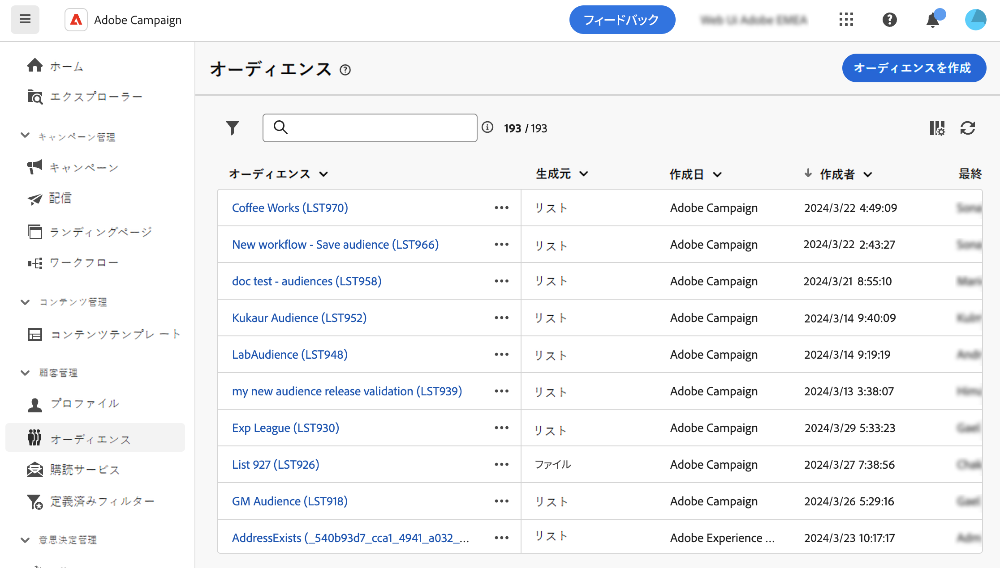
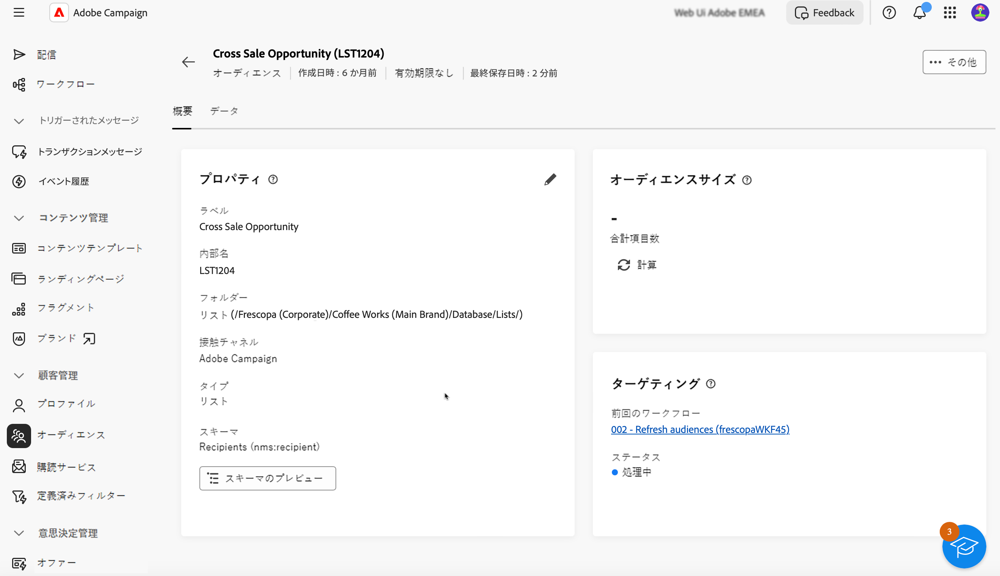

# オーディエンスの監視と管理 {#monitor}

>[!CONTEXTUALHELP]
>id="acw_audiences_workflow_error_data_execution"
>title="オーディエンスエラー"
>abstract="オーディエンスデータは利用できません。ワークフローの実行が終了するまでお待ちください。"

Campaign web で使用できるオーディエンスのリストには、**[!UICONTROL オーディエンス]**&#x200B;メニューからアクセスできます。

オーディエンスは複数のソースから作成できます。**[!UICONTROL 接触チャネル]**&#x200B;列は、特定のオーディエンスが作成された場所を示します。

* **[!UICONTROL Adobe Campaign]**：これらのオーディエンスは Adobe Campaign V8 コンソールで作成されます。詳しくは、[Campaign v8（クライアントコンソール）ドキュメント](https://experienceleague.adobe.com/docs/campaign/campaign-v8/audience/create-audiences/create-audiences.html?lang=ja){target="_blank"}を参照してください。

* **[!UICONTROL Adobe Experience Platform：]**&#x200B;これらのオーディエンスは、Adobe Experience Platform 内で作成され、アドビのソースおよび宛先との統合を使用して Campaign web に統合されます。この統合を設定する方法については、[Campaign v8（クライアントコンソール）ドキュメント](https://experienceleague.adobe.com/docs/campaign/campaign-v8/connect/ac-aep/ac-aep.html?lang=ja){target="_blank"}を参照してください。

>[!NOTE]
>
>Campaign で Adobe Experience Platform オーディエンスを使用するには、アドビのソースおよび宛先との統合を設定する必要があります。[Campaign v8（クライアントコンソール）ドキュメント](https://experienceleague.adobe.com/docs/campaign/campaign-v8/connect/ac-aep/ac-aep.html?lang=ja){target="_blank"}を参照してください。

* **[!UICONTROL Adobe Campaign web UI]**：これらのオーディエンスは、Campaign web オーディエンスワークフローを使用して作成されます。[オーディエンスの作成方法の詳細情報](create-audience.md)

オーディエンスの詳細を取得するには、リストからオーディエンスを開きます。オーディエンスプロパティと、オーディエンスに含まれているプロファイルの数が表示されます。「**[!UICONTROL 計算]**」ボタンを使用して、いつでもオーディエンス数を更新できます。

「**[!UICONTROL データ]**」タブでは、オーディエンスの一部であるプロファイルを視覚化できます。列をさらに追加することでこのビューをカスタマイズしたり、詳細フィルターを利用して表示対象データを絞り込んだりできます。

オーディエンスを複製または削除するには、オーディエンス名の横またはオーディエンス詳細画面内にあるオーディエンスリストに表示される「**[!UICONTROL その他のアクション]**」ボタンをクリックします。
