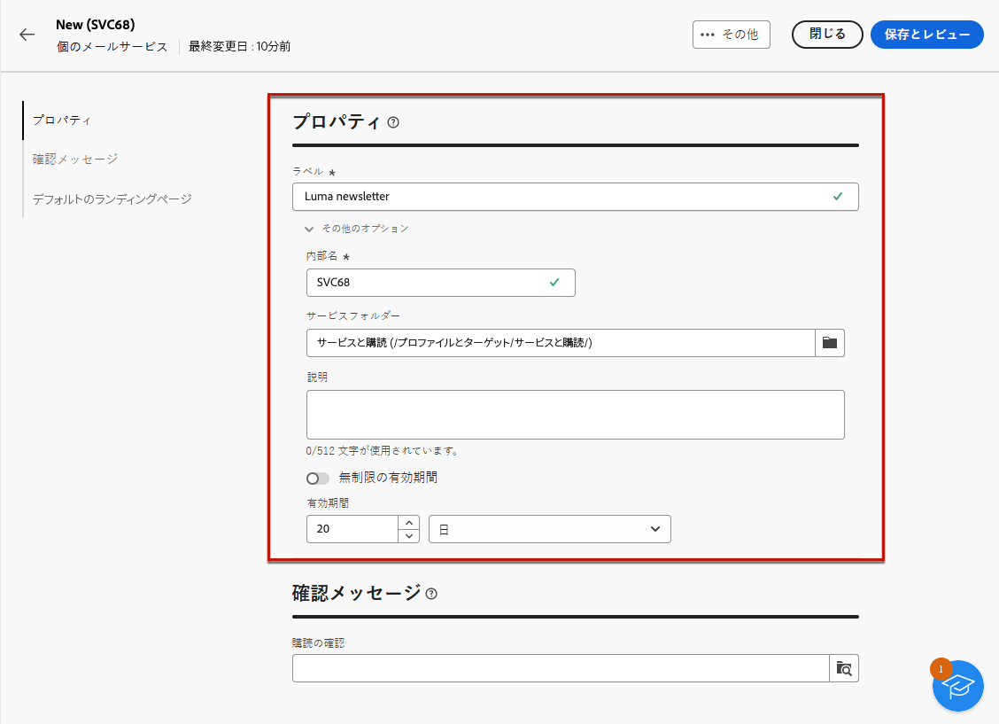
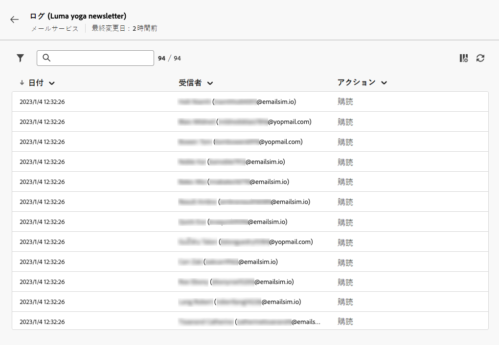

# 購読サービスの作成と管理 {#manage-services}

>[!CONTEXTUALHELP]
>id="acw_subscriptions_list"
>title="サービスの作成と管理"
>abstract="Adobe Campaign を使用すると、ニュースレターなどのサービスの作成と監視を行ったり、これらのサービスの購読または購読解除を確認したりできます。購読はメールおよび SMS 配信のみが対象となります。"

Adobe Campaign web を使用すると、ニュースレターなどのサービスの管理と作成を行ったり、それらのサービスの購読または購読解除を確認したりできます。

複数のサービスを並行して定義できます。例えば、web サイトの特定の商品カテゴリ、テーマまたは分野に関するニュースレター、様々なタイプのアラートメッセージやリアルタイム通知の購読などです。

>[!NOTE]
>
>購読はメールおよび SMS 配信のみが対象となります。

## 購読サービスへのアクセス {#access-services}

お使いのプラットフォームで利用可能な購読サービスにアクセスするには、次の手順に従います。

1. 左側のナビゲーションパネルの&#x200B;**[!UICONTROL 顧客管理]**&#x200B;の下にある&#x200B;**[!UICONTROL 購読サービス]**&#x200B;メニューを参照します。

   {zoomable="yes"}

1. 既存の全購読サービスのリストが表示されます。サービスを検索してチャネルやフォルダーでフィルタリングすることも、[クエリモデラー](../query/query-modeler-overview.md)を使用してルールを追加することもできます。

   {zoomable="yes"}

1. 既存のサービスを編集するには、サービス名をクリックします。

1. サービス名の横にある 3 つのドットのアイコンを使用して、サービスを削除または複製します。<!--so all subscribers are unsubscribed - need to mention?-->

## 最初の購読サービスの作成 {#create-service}

>[!CONTEXTUALHELP]
>id="acw_subscriptions_list_properties"
>title="サービスプロパティの定義"
>abstract="購読サービスのラベルを入力し、サービスの有効期間などの追加オプションを定義します。"

>[!CONTEXTUALHELP]
>id="acw_subscriptions_list_confirm"
>title="確認メッセージの選択"
>abstract="ユーザーがサービスを登録または登録解除する際に、確認メッセージを送信できます。そのメッセージに使用するテンプレートを選択します。"

>[!CONTEXTUALHELP]
>id="acw_subscriptions_defaultlp"
>title="デフォルトのランディングページ"
>abstract="このサービスに関連付けられたデフォルトのランディングページを選択します。"

購読サービスを作成するには、次の手順に従います。

1. 「**[!UICONTROL 購読サービスを作成]**」ボタンをクリックします。

   {zoomable="yes"}

1. **[!UICONTROL メール]**&#x200B;か **[!UICONTROL SMS]** のどちらかのチャネルを選択します。

1. サービスプロパティで、ラベルを入力し、必要に応じて&#x200B;**[!UICONTROL 追加オプション]**&#x200B;を定義します。

   {zoomable="yes"}

1. デフォルトでは、サービスは&#x200B;**[!UICONTROL サービスと購読]**&#x200B;フォルダーに保存されます。目的の場所を参照して変更できます。[詳しくは、フォルダーの操作方法を参照してください](../get-started/permissions.md#folders)

1. デフォルトでは、購読は無制限です。

   「**[!UICONTROL 無制限の有効期間]**」オプションを無効にして、サービスの有効期間を定義します。有効期間が終了した場合：
   * このサービスを購読できるプロファイルはいません。
   * このサービスのすべてのサブスクライバーは、自動的に登録解除されます。

   {zoomable="yes"}

1. ユーザーがサービスを登録または登録解除する際に、確認メッセージを送信できます。ユースケースに従って、そのメッセージに使用するテンプレートを選択します。これらのテンプレートは、**[!UICONTROL 購読]**&#x200B;ターゲットマッピングを使用して設定する必要があります。[詳細情報](#create-confirmation-message)

   {zoomable="yes"}

1. 「**[!UICONTROL 保存してレビュー]**」をクリックします。新しいサービスが&#x200B;**[!UICONTROL 購読サービス]**&#x200B;リストに追加されました。

1. このサービスに関連付けられたデフォルトの購読と購読解除のランディングページを選択します。

   {zoomable="yes"}

   完了したら、メールに[リンクを挿入](../email/message-tracking.md)する際に、「**[!UICONTROL 購読リンク]**」または「**[!UICONTROL 購読解除リンク]**」を選択します。そのリンクをクリックすると、ユーザーはサービスで参照される購読または購読解除のランディングページに移動します。<!--After submitting the form, they will be subscribed to / unsubscribed from the service.-->

   {zoomable="yes"}

1. 変更を保存してレビューします。

次が可能になりました。

* このサービスにサブスクライバーを手動で追加し、プロファイルを登録解除します。[詳細情報](../audience/manage-subscribers.md)

* ランディングページを通じてこのサービスを購読するように顧客を招待します。[詳細情報](../landing-pages/lp-use-cases.md#lp-subscription)

* このサービスのサブスクライバーにメッセージを送信します。[詳細情報](../msg/send-to-subscribers.md)

## 確認メッセージの作成 {#create-confirmation-message}

>[!CONTEXTUALHELP]
>id="acw_subscriptions_delivery_template"
>title="購読の配信テンプレートの選択"
>abstract="サービスを購読するユーザーに確認メッセージを送信するには、**[!UICONTROL 購読]**&#x200B;ターゲットマッピング（定義済みのターゲットなし）に基づいて特定の配信テンプレートを選択する必要があります。"

>[!CONTEXTUALHELP]
>id="acw_unsubscriptions_delivery_template"
>title="登録解除の配信テンプレートの選択"
>abstract="サービスを登録解除るユーザーに確認メッセージを送信するには、**[!UICONTROL 購読]**&#x200B;ターゲットマッピング（定義済みのターゲットなし）に基づいて特定の配信テンプレートを選択する必要があります。"

サービスを登録または登録解除するユーザーに確認メッセージを送信するには、**[!UICONTROL 購読]**&#x200B;ターゲットマッピング（定義済みのターゲットなし）を使用して配信テンプレートを作成します。以下の手順に従います。

1. 購読確認用の配信テンプレートを作成します。[詳しくは、テンプレートの作成方法を参照してください](../msg/delivery-template.md)

1. この配信のオーディエンスを選択しないでください。代わりに、配信&#x200B;**[!UICONTROL 設定]**&#x200B;にアクセスし、「[オーディエンス](../advanced-settings/delivery-settings.md#audience)」タブに移動して、**[!UICONTROL 購読]**&#x200B;ターゲットマッピングをリストから選択します。

   {zoomable="yes"}

   >[!NOTE]
   >
   >**[!UICONTROL 購読]**&#x200B;ターゲットマッピングを選択しない場合、サブスクライバーには確認メッセージが届きません。ターゲットマッピングについて詳しくは、[この節](../audience/targeting-dimensions.md)を参照してください。

1. 配信テンプレートのコンテンツを編集し、保存して閉じます。

   {zoomable="yes"}

   >[!NOTE]
   >
   >配信チャネルおよび配信コンテンツの定義方法について詳しくは、[メールチャネル](../email/create-email.md)および [SMS チャネル](../sms/create-sms.md)の節を参照してください。

1. 上記の手順を繰り返して、購読解除の確認用の配信テンプレートを作成します。

[サブスクリプションサービスの作成](#create-service)の際に、これらのメッセージを選択できるようになりました。そのサービスを購入または登録解除するユーザーには、選択した確認メッセージが表示されます。

## サブスクリプションサービスをモニター {#logs-and-reports}

>[!CONTEXTUALHELP]
>id="acw_subscriptions_totalnumber_subscribers"
>title="サブスクライバー数"
>abstract="「**計算**」をクリックして、このサービスのサブスクライバーの合計数を取得します。"

>[!CONTEXTUALHELP]
>id="acw_subscriptions_totalnumber_subscribers_report"
>title="サブスクライバーの合計数"
>abstract="主要業績評価指標（KPI）は、サブスクライバーベースの包括的なビューを提供し、このサービスを購読している個人の合計数を示します。"

>[!CONTEXTUALHELP]
>id="acw_subscriptions_overtheperiod_subscribers"
>title="期間中の購読数"
>abstract="ドロップダウンリストを使用して時間範囲を変更し、選択した期間の購読および登録解除の数を表示します。"

>[!CONTEXTUALHELP]
>id="acw_subscriptions_overallevolution_subscribers"
>title="購読の全体的な変化"
>abstract="このグラフは、購読、購読解除、数値の変化、ロイヤルティの割合を含む、期間別の分類を表示します。"

SMS チャネルおよびメールチャネルに関するサブスクリプションサービスの効果を測定するには、特定のサービスのログとレポートにアクセスします。

1. **[!UICONTROL サブスクリプションサービス]**&#x200B;リストから既存のサービスを選択します。「**[!UICONTROL 計算]**」をクリックして、サブスクライバーの合計数を取得します。

   {zoomable="yes"}

1. サービスダッシュボードで、「**[!UICONTROL ログ]**」を選択して、このサービスのサブスクライバーのリストを表示します。

   サブスクライバーの合計数、各受信者の名前およびアドレス、購読または購読解除のタイミングを確認できます。また、フィルタリングすることもできます。

   {zoomable="yes"}

1. サービスダッシュボードで、「**[!UICONTROL レポート]**」を選択します。次の指標を確認します。

   * **[!UICONTROL サブスクライバーの合計数]**&#x200B;が表示されます。

   * 選択した期間の購入および購読解除の数を表示します。ドロップダウンリストを使用して、時間範囲を変更します。

     {zoomable="yes"}

   * **[!UICONTROL サブスクリプションの全体的な変化]**&#x200B;グラフは、購読、購読解除、数値の変化、ロイヤルティの割合を含む、期間別の分類を表示します。<!--what is Registered?-->

1. 「**[!UICONTROL リロード]**」ボタンを使用して、トラッキングワークフローの実行およびスケジュールから最新の値を取得します。