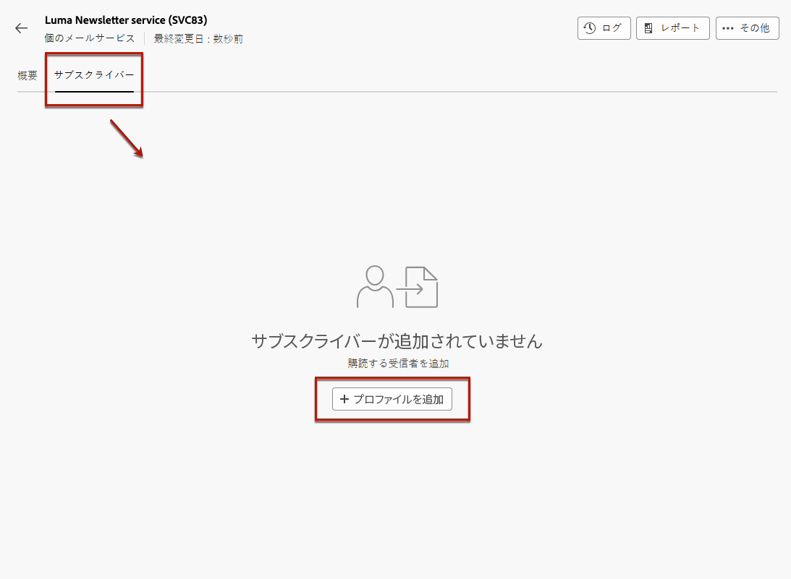
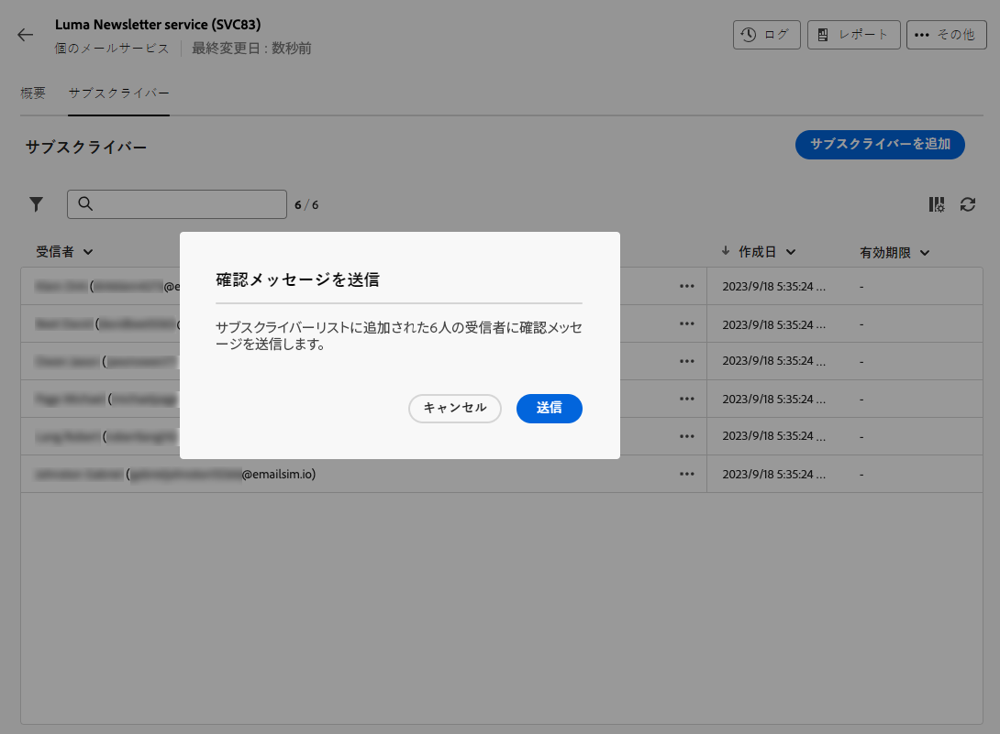
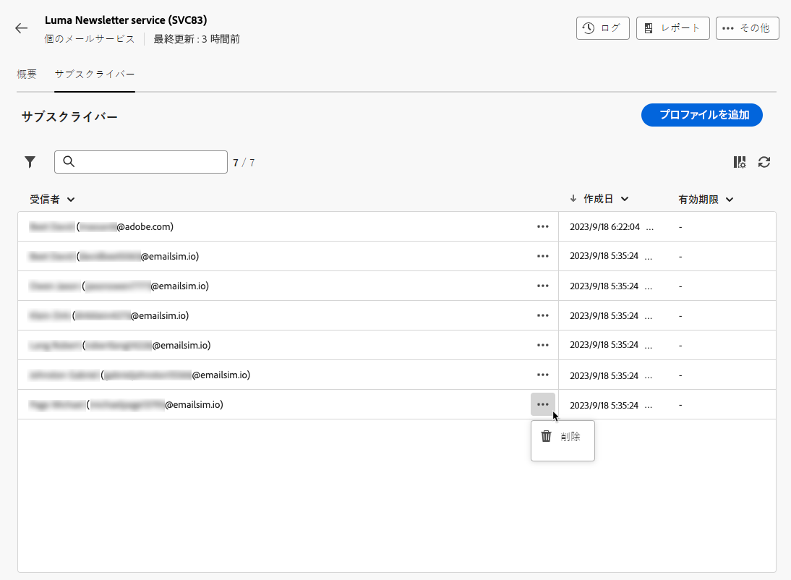
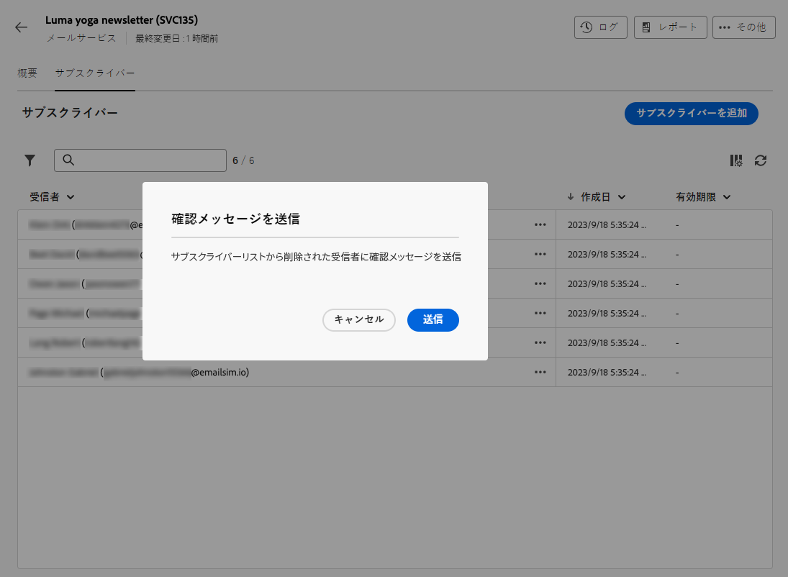
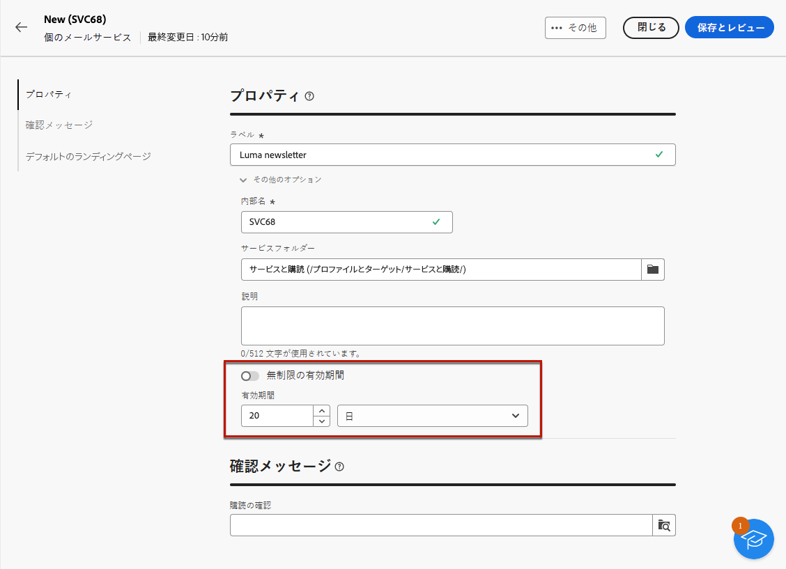

# サブスクライバーの管理 {#manage-subscribers}

「[サービスを作成](manage-services.md#create-service)」したら、サブスクライバーを追加したり、受信者を登録解除したり、そのサービスのサブスクライバーにメッセージを送信したりできます。

サブスクライバーの管理について詳しくは、このページを参照してください。 サブスクライバーにメッセージを送信する方法については、[この節](../msg/send-to-subscribers.md)を参照してください

## サブスクライバーをサービスに追加 {#add-subscribers}

サブスクライバーを手動で追加するには、次の手順に従います。

1. **[!UICONTROL サブスクライバーサービス]**&#x200B;リストから既存のサービスを選択します。

1. 「**[!UICONTROL 購読者]**」タブに移動し、「**[!UICONTROL 購読者を追加]** をクリックします。

   {zoomable="yes"}

1. 追加するプロファイルをリストから選択し、「**[!UICONTROL 確認]**」をクリックします。

   {zoomable="yes"}

1. 「**[!UICONTROL 送信 &#x200B;]**<!--if you click cancel, does it mean that no message is sent but recipients are still subscribed, or they are not subscribed? it's 2 different actions in the console)-->」をクリックして、選択した受信者に、「サービスの作成 [&#128279;](manage-services.md#create-service) 時に定義した購読 [ 確認メッセージ ](manage-services.md#create-confirmation-message) を受信させ  す。

   {zoomable="yes"}

   >[!NOTE]
   >
   >「**[!UICONTROL キャンセル]**」を選択した場合、選択したプロファイルに確認メッセージは送信されませんが、購読されます。

追加したプロファイルは、「**[!UICONTROL サブスクライバー]**」タブに表示されます。このプロファイルをサービスに登録しました。

## サービスからサブスクライバーを削除 {#remove-subscribers}

### 手動でプロファイルを登録解除 {#manual-unsubscription}

サービスに[サブスクライバーを追加](#add-subscribers)したら、それ各サブスクライバーを手動で登録解除できます。以下の手順に従います。

1. **[!UICONTROL サブスクリプションサービス]**&#x200B;リストから既存のサービスを選択します。

1. 目的の受信者名の横にある 3 ドットアイコンをクリックし、「**[!UICONTROL 削除]**」を選択します。

   {zoomable="yes"}

1. 削除を確認します。

1. 「**[!UICONTROL 送信]**」をクリックすると、[サービスを作成](manage-services.md#create-service)の際に選んだ登録解除[確認メッセージ](manage-services.md#create-confirmation-message)を、選択した受信者が受信します。

   {zoomable="yes"}

受信者が「**[!UICONTROL サブスクライバー]**」タブから削除され、サービスの登録が解除されました。

### 受信者を自動的に登録解除 {#automatic-unsubscription}

サブスクリプションサービスの期間を限定することができます。有効期間が終了すると、プロファイルは自動的に登録解除されます。

この期間は、[サービスの作成](manage-services.md#create-service)時に指定されます。「**[!UICONTROL その他のオプション]**」で「**[!UICONTROL 無制限の有効期間]**」オプションを無効にし、サービスの有効期間を定義します。

{zoomable="yes"}

指定された期間が終了すると、すべてのサブスクライバーがそのサービスから自動的に登録解除されます。