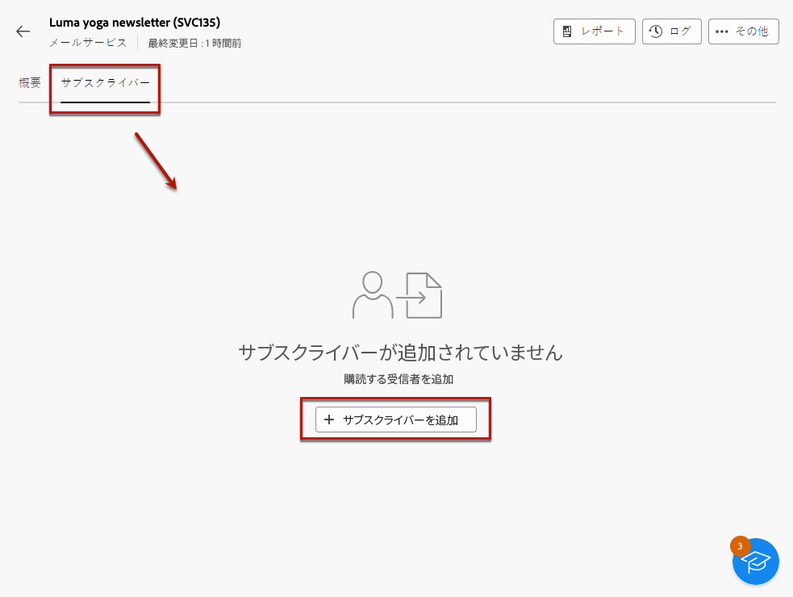

# 購読者の管理 {#manage-subscribers}

「[サービスを作成](manage-services.md#create-service)」したら、サブスクライバーを追加したり、受信者を登録解除したり、そのサービスのサブスクライバーにメッセージを送信したりできます。

サブスクライバー管理について詳しくは、このページを参照してください。サブスクライバーにメッセージを送信する方法については、[この節](../msg/send-to-subscribers.md)を参照してください

## サブスクライバーをサービスに追加 {#add-subscribers}

サブスクライバーを手動で追加するには、次の手順に従います。

1. **[!UICONTROL サブスクライバーサービス]**&#x200B;リストから既存のサービスを選択します。

1. 次に移動： **[!UICONTROL 購読者]** タブをクリックし、 **[!UICONTROL 購読者を追加]**.

   

1. リストから追加するプロファイルを選択し、「**[!UICONTROL 確認]**」をクリックします。

   

1. クリック **[!UICONTROL 送信]**<!--if you click cancel, does it mean that no message is sent but recipients are still subscribed, or they are not subscribed? it's 2 different actions in the console)--> 選択した受信者に購読を受け取らせる [確認メッセージ](manage-services.md#create-confirmation-message) 次の時に定義した [サービスの作成](manage-services.md#create-service).

   

   >[!NOTE]
   >
   >次を選択した場合、 **[!UICONTROL キャンセル]**&#x200B;に設定すると、選択したプロファイルに確認メッセージは送信されませんが、購読されています。

追加されたプロファイルは、「 **[!UICONTROL 購読者]** タブをクリックします。 このプロファイルをサービスに登録しました。

## サービスからサブスクライバーを削除 {#remove-subscribers}

### 手動で受信者を登録解除 {#manual-unsubscription}

サービスに[サブスクライバーを追加](#add-subscribers)したら、それ各サブスクライバーを手動で登録解除できます。以下の手順に従います。

1. **[!UICONTROL サブスクリプションサービス]**&#x200B;リストから既存のサービスを選択します。

1. 目的の受信者名の横にある 3 つのドットのアイコンをクリックし、「**[!UICONTROL 削除]**」を選択します。

   

1. 削除を確認します。

1. クリック **[!UICONTROL 送信]** 選択した受信者に購読解除を受け取らせる [確認メッセージ](manage-services.md#create-confirmation-message) 次の時に定義した [サービスの作成](manage-services.md#create-service).

   

受信者が **[!UICONTROL 購読者]** 」タブに追加され、サービスの購読登録が解除されます。

### 受信者を自動的に登録解除 {#automatic-unsubscription}

サブスクリプションサービスの期間を限定することができます。有効期間が終了すると、受信者は自動的に登録解除されます。

この期間は、[サービスの作成](manage-services.md#create-service)時に指定されます。「**[!UICONTROL その他のオプション]**」から、「**[!UICONTROL 無制限の有効期間]**」オプションを選択し、サービスの有効期間を定義します。

指定された期間が終了すると、すべてのサブスクライバーがそのサービスから自動的に登録解除されます。
