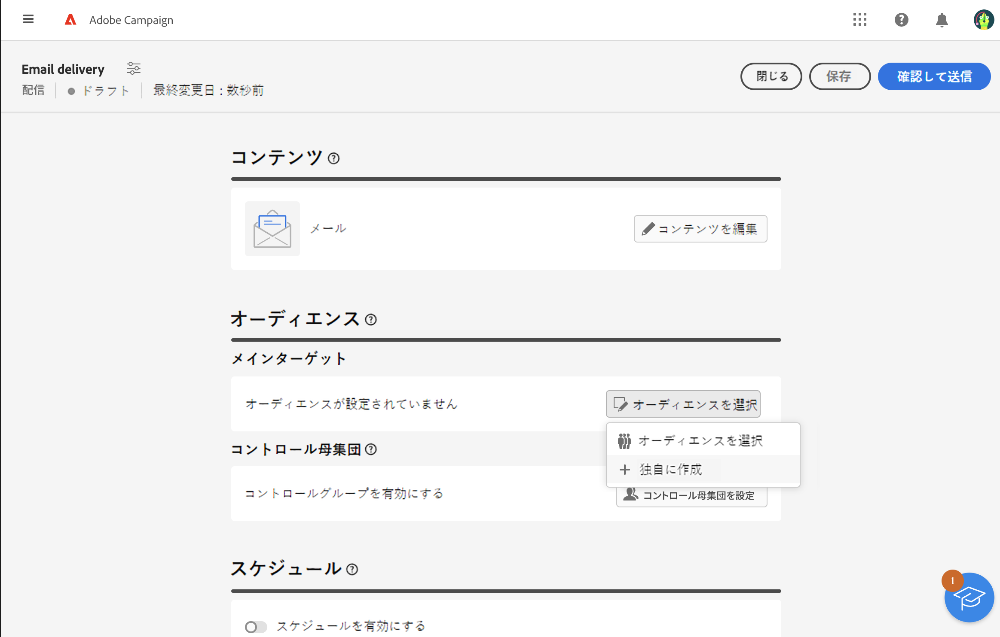
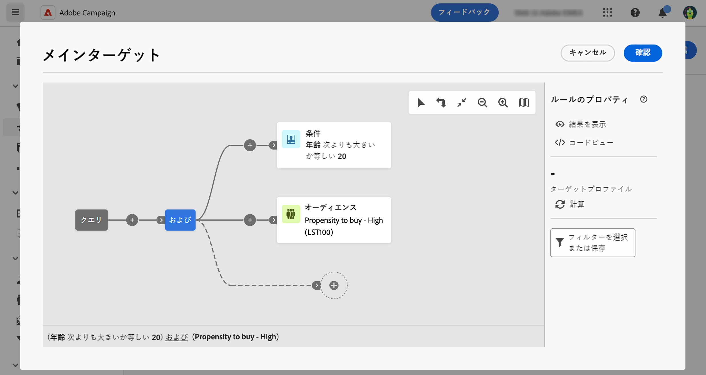

# 1 回限りのオーディエンスの作成 {#one-time}

この節では、新しい配信を作成する際にオーディエンスを作成する方法について説明します。この場合、配信オーディエンスに含める受信者は、クエリモデラーでデータベースに対してクエリを実行することでターゲットに設定されます。

その結果作成されたオーディエンスは、この配信に 1 回だけ使用されます。オーディエンスリストには保存されません。

配信のメインターゲットを定義する際には、次の操作も可能です。

* **[!UICONTROL オーディエンス]**&#x200B;リストから[既存のオーディエンスを選択](add-audience.md)します。
* [外部ファイルのオーディエンスを読み込みます](file-audience.md)（メールの場合のみ）。

配信から新しいオーディエンスを直接作成するには、次の手順に従います。

1. 配信作成アシスタントの「**オーディエンス**」セクションで、「**[!UICONTROL オーディエンスを選択]**」ボタンをクリックします。

   

1. 「**独自に作成**」を選択します。クエリモデラーが表示されます。ルールビルダーを使用すると、データベースに含まれているデータをフィルタリングすることにより、配信のターゲットとなる母集団を定義できます。[詳しくは、クエリモデラーの使用方法を参照してください](../query/query-modeler-overview.md)

   

1. クエリの準備が整ったら、「**確認**」をクリックして、オーディエンスを配信のメインターゲットとして使用します。

   また、コントロール母集団を設定して、キャンペーンの影響を測定することもできます。コントロール母集団はメッセージを受信しません。これにより、メッセージを受信した母集団の行動と、受信しなかった連絡先の行動を比較できます。[詳細情報](control-group.md)
