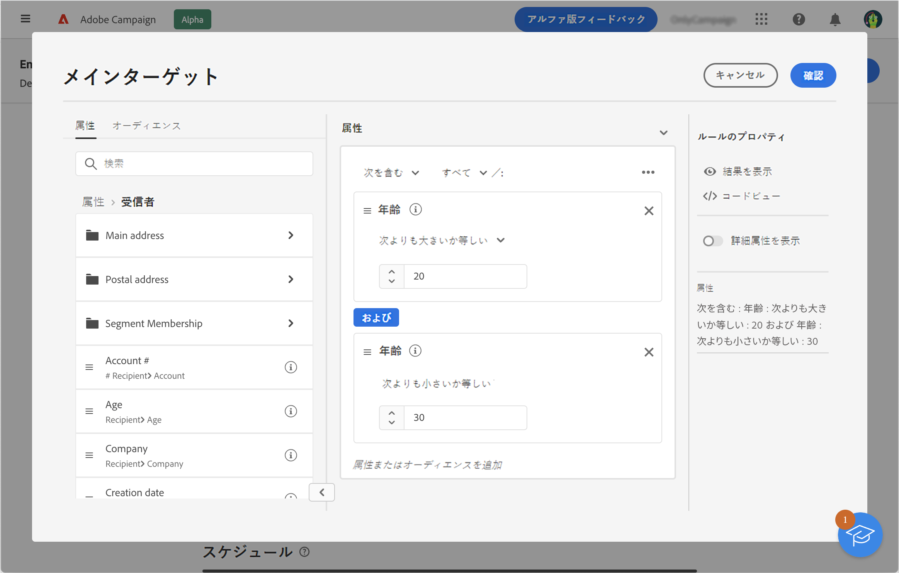

# 配信に 1 回限りのオーディエンスを構築 {#sone-time}

この節では、新しい配信を作成する際にオーディエンスを作成する方法について説明します。 この場合、配信オーディエンスに含める受信者は、ルールビルダーでデータベースに対するクエリを実行することでターゲットになります。

結果のオーディエンスは、この配信に 1 回だけ使用されます。 オーディエンスリストには保存されません。

配信のメインターゲットを定義する際には、次の操作も実行できます。

* [既存のオーディエンスを選択](add-audience.md) から **[!UICONTROL オーディエンス]** リスト。
* [外部ファイルからオーディエンスを読み込む](file-audience.md) （e メールの場合のみ）。

配信から直接新しいオーディエンスを作成するには、次の手順に従います。

1. 配信作成アシスタントの「**オーディエンス**」セクションで、「**[!UICONTROL オーディエンスを選択]**」ボタンをクリックします。

   

1. 「**独自に作成**」を選択します。ルールビルダーが表示されます。配信のターゲットとなる母集団を定義するには、データベースに含まれるデータをフィルタリングします。 [ルールビルダーの使用方法を説明します](segment-builder.md)

   

1. クエリの準備が整ったら、「 **確認** オーディエンスを配信のメインターゲットとして使用する場合。

   また、コントロール母集団を設定して、キャンペーンの影響を測定することもできます。コントロール母集団はメッセージを受信しません。これにより、メッセージを受信した母集団の行動と、受信しなかった連絡先の行動を比較できます。[詳細情報](control-group.md)
