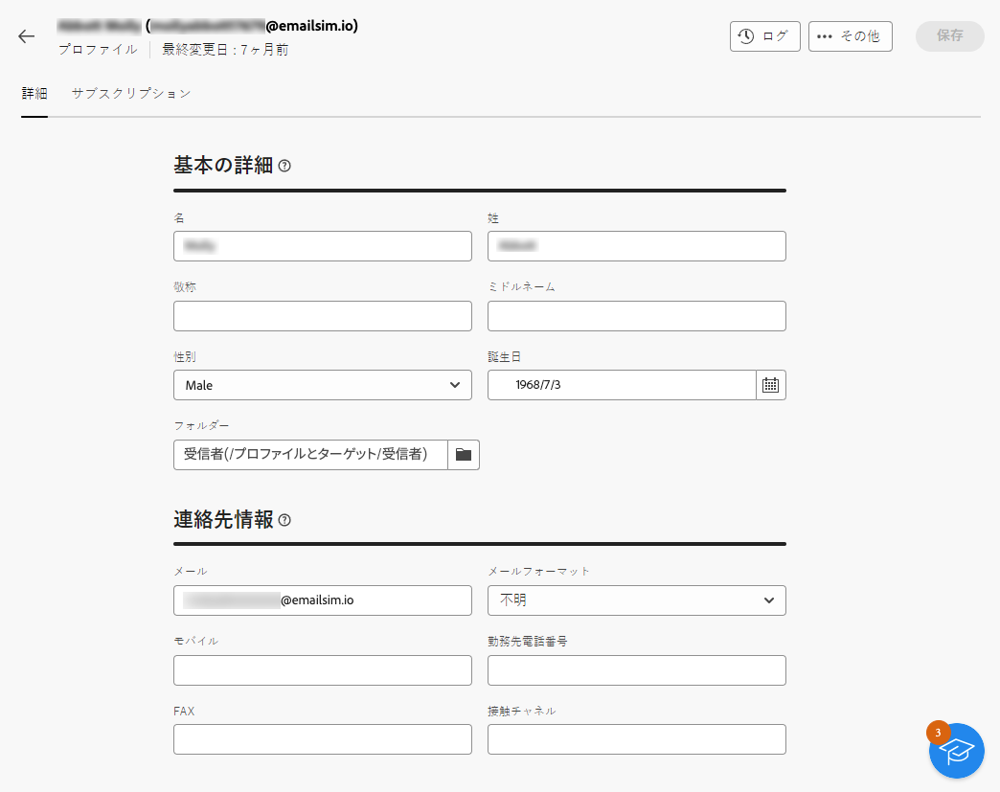
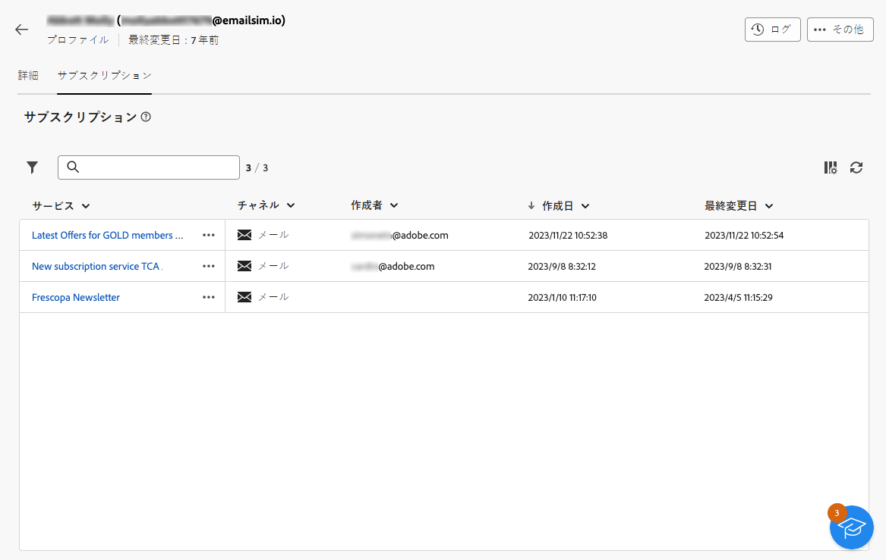
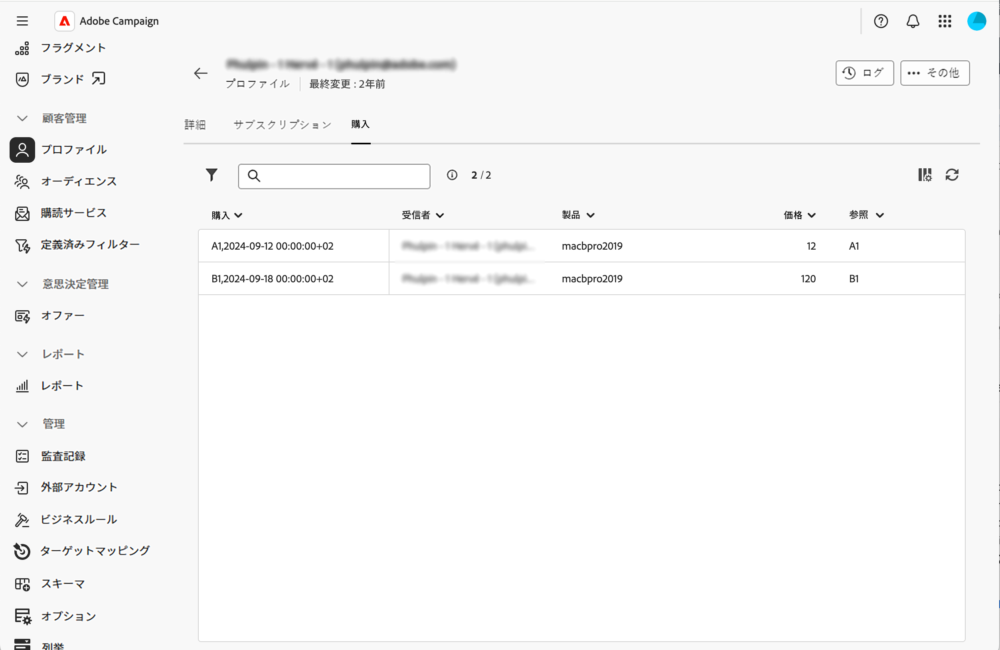
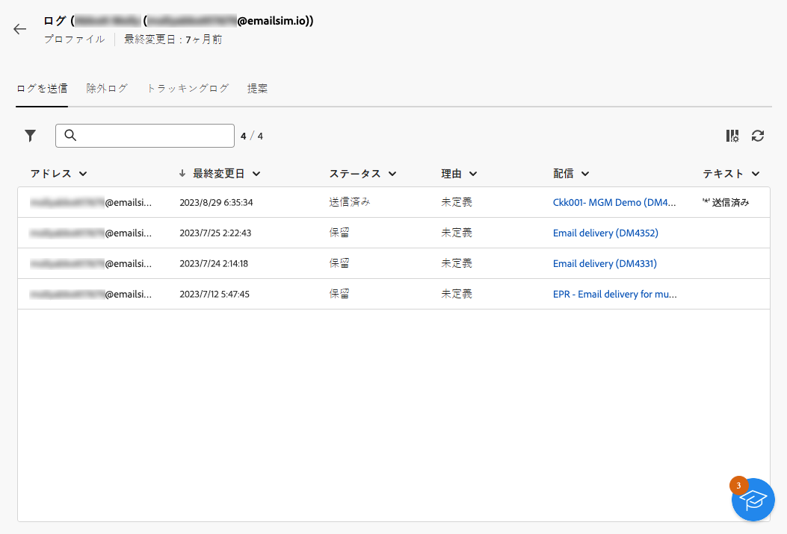

# プロファイルの詳細の探索 {#profile-view}

>[!CONTEXTUALHELP]
>id="acw_recipients_subscription_list"
>title="購読リスト"
>abstract="このタブには、プロファイルがサブスクライブしているすべてのサービスがリストされます。"

プロファイルの詳細にアクセスするには、**[!UICONTROL 顧客管理]**／**[!UICONTROL プロファイル]**&#x200B;を参照し、アクセスするプロファイルをクリックします。

プロファイルの情報は、次のように分類されます。

* 「**[!UICONTROL 詳細]**」タブを使用すると、プロファイルのビルトインの属性とカスタム属性を参照できます。属性を編集するには、必要なフィールドに変更を加え、「**[!UICONTROL 保存]**」ボタンをクリックします。プロファイルの属性について詳しくは、[プロファイルの作成](create-profile.md)の節を参照してください。

  {zoomable="yes"}

* 「**[!UICONTROL サブスクリプション]**」タブには、プロファイルがサブスクライブしているサービスに関する情報が表示されます。[サブスクリプションサービスの詳細情報を参照してください](manage-services.md)

  {zoomable="yes"}

* 受信者スキーマの画面定義でコレクションリンクを定義すると、購入などのカスタムタブを表示できます。 [ コレクションリンクの詳細情報 ](../administration/schemas.md#collection-lists)

  {zoomable="yes"}

* また、画面の右上隅にある「**[!UICONTROL ログ]**」ボタンを使用すると、送信ログ、除外ログ、トラッキングログを通じてプロファイルのインタラクションの履歴が表示されます。[配信ログの詳細情報を参照してください](../monitor/delivery-logs.md)

  これらのログから、「**[!UICONTROL 提案]**」タブで選択したプロファイルに示されたオファーを確認することもできます。[オファーの詳細情報を参照してください](../msg/offers.md)

  {zoomable="yes"}