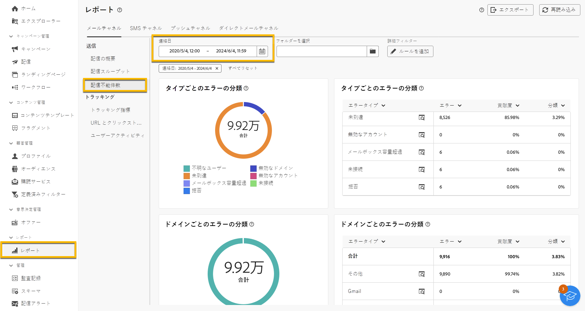
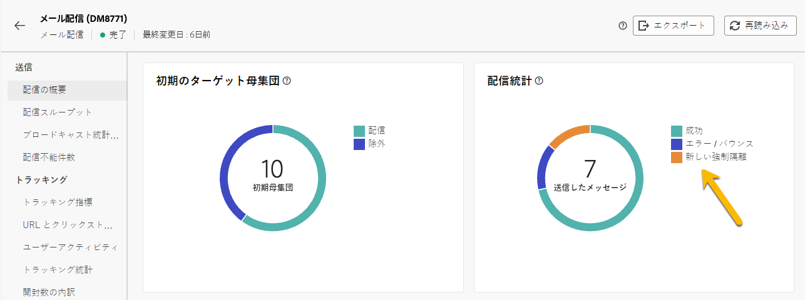

# 強制隔離

Adobe Campaign は、強制隔離アドレス（メール、SMS、プッシュ通知）を管理します。

強制隔離は、**メールアドレス**、**電話番号**、または&#x200B;**デバイストークン**&#x200B;にのみ適用され、プロファイル自体には適用されません。例えば、メールアドレスが強制隔離されているプロファイルは、プロファイルを更新して新しいアドレスを入力できるので、再び配信アクションのターゲットになる可能性があります。同様に、2 つのプロファイルの電話番号が同じ場合、その番号が強制隔離されると、両方のプロファイルが影響を受けます。

>[!CAUTION]
>
>Adobe Campaign の強制隔離では、大文字と小文字が区別されます。

## 強制隔離とは

強制隔離とは、**配信における無効なアドレスを管理する**&#x200B;方法です。

無効なアドレスの割合が高い場合、配信がスパムと見なされることがあります。これらのアドレスを強制隔離を使用して管理すると、インターネットプロバイダーでブロックリストに登録されるのを回避できます。これは、レピュテーションにとって重要です。

Adobe Campaign でアドレスが強制隔離されると、配信の分析中に、プロファイルはターゲットから自動的に除外されます。

強制隔離は、誤りのある電話番号を配信から除外することで、SMS の送信コスト削減にも役立ちます。

## アドレスが強制隔離に送信される理由

様々な理由により、アドレスが強制隔離に送信される場合があります。

- SMS の場合、誤った電話番号
- SMS の場合、プロファイルが「STOP」などのキーワードを含む SMS メッセージに返信したとき
- メールの場合、メッセージがスパムとして報告されたときメッセージは、アドビが管理するテクニカルメールボックスに自動的にリダイレクトされます。さらに、そのメールアドレスは自動的に強制隔離され、ステータスが「ブロックリスト登録済み」となります。
- 例えば、メールボックスの容量が超過した場合、アドレスが存在しない場合、またはメールサーバーが使用できない場合などに、メールアドレスを強制隔離できます。

[配信エラーの詳細情報](https://experienceleague.adobe.com/ja/docs/campaign-classic/using/sending-messages/monitoring-deliveries/understanding-delivery-failures)

## 強制隔離アドレスの場所

インスタンスのすべての強制隔離アドレスは、**[!UICONTROL エクスプローラー]**／**[!UICONTROL 管理]**／**[!UICONTROL キャンペーン管理]**／**[!UICONTROL 配信不能の管理]**／**[!UICONTROL 配信不能およびアドレス]**&#x200B;で表示できます。このセクションには、メール、SMS およびプッシュ通知チャネルの強制隔離された要素のリストが表示されます。

{zoomable="yes"}

また、インスタンスで強制隔離に関するレポートを取得することもできます。

{zoomable="yes"}

配信ごとに、配信の概要レポートを確認することもできます。このレポートには、配信ターゲット内の強制隔離中のアドレス数が表示されます。

{zoomable="yes"}

Adobe Campaign コンソールで強制隔離アドレスを管理できる可能性を、さらに広げることもできます。[詳細情報](https://experienceleague.adobe.com/ja/docs/campaign/campaign-v8/send/failures/quarantines#access-quarantined-addresses)
