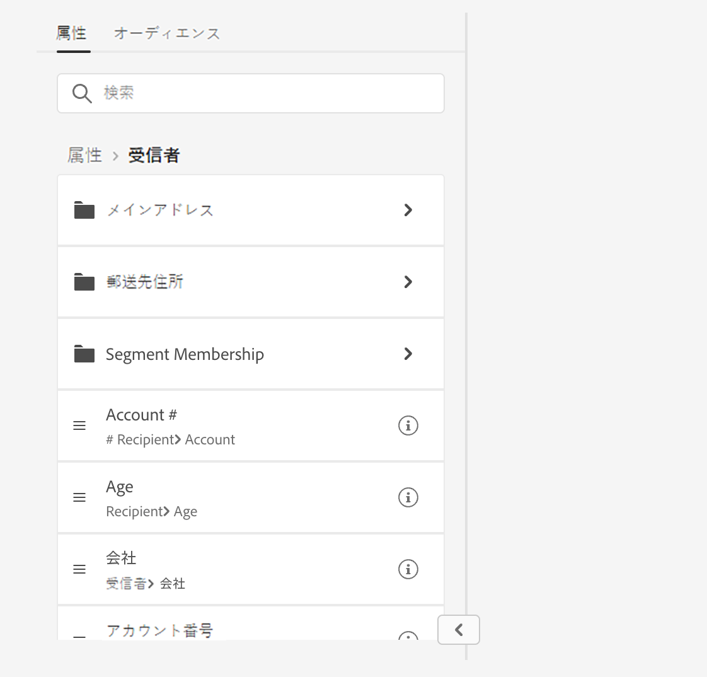
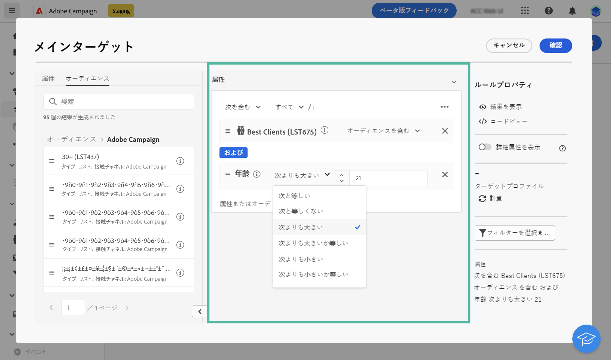
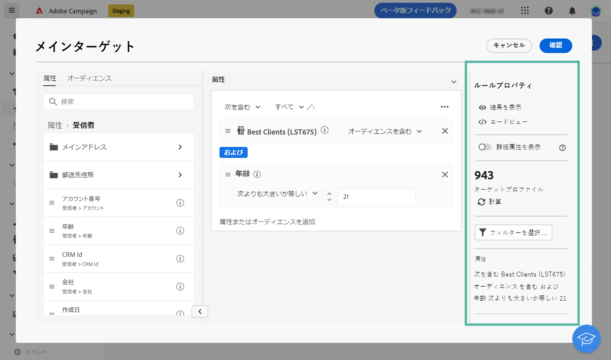
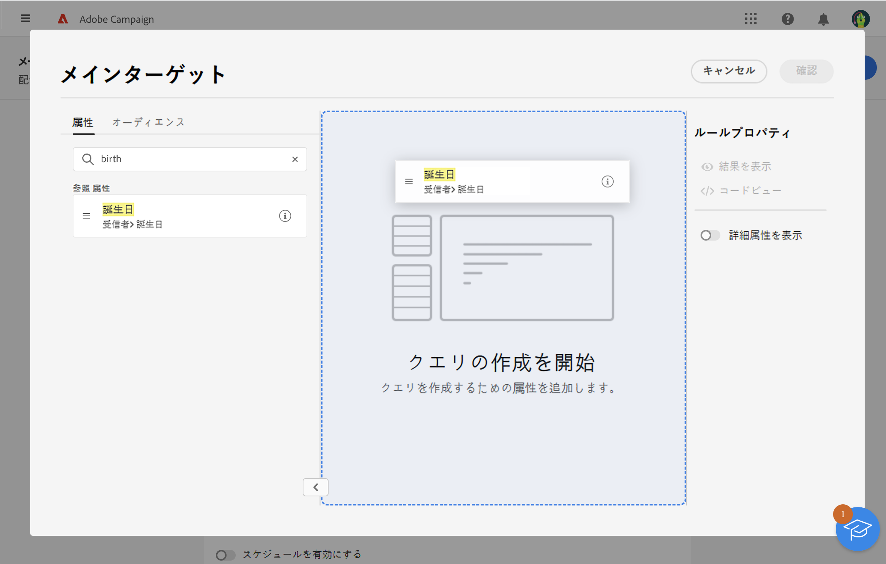
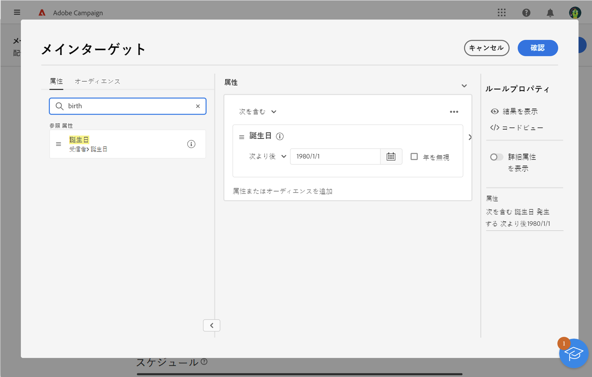
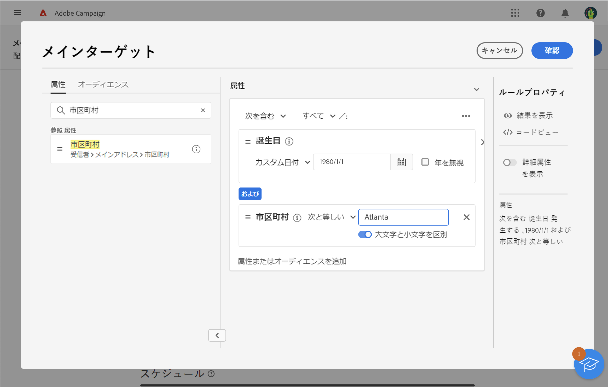
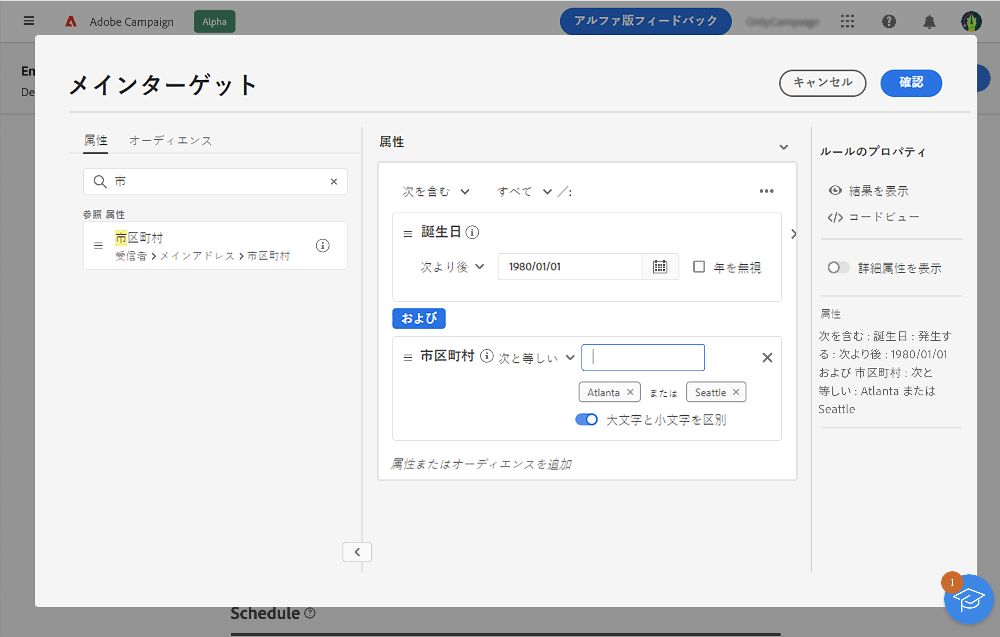
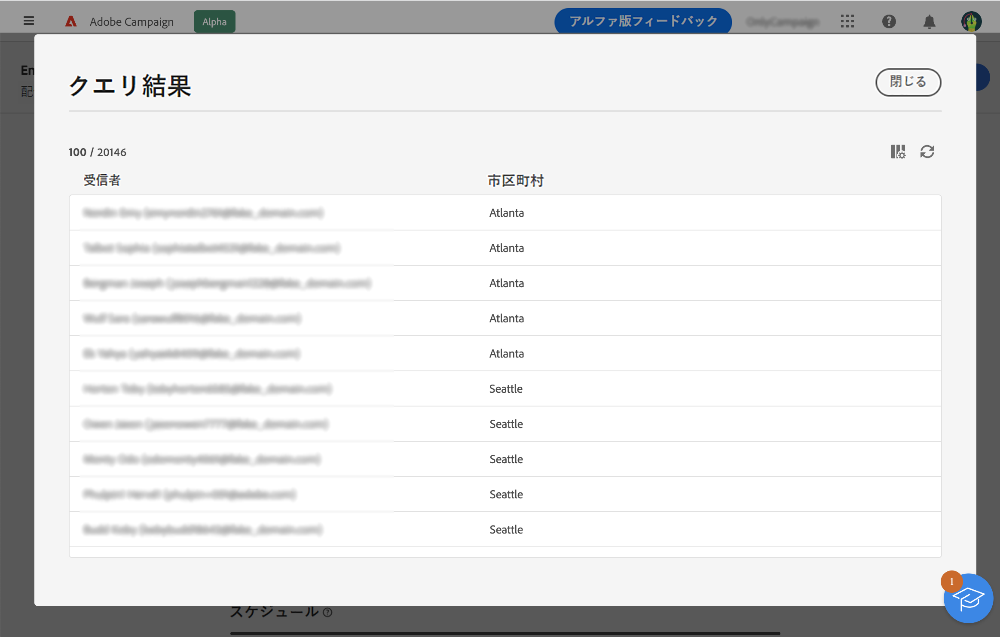

# ルールビルダーの操作 {#segment-builder}

ルールビルダーを使用すると、データベースに含まれているデータをフィルタリングして、配信のターゲットとなる母集団を定義できます。ルールビルダーを使用して、**[!UICONTROL オーディエンスを作成]**&#x200B;アクティビティを使用するワークフローからオーディエンスを作成するか、配信の作成時に直接、1 回限りのオーディエンスを作成します。

* [オーディエンスを作成および保存する方法を学ぶ](create-audience.md)
* [配信用に 1 回限りのオーディエンスを作成する方法を説明します](one-time-audience.md)

## パレット

左側のパレットには、オーディエンスを作成するのにフィルタリングできるすべての要素が含まれています。要素をすばやく見つけるには、検索バーを使用します。パレットに含まれているタイルを設定し考慮するには、中央のキャンバスに移動します。

{zoomable="yes"}{width="70%" align="left"}

パレットは次の 2 つのタブに分かれています。

* **属性**：このタブでは、スキーマから使用可能なすべてのフィールドにアクセスできます。フィールドのリストは、メールテンプレートで定義されているターゲティングスキーマによって異なります。

* **オーディエンス**：このタブでは、Campaign Classic コンソールまたは Adobe Experience Platform で定義された既存のオーディエンスの 1 つを使用してフィルタリングできます。オーディエンスの監視と管理の方法について詳しくは、[この節](manage-audience.md)を参照してください。

  >[!NOTE]
  >
  >Adobe Experience Platform オーディエンスを使用するには、宛先との統合を設定します。詳しくは、[Adobe Experience Platform の宛先に関するドキュメント](https://experienceleague.adobe.com/docs/experience-platform/destinations/home.html?lang=ja){target="_blank"}を参照してください。

## キャンバス

キャンバスは、パレットから追加された要素を基に、ルールを設定したり組み合わせたりできる中央ゾーンです。新しいルールを追加するには、パレットからタイルをドラッグし、キャンバスにドロップします。コンテキスト固有のオプションは、追加するデータのタイプに基づいて表示されます。

{zoomable="yes"}{width="70%" align="left"}

## ルールのプロパティパネル

右側にある&#x200B;**ルールのプロパティ**&#x200B;パネルでは、次のアクションを実行できます。

{zoomable="yes"}{width="70%" align="left"}

* **結果を表示：**&#x200B;オーディエンスのターゲットとなるプロファイルのリストを表示します。
* **コードビュー**：オーディエンスのコードベースのバージョンを SQL で表示します。
* **詳細属性の表示**：このオプションをオンにすると、ノード、グループ、1 対 1 のリンク、1 対多のリンクを含む属性の完全なリストが左側のパレットに表示されます。
* **計算**：クエリのターゲットとなるプロファイルの数を更新および表示します。
* **フィルターを選択または保存**：定義済みフィルターを使用してクエリをフィルタリングするか、後で再利用できるように、クエリを新しいフィルターとして保存します。[詳しくは、定義済みフィルターの操作方法を参照してください](../get-started/predefined-filters.md)。

  >[!IMPORTANT]
  >
  >製品のこのバージョンでは、一部の定義済みフィルターがユーザーインターフェイスで使用できません。引き続きそれらを使用できます。[詳細情報](../get-started/guardrails.md#predefined-filters-filters-guardrails-limitations)。

* **属性**：作成したオーディエンスの説明が表示されます。

## 例

この例では、アトランタまたはシアトルに住み、1980年以降に生まれたすべての顧客をターゲットにするオーディエンスを作成しています。

1. パレットの「**属性**」タブで、「**生年月日**」フィールドを検索します。タイルをドラッグし、キャンバスにドロップします。

   {zoomable="yes"}

1. キャンバスで、**After** 演算子を使用して、目的の日付を入力します。

   {zoomable="yes"}

1. パレットで、「**市区町村**」フィールドを検索し、キャンバスの最初のルールの下に追加します。

   {zoomable="yes"}

1. テキストフィールドに最初の都市名を入力し、Enter キーを押します。

   {zoomable="yes"}

1. 2 つ目の都市名に対して、同じ操作を繰り返します。

   {zoomable="yes"}

1. 「**結果を表示**」をクリックすると、クエリに一致する受信者のリストと数が表示されます。列を追加し、データを視覚化して確認します。この例では、**市区町村**&#x200B;列を追加すると、アトランタとシアトルが表示されます。

   {zoomable="yes"}

1. 「**確認**」をクリックします。