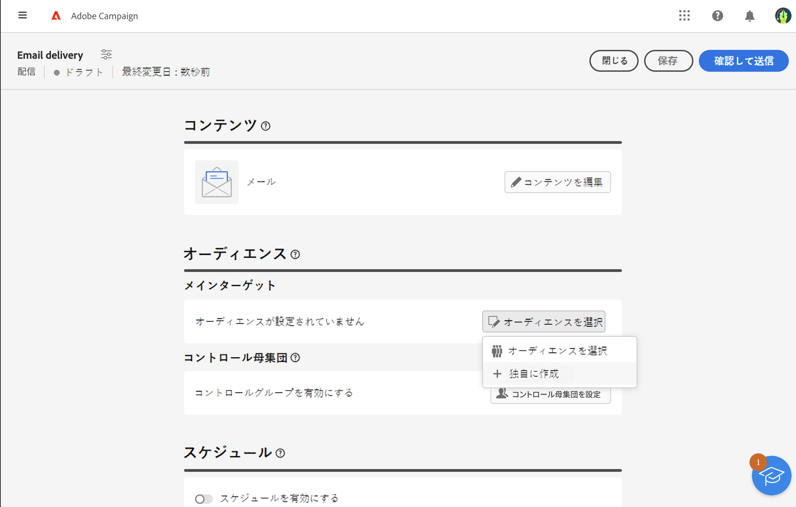
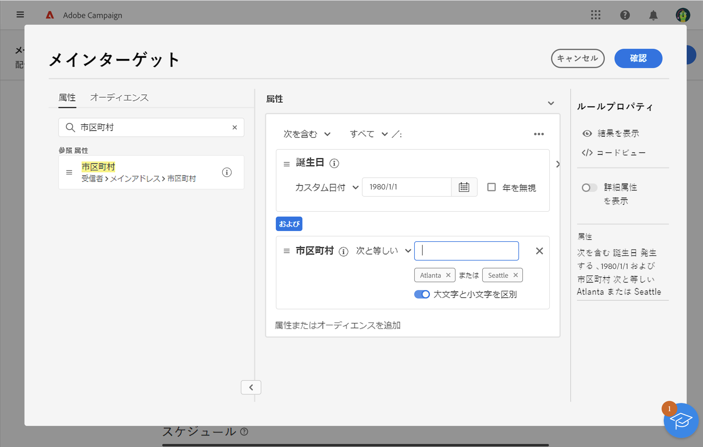

# ルールビルダーを使用したオーディエンスの定義 {#segment-builder}

この節では、新しいメールをデザインする際にオーディエンスを作成する方法について説明します。作成したオーディエンスは、このメールでのみ使用できます。

ルールビルダーを使用すると、データベースに含まれるデータをフィルタリングすることで、メッセージのターゲットとなる母集団を定義できます。 既存のオーディエンスを選択する場合は、この[節](add-audience.md)を参照してください。

ルールビルダーについて詳しくは、 [セグメント化サービスのドキュメント](https://experienceleague.adobe.com/docs/experience-platform/segmentation/ui/segment-builder.html?lang=ja).

メールのデザイン時に新しいオーディエンスを作成するには、次の手順に従います。

1. 配信作成アシスタントの「**オーディエンス**」セクションで、「**[!UICONTROL オーディエンスを選択]**」ボタンをクリックします。

   

1. 「**独自に作成**」を選択します。ルールビルダーが表示されます。

   

## パレット

左側のパレットには、オーディエンスを作成するためにフィルタリングできるすべての要素が含まれています。パレットに含まれるタイルを設定して考慮するには、中央のキャンバスに移動する必要があります。パレットは次の 2 つのタブに分かれています。

* **属性**：このタブでは、スキーマから使用可能なすべてのフィールドにアクセスできます。フィールドのリストは、メールテンプレートで定義されているターゲティングスキーマによって異なります。

   {width="70%" align="left"}

* **オーディエンス**:このタブでは、Campaign ClassicコンソールまたはAdobe Experience Platformで定義された既存のオーディエンスの 1 つを使用して、フィルタリングすることができます。

   {width="70%" align="left"}

   >[!NOTE]
   >
   >Adobe Experience Platformオーディエンスを活用するには、宛先との統合を設定する必要があります。 詳しくは、 [宛先ドキュメント](https://experienceleague.adobe.com/docs/experience-platform/destinations/home.html?lang=ja){target="_blank"}.

検索バーを使用して、要素をすばやく見つけることができます。

## キャンバス

キャンバスは、パレットから追加された要素を基に、ルールを設定したり組み合わせたりできる中央ゾーンです。新しいルールを追加するには、パレットからタイルをドラッグし、キャンバスにドロップします。 追加するデータのタイプに応じて、コンテキスト固有のオプションが表示されます。

{width="70%" align="left"}

## ルールのプロパティパネル

右側に表示される「**ルールのプロパティ**」パネルでは、次のアクションを実行できます。

{width="70%" align="left"}

* **結果を表示：**&#x200B;オーディエンスによってターゲットされた受信者のリストを表示します。
* **コードビュー**：オーディエンスのコードベースのバージョンを SQL で表示します。
* **詳細属性の表示**：左側のパレットに属性の完全なリスト（ノード、グループ、1 対 1 のリンク、1 対多のリンク）を表示する場合は、このオプションを選択します。
* **属性**：作成したオーディエンスの説明が表示されます。

## 例

この例では、アトランタまたはシアトルに住み、1980 年以降に生まれたすべての顧客をターゲットにするオーディエンスを作成します。

1. パレットの「**属性**」タブで、「**生年月日**」フィールドを検索します。タイルをドラッグし、キャンバスにドロップします。

   

1. キャンバスで、「**これ以降**」演算子を使用して、目的の日付を入力します。

   

1. パレットで、「**市区町村**」フィールドを検索し、キャンバスの最初のルールの下に追加します。

   

1. テキストフィールドに最初の都市名を入力し、Enter キーを押します。

   

1. 2 つ目の都市名に対して、同じ操作を繰り返します。

   

1. 「**結果を表示**」をクリックすると、クエリに一致する受信者のリストと数が表示されます。また、列を追加して、データを視覚化および確認することもできます。 この例では、 **市区町村** アトランタとシアトルを見てみましょう。

   

1. 「**確認**」をクリックします。

オーディエンスが定義され、メールで使用できる状態になります。