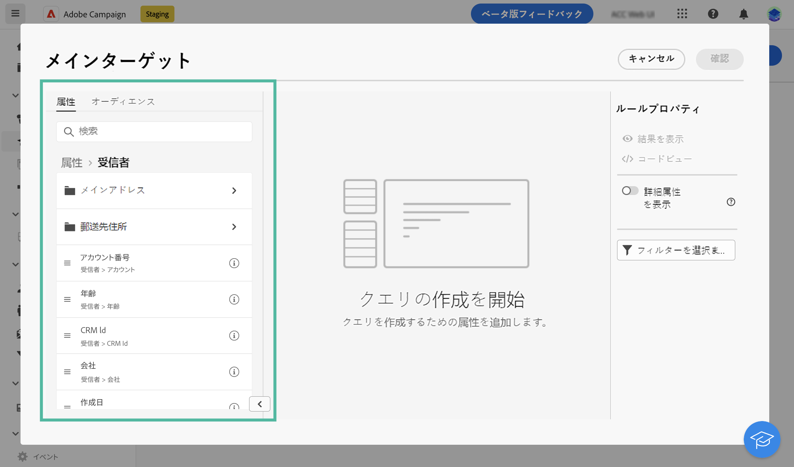
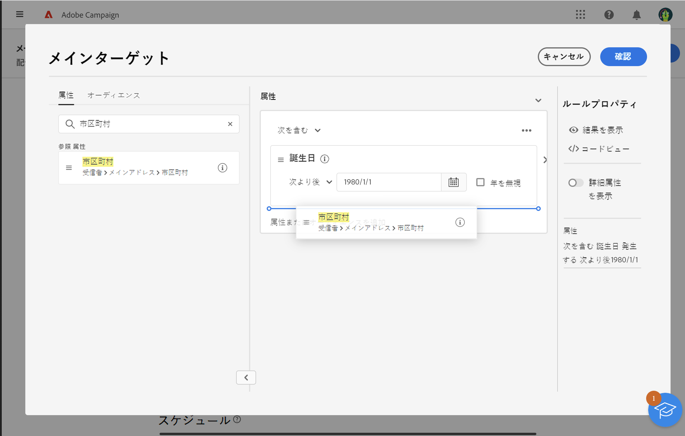
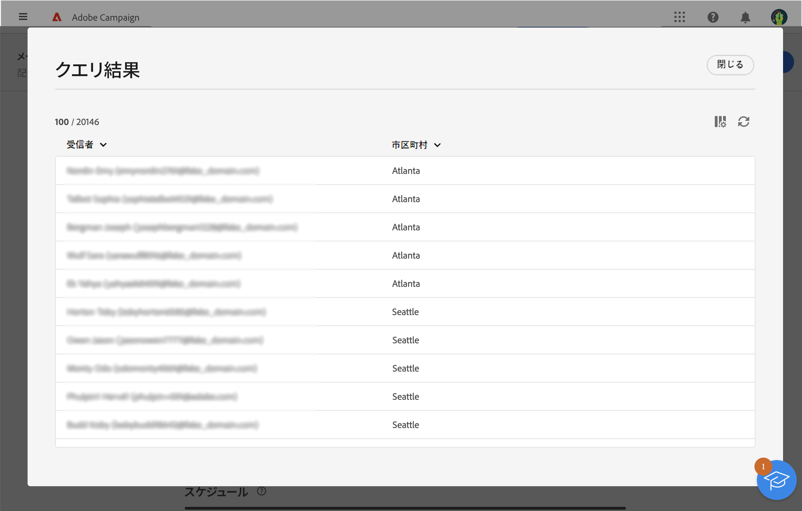

# ルールビルダーの操作 {#segment-builder}

ルールビルダーを使用すると、データベースに含まれるデータをフィルタリングすることで、配信のターゲットとなる母集団を定義できます。 **[!UICONTROL オーディエンスを作成]** アクティビティを使用して、ワークフローからオーディエンスを作成する場合、または配信の作成時に直接オーディエンスを作成して 1 回限りのオーディエンスを作成する場合に使用します。

* [オーディエンスを作成および保存する方法を学ぶ](create-audience.md)
* [配信用に 1 回限りのオーディエンスを作成する方法を説明します](one-time-audience.md)

## パレット

左側のパレットには、オーディエンスを作成するためにフィルタリングできるすべての要素が含まれています。 要素をすばやく見つけるには、検索バーを使用します。 パレットに含まれるタイルを中央のキャンバスに移動して設定し、考慮に入れます。

{zoomable="yes"}{width="70%" align="left"}

パレットは次の 2 つのタブに分かれています。

* **属性**：このタブでは、スキーマから使用可能なすべてのフィールドにアクセスできます。 フィールドのリストは、メールテンプレートで定義されているターゲティングスキーマによって異なります。

* **オーディエンス**：このタブでは、Campaign Classic コンソールまたはAdobe Experience Platformで定義された既存のオーディエンスの 1 つを使用してフィルタリングできます。 オーディエンスを監視および管理する方法については、[ この節 ](manage-audience.md) を参照してください。

  >[!NOTE]
  >
  >Adobe Experience Platform オーディエンスを使用するには、宛先との統合を設定します。 詳しくは、[Adobe Experience Platform の宛先に関するドキュメント](https://experienceleague.adobe.com/docs/experience-platform/destinations/home.html?lang=ja){target="_blank"}を参照してください。

## キャンバス

キャンバスは、パレットから追加された要素に基づいてルールを設定したり組み合わせたりできる中央ゾーンです。 新しいルールを追加するには、パレットからタイルをドラッグし、キャンバスにドロップします。 コンテキスト固有のオプションは、追加するデータのタイプに基づいて表示されます。

{zoomable="yes"}{width="70%" align="left"}

## ルールのプロパティパネル

右側に表示される **ルールのプロパティ** パネルでは、以下に示すアクションを実行できます。

{zoomable="yes"}{width="70%" align="left"}

* **結果を表示：** オーディエンスによってターゲットされたプロファイルのリストを表示します。
* **コードビュー**：オーディエンスのコードベースバージョンを SQL で表示します。
* **詳細属性の表示**：このオプションをオンにすると、ノード、グループ、1 対 1 のリンク、1 対多のリンクを含む、左側のパレットに属性の完全なリストが表示されます。
* **計算**：クエリのターゲットとなるプロファイルの数を更新および表示します。
* **フィルターを選択または保存**：定義済みフィルターを使用してクエリをフィルターするか、後で再利用できるように新しいフィルターとしてクエリを保存します。 [ 定義済みフィルターの操作方法を説明します ](../get-started/predefined-filters.md)。

  >[!IMPORTANT]
  >
  >このバージョンの製品では、一部の定義済みフィルターはユーザーインターフェイスで使用できません。 引き続きそれらを使用できます。[詳細情報](../get-started/guardrails.md#predefined-filters-filters-guardrails-limitations)。

* **属性**：作成したオーディエンスの説明が表示されます。

## 例

この例では、アトランタまたはシアトルに住み、1980 年以降に生まれたすべての顧客をターゲットにしてオーディエンスを作成しています。

1. パレットの「**属性**」タブで、「**生年月日**」フィールドを検索します。タイルをドラッグし、キャンバスにドロップします。

   {zoomable="yes"}

1. キャンバスで、**After** 演算子を使用して、目的の日付を入力します。

   {zoomable="yes"}

1. パレットで、「**市区町村**」フィールドを検索し、キャンバスの最初のルールの下に追加します。

   {zoomable="yes"}

1. テキストフィールドに最初の都市名を入力し、Enter キーを押します。

   {zoomable="yes"}

1. 2 つ目の都市名に対して、同じ操作を繰り返します。

   {zoomable="yes"}

1. 「**結果を表示**」をクリックすると、クエリに一致する受信者のリストと数が表示されます。データを視覚化および確認するために列を追加します。 この例では、**市区町村** 列を追加して、アトランタとシアトルを表示します。

   {zoomable="yes"}

1. 「**確認**」をクリックします。