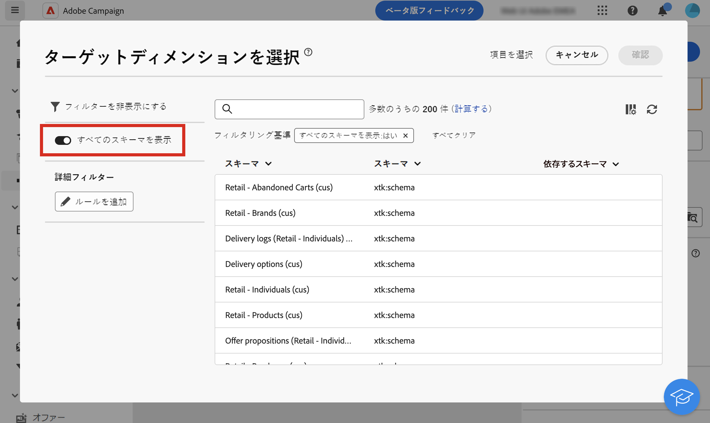

# ターゲティングディメンション {#targeting-dimensions}

>[!CONTEXTUALHELP]
>id="acw_orchestration_build_audience_dimension"
>title="ターゲティングディメンションの選択"
>abstract="ターゲティングディメンションは、受信者、契約の受益者、オペレーター、サブスクライバーなど、ターゲットされる母集団を操作ごとに定義します。デフォルトでは、メールと SMS の場合、ターゲットは受信者ビルトインテーブルから選択されます。プッシュ通知の場合、デフォルトのターゲットディメンションはサブスクライバーのアプリケーションです。"

ターゲティングディメンション、別名ターゲットマッピングは、操作で処理されるデータのタイプです。ターゲット母集団（プロファイル、契約の受取人、オペレーター、サブスクライバーなど）を定義できます。

## ワークフローのターゲティングディメンション {#workflow}

ワークフローのターゲティングディメンションは、最初の&#x200B;**[!UICONTROL オーディエンスを作成]**&#x200B;アクティビティで定義され、ワークフローが終了するまで、他のすべてのアクティビティで使用されます。例えば、データベースからプロファイルに対してクエリを実行すると、アウトバウンドトランジションには「受信者」タイプのデータが含まれ、次のアクティビティに送信されます。

なお、ワークフロー内のターゲティングディメンションは、[ディメンションアクティビティを変更](../workflows/activities/change-dimension.md)を使用して切り替えることができます。これにより、例えば、購入またはサブスクリプションなどの特定のテーブルでデータベースをクエリしてから、ターゲティングディメンションを「受信者」に変更して、対応するプロファイルに配信を送信できます。

ターゲティングディメンションを（ワークフロー設定や、などのアクティビティで）選択する場合 **オーディエンスを作成**, **紐付け** または **ディメンションを変更**）を選択すると、一般的に使用されるスキーマの選択がデフォルトでリストに表示されます。 使用可能なすべてのスキーマを表示するには、「**[!UICONTROL すべてのスキーマを表示]**」ボタンの切替スイッチをオンにします。オプションの選択は、各ユーザーに対して保存されます。

{zoomable=&quot;yes&quot;}

## ターゲティングディメンション {#list}

デフォルトでは、メールと SMS 配信テンプレートは、プロファイルをターゲットにしています。したがって、ターゲットマッピングには **nms:recipient** テーブルのフィールドが使用されます。プッシュ通知の場合、デフォルトのターゲットマッピングは&#x200B;**サブスクライバーのアプリケーション（nms:appSubscriptionRcp）**&#x200B;であり、受信者のテーブルにリンクされています。

また、以下に表示されているワークフローと配信で、他のビルトインターゲットマッピングを使用することもできます。

| 名前 | 用途 | スキーマ |
|---|---|---|
| 受信者 | プロファイル / 受信者への配信 (ビルトイン受信者テーブル) | nms:recipient |
| 訪問者 | 紹介（バイラルマーケティング）などの方法でプロファイルを収集した訪問者への配信 | mns:visitor |
| 購読 | ニュースレターなどの情報サービスを購読しているプロファイルへの配信 | nms:subscription |
| 訪問者の購読 | 情報サービスを購読している訪問者に対する配信 | nms:visitorSub |
| オペレーター | Adobe Campaign オペレーターに対する配信 | nms:operator |
| 外部ファイル | 配信に必要な情報をすべて含んだファイルを経由しての配信 | リンクされるスキーマなし、入力されるターゲットなし |
| サブスクライバーのアプリケーション | アプリケーションを購読しているプロファイルへの配信 | nms:appSubscriptionRcp |

また、必要に応じて、新しいターゲットマッピングを作成できます。この操作は、クライアントコンソールからのみ実行されます。詳しくは、[Campaign v8（クライアントコンソール）ドキュメント](https://experienceleague.adobe.com/docs/campaign/campaign-v8/audience/add-profiles/target-mappings.html?lang=ja#new-mapping){target="_blank"}を参照してください。
