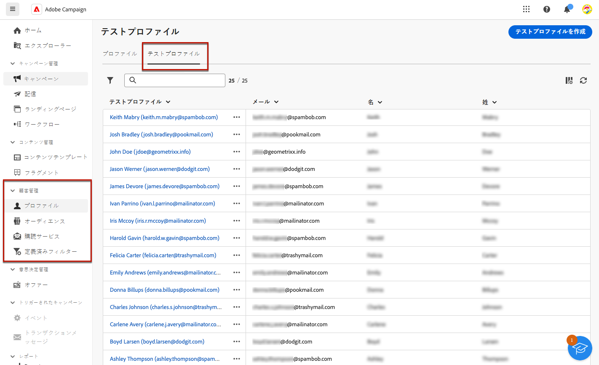
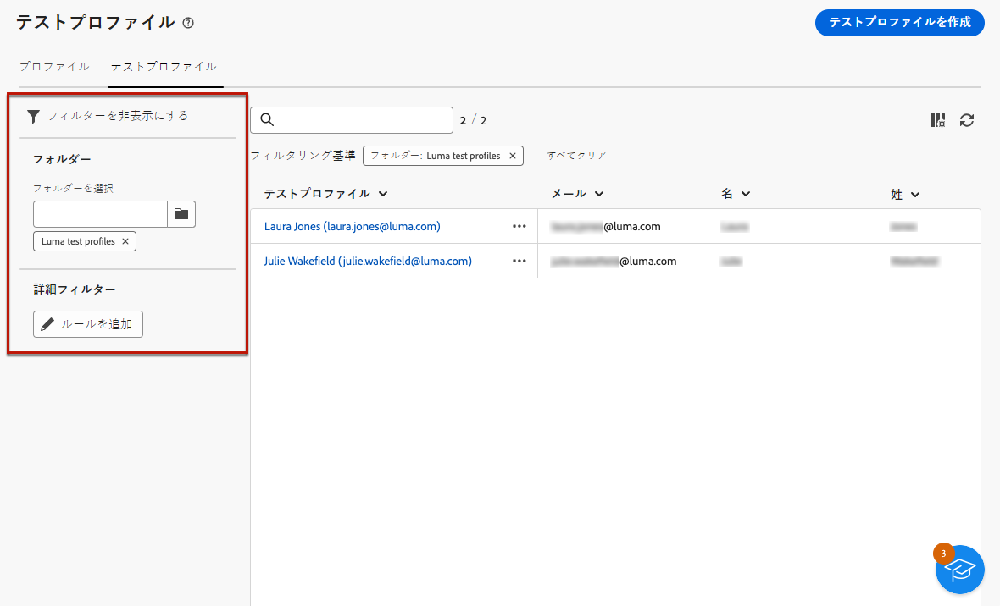
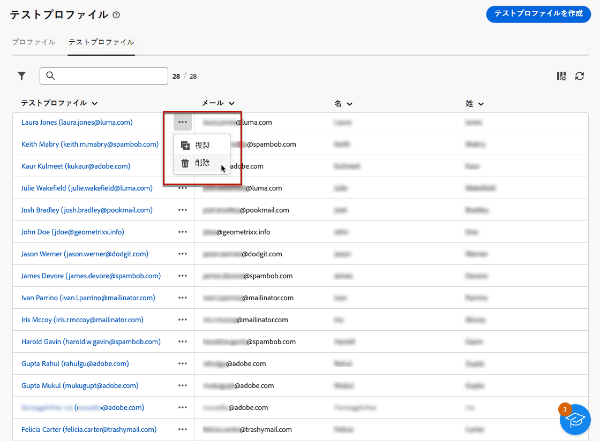
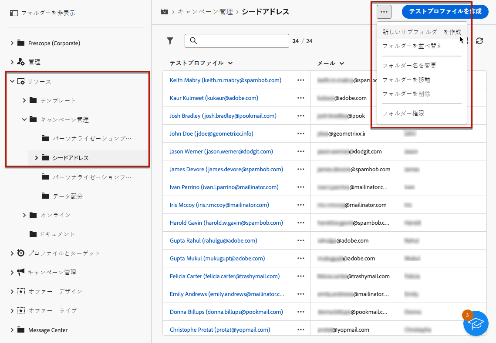
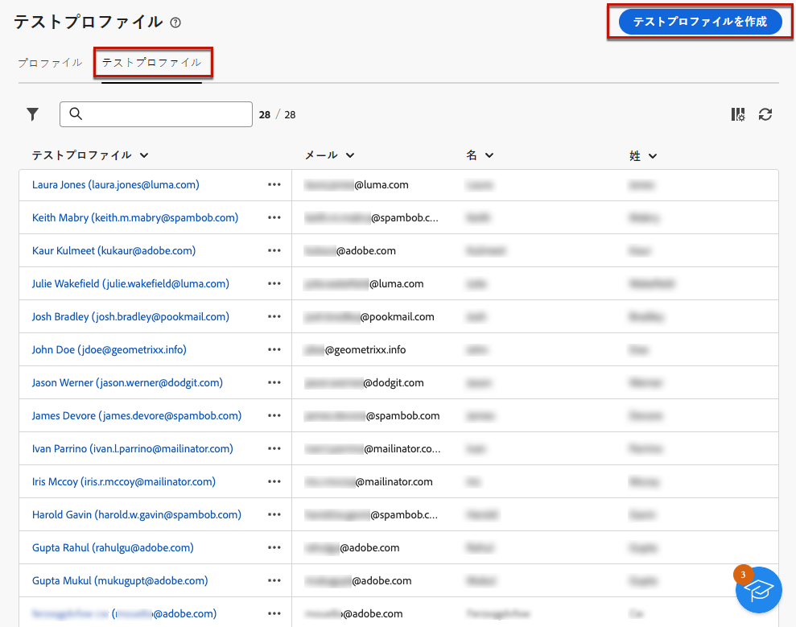
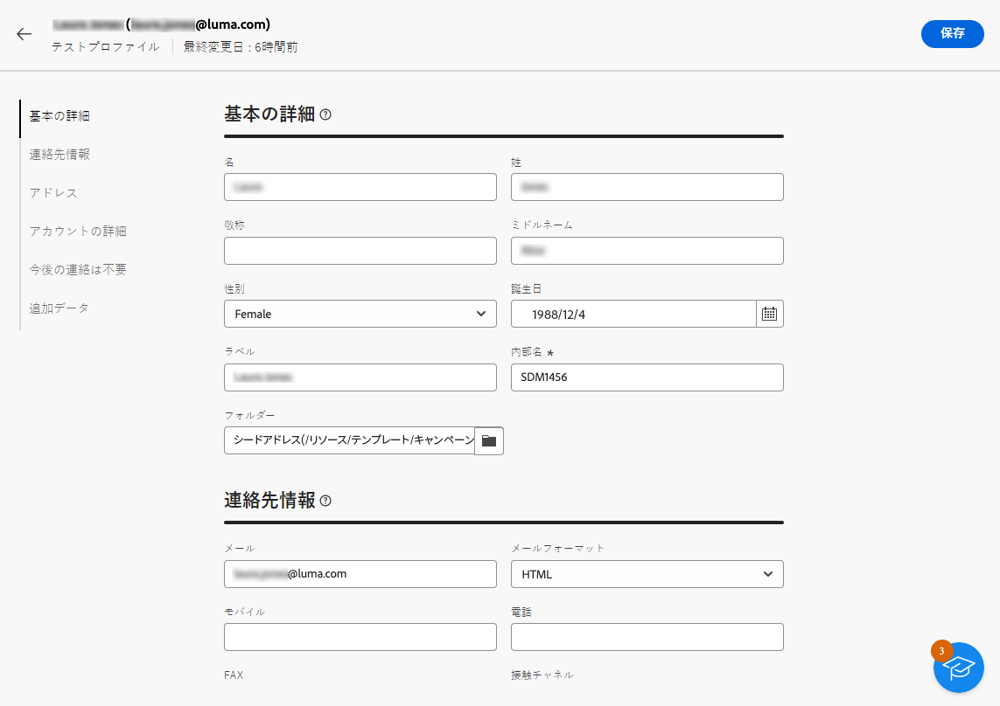
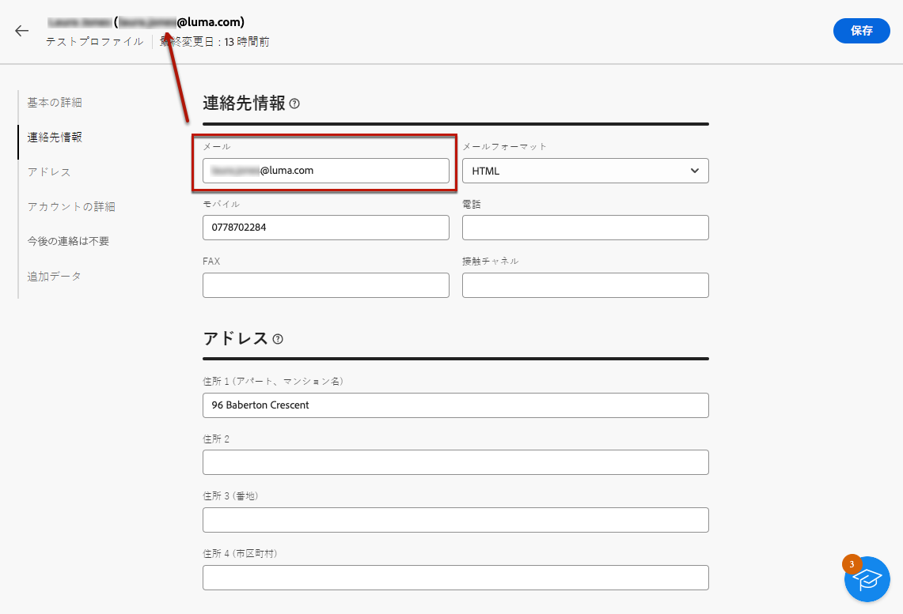
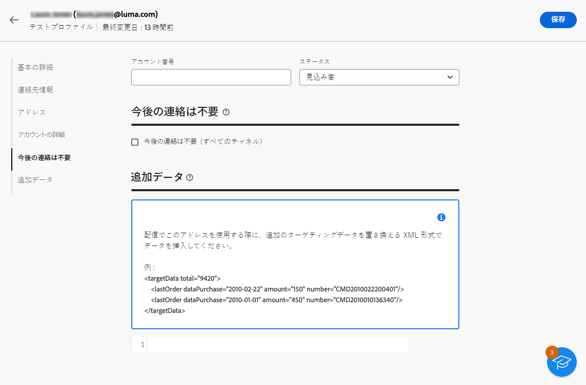

# テストプロファイルの作成と管理 {#create-test-profiles}

>[!CONTEXTUALHELP]
>id="acw_recipients_testprofiles_menu"
>title="テストプロファイルを作成"
>abstract="テストプロファイルは、シードアドレスとして作成されます。シードアドレスは、定義されたターゲット条件に一致しない架空のプロファイルをターゲットにするために使用されるデータベース内の追加の受信者です。"

テストプロファイルは、シードアドレスとして作成されます。シードアドレスは、定義されたターゲット条件に一致しない架空のプロファイルをターゲットにするために使用されるデータベース内の追加の受信者です。シードアドレスでは、配達確認を送信することで、配信を送信する前にパーソナライゼーションとレンダリングをプレビューおよびテストできます。

<!--Learn more on test profiles in the [Campaign v8 (client console) documentation](https://experienceleague.adobe.com/docs/campaign/campaign-v8/audience/add-profiles/test-profiles.html){target="_blank"}.-->

シードアドレスにテストメッセージを送信する手順については、[この節](../preview-test/test-deliveries.md#test-profiles)を参照してください。

>[!NOTE]
>
>テストプロファイルは、**[!UICONTROL クリック数]**、**[!UICONTROL 開封数]**、**[!UICONTROL 購読解除]**&#x200B;の配信統計に関するレポートからは自動的に除外されます。[詳しくは、レポートを参照してください]

## テストプロファイルのアクセスと管理 {#access-test-profiles}

テストプロファイルリストにアクセスするには、左側のメニューから&#x200B;**[!UICONTROL 顧客管理]**／**[!UICONTROL プロファイル]**&#x200B;を選択し、「**[!UICONTROL テストプロファイル]**」タブをクリックします。

{zoomable=&quot;yes&quot;}

* ドロップダウンリストを使用して特定の[フォルダー](../get-started/permissions.md#folders)をフィルタリングしたり、[クエリモデラー](../query/query-modeler-overview.md)を使用してルールを追加したりできます。

  {zoomable=&quot;yes&quot;}

* 必要に応じて、テストプロファイルを複製し、更新できます。テストプロファイルを編集する手順は、[テストプロファイルを作成](#create-test-profile)する場合と同じです。

* テストプロファイルを削除するには、**[!UICONTROL その他のアクション]**&#x200B;メニューから対応するオプションを選択します。

  {zoomable=&quot;yes&quot;}

* テストプロファイルを編集するには、リストから目的の項目をクリックします。テストプロファイルを編集する手順は、[テストプロファイルを作成](#create-test-profile)する場合と同じです。

また、**[!UICONTROL エクスプローラー]**&#x200B;ビューの&#x200B;**[!UICONTROL リソース]**／**[!UICONTROL キャンペーン管理]**／**[!UICONTROL シードアドレス]**&#x200B;ノードからテストプロファイルにアクセスすることもできます。

そこから、フォルダーまたはサブフォルダーを参照、作成、管理したり、関連する権限を確認したりできます。[フォルダーの作成方法を学ぶ](../get-started/permissions.md#folders)

{zoomable=&quot;yes&quot;}

また、**[!UICONTROL エクスプローラー]**&#x200B;ビューから、テストプロファイルをフィルタリング、削除、編集、[作成](#create-test-profile)することもできます。

## テストプロファイルの作成 {#create-test-profile}

>[!CONTEXTUALHELP]
>id="acw_recipients_testprofiles_additionaldata"
>title="テストプロファイルの追加データ"
>abstract="データ管理ワークフローで作成された配信に使用され、特定の値を割り当てたいパーソナライズデータを入力します。"

テストプロファイルを作成するには、次の手順に従います。

1. **[!UICONTROL 顧客管理]**／**[!UICONTROL プロファイル]**&#x200B;を参照し、「**[!UICONTROL テストプロファイル]**」タブを選択します。

1. 「**[!UICONTROL テストプロファイルを作成]**」ボタンをクリックします。

   {zoomable=&quot;yes&quot;}

1. 必要に応じて、テストプロファイルの詳細を入力します。<!--Most of the fields are the same as when creating profiles. [Learn more]-->

   {zoomable=&quot;yes&quot;}

   >[!NOTE]
   >
   >「**[!UICONTROL ラベル]**」フィールドには、定義した姓と名が自動的に入力されます。

1. デフォルトでは、テストプロファイルは&#x200B;**[!UICONTROL シードアドレス]**&#x200B;フォルダーに保存されます。目的の場所を参照して変更できます。[詳しくは、フォルダーの操作方法を参照してください](../get-started/permissions.md#folders)

   <!--{zoomable="yes"}-->

<!--
You do not need to enter all fields of each tab when creating a seed address. Missing personalization elements are entered randomly during delivery analysis. (Not valid?)
-->

1. 「**[!UICONTROL 連絡先情報]**」セクションに、メールアドレスと他の関連データを入力します。メールアドレスは、テストプロファイルラベルの後の括弧内に表示されます。

   {zoomable=&quot;yes&quot;}

1. 「**[!UICONTROL 今後の連絡は不要（すべてのチャネル）]**」チェックボックスをオンにすると、テストプロファイルはブロックリストに登録されます。このような受信者は、いずれのチャネル（メール、SMS など）でもターゲットに設定されなくなりました。

1. 「**[!UICONTROL 追加データ]**」タブでは、データ管理ワークフローで作成された配信に使用され、特定の値を割り当てたいパーソナライズデータを入力します。[詳しくは、ワークフローを参照してください](../workflows/gs-workflows.md)

   {zoomable=&quot;yes&quot;}

   追加のターゲットデータが、「**[!UICONTROL エンリッチメント]**」ワークフローアクティビティで「@」で始まるエイリアスで定義されていることを確認してください。それ以外の場合は、配信アクティビティでシードアドレスと共に適切に使用できません。[詳しくは、「エンリッチメント」アクティビティを参照してください](../workflows/activities/enrichment.md)

1. 「**[!UICONTROL 保存]**」ボタンをクリックします。

作成したテストプロファイルを使用してテストを送信する準備が整いました。[詳細情報](../preview-test/test-deliveries.md#test-profiles)

<!--Use test profiles in Direct mail? cf v7/v8-->
