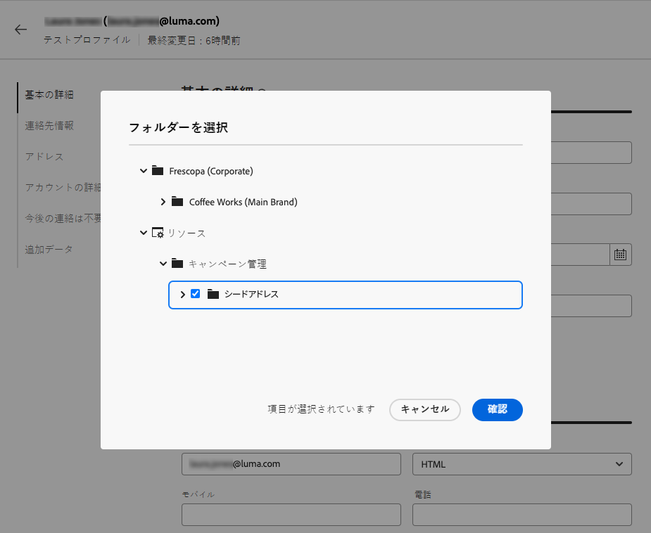

# テストプロファイルの作成と管理 {#create-test-profiles}

>[!CONTEXTUALHELP]
>id="acw_recipients_testprofiles_menu"
>title="テストプロファイルを作成"
>abstract="テストプロファイルは、シードアドレスとして作成されます。これらは、定義されたターゲット条件に一致しない架空のプロファイルをターゲットするために使用される、データベース内の追加の受信者です。"

テストプロファイルは、シードアドレスとして作成されます。これらは、定義されたターゲット条件に一致しない架空のプロファイルをターゲットするために使用される、データベース内の追加の受信者です。 配達確認を送信することで、配信を送信する前に、パーソナライゼーションとレンダリングをプレビューおよびテストできます。

<!--Learn more on test profiles in the [Campaign v8 (client console) documentation](https://experienceleague.adobe.com/docs/campaign/campaign-v8/audience/add-profiles/test-profiles.html){target="_blank"}.-->

シードアドレスにテストメッセージを送信する手順について詳しくは、 [この節](../preview-test/test-deliveries.md#test-profiles).

>[!NOTE]
>
>テストプロファイルは、次の配信統計に関するレポートから自動的に除外されます。 **[!UICONTROL クリック数]**, **[!UICONTROL 開封数]**, **[!UICONTROL 購読解除]**. [レポートの詳細を説明します]

## テストプロファイルへのアクセスと管理 {#access-test-profiles}

テストプロファイルのリストにアクセスするには、「 」を選択します。 **[!UICONTROL 顧客管理]** > **[!UICONTROL プロファイル]** 左側のメニューから、 **[!UICONTROL テストプロファイル]** タブをクリックします。

* 特定の [フォルダー](../get-started/permissions.md#folders) ドロップダウンリストを使用するか、 [クエリモデラー](../query/query-modeler-overview.md).

  

* 任意のテストプロファイルを複製し、必要に応じて更新できます。 テストプロファイルを編集する手順は、 [テストプロファイルの作成](#create-test-profile).

* テストプロファイルを削除するには、 **[!UICONTROL その他のアクション]** メニュー。

  

* テストプロファイルを編集するには、リストから目的の項目をクリックします。 テストプロファイルを編集する手順は、 [テストプロファイルの作成](#create-test-profile).

また、 **[!UICONTROL エクスプローラ]** ビュー、 **[!UICONTROL リソース]** > **[!UICONTROL Campaign Management]** > **[!UICONTROL シードアドレス]** ノード。

ここから、フォルダやサブフォルダを参照、作成、管理したり、関連する権限を確認したりできます。 [フォルダーの作成方法を説明します](../get-started/permissions.md#folders)

次から： **[!UICONTROL エクスプローラ]** 表示では、フィルター、削除、編集および [作成](#create-test-profile) テストプロファイル。

## テストプロファイルの作成 {#create-test-profile}

>[!CONTEXTUALHELP]
>id="acw_recipients_testprofiles_additionaldata"
>title="テストプロファイルの追加データ"
>abstract="データ管理ワークフローで作成される配信に使用されるパーソナライゼーションデータと、特定の値を割り当てるパーソナライゼーションデータを入力します。"

テストプロファイルを作成するには、次の手順に従います。

1. 参照先 **[!UICONTROL 顧客管理]** > **[!UICONTROL プロファイル]** をクリックし、 **[!UICONTROL テストプロファイル]** タブをクリックします。

1. 次をクリック： **[!UICONTROL テストプロファイルを作成]** 」ボタンをクリックします。

   

1. 必要に応じて、テストプロファイルの詳細を入力します。 <!--Most of the fields are the same as when creating profiles. [Learn more]-->

   

   >[!NOTE]
   >
   >The **[!UICONTROL ラベル]** フィールドには、定義した姓と名が自動的に入力されます。

1. デフォルトでは、テストプロファイルは、 **[!UICONTROL シードアドレス]** フォルダー。 目的の場所を参照して変更できます。 [フォルダーの操作方法を説明します](../get-started/permissions.md#folders)

   

<!--
You do not need to enter all fields of each tab when creating a seed address. Missing personalization elements are entered randomly during delivery analysis. (Not valid?)
-->

1. Adobe Analytics の **[!UICONTROL 連絡先情報]** 「 」セクションで、E メールアドレスやその他の関連データを入力します。 E メールアドレスは、テストプロファイルラベルの後に括弧で囲まれて表示されます。

   

1. 次を選択した場合、 **[!UICONTROL 今後の連絡は不要（すべてのチャネル）]** 「 」チェックボックスをオンにすると、テストプロファイルは「 」ブロックリストに加えるになります。 このような受信者は、どのチャネル（E メール、SMS など）のターゲットにもならなくなりました。

1. Adobe Analytics の **[!UICONTROL 追加データ]** 「 」タブでは、データ管理ワークフローで作成される配信に使用されるパーソナライゼーションデータと、特定の値を割り当てるパーソナライゼーションデータを入力します。 [ワークフローの詳細を説明します](../workflows/gs-workflows.md)

   

   追加のターゲットデータが、「**[!UICONTROL エンリッチメント]**」ワークフローアクティビティで「@」で始まるエイリアスで定義されていることを確認してください。そうでない場合、配信アクティビティのシードアドレスで適切に使用することはできません。 [エンリッチメントアクティビティの詳細を説明します](../workflows/activities/enrichment.md)

1. 「**[!UICONTROL 保存]**」ボタンをクリックします。

これで、作成したテストプロファイルを使用してテストを送信する準備が整いました。 [詳細情報](../preview-test/test-deliveries.md#test-profiles)

<!--Use test profiles in Direct mail? cf v7/v8-->

