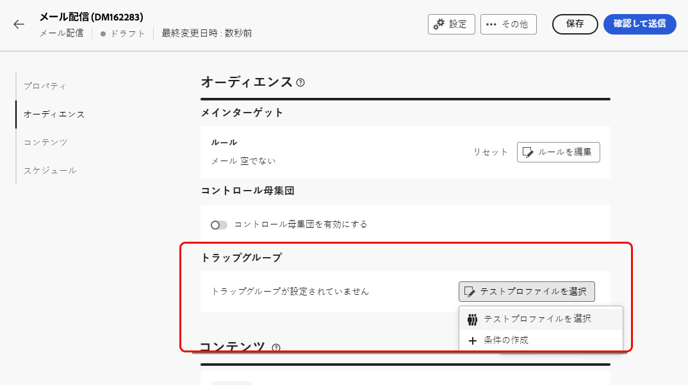
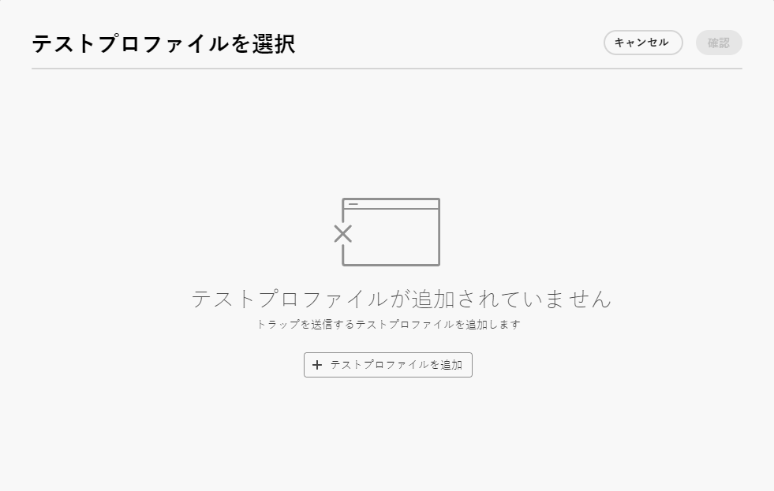
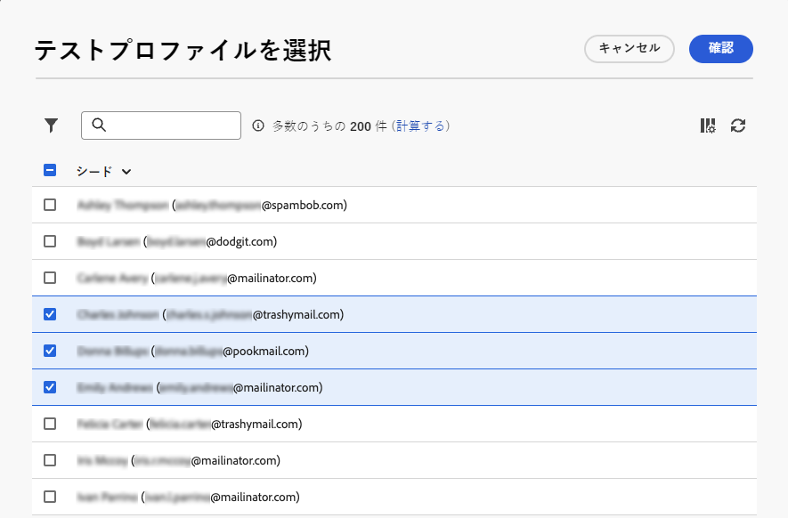
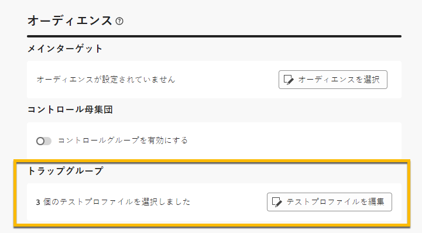
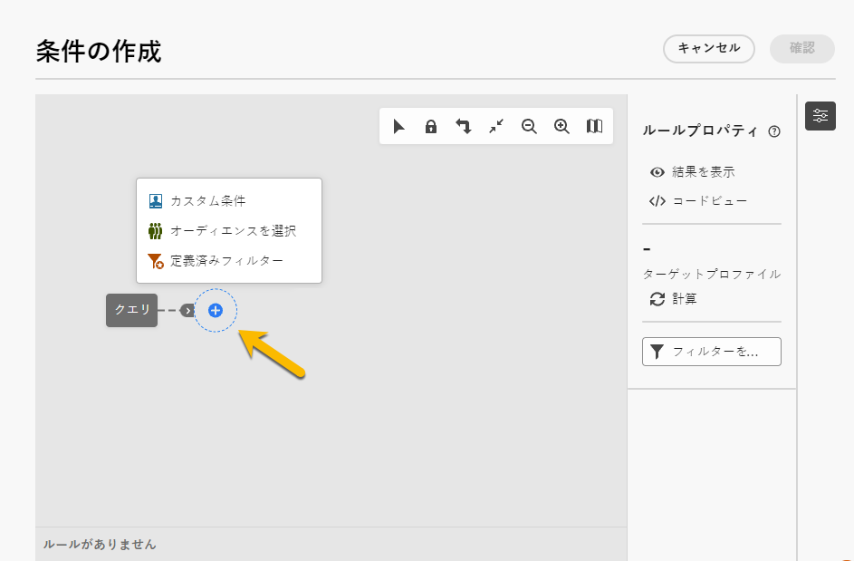
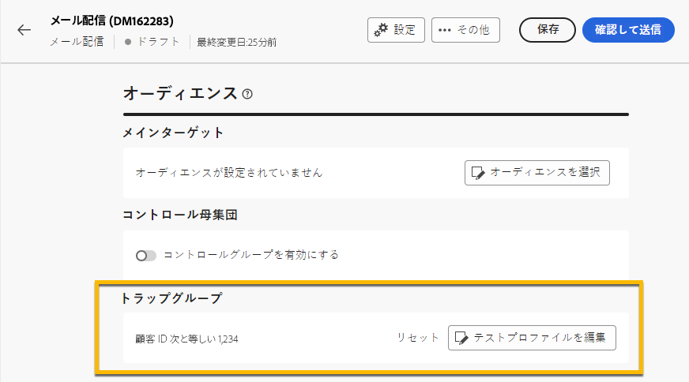
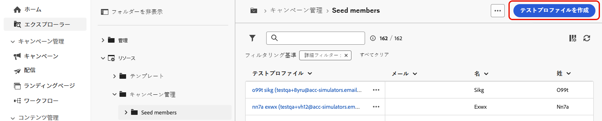
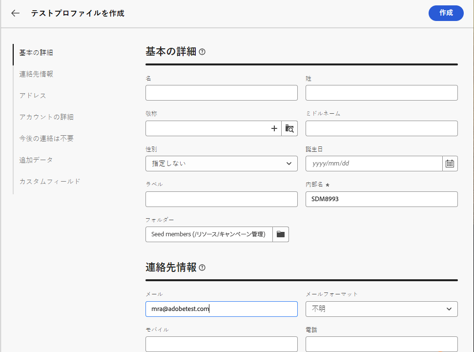

# **[!UICONTROL トラップグループ]**&#x200B;の使用 {#trap-group}

**[!UICONTROL トラップグループ]**は、定義されたターゲット条件に一致しない受信者を配信のターゲットにする場合に使用されます。これにより、配信スコープ外の受信者が他のターゲット受信者と同様に配信を受信することができます。
**[!UICONTROL トラップグループ]**&#x200B;は、**[!UICONTROL シードアドレス]**&#x200B;のグループです。

## **[!UICONTROL トラップグループ]**&#x200B;を使用する理由

次の目的のために、**[!UICONTROL トラップグループ]**&#x200B;を使用できます。

1. **配達確認として**：**[!UICONTROL トラップグループ]**&#x200B;の各メンバーは、オーディエンスの一部と同様に配信を受信します。

1. **メーリングリストを保護するために**：オーディエンスが受信する内容を受信することで、サードパーティがメーリングリストを使用した場合に、**[!UICONTROL トラップグループ]**&#x200B;の各&#x200B;**[!UICONTROL シードアドレス]**&#x200B;が通知されます。

## **[!UICONTROL トラップグループ]**&#x200B;について

シードアドレスは、**クリック数**、**開封数**、**購読解除**&#x200B;の配信統計に関するレポートからは自動的に除外されます。レポートは、実際のオーディエンスに関する内容のみです。

メール配信の場合、**[!UICONTROL トラップグループ]**&#x200B;のメールアドレスのみが必要で、他のフィールドのパーソナライゼーションは Campaign によってランダムに入力されます。

## 配信で&#x200B;**[!UICONTROL トラップグループ]**&#x200B;を設定する方法

**[!UICONTROL トラップグループ]**&#x200B;を設定するには、配信の&#x200B;**[!UICONTROL オーディエンス]**&#x200B;設定に移動します。次の 2 つのオプションがあります。
- [テストプロファイルを選択](#select-test-profile)
- [条件を作成](#create-condition)

{zoomable="yes"}

### テストプロファイルを選択 {#select-test-profiles}

「テストプロファイルを選択」を選択すると、以下のようなウィンドウが表示され、**[!UICONTROL テストプロファイルを追加]**&#x200B;するように促されます。

{zoomable="yes"}

ボタンをクリックすると、**[!UICONTROL トラップグループ]**を追加できるシードアドレスにアクセスできます。使用するシードアドレスをオンにします。
新しいシードアドレスを作成できます。[詳細情報](#create-seed)

{zoomable="yes"}

トラップアドレスを確認する際は、**[!UICONTROL トラップグループ]**&#x200B;の番号が正しいことを確認します。

{zoomable="yes"}

### 条件を作成 {#create-condition}

「**[!UICONTROL 条件を作成]**」を選択すると、使用するシードアドレスを定義するためのクエリをカスタマイズできる新しいウィンドウが表示されます。

{zoomable="yes"}

クエリは、**[!UICONTROL トラップグループ]**&#x200B;の下に表示されます。

{zoomable="yes"}

## 新しい&#x200B;**[!UICONTROL シードアドレス]**&#x200B;を作成する方法 {#create-seed}

**[!UICONTROL エクスプローラー]**／**[!UICONTROL リソース]**／**[!UICONTROL キャンペーン管理]**／**[!UICONTROL シードメンバー]**&#x200B;で新しい&#x200B;**[!UICONTROL シードアドレス]**&#x200B;を作成できます

{zoomable="yes"}

オーディエンスプロファイルと同様に、シードメンバーに関するすべての詳細を入力できます。

{zoomable="yes"}