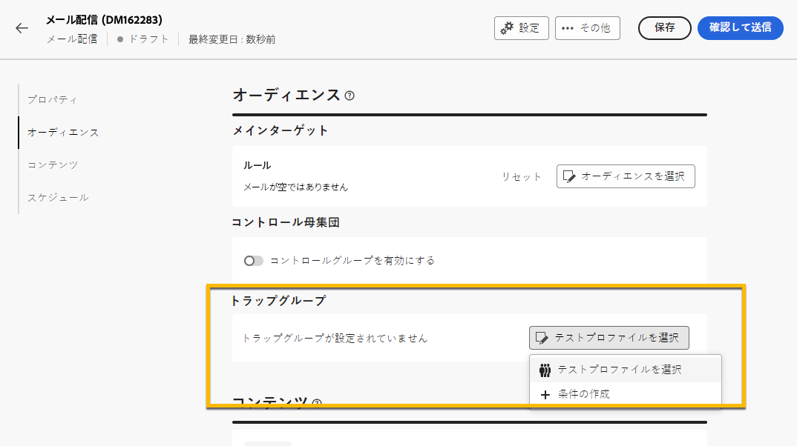

# を使用 **[!UICONTROL [ トラップ ] 領域]** {#trap-group}

A **[!UICONTROL [ トラップ ] 領域]** は、定義されたターゲット条件に一致しない受信者を配信のターゲットにする場合に使用されます。 これにより、配信スコープ外の受信者が他のターゲット受信者と同様に配信を受信できます。
A **[!UICONTROL [ トラップ ] 領域]** 次のグループです **[!UICONTROL シードアドレス]**.

## を使用する理由 **[!UICONTROL [ トラップ ] 領域]**

次を使用できます **[!UICONTROL [ トラップ ] 領域]** :

1. **As a proof** ：の各メンバー **[!UICONTROL [ トラップ ] 領域]** は、オーディエンスの一部であるかのように配信を受け取ります。

1. **メーリング リストを保護するには** ：オーディエンスが受け取る内容によって、それぞれ **[!UICONTROL シードアドレス]** の **[!UICONTROL [ トラップ ] 領域]** メーリングリストがサードパーティによって使用されている場合は通知されます。

## について **[!UICONTROL [ トラップ ] 領域]**

シードアドレスは、次の配信統計に関するレポートから自動的に除外されます。 **クリック数**, **開封数**, **購読解除**. レポートは、実際のオーディエンスに関するものです。

メール配信の場合、 **[!UICONTROL [ トラップ ] 領域]**&#x200B;その場合、他のフィールドのパーソナライゼーションは、Campaign によってランダムに入力されます。

## の設定方法 **[!UICONTROL [ トラップ ] 領域]** 配信中

を設定するには **[!UICONTROL [ トラップ ] 領域]**&#x200B;に移動します。 **[!UICONTROL 対象読者]** 配信の設定。 次の 2 つのオプションがあります。
- [テストプロファイルを選択](#select-test-profile)
- [条件の作成](#create-condition)

{zoomable="yes"}

### テストプロファイルを選択 {#select-test-profiles}

「テストプロファイルを選択」を選択すると、以下のようなウィンドウが表示され、招待を受けることができます **[!UICONTROL テストプロファイルを追加]** :

{zoomable="yes"}

ボタンをクリックすると、を追加できるシードアドレスにアクセスできます **[!UICONTROL [ トラップ ] 領域]**. 使用するチェックボックスをオンにします。
新しいシードアドレスを作成できます。 [詳細情報](#create-seed)

{zoomable="yes"}

トラップアドレスを確認したら、の下に正しい番号があることを確認します **[!UICONTROL [ トラップ ] 領域]**.

{zoomable="yes"}

### 条件の作成 {#create-condition}

（を使用） **[!UICONTROL 条件を作成]** を選択すると、新しいウィンドウが表示され、使用するシードアドレスを定義するクエリをカスタムで定義できます。

{zoomable="yes"}

クエリはの下に表示されます **[!UICONTROL [ トラップ ] 領域]**.

{zoomable="yes"}

## 新しいテンプレートの作成方法 **[!UICONTROL シードアドレス]** {#create-seed}

新しい **[!UICONTROL シードアドレス]** 。対象： **[!UICONTROL エクスプローラー]** > **[!UICONTROL リソース]** > **[!UICONTROL Campaign Management]** > **[!UICONTROL シードメンバー]**

{zoomable="yes"}

シードメンバーに関するすべての詳細を、オーディエンスプロファイルの場合と同様に入力できます。

{zoomable="yes"}