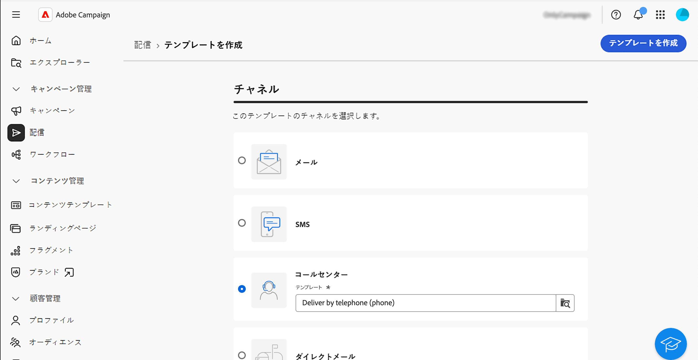
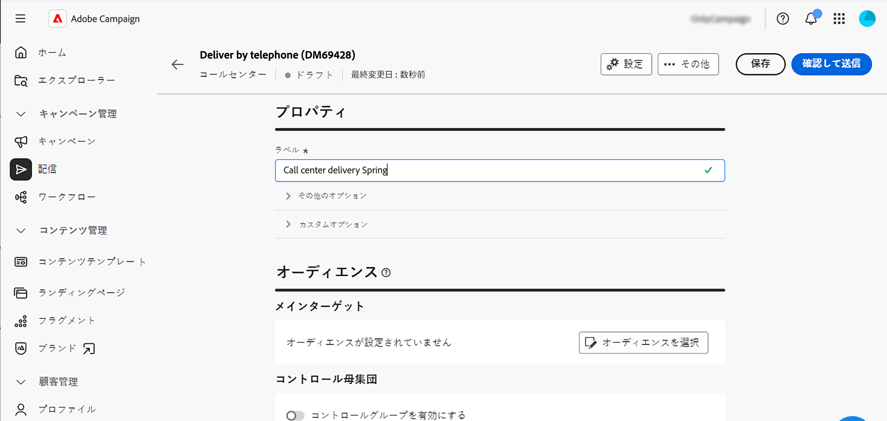
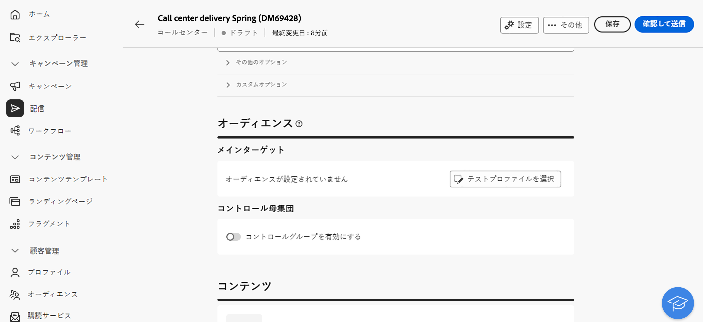
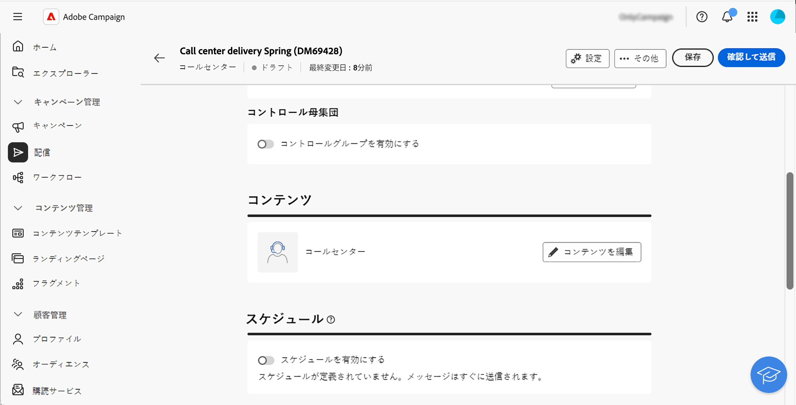
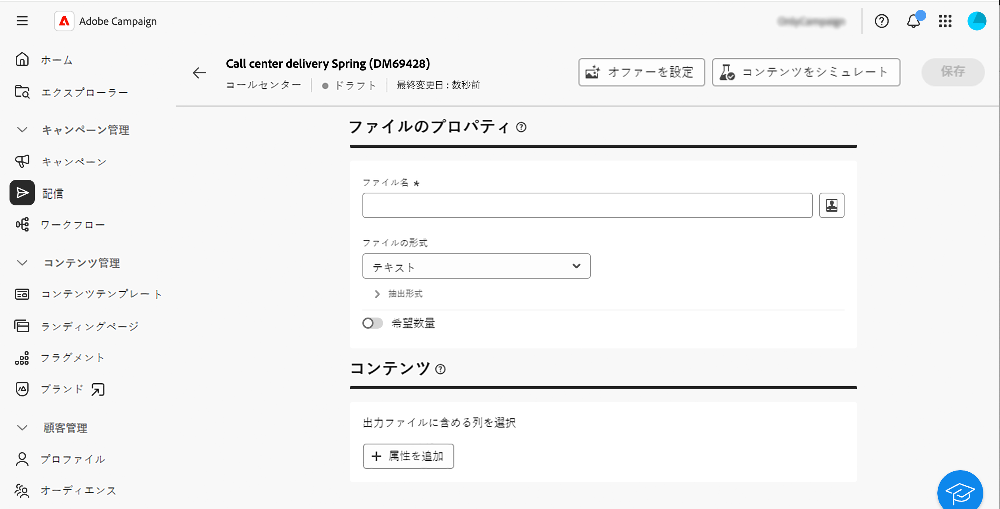
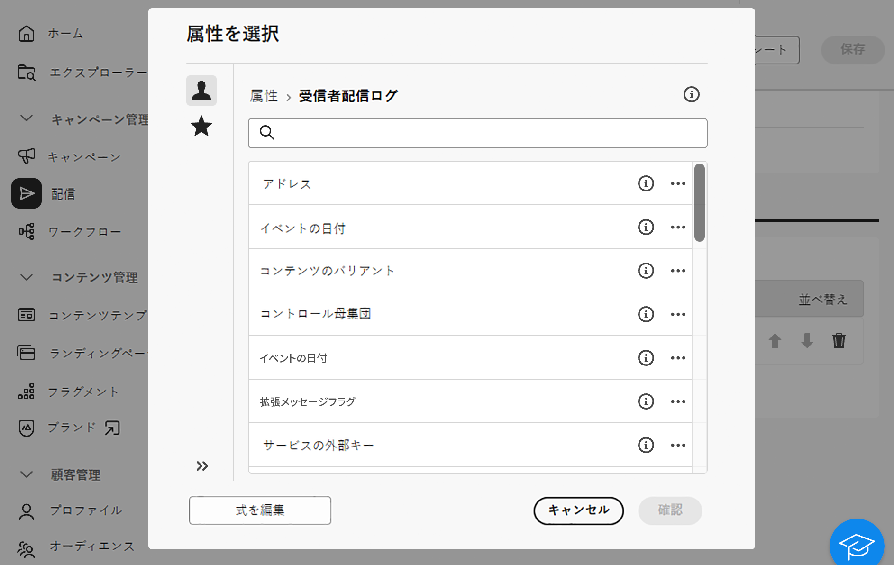
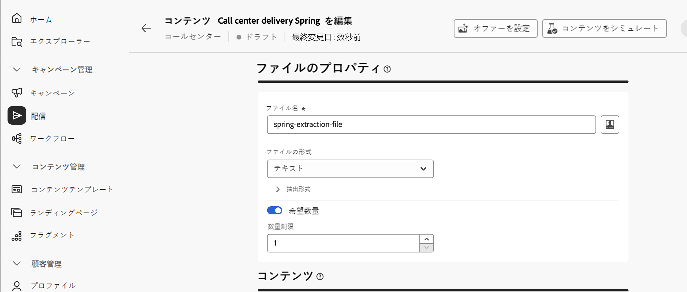
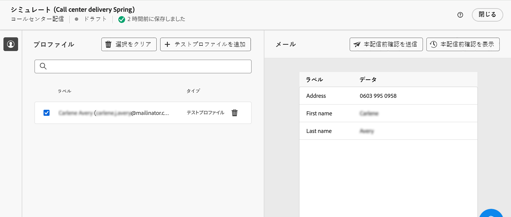
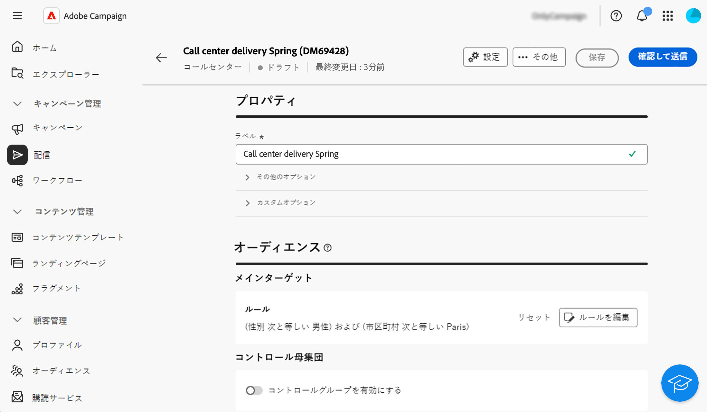
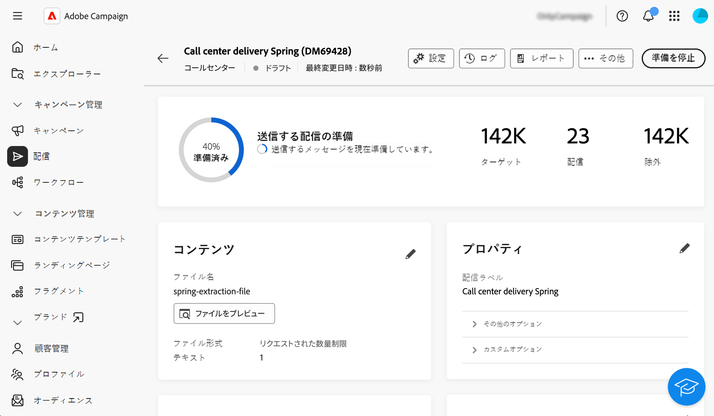

# コールセンター配信の作成と送信 {#create-call-center}

スタンドアロンのコールセンター配信を作成することも、キャンペーンワークフローのコンテキストで作成することもできます。以下の手順では、スタンドアロン（1 回限りの）配信の手順について説明します。キャンペーンワークフローのコンテキストで作業している場合、作成手順について詳しくは、[この節](../workflows/activities/channels.md#create-a-delivery-in-a-campaign-workflow)を参照してください。

新しくスタンドアロンのコールセンター配信を作成して送信するには、次の主な手順に従います。

1. 配信を作成します。[詳細情報](#create-delivery)
1. オーディエンスを定義します。[詳細情報](#select-audience)
1. コンテンツを編集します。[詳細情報](#edit-content)
1. 配信をプレビューして送信します。[詳細情報](#preview-send)

## 配信の作成{#create-delivery}

配信を作成し、そのプロパティを設定するには、次の手順に従います。

1. **[!UICONTROL 配信]**&#x200B;メニューを選択し、「**[!UICONTROL 配信を作成]**」ボタンをクリックします。

1. チャネルとして「**[!UICONTROL コールセンター]**」を選択し、「**[!UICONTROL 配信を作成]**」をクリックして確定します。

   {zoomable="yes"}

   >[!NOTE]
   >
   >別のテンプレートを選択する場合は、この[ページ](../msg/delivery-template.md)を参照してください。

1. **[!UICONTROL プロパティ]**&#x200B;に、配信の&#x200B;**[!UICONTROL ラベル]**&#x200B;を入力します。その他のオプションについて詳しくは、この[節](../email/create-email.md#create-email)を参照してください。

   {zoomable="yes"}

>[!NOTE]
>
>特定の日付に送信される配信をスケジュールできます。詳しくは、[この節](../msg/gs-deliveries.md#gs-schedule)を参照してください。

## オーディエンスを定義{#select-audience}

次に、抽出ファイルのターゲットとなるオーディエンスを定義する必要があります。

1. 配信ページの「**[!UICONTROL オーディエンス]**」セクションで、「**[!UICONTROL オーディエンスを選択]**」をクリックします。

   {zoomable="yes"}

1. 既存のオーディエンスを選択するか、独自のオーディエンスを作成します。

   * [既存のオーディエンスの選択方法について説明します。](../audience/add-audience.md)
   * [新規のオーディエンスの作成方法について説明します。](../audience/one-time-audience.md)

   {zoomable="yes"}

>[!NOTE]
>
>コールセンターの受信者には、少なくとも名前と電話番号が登録されている必要があります。情報が不完全な受信者はコールセンターの配信から除外されます。
>
>コントロールグループの設定方法について詳しくは、この[ページ](../audience/control-group.md)を参照してください

## コンテンツの編集{#edit-content}

次に、コールセンター配信で生成される抽出ファイルの内容を編集します。

1. 配信ページで、「**[!UICONTROL コンテンツを編集]**」ボタンをクリックします。

   {zoomable="yes"}

1. **[!UICONTROL ファイル名]**&#x200B;を指定します。ファイル名のパーソナライズ方法について詳しくは、この[ページ](../personalization/personalize.md)を参照してください。

1. **[!UICONTROL ファイル形式]**（**テキスト**、**列で固定を使用したテキスト**、**CSV（Excel）**&#x200B;または **XML**）を選択します。

   {zoomable="yes"}

   >[!NOTE]
   >
   >抽出形式のオプションについて詳しくは、この[ページ](../direct-mail/content-direct-mail.md#properties)を参照してください。

1. 配信の受信者数を制限できない場合は、「**[!UICONTROL リクエストされた数量]**」オプションをオンに切り替えます。

1. 「**[!UICONTROL コンテンツ]**」セクションで、「**[!UICONTROL 属性を追加]**」ボタンをクリックして、抽出ファイルに表示する新しい列を作成します。

1. 列に表示する属性を選択し、確定します。属性を選択してお気に入りに追加する方法について詳しくは、この[ページ](../get-started/attributes.md)を参照してください。

   

1. これらの手順を繰り返して、抽出ファイルに必要な数の列を追加します。

   その後、属性の編集、抽出ファイルの並べ替え、列の位置の変更を行うことができます。詳しくは、この[ページ](../direct-mail/content-direct-mail.md#content)を参照してください。

   

## 配信のプレビューと送信{#preview-send}

配信コンテンツの準備が整ったら、テストプロファイルを使用してプレビューし、配達確認を送信できます。その後、コールセンター配信を送信して、抽出ファイルを生成できます。

抽出ファイルをプレビューして送信する主な手順は次のとおりです。詳しくは、[このページ](../direct-mail/send-direct-mail.md)を参照してください。

1. 配信コンテンツページから、「**[!UICONTROL コンテンツをシミュレート]**」ボタンをクリックします。

   {zoomable="yes"}

1. 1 つまたは複数のテストプロファイルを選択して、パーソナライズされたコンテンツをプレビューします。また、配達確認を送信することもできます。[詳細情報](../direct-mail/send-direct-mail.md#preview-dm)

   {zoomable="yes"}

1. 配信ページで、「**[!UICONTROL 確認して送信]**」をクリックします。

   {zoomable="yes"}

1. 「**[!UICONTROL 準備]**」をクリックし、提供される進行状況と統計を監視してから確認します。

   {zoomable="yes"}

1. 「**[!UICONTROL 送信]**」をクリックし、最終的な送信プロセスに進んでから確認します。

配信を送信すると、抽出ファイルが自動的に生成され、配信テンプレートの[詳細設定](../advanced-settings/delivery-settings.md)で選択した&#x200B;**[!UICONTROL ルーティング]**&#x200B;外部アカウントで指定した場所にエクスポートされます。また、画面の「**コンテンツ**」セクションの「**ファイルをプレビュー**」ボタンをクリックして、ファイルをプレビューすることもできます。

配信ページから KPI（主要業績評価指標）データを追跡し、**[!UICONTROL ログ]**&#x200B;メニューからデータを追跡します。

組み込みレポートを使用して、メッセージの影響の測定を開始します。[詳細情報](../reporting/direct-mail.md)
