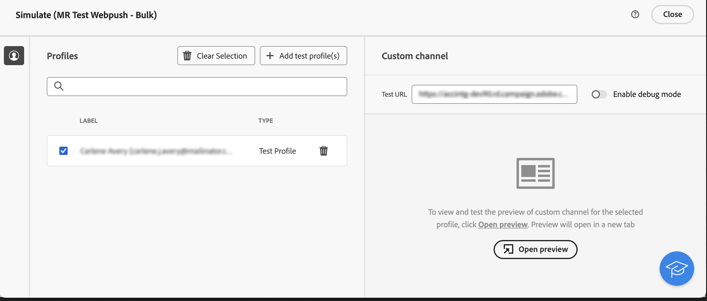

# カスタムチャネルの基本を学ぶ {#gs-custom-channel}

>[!CONTEXTUALHELP]
>id="acw_homepage_welcome_rn1"
>title="API 配信のカスタムチャネル"
>abstract="Adobe Campaign web UI から直接、カスタム API チャネルに基づいて配信を調整および実行できるようになりました。これらの配信は、スタンドアロンで行うか、ワークフローの一部として行うことができます。"
>additional-url="https://experienceleague.adobe.com/docs/campaign-web/v8/release-notes/release-notes.html?lang=ja" text="リリースノートを参照してください"

Adobe Campaign web UI から直接、サードパーティと統合されたカスタムチャネルに基づいて配信を調整および実行できます。カスタムチャネルの設定は、クライアントコンソールで実行します。

外部と API の 2 つのタイプのカスタムチャネルがサポートされています。外部チャネルを使用すると、Campaign では、必要なすべての連絡先データとパーソナライゼーションデータを含むカスタマイズ可能な書き出しファイルを生成します。API チャネルを使用すると、設定した API を通じてターゲットプロファイルにメッセージが送信されます。

カスタムチャネル配信をワークフローに追加することも、スタンドアロン配信として使用することもできます。

以下の手順では、スタンドアロン（1 回限りの）配信の手順について説明します。ほとんどの手順は、コールセンター配信と似ています。詳しくは、こちらの[ページ](../call-center/create-call-center.md)を参照してください。

新しいスタンドアロンカスタム配信を送信するには、次の主な手順に従います。

1. カスタムチャネルを設定します。[詳細情報](#create-channel)
1. 配信を作成します。[詳細情報](#create-delivery)
1. オーディエンスを定義します。[詳細情報](#select-audience)
1. コンテンツを編集します。[詳細情報](#edit-content)
1. 配信をプレビューして送信します。[詳細情報](#preview-send)

## カスタムチャネルの設定{#create-channel}

まず、カスタムチャネルを設定する必要があります。クライアントコンソールで実行する主な手順は次のとおりです。次の手順は、カスタム外部チャネルと API チャネルに共通です。

1. スキーマを設定して、使用可能なチャネルのリストに新しいチャネルを追加します。[詳細情報](https://experienceleague.adobe.com/docs/campaign/campaign-v8/send/custom-channel.html?lang=ja#configure-schema){target="_blank"}
1. 新しいルーティング外部アカウントを作成します。[詳細情報](https://experienceleague.adobe.com/docs/campaign/campaign-v8/send/custom-channel.html?lang=ja#reate-ext-account){target="_blank"}
1. 新しいチャネルに関連付ける新しい配信テンプレートを作成します。[詳細情報](https://experienceleague.adobe.com/docs/campaign/campaign-v8/send/custom-channel.html?lang=ja#create-template){target="_blank"}

カスタム API チャネルには、追加の設定が必要です。[詳細情報](https://experienceleague.adobe.com/docs/campaign/campaign-v8/send/custom-channel.html?lang=ja#api-additional){target="_blank"}

## 配信の作成{#create-delivery}

配信を作成し、そのプロパティを設定するには、次の手順に従います。

1. **[!UICONTROL 配信]**&#x200B;メニューを選択し、「**[!UICONTROL 配信を作成]**」ボタンをクリックします。

1. 目的のカスタムチャネルを選択し、関連するテンプレートを選択して、「**[!UICONTROL 配信を作成]**」をクリックして確定します。

   {zoomable="yes"}

1. **[!UICONTROL プロパティ]**&#x200B;に、配信の&#x200B;**[!UICONTROL ラベル]**&#x200B;を入力します。

   {zoomable="yes"}

配信の作成について詳しくは、コールセンターの[ドキュメント](../call-center/create-call-center.md#create-delivery)を参照してください。

## オーディエンスを定義{#select-audience}

次に、ターゲットとなるオーディエンスを定義する必要があります。

1. 配信ダッシュボードの「**[!UICONTROL オーディエンス]**」セクションで、「**[!UICONTROL オーディエンスを選択]**」をクリックします。

1. 既存のオーディエンスを選択するか、独自のオーディエンスを作成します。

   {zoomable="yes"}

オーディエンスの定義について詳しくは、コールセンターの[ドキュメント](../call-center/create-call-center.md#select-audience)を参照してください。

## コンテンツの編集{#edit-content}

次に、配信のコンテンツを編集します。

>[!BEGINTABS]

>[!TAB カスタム外部チャネル]

1. 配信ダッシュボードで、「**[!UICONTROL コンテンツを編集]**」ボタンをクリックします。

1. **[!UICONTROL ファイル名]**&#x200B;を指定し、**[!UICONTROL ファイル形式]**&#x200B;を選択して、抽出ファイルに必要な数の列を追加します。

   

>[!TAB カスタム API チャネル]

1. 配信ダッシュボードで、「**[!UICONTROL コンテンツを編集]**」ボタンをクリックします。

1. 必要に応じてフィールドに入力します。この画面の設定方法について詳しくは、この[ページ](https://experienceleague.adobe.com/docs/campaign/campaign-v8/send/custom-channel.html?lang=ja#api-additional-screen){target="_blank"}を参照してください。

   

>[!ENDTABS]

コンテンツの編集について詳しくは、コールセンターの[ドキュメント](../call-center/create-call-center.md#edit-content)を参照してください。

## 配信のプレビューと送信{#preview-send}

配信コンテンツの準備が整ったら、テストプロファイルを使用してプレビューできます。その後、配信を送信して抽出ファイルを生成、または、API 経由でメッセージを送信できます。

>[!BEGINTABS]

>[!TAB カスタム外部チャネル]

1. 配信ダッシュボードで、「**[!UICONTROL コンテンツを編集]**」ボタンをクリックします。

1. 配信コンテンツページから、「**[!UICONTROL コンテンツをシミュレート]**」ボタンをクリックしてテストプロファイルを選択します。

   {zoomable="yes"}

>[!TAB カスタム API チャネル]

1. 配信ダッシュボードで、「**[!UICONTROL コンテンツを編集]**」ボタンをクリックします。

1. 配信コンテンツページから、「**[!UICONTROL コンテンツをシミュレート]**」ボタンをクリックしてテストプロファイルを選択します。

1. 右側で、「**プレビューを開く**」をクリックします。この機能は、JSSP を使用して設定する必要があります。この[ページ](https://experienceleague.adobe.com/docs/campaign/campaign-v8/send/custom-channel.html?lang=ja#api-additional-preview){target="_blank"}を参照してください。

   {zoomable="yes"}

>[!ENDTABS]

配信ダッシュボードで、「**[!UICONTROL 確認して送信]**」、「**[!UICONTROL 準備]**」の順にクリックします。その後、確認します。「**[!UICONTROL 送信]**」をクリックし、最終的な送信プロセスに進んでから確認します。

{zoomable="yes"}

プレビューと送信について詳しくは、コールセンターの[ドキュメント](../call-center/create-call-center.md#preview-send)を参照してください。
