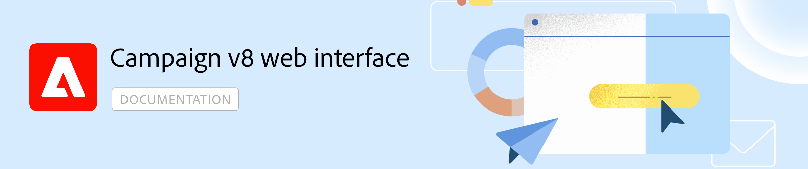

# Adobe Campaign Web v8 ドキュメント {#campaign-documentation}

>[!NOTE]
>
>このドキュメントは作成中で、頻繁に更新されています。 このコンテンツの最終バージョンは、2023 年 1 月に準備が整います。

>Campaign v8 Web は現在アルファバージョンです。 アクセスは、一部のアルファ顧客のセットに制限されています。 製品インターフェイス、機能、使用フローは予告なく変更される場合があることに注意してください。
