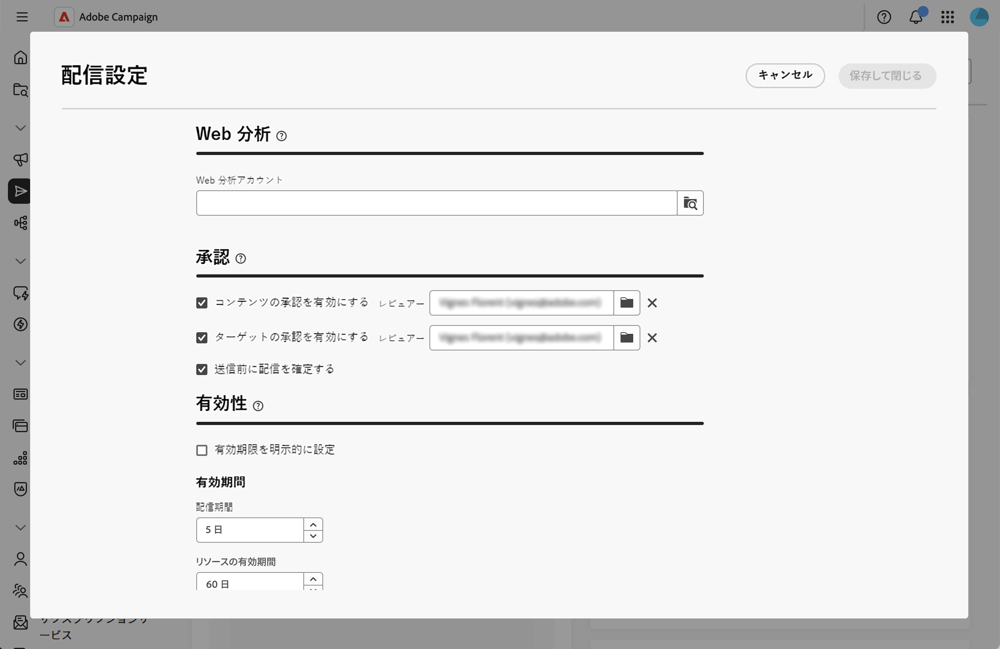
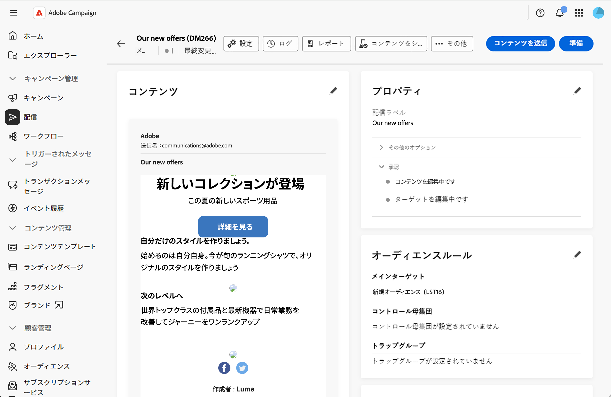
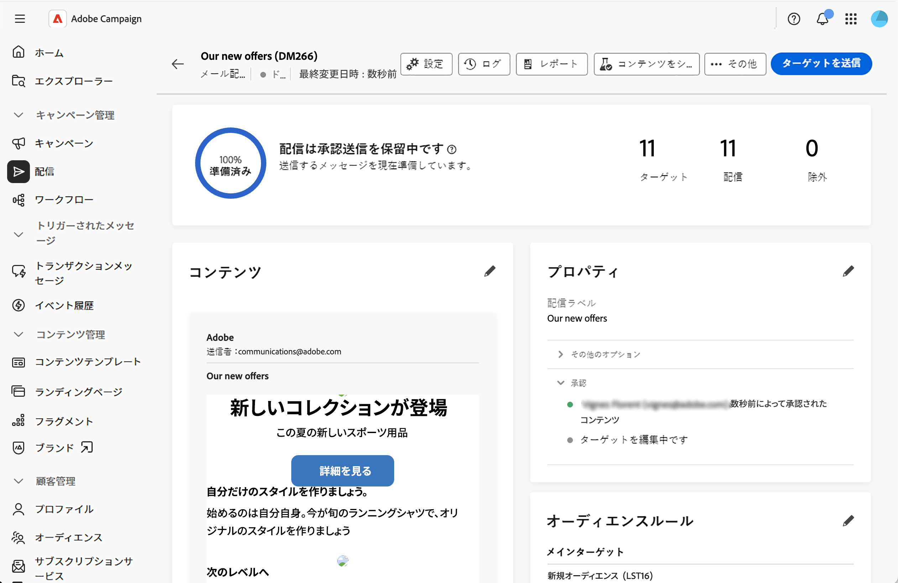
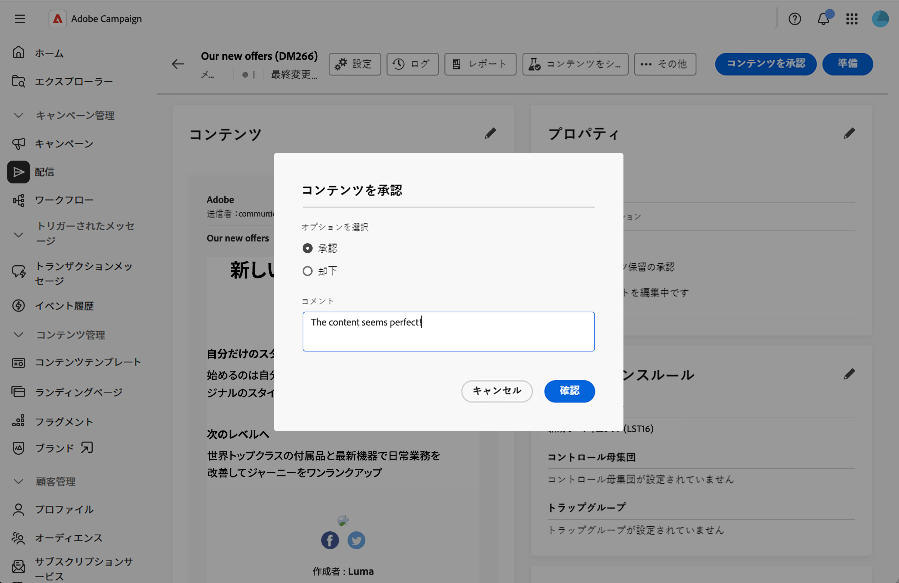

# 承認プロセスの管理 {#campaign-approvals}

>[!IMPORTANT]
>
>承認は、キャンペーン内で作成された配信でのみ使用できます。 これは、キャンペーンコンテキスト以外のワークフローで作成されたスタンドアロン配信または配信には適用されません。

承認プロセスは、複数の関係者の調整を支援し、配送の送信前に品質管理を確保します。 マーケティングマネージャーがコンテンツをレビューしたり、データアナリストがターゲットオーディエンスを検証したりするなど、複数のチームによる検証が必要な場合に、承認を使用します。

承認が有効になっている場合は、コンテンツまたはターゲットを送信して承認する必要があります。 指定されたレビュー担当者は、検証を要求するメール通知を受け取り、Web UI インターフェイスから直接承認または拒否できます。 必要な承認がすべて付与されるまで、配信を送信することはできません。 次を有効にできます。

* **コンテンツの承認**：メッセージコンテンツ、デザイン、パーソナライゼーションの検証
* **ターゲットの承認**: オーディエンスとターゲット条件を検証します
* **配達確認**：送信前に最終確認が必要です

## 承認設定の設定 {#configure-approvals}

承認設定はキャンペーンテンプレートから継承され、個々のキャンペーンに対して変更できます。 承認設定を設定するには、次の手順に従います。

1. キャンペーンまたはキャンペーンテンプレートを開くか、**[!UICONTROL キャンペーン]** メニューから新しいテンプレートを作成します。

1. キャンペーンダッシュボードの右上にある「**[!UICONTROL 設定]**」ボタンをクリックします。

1. 「**[!UICONTROL 承認]**」セクションで、次のオプションを設定します。

   キャンペーン承認設定を示す{zoomable="yes"}

   * **[!UICONTROL コンテンツの承認を有効にする]**：有効にすると、配信コンテンツは送信前に承認される必要があります。 **[!UICONTROL Reviewer]** フィールドのフォルダーアイコンをクリックして、オペレーターまたはオペレーターグループを選択します。

   * **[!UICONTROL ターゲット承認を有効にする]**：有効にすると、配信ターゲットオーディエンスが承認される必要があります。 **[!UICONTROL Reviewer]** フィールドのフォルダーアイコンをクリックして、オペレーターまたはオペレーターグループを選択します。

   * **[!UICONTROL 送信前に配信を確認]**：他のすべての承認が完了した後でも、送信前に最終的な手動確認が必要です。

>[!NOTE]
>
>* レビュアーが指定されていない場合、キャンペーン所有者はレビュアーとして割り当てられます。
>* レビュー担当者には、配信を承認するための適切な権限が必要です。 承認者リストで特定されたユーザーのみが承認できます。

## 承認用に送信 {#submit-approval}

配信を作成したら、次の手順に従ってコンテンツを送信し、承認用にターゲットします。

>[!NOTE]
>承認は、キャンペーンワークフロー配信とキャンペーンスタンドアロン配信の両方で使用できます。

1. 配信ダッシュボードで、「**[!UICONTROL コンテンツを送信]**」ボタンをクリックします。 指定されたレビュー担当者は承認または却下できます。 この[節](#approve-reject)を参照してください。

   コンテンツを送信ボタンを表示する{zoomable="yes"}

   配信ダッシュボードの&#x200B;**[!UICONTROL プロパティ]** セクションで、承認ステータスが「保留」に変更されます。 この[節](#rack-approvals)を参照してください。

1. コンテンツが承認されたら、「**[!UICONTROL 準備]**」ボタンをクリックして、配信ターゲットを準備します。 オーディエンスとターゲティング基準が準備されます。

1. 「**[!UICONTROL ターゲットを送信]**」ボタンをクリックします。 指定されたレビュー担当者は、承認または却下できます。 この[節](#approve-reject)を参照してください。

   ターゲットを送信ボタンを表示する{zoomable="yes"}

   承認ステータスが「保留中」に変更されます。 この[節](#rack-approvals)を参照してください。

1. ターゲットが承認されると、準備が再開され、配信を送信できます。

>[!NOTE]
>承認が却下された場合、配信所有者は、レビュー担当者のフィードバックにもとづいて、コンテンツまたはターゲットに必要なあらゆる変更を加え、承認のために再送信する必要があります。

## 承認または却下 {#approve-reject}

指定されたレビューアーは、コンテンツやターゲット提出を承認または却下できます。 この[節](#submit-approval)を参照してください。

>[!NOTE]
>メール通知を送信するには、レビュー担当者のアドレスをインスタンスで設定する必要があります。

1. 通知メールを受信したら、Web UI インターフェイスから直接承認が必要な配信を開きます。

1. コンテンツやターゲット情報の確認：

1. 「**[!UICONTROL コンテンツを承認]**」または「**[!UICONTROL ターゲットを承認]**」ボタンをクリックします。

   配信ダッシュボードの「コンテンツを承認」ボタンを表示する{zoomable="yes"}

1. **[!UICONTROL 承認]**&#x200B;または&#x200B;**[!UICONTROL 却下]**&#x200B;をクリックします。

1. オプションで、**[!UICONTROL コメント]**&#x200B;を追加して、決定を説明します。

   {zoomable="yes"}

1. 決定を確定します。 承認ステータスは、配信ダッシュボードですぐに更新されます。 この[節](#rack-approvals)を参照してください。

## 承認ステータスの追跡 {#track-approvals}

承認ステータスは、配信ダッシュボードの&#x200B;**[!UICONTROL プロパティ]** セクションに表示されます。 ステータスには、待機中の承認と現在の状態が表示されます。

承認ステータスを示す{zoomable="yes"}

* **[!UICONTROL 編集中]**: コンテンツまたはターゲットはまだ承認用に送信されていません
* **[!UICONTROL 承認待ち]**: コンテンツまたはターゲットはレビュー待ちです
* **[!UICONTROL Approved]**: コンテンツまたはターゲットがレビュー担当者によって承認されました
* **[!UICONTROL 却下]**: コンテンツまたはターゲットがレビュー担当者によって拒否されました

レビュー担当者が各ステップを検証または却下すると、承認セクションには、有効なすべての承認と更新がリアルタイムで表示されます。

## 関連トピック {#related}

* [キャンペーンの作成](create-campaigns.md)
* [キャンペーンの管理](manage-campaigns.md)
