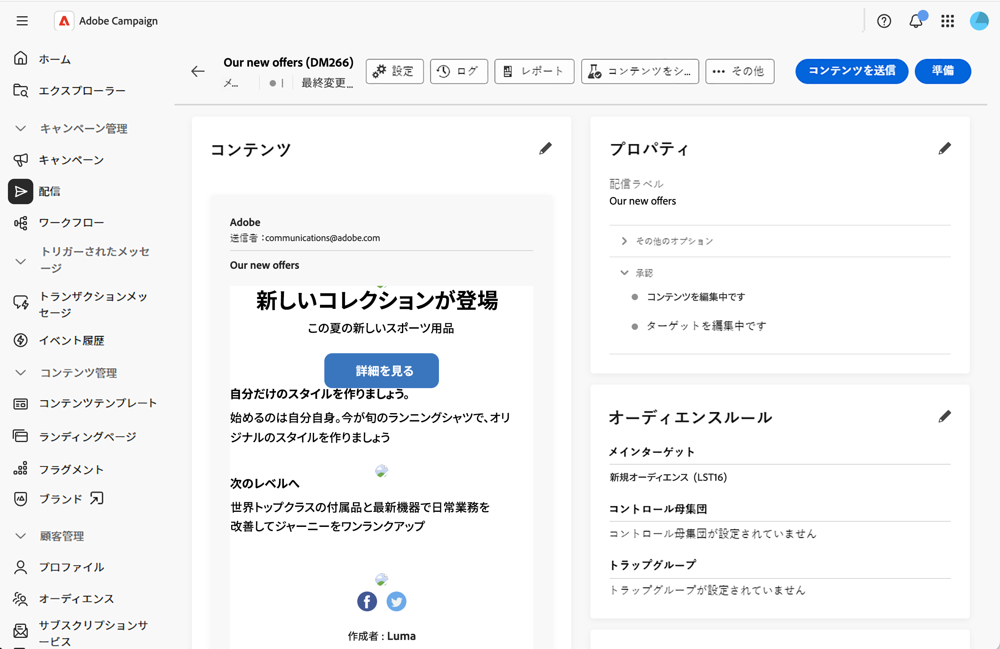
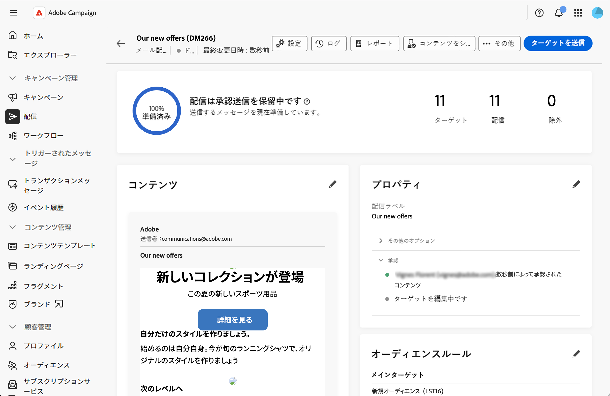
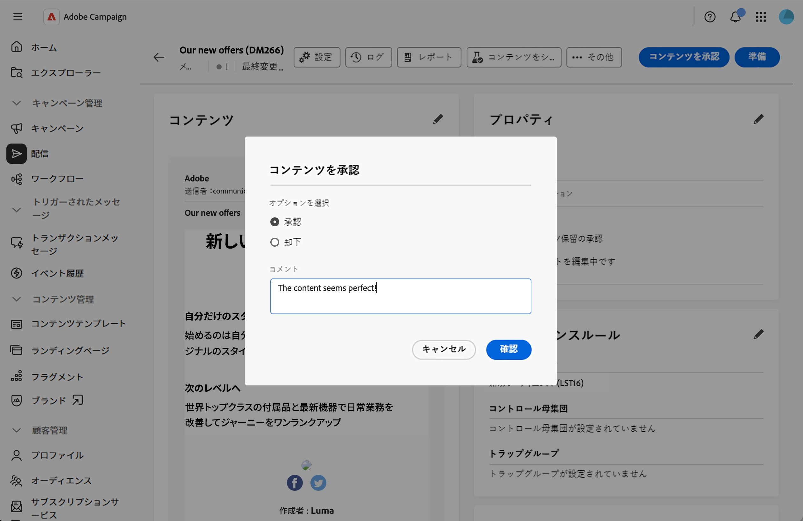

# 承認プロセスの管理 {#campaign-approvals}

>[!IMPORTANT]
>
>承認は、キャンペーン内で作成されたキャンペーンと配信でのみ使用できます。

承認プロセスは、複数の関係者の連携を支援し、配信前の品質管理を確実に行うためのものです。 承認を使用するのは、マーケティングマネージャーがコンテンツをレビューしたり、データアナリストがターゲットオーディエンスを検証したりするなど、組織の複数のチームによる検証が必要になる場合です。

承認が有効になっている場合、承認に対するコンテンツまたはターゲットを送信する必要があります。 指定されたレビュアーは、検証をリクエストするメール通知を受信し、Web UI インターフェースから直接承認または却下できます。 必要な承認がすべて付与されるまで、配信は送信できません。 次を有効にできます。

* **コンテンツの承認**: メッセージのコンテンツ、デザイン、パーソナライゼーションを検証します。 コンテンツが内部承認されると、コンテンツ承認前に編集ステップを追加し、指定されたオペレーターが処理し、外部レビュアーの承認ステップを追加できます。
* **ターゲットの承認**：オーディエンスとターゲティング条件を検証します
* **予算承認**：配信予算を検証します
* **配信開始**：特定のレビュアーへの配信を開始できるユーザーを制限します
* **配信の確認**：送信前に最終確認を必須にします

## 承認設定の指定 {#configure-approvals}

承認設定は、キャンペーンテンプレートから継承され、個々のキャンペーンに対して変更できます。 同じ&#x200B;**[!UICONTROL 承認]** セクションは、キャンペーン内で作成された配信の設定でも使用でき、その配信に対してのみキャンペーンレベルの設定を上書きできます。

キャンペーンレベルで承認設定を設定するには、次の手順に従います。

1. **[!UICONTROL キャンペーン]**&#x200B;メニューから、キャンペーンまたはキャンペーンテンプレートを開くか、新しいキャンペーンを作成します。

1. キャンペーンダッシュボードの右上にある「**[!UICONTROL 設定]**」ボタンをクリックします。

1. 「**[!UICONTROL 承認]**」セクションで、次のオプションを設定します。

   {zoomable="yes"}

   >[!NOTE]
   >
   > 承認オプションを有効にする場合は、**[!UICONTROL Reviewer]** フィールドのフォルダーアイコンをクリックして、オペレーターまたはオペレーターグループを選択します。

1. **[!UICONTROL コンテンツの承認]**&#x200B;を設定：有効にすると、配信コンテンツは送信前に承認される必要があります。 このオプションを有効にすると、次の2つのフィールドが表示されます。

   * **[!UICONTROL コンテンツ編集の割り当て]**：コンテンツの承認前に編集ステップを追加します。 web マスターなどの指定されたオペレーターに、コンテンツを編集するように通知し、承認のために利用できるようにします。
   * **[!UICONTROL 外部コンテンツ承認]**: コンテンツが内部承認されると、配信のレンダリング（ブランドの一貫性など）を検証するパートナーやサプライヤーなどの外部レビュアーに対して、承認手順を追加します。

1. **[!UICONTROL ターゲット承認]**&#x200B;を定義します。有効にすると、配信ターゲットオーディエンスが承認される必要があります。

1. **[!UICONTROL 予算承認]**&#x200B;を設定します。有効にすると、配信予算を承認する必要があります。 このオプションを使用するには、キャンペーンに既に予算が割り当てられている必要があります。このキャンペーンは現在、クライアントコンソールから実行されています。

1. **[!UICONTROL 配信開始]**&#x200B;を設定：配信開始を特定のオペレーターまたはオペレーターグループに制限します。 権限のないオペレーターが配信を送信しようとすると、このアクションを実行する権限がないことを示すエラーが表示されます。

1. **[!UICONTROL 送信前に配信を確認]**&#x200B;を設定します。他のすべての承認が完了した後でも、送信前に最終的な手動確認が必要です。

>[!NOTE]
>
>* レビュアーが指定されていない場合、キャンペーン所有者がレビュアーとして割り当てられます。
>* レビュアーには、配信を承認する適切な権限が必要です。 レビュアーリストで特定されたユーザーのみが承認できます。

## 承認用に送信 {#submit-approval}

配信を作成したら、次の手順に従って、承認に対するコンテンツとターゲットを送信します。

>[!NOTE]
>
>承認は、配信がキャンペーン内で直接作成されたか、キャンペーンワークフローを通じて作成されたかを問わず適用されます。

1. 配信ダッシュボードで、「**[!UICONTROL コンテンツを送信]**」ボタンをクリックします。 指定されたレビュアーは承認または却下できます。 [こちら](#approve-reject)を参照してください。

   {zoomable="yes"}

   配信ダッシュボードの「**[!UICONTROL プロパティ]**」セクションで、承認ステータスが保留に変更されます。 [こちら](#track-approvals)を参照してください。

1. コンテンツが承認されたら、「**[!UICONTROL 準備]**」ボタンをクリックして、配信ターゲットを準備します。 オーディエンスとターゲティング条件が準備されます。

1. 「**[!UICONTROL ターゲットを送信]**」ボタンをクリックします。 次に、指定されたレビュアーは承認または却下できます。 [こちら](#approve-reject)を参照してください。

   ターゲットを送信ボタンを表示する{zoomable="yes"}

   承認ステータスが保留に変更されます。 [こちら](#track-approvals)を参照してください。

1. 予算承認が有効になっている場合は、同じ原則に従って承認用に予算を送信します。 指定されたレビュアーは承認または却下できます。 [こちら](#approve-reject)を参照してください。

1. 目標が設定され、予算が承認されると、準備が再開され、配信を送信できます。

>[!NOTE]
>承認が却下された場合、配信所有者はレビュアーのフィードバックに基づいてコンテンツまたはターゲットに必要な変更をすべて行って、承認用に再送信する必要があります。

## 承認または却下 {#approve-reject}

レビューアーは、コンテンツ、ターゲット、予算の提出を承認または却下できます。 [こちら](#submit-approval)を参照してください。

>[!NOTE]
>メール通知を送信するには、レビュアーのアドレスをインスタンス内に設定する必要があります。

1. 通知メールを受信したら、Web UI インターフェイスから直接、承認が必要な配信を開きます。

1. コンテンツまたはターゲットの情報を確認します。

1. 「**[!UICONTROL コンテンツを承認]**、**[!UICONTROL ターゲットを承認]**、または&#x200B;**[!UICONTROL 予算を承認]**」ボタンをクリックします。

   {zoomable="yes"}

1. 「**[!UICONTROL 承認]**」または「**[!UICONTROL 却下]**」をクリックします。

1. オプションで、**[!UICONTROL コメント]**&#x200B;を追加して、決定を説明します。

   {zoomable="yes"}

1. 決定を確定します。 承認ステータスは、配信ダッシュボードですぐに更新されます。 [こちら](#track-approvals)を参照してください。

## 承認ステータスの追跡 {#track-approvals}

承認ステータスは、配信ダッシュボードの「**[!UICONTROL プロパティ]**」セクションに表示されます。 ステータスには、待機中の承認と現在の状態が表示されます。

{zoomable="yes"}

* **[!UICONTROL 編集中]**：コンテンツまたはターゲットがまだ承認用に送信されていません
* **[!UICONTROL 承認を保留中]**：コンテンツまたはターゲットがレビューを待機しています
* **[!UICONTROL 承認済み]**：コンテンツまたはターゲットがレビュアーにより承認されました
* **[!UICONTROL 却下済み]**：コンテンツまたはターゲットがレビュアーにより却下されました

承認セクションでは、レビュアーが各手順を承認または却下すると、有効なすべての承認と更新がリアルタイムで表示されます。

## 関連トピック {#related}

* [キャンペーンの作成](create-campaigns.md)
* [キャンペーンの管理](manage-campaigns.md)
