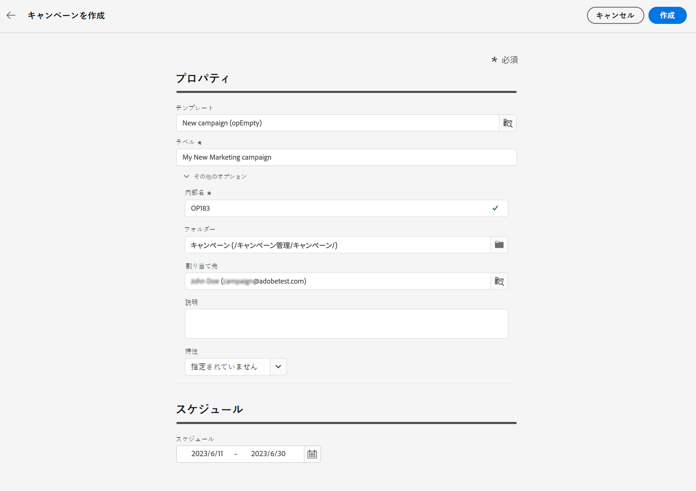

# 最初のキャンペーンを作成 {#create-first-campaigns}

>[!CONTEXTUALHELP]
>id="acw_campaign_creation_properties"
>title="キャンペーン作成プロパティ"
>abstract="キャンペーンのプロパティとメタデータを定義します。"

>[!CONTEXTUALHELP]
>id="acw_campaign_properties"
>title="キャンペーンプロパティ"
>abstract="キャンペーンの設定とメタデータを定義します。"

新しいキャンペーンを作成するには、そのプロパティを定義し、ワークフローと配信をスケジュールして含める必要があります。

## キャンペーンの作成{#campaign-create}

>[!CONTEXTUALHELP]
>id="acw_campaign_creation_schedule"
>title="キャンペーンスケジュール"
>abstract="キャンペーンの作成中にキャンペーンスケジュールを定義します。"

新しいキャンペーンを作成するには、次の手順に従います。

1. **[!UICONTROL キャンペーン]**&#x200B;メニューをクリックし、「**[!UICONTROL キャンペーンを作成]**」ボタンをクリックします。
1. 使用する&#x200B;**テンプレート**を選択し、キャンペーンのラベルを入力します。キャンペーンテンプレートは、新しいキャンペーンの作成に再利用できるように事前設定されており、これらはクライアントコンソールから作成されます。
   [詳細情報](https://experienceleague.adobe.com/docs/campaign/automation/campaign-orchestration/marketing-campaign-templates.html?lang=ja)。
1. 必要に応じて、内部名、フォルダー、担当者、説明、特性などの&#x200B;**追加オプション**&#x200B;を変更できます。
1. キャンペーンの&#x200B;**スケジュール**&#x200B;を定義します。キャンペーンは、開始日になると開始します。開始日と終了日は、キャンペーンリストに表示され、フィルターとして使用できます。[こちら](manage-campaigns.md#access-campaigns)を参照してください。

   

   >[!NOTE]
   >
   >これらのプロパティは、キャンペーンラベルの横にある「**キャンペーン設定を指定**」アイコンからいつでも変更できます。この[節](gs-campaigns.md#campaign-dashboard)を参照してください。

1. 「**作成**」をクリックします。
1. キャンペーンにワークフローと配信を追加します。

   * 「**ワークフロー**」タブで、「**ワークフローを作成**」をクリックします。キャンペーンの作成時に、デフォルトのワークフローが自動的に追加されます。詳しくは、[ワークフローの作成](../workflows/create-workflow.md)方法を参照してください。
   * 「**配信**」タブで、「**配信を作成**」をクリックします。[詳細情報](../msg/gs-messages.md)

1. 「**ログ**」ボタンと「**レポート**」ボタンを使用して、キャンペーンのパフォーマンスを分析します。

## キャンペーンの監視とトラック{#campaign-monitoring}

キャンペーンの監視は、キャンペーンの有効性を分析するための重要な手順です。キャンペーンを開き、「**ログ**」ボタンをクリックします。

また、専用のレポートを表示するには、「**レポート**」ボタンをクリックします。 [こちら](../reporting/campaign-reports.md)を参照してください。

<!--
    +++WORKF
++screen
## Create a cross-channel campaign {#cross-channel-campaign}

>[!CONTEXTUALHELP]
>id="acw_campaign_creation_workflow"
>title="Workflow list"
>abstract="List of workflows available for your campaign. Use the 'Create workflow' button to add a workflow in your campaign."

In a cross-channel campaign, a single marketing communication uses different channels. Data is passed between the channels. The customer receives communication through multiple channels based on, for example, their interaction with the previous communication.

-->
<!--
existing campaign: settings button -> properties like when creation
schedule in header

About plans, programs and campaigns
Adobe Campaign allows you to plan marketing campaigns in which you can create and manage different types of activities: emails, SMS messages, push notifications, workflows, landing pages. These campaigns and their contents can be gathered into programs.

The programs and campaigns allow you to regroup and view the different marketing activities that are linked to them.

A program may contain other programs as well as campaigns, workflows, and landing pages. It appears in the timeline and help you organize your marketing activities: you can separate them by country, by brand, by unit, etc.
A campaign enables you to gather all the marketing activities of your choice under a single entity. A campaign may contain emails, SMS, push notifications, direct mails, workflows, and landing pages.
To better organize your marketing plans, Adobe recommends the following hierarchy: Program > Sub-programs > Campaigns > Workflows > Deliveries.

Reports on programs and campaigns allow you to analyze their impact. For example, you can build reports at the campaign level to aggregate data on all deliveries contained in that campaign.

Related topics:

Timeline
About dynamic reports
Creating a campaign
In programs and sub-programs, you can add campaigns. Campaigns can contain marketing activities such as emails, SMS, push notifications, workflows, and landing pages.

From the Adobe Campaign home page, select the Programs & Campaigns card and access a program or sub-program.

Click on the Create button and select Campaign.

In the Creation mode screen, select a campaign type.

The campaign types available are based on templates defined in Resources > Templates > Campaign templates. For more on this, refer to the Managing templates section.

In the Properties screen, enter the name and ID of the campaign.

Select a start and end date to your campaign. These dates only apply to the campaign itself.

Click on Create to confirm the creation of the campaign.

The campaign is created and displayed. Use the Create button to add marketing activities to your campaign.

NOTE
Depending on your license agreement, you may access only some of these activities.

You can also create a campaign from the marketing activity list. You can choose to link the marketing activity to a parent program or sub-program via the properties window of the campaign.

Programs and campaigns icons and statuses
Each program and each campaign in the list has a visual symbol and an icon whose color indicates the execution status. This status depends on the validity period of the program or the campaign.

Gray: the program/campaign has not yet started - Editing status.
Blue: the program/campaign is in progress - In progress status.
Green: the program/campaign has finished - Finished status. By default, the current date is automatically shown as the validity start date and the end date is calculated according to the start date (D+186 days). You can change these dates in the program or campaign properties.

Business.Adobe.com resources
-->
