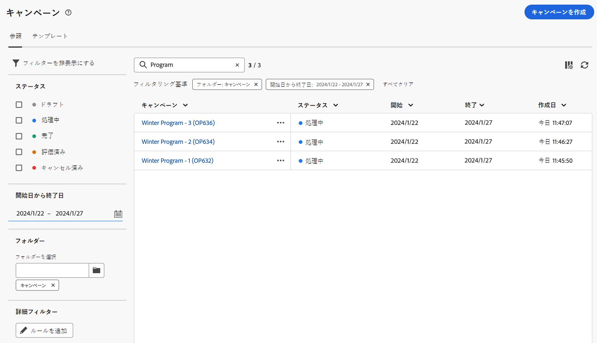

# キャンペーンの基本を学ぶ {#campaigns}

>[!CONTEXTUALHELP]
>id="acw_homepage_card5"
>title="クロスチャネルキャンペーンの設計と送信"
>abstract="Adobe Campaignの機能は、一元化された顧客データの管理、顧客コミュニケーションおよびキャンペーンの設計、様々なチャネルにわたるパーソナライズされたエクスペリエンスの作成に役立ちます。E メール、プッシュ、SMS。"

Adobe Campaign を使用して、クロスチャネルキャンペーンを作成します。マーケティングキャンペーンオーケストレーション機能を使用すると、顧客データの管理と一元化、顧客コミュニケーションとキャンペーンの設計、様々なチャネルにわたるパーソナライズされたエクスペリエンスの作成が可能です。 このバージョンでは、E メール、プッシュおよび SMS チャネルを使用できます。

大量の E メールキャンペーンを設計および実行して、あらゆるプラットフォームおよび画面サイズに合わせてパーソナライズされたメッセージを配信します。
開封数、クリック数、転送数などの詳細レポートで、配信の効果を測定します。  Adobe Campaign のセグメント化機能を使用すると、大量のデータベースに対してクエリを実行し、キャンペーンを完全にターゲットにする動的なマーケティングセグメントを簡単に定義できます。

<!--
Get Started with campaigns
Adobe Campaign offers a set of solutions that help you personalize and deliver campaigns across all of your online and offline channels. You can create, configure, execute and analyze marketing campaigns. All marketing campaigns can be managed from a unified control center. Discover how to browse and create marketing campaigns in this section.

Campaigns include actions (deliveries) and processes (importing or extracting files), as well as resources (marketing documents, delivery outlines). They are used in marketing campaigns. Campaigns are part of a program, and programs are included in a campaign plan.
-->

## キャンペーンへのアクセスと管理{#access-campaigns}

新しいキャンペーンを作成したり、既存のキャンペーンを管理したりするには、 **[!UICONTROL キャンペーン]** メニュー 次の 2 つのタブを使用できます。

* この **参照** 「 」タブには、既存のすべてのキャンペーンが一覧表示されます。 キャンペーンをクリックしてダッシュボードを開くか、 **キャンペーンを作成** 」ボタンをクリックします。 参照 [セクション](create-campaigns.md#create-campaigns)

* この **テンプレート** 「 」タブに、使用可能なキャンペーンテンプレートがすべて表示されます。 キャンペーンテンプレートは、新しいキャンペーンの作成に再利用できるように事前設定されています。 クライアントコンソールから作成されます。 [詳細情報](https://experienceleague.adobe.com/docs/campaign/automation/campaign-orchestration/marketing-campaign-templates.html?lang=ja)。

表示される列は、 **カスタムレイアウトの列を設定する** リストの右上隅にあるアイコン。 これにより、リストに情報を追加できます。 また、検索バーとフィルターを使用して、リスト内での検索を容易にすることができます。 [詳細情報](../get-started/user-interface.md#list-screens)

例えば、キャンペーンスケジュールに基づいてフィルタリングできます。 フィルターパネルを開き、 **開始 — 終了日** セクション：

リスト内の各キャンペーンには、現在のステータス、作成日、最終変更日時などに関する情報が表示されます。

## キャンペーンダッシュボード{#campaign-dashboard}

内 **参照** 」タブをクリックし、キャンペーンをクリックして、キャンペーンのダッシュボードを表示します。 次の 2 つのタブを使用できます。

* この **ワークフロー** 「 」タブには、キャンペーンにリンクされているすべてのワークフローが表示されます。 また、このタブでは、キャンペーン内に新しいワークフローを作成できます。 参照 [セクション](create-campaigns.md#create-campaigns)
* この **配信** 「 」タブには、キャンペーンにリンクされているすべての配信の一覧が表示されます。 また、このタブでは、キャンペーン内に新しい配信を作成できます。 参照 [セクション](create-campaigns.md#create-campaigns)

この **キャンペーンの設定** アイコンを使用すると、キャンペーンの作成時に定義したキャンペーンのプロパティを変更できます。 参照 [セクション](create-campaigns.md#create-campaigns)

## ロングの監視と追跡{#campaign-monitoring}

キャンペーンの監視は、キャンペーンを分析するための重要な手順です。 これらは、 **ログ** 」ボタンをクリックします。

また、 **レポート** ボタンをクリックします。 参照 [セクション](../reporting/campaign-reports.md)

## 複製と削除

キャンペーンを複製または削除するには、省略記号ボタンをクリックし、「 **複製** または **削除**. キャンペーンのダッシュボードから、ワークフローや配信を複製または削除することもできます。

>[!NOTE]
>
>ワークフロー内の配信を削除するには、ワークフローからその配信を削除する必要があります。

