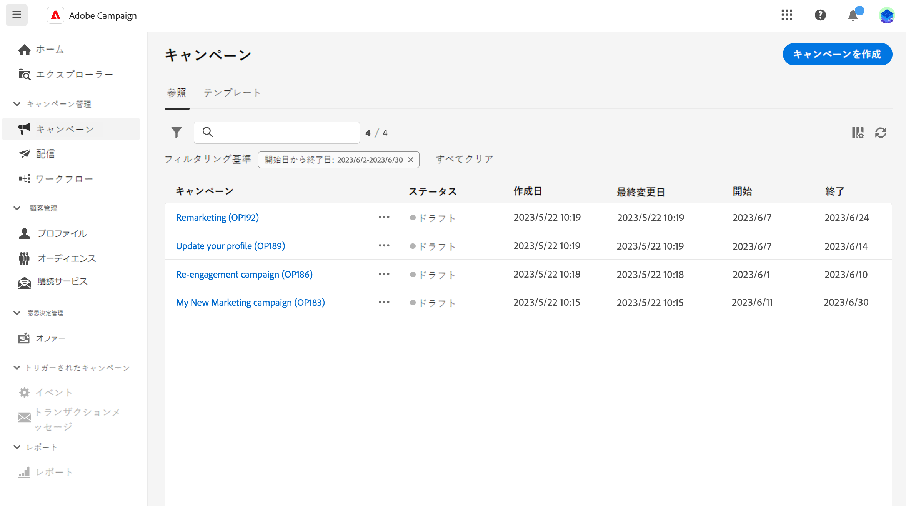
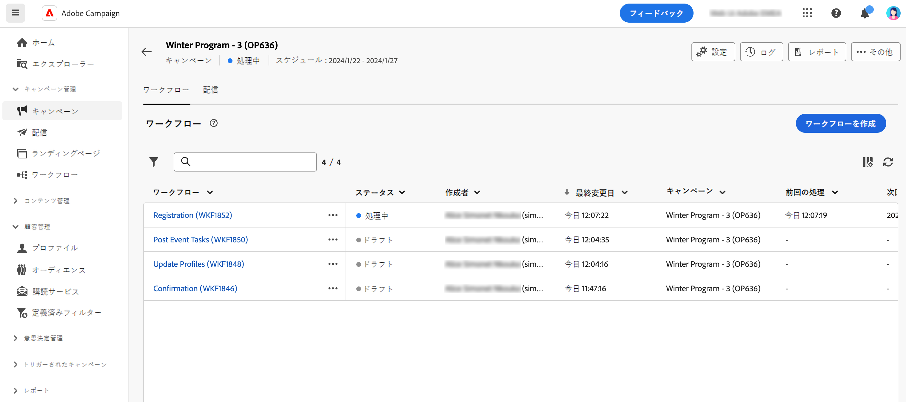

# キャンペーンへのアクセスと管理{#manage-campaigns}

>[!CONTEXTUALHELP]
>id="acw_campaign_schedule"
>title="キャンペーンスケジュール"
>abstract="キャンペーンのスケジュールを設定または変更します。"

新しいキャンペーンを作成したり、既存のキャンペーンを管理したりするには、左側のナビゲーションで&#x200B;**[!UICONTROL キャンペーン]**&#x200B;メニューをクリックします。

## キャンペーンリスト{#access-campaigns}

キャンペーンリストには、次の 2 つのタブが表示されます。

* 「**参照**」タブには、既存のすべてのキャンペーンがリストされます。キャンペーンをクリックしてダッシュボードを開くか、「**キャンペーンを作成**」ボタンをクリックして新しいキャンペーンを作成できます。この[節](create-campaigns.md#create-campaigns)を参照してください。

* 「**テンプレート**」タブには、使用可能なすべてのキャンペーンテンプレートがリストされます。キャンペーンテンプレートは、新しいキャンペーンを作成する際に再利用できるように事前設定されています。これらはクライアントコンソールから作成されます。[詳細情報](https://experienceleague.adobe.com/docs/campaign/automation/campaign-orchestration/marketing-campaign-templates.html?lang=ja)

デフォルトでは、リスト内の各キャンペーンには、現在のステータス、作成日、最終変更日時などに関する情報が表示されます。

リストの右上隅にある「**カスタムレイアウトの列を設定**」アイコンをクリックすると、表示される列をカスタマイズできます。これにより、リストに情報を追加できます。また、検索バーとフィルターを使用して、リスト内での検索を簡単にすることができます。[詳細情報](../get-started/user-interface.md#list-screens)。

例えば、キャンペーンスケジュールに基づいてフィルタリングできます。フィルターパネルを開き、「**開始日から終了日**」セクションを使用します。

## キャンペーンダッシュボード{#campaign-dashboard}

キャンペーンリストの「**参照**」タブで、キャンペーンをクリックして詳細を表示します。

キャンペーンのステータスとスケジュールが画面の上部に表示されます。「**キャンペーン設定を指定**」アイコンを使用して、キャンペーンの作成時に定義したキャンペーンのプロパティを変更できます。ログの表示、レポートの表示、キャンペーンの複製または削除を行うことができる 3 つのボタンが使用可能です。この[節](create-campaigns.md#create-campaigns)を参照してください

次の 2 つのタブを使用できます。

* 「**ワークフロー**」タブには、キャンペーンにリンクされているすべてのワークフローがリストされます。また、このタブでは、キャンペーン内に新しいワークフローを作成することもできます。この[節](create-campaigns.md#create-campaigns)を参照してください。

* 「**配信**」タブには、現在のキャンペーンにリンクされているすべての配信がリストされます。また、キャンペーン内に新しい配信を作成することもできます。[こちら](create-campaigns.md#create-campaigns)を参照してください。

## キャンペーンの複製と削除

キャンペーンの複製や削除を行うには、次の操作を実行します。

* キャンペーンのリストで、省略記号ボタンをクリックし、「**複製**」または「**削除**」を選択します。
* キャンペーン自体で、「**詳細**」ボタンをクリックし、「**複製**」または「**削除**」を選択します。

>[!NOTE]
>
>「**配信**」タブには、キャンペーンにリンクされているすべての配信が表示されます。ただし、ワークフローで作成された配信はそこから削除できません。ワークフローのコンテキストで作成された配信を削除するには、ワークフローから配信アクティビティを削除する必要があります。[詳細情報](../msg/gs-messages.md#delivery-delete)
