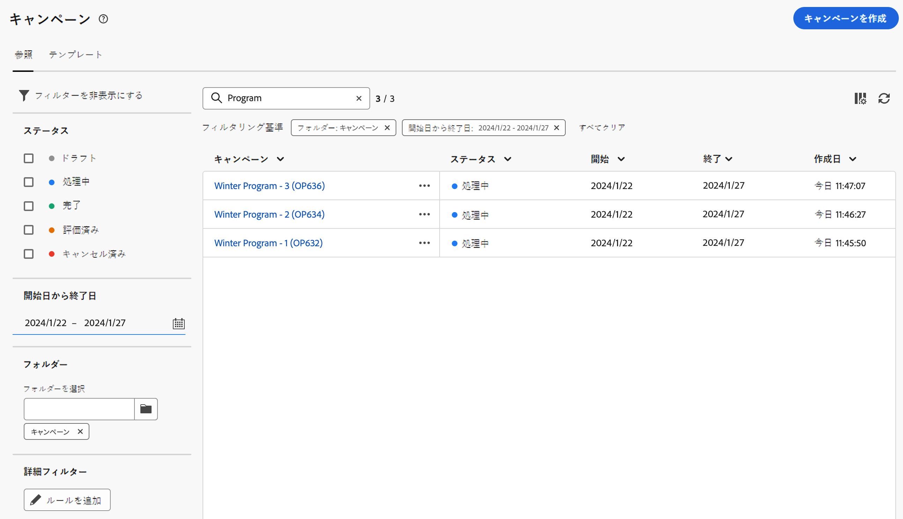

# キャンペーンへのアクセスと管理 {#manage-campaigns}

>[!CONTEXTUALHELP]
>id="acw_campaign_schedule"
>title="キャンペーンスケジュール"
>abstract="キャンペーンのスケジュールを設定または変更します。"

キャンペーンにアクセスし管理するには、左側のナビゲーションで&#x200B;**[!UICONTROL キャンペーン]**&#x200B;メニューをクリックします。

## キャンペーンのリスト {#access-campaigns}

キャンペーンリストには、次の 2 つのタブが表示されます。

* 「**参照**」タブには、既存のすべてのキャンペーンがリストされます。キャンペーンをクリックしてダッシュボードを開くか、「**キャンペーンを作成**」ボタンをクリックして新しいキャンペーンを作成できます。この[節](create-campaigns.md#create-campaigns)を参照してください。

* 「**テンプレート**」タブには、使用可能なすべてのキャンペーンテンプレートがリストされます。既存のテンプレートを表示したり、テンプレートを新規作成したりできます。 [詳細情報](#manage-campaign-templates)。

デフォルトでは、リスト内の各キャンペーンには、現在のステータス、開始日と終了日、作成日、最終変更日時などに関する情報が表示されます。

リストの右上隅にある「**カスタムレイアウトの列を設定**」アイコンをクリックすると、表示される列をカスタマイズできます。これにより、列の追加や削除、キャンペーンリスト内の情報の並べ替えが可能になります。

また、検索バーとフィルターを使用して、リスト内での検索を簡単にすることができます。[詳細情報](../get-started/user-interface.md#list-screens)。

例えば、キャンペーンスケジュールに基づいてフィルタリングできます。フィルターパネルを開き、「**開始日から終了日**」セクションを使用します。

## Campaign ダッシュボード {#campaign-dashboard}

>[!CONTEXTUALHELP]
>id="acw_campaign_delivery_list"
>title="キャンペーンの配信リスト"
>abstract="「**配信**」タブには、現在のキャンペーンにリンクされているすべての配信がリストされます。編集する配信の名前をクリックします。「配信を作成」ボタンを使用して、このキャンペーンに新しい配信を追加します。"

>[!CONTEXTUALHELP]
>id="acw_campaign_workflow_list"
>title="キャンペーンのワークフローリスト"
>abstract="「**ワークフロー**」タブには、現在のキャンペーンにリンクされているすべてのワークフローが表示されます。"

キャンペーンリストの「**参照**」タブで、キャンペーン名をクリックして詳細を表示します。

キャンペーンのステータスとスケジュールが画面の上部に表示されます。「**設定**」ボタンを使用して、キャンペーンのラベル、フォルダー、説明などキャンペーンのプロパティを更新します。また、設定画面からキャンペーンのスケジュールを変更することもできます。キャンペーンのスケジュールについて詳しくは、[このセクション](create-campaigns.md#campaign-schedule)を参照してください。

キャンペーンダッシュボードから、「**ログ**」ボタンと「**レポート**」ボタンを使用してキャンペーンを監視します。詳しくは、[この節](create-campaigns.md#create-campaigns)を参照してください。

キャンペーンごとに、ダッシュボードには「ワークフロー」と「配信」という 2 つのメインタブが表示されます。

* 「**ワークフロー**」タブには、キャンペーンに関連付けられているすべてのワークフローがリストされます。また、このタブでは、キャンペーン内に新しいワークフローを作成することもできます。この[セクション](create-campaigns.md#create-campaigns)を参照してください。

* 「**配信**」タブには、現在のキャンペーンに作成されたすべての配信がリストされます。また、キャンペーン内に新しい配信を作成することもできます。[こちら](create-campaigns.md#create-campaigns)を参照してください。

>[!NOTE]
>
>「**配信**」タブには、キャンペーンにリンクされているすべての配信が表示されます。ただし、ワークフローで作成された配信はそこから削除できません。ワークフローのコンテキストで作成された配信を削除するには、ワークフローから配信アクティビティを削除します。[詳細情報](../msg/gs-messages.md#delivery-delete)。

## キャンペーンの削除 {#campaign-delete}

キャンペーンの削除方法には、次の 2 つがあります。

* キャンペーンのリストで、省略記号ボタンをクリックし、「**削除**」を選択します。

  

* キャンペーン自体で、「**詳細**」ボタンをクリックし、「**削除**」を選択します。

  

## キャンペーンの複製 {#campaign-duplicate}

キャンペーンの複製方法には、次の 2 つがあります。

* キャンペーンのリストで、省略記号ボタンをクリックし、「**複製**」を選択します。

* キャンペーン自体で、「**詳細**」ボタンをクリックし、「**複製**」を選択します。

どちらの場合も、複製を確認して新しいキャンペーンを作成します。キャンペーンのラベルは、**`<label of the initial campaign>`** のコピーです。キャンペーンの設定を参照して、このラベルを更新します。

## キャンペーンテンプレートの操作 {#manage-campaign-templates}

キャンペーンテンプレートには、新しいキャンペーンの作成に再利用できる事前設定済みの設定が含まれています。一連の組み込みテンプレートを使用して、作業を開始できます。キャンペーンテンプレートを作成および設定して、そのテンプレートからキャンペーンを作成することができます。

キャンペーンテンプレートには、次の情報を保存できます。

* キャンペーン&#x200B;**設定**
* キャンペーン&#x200B;**スケジュール**
* ワークフローテンプレート
* 配信テンプレート

キャンペーンテンプレートを作成するには、次の手順に従います。

1. **[!UICONTROL キャンペーン]**&#x200B;メニューをクリックし、「**テンプレート**」タブに移動して、「**[!UICONTROL テンプレートを作成]**」ボタンをクリックします。
1. 使用する「**テンプレート**」を選択します。これで、以前に作成したテンプレートを基に新しいテンプレートを作成できます。
1. テンプレートのラベルを指定します。
1. 必要に応じて、内部名、フォルダー、担当者、説明、特性などの&#x200B;**追加オプション**&#x200B;を変更します。
1. キャンペーンの&#x200B;**スケジュール**&#x200B;を定義します。キャンペーンスケジュールを設定する方法について詳しくは、[この節](create-campaigns.md#campaign-schedule)を参照してください。
1. 「**作成**」をクリックします。
1. キャンペーンにワークフローと配信テンプレートを追加します。