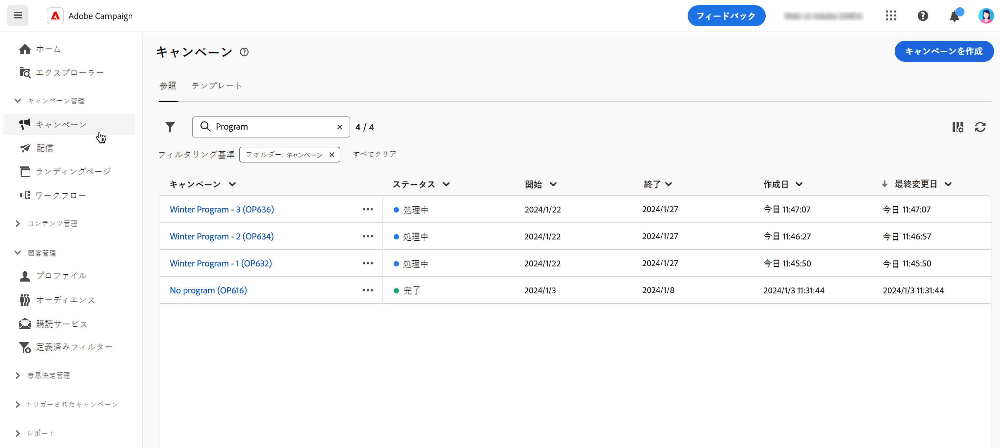

# キャンペーンへのアクセスと管理{#manage-campaigns}

新しいキャンペーンを作成したり、既存のキャンペーンを管理したりするには、 **[!UICONTROL キャンペーン]** メニュー

## キャンペーンリスト{#access-campaigns}

キャンペーンリストには、次の 2 つのタブが表示されます。

* この **参照** 「 」タブには、既存のすべてのキャンペーンが一覧表示されます。 キャンペーンをクリックしてダッシュボードを開くか、 **キャンペーンを作成** 」ボタンをクリックします。 [こちら](create-campaigns.md#create-campaigns)を参照してください。

* この **テンプレート** 「 」タブに、使用可能なキャンペーンテンプレートがすべて表示されます。 キャンペーンテンプレートは、新しいキャンペーンを作成する際に再利用できるように事前設定されています。 クライアントコンソールから作成されます。 [詳細情報](https://experienceleague.adobe.com/docs/campaign/automation/campaign-orchestration/marketing-campaign-templates.html?lang=ja)

リスト内の各キャンペーンには、現在のステータス、作成日、最終変更日時などに関する情報が表示されます。

表示される列は、 **カスタムレイアウトの列を設定する** リストの右上隅にあるアイコン。 これにより、リストに情報を追加できます。 また、検索バーとフィルターを使用して、リスト内での検索を容易にすることができます。 [詳細情報](../get-started/user-interface.md#list-screens)

例えば、キャンペーンスケジュールに基づいてフィルタリングできます。 フィルターパネルを開き、 **開始 — 終了日** セクション：

## キャンペーンダッシュボード{#campaign-dashboard}

内 **参照** キャンペーンリストの「 」タブで、キャンペーンをクリックして詳細を表示します。

キャンペーンのステータスとスケジュールが画面の上部に表示されます。 以下を使用して、 **キャンペーンの設定** アイコンを使用して、キャンペーンの作成時に定義したキャンペーンのプロパティを変更します。 キャンペーンのログ、レポート、複製、削除を表示する 3 つのボタンを使用できます。 参照 [セクション](create-campaigns.md#create-campaigns)

次の 2 つのタブを使用できます。

* この **ワークフロー** 「 」タブには、キャンペーンにリンクされているすべてのワークフローが表示されます。 また、このタブでは、キャンペーン内に新しいワークフローを作成できます。 参照 [セクション](create-campaigns.md#create-campaigns)

* この **配信** 「 」タブには、キャンペーンにリンクされているすべての配信の一覧が表示されます。 キャンペーン内に新しい配信を作成することもできます。 参照 [セクション](create-campaigns.md#create-campaigns)

## キャンペーンの複製と削除

キャンペーンの複製や削除は、次の場合におこなえます。

* キャンペーンのリストで、省略記号ボタンをクリックし、「 **複製** または **削除**.
* キャンペーン自体から、 **詳細** ボタンをクリックし、 **複製** または **削除**.

>[!NOTE]
>
>この **配信** 「 」タブには、キャンペーンにリンクされているすべての配信が表示されます。 ただし、ワークフローで作成された配信はそこから削除できません。 ワークフローのコンテキストで作成された配信を削除するには、ワークフローから配信アクティビティを削除する必要があります。
