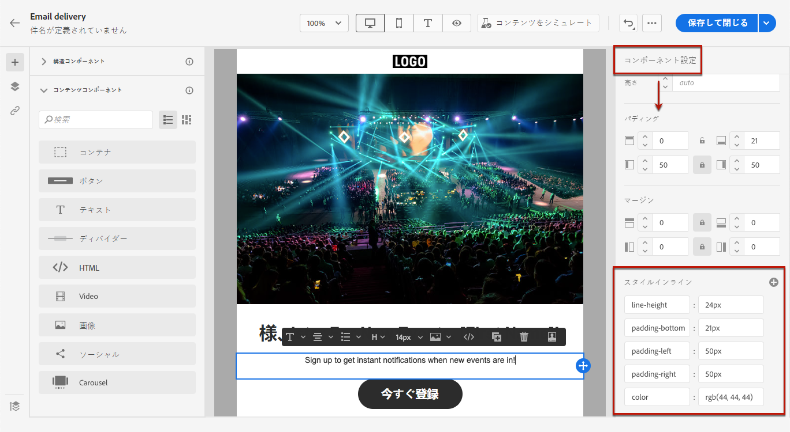
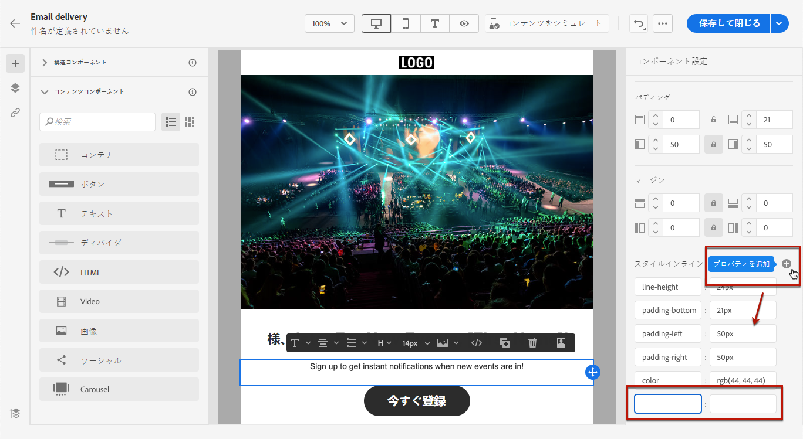

# インラインスタイル属性を追加する {#adding-inline-styling-attributes}

>[!NOTE]
>
>このドキュメントは作成中で、頻繁に更新されています。 このコンテンツの最終バージョンは、2023 年 1 月に準備が整います。

E メールデザイナーインターフェイスで、要素を選択し、サイドパネルにその設定を表示する際に、その要素のインライン属性と値をカスタマイズできます。

1. コンテンツ内の要素を選択します。
1. サイドパネルで、 **[!UICONTROL スタイルインライン]** 設定。

   

1. 既存の属性の値を変更するか、 **+** 」ボタンをクリックします。 CSS に準拠している任意の属性と値を追加できます。

   

次に、選択した要素にスタイルが適用されます。 子要素に特定のスタイル属性が定義されていない場合、親要素のスタイル設定が継承されます。
