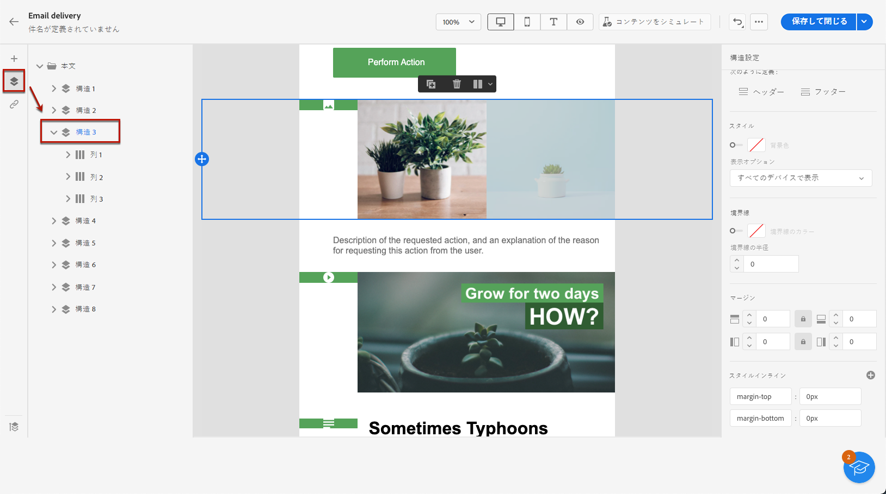
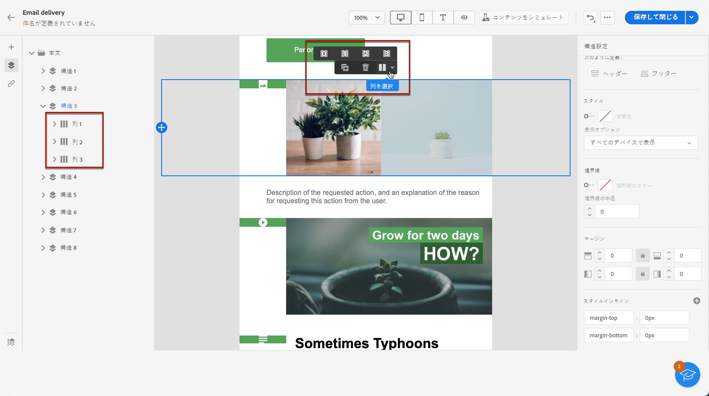
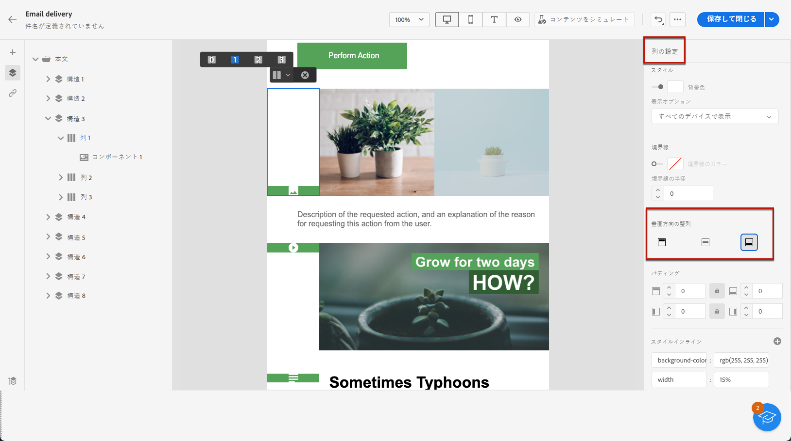
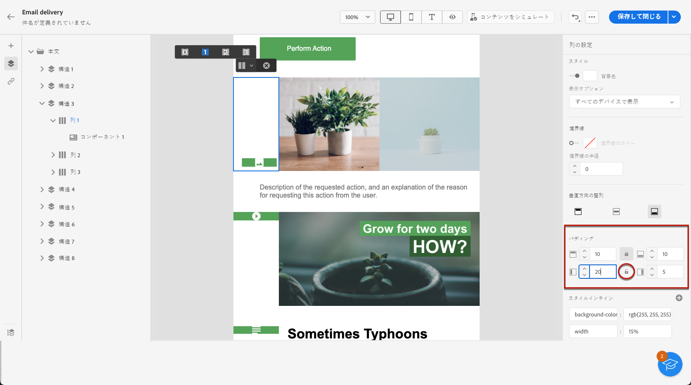

# 垂直方向の整列とパディングを調整する {#alignment-and-padding}

この例では、3 列で構成される構造コンポーネント内のパディングと垂直方向の整列を調整します。

1. メールで構造コンポーネントを直接選択するか、左側のパネルにある&#x200B;**[!UICONTROL ナビゲーションツリー]**&#x200B;を使用して選択します。

   

1. コンテキストツールバーから「**[!UICONTROL 列を選択]**」をクリックし、編集する列を選択します。左側の構造ツリーから選択することもできます。

   

1. その列の編集可能なパラメーターは、右側の&#x200B;**[!UICONTROL 列設定]**&#x200B;メニューに表示されます。専用セクションを使用して、**[!UICONTROL 垂直方向の整列]**&#x200B;を調整します。

   

   例えば、「**[!UICONTROL 下部]**」を選択します。コンテンツコンポーネントが列の下部に移動します。

1. **[!UICONTROL パディング]**&#x200B;の下で、列の内側の上部のパディングを定義し、その列の左右のパディングを設定します。

   >[!NOTE]
   >
   >ロックアイコンをクリックすると、上下または左右のパディングの同期が解除されます。

   

1. 他の列の整列とパディングを調整する場合と同様に行います。

1. 変更内容を保存します。
